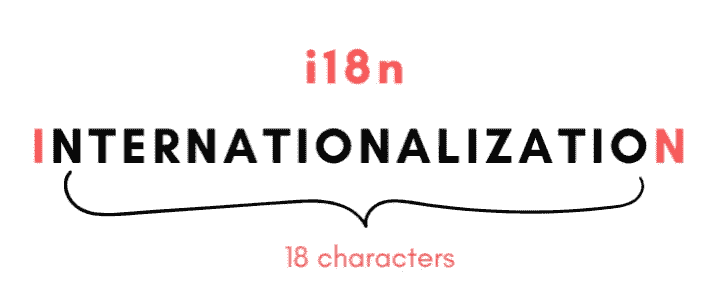
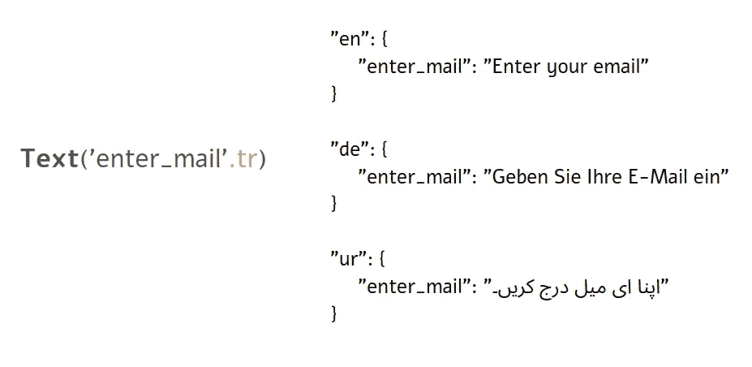
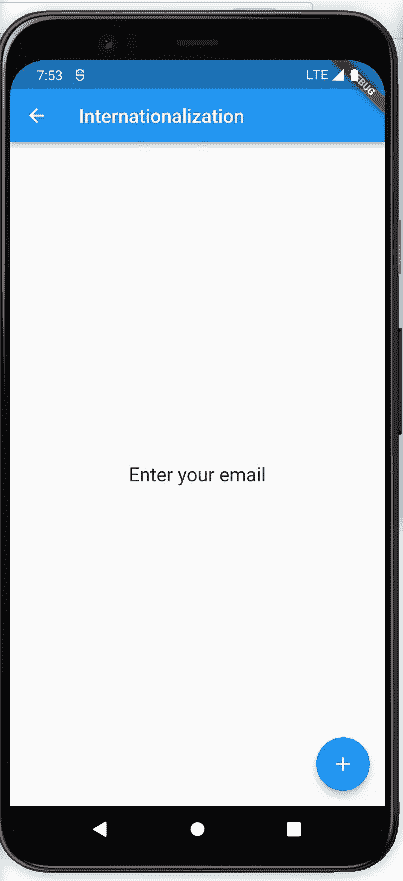
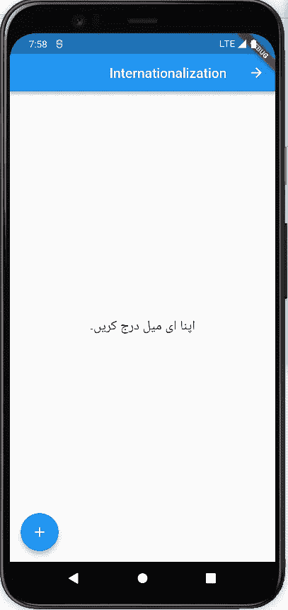
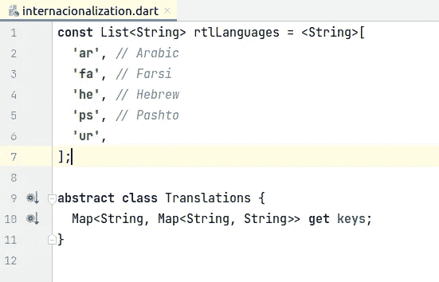

# 使用 GetX 的 Flutter 国际化(i18n)

> 原文：<https://blog.devgenius.io/flutter-internationalization-i18n-with-getx-d3a6465d1282?source=collection_archive---------2----------------------->

i18n 的可视化

# 什么是国际化？

国际化(通常简称为 i18n)是开发您的应用程序的过程，以这种方式**它支持多种语言/地区，并使本地化变得容易。**

例如，使用硬编码字符串的 Flutter 应用程序被认为没有为国际观众做好准备，当应用程序必须以其他语言推出时，这将引起一场真正的斗争。

文本小部件中使用的硬编码字符串

正确的方法是在翻译词典中使用引用键，而不是硬编码的字符串。下次应用程序显示一些文本时，它会在字典中查找所选用户语言的关键字，并相应地检索内容。下图很好地解释了这一点。

文本微件中使用的映射键引用

> 除了文本之外，日期和数字的格式(金额、电话号码等)、布局等也应该在国际化过程中加以考虑。

概括地说，国际化意味着以一种易于扩展的方式开发您的产品，并且如果出现任何新的语言/地区，只需要最小的代码更改。

# 用 GetX 实现国际化

让我们深入代码，学习一下如何实现国际化:

*   首先在您的`pubspec.yaml`文件中添加 *get* 作为依赖项。请从[网站](https://pub.dev/packages/get)查看最新版本。

*   接下来，确保你的最高级别小部件是 **GetMaterialApp** 而不是 **MaterialApp** 。

*   *GetMaterialApp* 可以带`translations`的类类型*翻译*。

*   现在让我们实现类`AppTranslations`，它需要从`Translations`扩展而来。

`Translations`是来自`get`依赖项的抽象类，您必须包含返回多语言地图的 *keys* 方法的实现。像这样:

上面你可以看到，`en_US`，`ur_PK`，这些叫做`Locales`，来源于`material.dart`

locale 有两个参数， *languageCode* 和 *countryCode* 。

你可以在这里看到所有地区[的列表。](https://pub.dev/documentation/locales/latest/locales/Locale-class.html)

*   现在，不要在文本小部件中使用硬编码的字符串，而是使用您在地图中添加的引用键，在我的例子中，就像这样:

就像你在上面的插图中看到的一样。右⁉️

*   最后一件事，你应该知道的是关于改变地区。您可以像这样将初始区域设置传递给您的 *GetMaterialApp* 。因此，最初，您的应用程序将显示在英语区域。

到目前为止，输出是这样的。

现在，假设我想在浮动操作按钮被按下后立即将区域设置更新为乌尔都语。你就是这么做的:

`Get.updateLocale`负责更新区域设置，作为参数给出的区域设置将在 *AppTranslations* 类中查找相应的键。

点击一个按钮，奇迹就发生了:

不仅文本字符串发生了变化，而且您可能还注意到 LTR 布局变成了 RTL。嗯，这就是 Getx 国际化的妙处。

乌尔都语、阿拉伯语、波斯语、希伯来语和普什图语将在区域设置更新为这些语言后立即拥有 RTL 布局。GetX 国际化类支持它，你不必为此做任何事情！

欢迎从官方文档中探索更多关于 GetX 国际化的内容，如果我遗漏了什么，请告诉我！

[**链接到官方文档**](https://pub.dev/packages/get#internationalization)

感谢你的阅读，为它鼓掌或者请我喝杯咖啡！

