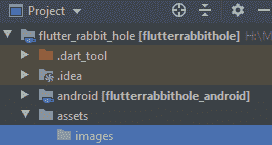
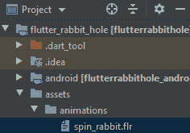
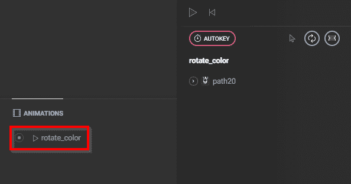

# 颤动:启动器图标、标签和闪屏

> 原文：<https://blog.devgenius.io/flutter-launcher-icons-labels-and-splash-screens-b37d80f61a0?source=collection_archive---------11----------------------->

## 这都是关于演示的


诺德伍德主题公司在 [Unsplash](https://unsplash.com?utm_source=medium&utm_medium=referral) 上拍摄的照片

当设计一个新的应用程序时，有很多工作要做，包括设计和实现应用程序逻辑。您需要设计数据库结构、导航方案和用户界面，同时努力坚持一个连贯的主题。总而言之，一个小应用的开发过程可能需要[3 到 9 个月](https://3sidedcube.com/how-long-does-it-take-to-build-an-app/)…而且你可能第一次就做不好。当进展似乎很慢，当你一想到前进就觉得自己在后退两步时，有几个选项可以让你振作起来。

# 更新你的启动器图标

当人们在 app store 中滚动时，你的应用程序的启动器图标是第一个会注意到的东西，所以它需要是除了通用的 Flutter 图标之外的东西(显然)。幸运的是，Flutter 有一个 [flutter_launcher_icons](https://pub.dev/packages/flutter_launcher_icons) 包，让这一步变得轻而易举。

```
dev_dependencies: flutter_test: sdk: flutter flutter_launcher_icons: "^0.7.3"
```

2.在您的项目中创建一个新的“资产”目录

3.在“资产”目录中，创建另一个名为“图像”的目录



4.移动您的图像(。png)到这个新目录中

5.在 pubspec.yaml 文件中，添加一个 flutter_icons 条目来指定图像的路径

```
flutter_icons: android: "launcher_icon" ios: true image_path: "assets/images/ic_launcher-playstore.png"
```

6.在终端中，运行以下命令:

```
flutter pub run flutter_launcher_icons:main
```

就是这样！运行此命令将更新 Android 和 iOS 上更改启动器图标所需的所有相应文件。如果你喜欢为不同的平台使用不同的图标，flutter_launcher_icons 包有[属性](https://pub.dev/packages/flutter_launcher_icons#mag-attributes)，你可以用它来实现。


# 更新你的启动器标签

默认情况下，您的 Flutter 应用程序的显示名称将是在 pubspec.yaml 文件中的 *name* 属性下列出的名称。由于“‘名称’字段必须是一个有效的 Dart 标识符”，因此很多时候看起来并不令人愉快。根据 pubspec 文件的这些[命名标准](https://dart.dev/tools/pub/pubspec#name)，这意味着该名称必须具有:

*   全部小写字符
*   下划线代替空格
*   只有拉丁字母和阿拉伯数字[a-z0–9 _]

此外，它不能以数字开头，也不能是这些[保留字](https://dart.dev/guides/language/language-tour#keywords)中的一个。也就是说，如果您想仅通过更改 pubspec.yaml 文件来更新名称，有很多限制。相反，你必须用另外两种方法中的一种。

# 用手

[这篇来自 Stack Overflow](https://stackoverflow.com/questions/49353199/how-to-change-the-app-display-name-build-with-flutter) 的文章总结了必要的步骤，但我将在下面总结。

## 机器人

Android 设备的[启动器标签可以在位于<项目>/Android/app/src/main/AndroidManifest.xml 的 Android manifest . XML 文件中更新。只需更新 android:label 属性，一切就绪。](https://flutter.dev/docs/deployment/android)

## ios

我不太熟悉 iOS 平台，但是更新[启动器标签](https://flutter.dev/docs/deployment/ios)的步骤同样简单。打开位于<项目> /ios/Runner/Info.plist 的 Info.plist 文件，找到 CFBundleName 键，然后更新关联的字符串。

```
<key>CFBundleName</key> <string>flutterrabbithole</string>
```

# 使用颤振包

就像更新启动器图标一样，有一个现有的 Flutter 包可以帮助重新标记你的应用程序。它叫做(你猜对了) [flutter_launcher_name](https://pub.dev/packages/flutter_launcher_name#-installing-tab-) 并且非常容易使用。

```
dev_dependencies: flutter_launcher_name: "^0.0.1"
```

2.在您的 pubspec.yaml 文件中，使用您的应用程序名称添加以下属性:

```
flutter_launcher_name: name: "yourNewAppLauncherName"
```

4.在终端中，运行以下命令:

```
flutter pub get flutter pub run flutter_launcher_name:main
```

砰！你完了。

这两种方法都非常简单，而且都让你到达同一个地方，所以选择你的毒药吧。

# 更新您的闪屏

在 Flutter 中，解决问题的第一步应该是检查 [pub.dev](https://pub.dev/) 上的 Flutter 包。原来，简单地搜索“闪屏”会返回一个使用 [Flare](https://medium.com/rive/introducing-flare-466950caa023) 动画创建闪屏的流行包。如果你有兴趣最终让你的闪屏比单一图像更复杂，这就是你想要做的。

这个特定的包叫做 [flare_splash_screen](https://pub.dev/packages/flare_splash_screen#-readme-tab-) ，依赖关系如下:

```
flare_splash_screen: ^3.0.1
```

在调用 pub get 之后，您需要在“assets”目录中创建一个“animations”目录。这将用于存储我们最终将在应用程序中调用的耀斑动画。



你可以在 [Rive 网站](https://rive.app/explore/popular/trending/all)上创建一个 Flare 动画，使用浏览器内的编辑工具几乎不费吹灰之力。我发现这个[教程](https://medium.com/flutterdevs/flutter-animation-with-flare-3863e8ff5030)很有帮助。

动画完成后，将其导出并放入项目中的“资产/动画”目录中。然后，使用完整路径名在 pubspec.yaml 文件中的如下资产下列出动画:

```
flutter: assets: - assets/animations/spin_rabbit.flr
```

然后，在第一个小部件中，将“home”属性作为新的启动屏幕。

```
class MyApp extends StatelessWidget { // This widget is the root of your application. @override Widget build(BuildContext context) { return MaterialApp( title: 'Rabbit Hole', theme: ThemeData.dark().copyWith(accentColor: Colors.green), home: SplashScreen.navigate( name: 'assets/animations/spin_rabbit.flr', next: (context) => SignInPage(), until: () => Future.delayed(Duration(seconds: 2)), loopAnimation: 'rotate_color', ), ); } }
```

请注意，动画的名称必须包括完整路径，并且 loopAnimation 属性需要与 Flare 编辑器的“动画”框中的动画匹配。



# 最后

一旦所有这些事情都完成了，你可以坐下来，感觉你已经完成了一天的事情。当然，我们还有很多事情要做，优化哪怕是最简单的事情也需要花费大量的时间，但是如果你不着手去做，你将一事无成！

敬请关注更多有关 Flutter 开发的文章！

*原载于 2020 年 7 月 3 日*[*http://lonercoder.wordpress.com*](https://lonercoder.wordpress.com/2020/07/02/flutter-launcher-icons-labels-and-splash-screens/)*。*