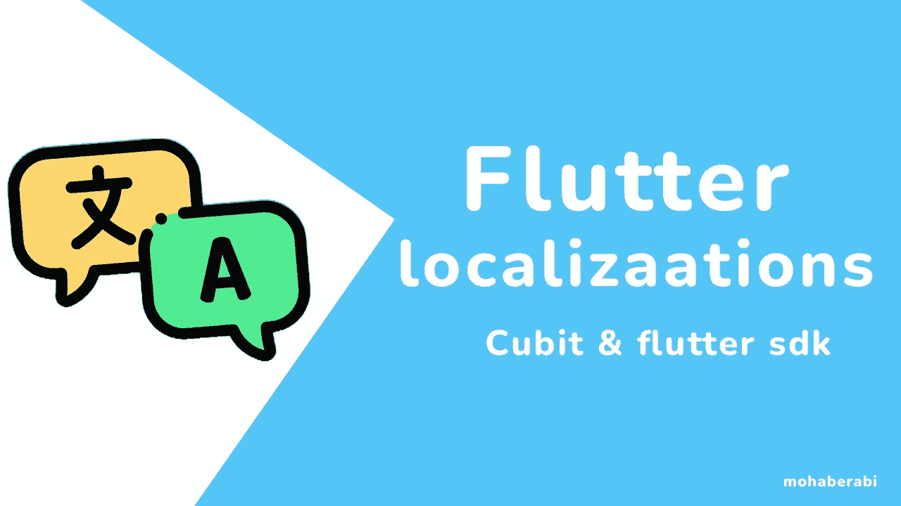
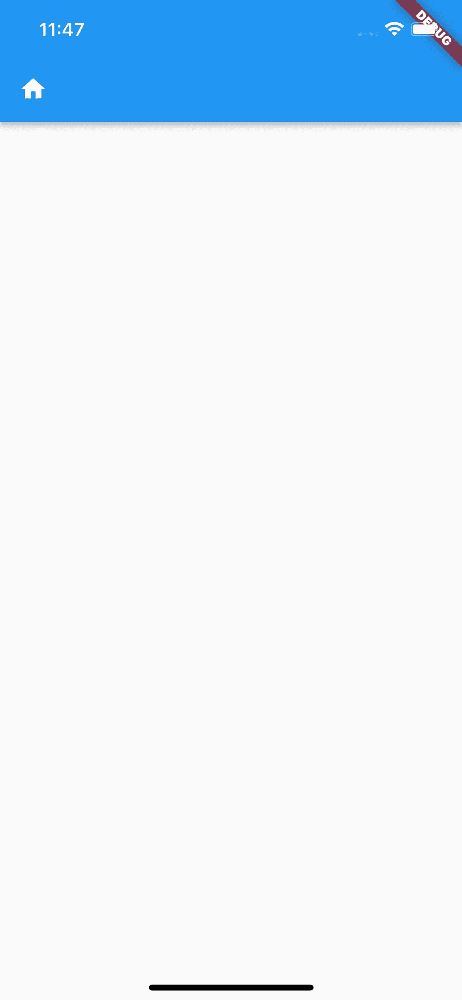
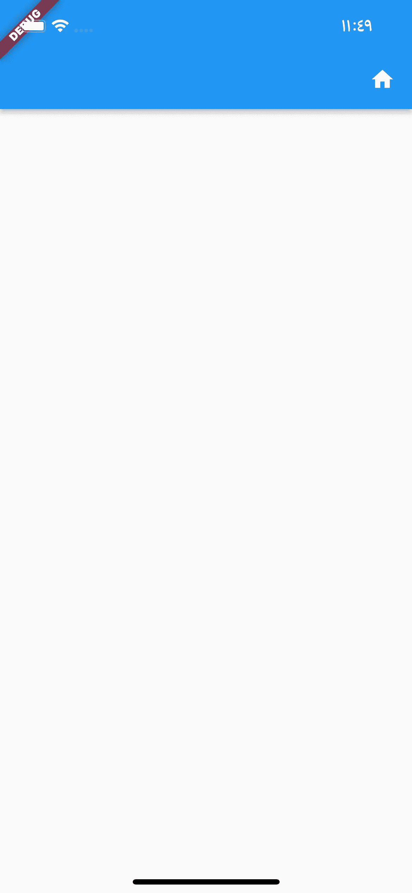
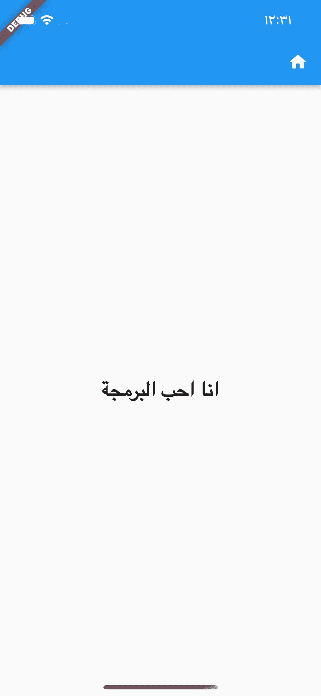
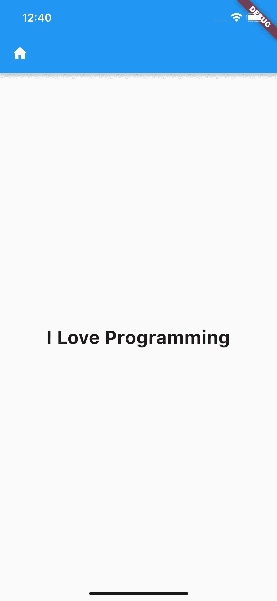

# 使用 Cubit 和内置的颤振 sdk 进行颤振定位

> 原文：<https://blog.devgenius.io/flutter-localizations-using-bloc-pattern-cubit-and-without-any-packages-296aa57d7a23?source=collection_archive---------2----------------------->



了解如何在 flutter 应用程序上添加本地化，并使用 bloc 或 cubit 来本地化您的应用程序

> 在使用任何技术的移动应用程序开发中，将应用程序本地化是最重要的功能之一，在 flutter 中有许多方法或途径和软件包可以帮助您完成这一任务，但我将首先讨论两个我更喜欢的方法，即使用 flutter sdk 本身，另一个使用 bloc

让我们首先通过获取当前的应用程序语言来使用 flutter sdk

我将创建一个具有简单 ui 的简单 flutter 项目

在 lib 文件夹中创建一个新文件 **home_screen.dart，**，然后添加下面的代码

```
import 'package:flutter/material.dart';

class HomeScreen extends StatelessWidget {
  const HomeScreen({Key? key}) : super(key: key);

  @override
  Widget build(BuildContext context) {
    return Scaffold(
      appBar: AppBar(
        leading: Icon(Icons.home),
      ),
      body: Column(
        children: [],
      ),
    );
  }
}
```

然后返回到你的 **main.dart** 文件，它应该看起来像下面这样

```
import 'package:flutter/material.dart';

import 'home_screen.dart';

void main() {
  runApp(const MyApp());
}

class MyApp extends StatelessWidget {
  const MyApp({super.key});

  @override
  Widget build(BuildContext context) {
    return MaterialApp(
      title: 'Localization in flutter example ',
      theme: ThemeData(
        primarySwatch: Colors.blue,
      ),
      home: HomeScreen(),
    );
  }
}
```

在你的 MaterialApp 里面，有一个名为**的属性支持 Locales :**

接受一个本地人列表

```
return MaterialApp(
  title: 'Localization in flutter example ',
  theme: ThemeData(
    primarySwatch: Colors.blue,
  ),
  supportedLocales: [],
  home: HomeScreen(),
);
```

区域设置有两个参数，**语言代码**这是这个应用程序的任何国家代码的 iso 代码，我们将使用英语和阿拉伯语区域设置，你可以在这里找到你的国家代码和**国家**

```
import 'package:flutter/material.dart';

import 'home_screen.dart';

void main() {
  runApp(const MyApp());
}

class MyApp extends StatelessWidget {
  const MyApp({super.key});

  @override
  Widget build(BuildContext context) {
    return MaterialApp(
      title: 'Localization in flutter example ',
      theme: ThemeData(
        primarySwatch: Colors.blue,
      ),
      supportedLocales: [
        Locale('en', "US"),
        Locale("ar", ""),
      ],
      home: HomeScreen(),
    );
  }
}
```

此外，您可以将国家代码留空，这是可选的，因此它支持任何国家的语言

```
supportedLocales: [
  Locale('en', ""),
  Locale("ar", ""),
],
```

现在在你的根项目文件夹中创建一个名为" **assets** 的新文件夹，在里面创建一个新文件夹" **lang** ，然后创建两个 json 文件 **ar。Json en。Json** ，这些将包含我们要翻译的字符串

那么我们应该提到 pubsbec.yaml 中的那些文件

```
assets:
  - assets/lang/ar.json
  - assets/lang/en.json
```

我们还需要在依赖项下添加 flutter sdk 本地化包

```
flutter_localizations:
  sdk: flutter
```

再次回到你的 MaterialApp，导入包

```
import 'package:flutter_localizations/flutter_localizations.dart';
```

现在我们应该添加删除项，

> delegets ->处理应用程序和所有部件的方向性，并且在鼠标悬停在某些按钮上时翻译相应部件中的一些无用文本

在您的 materialApp 内添加以下内容

```
localizationsDelegates: [
  GlobalMaterialLocalizations.delegate,
  GlobalWidgetsLocalizations.delegate,
  GlobalCupertinoLocalizations.delegate,
],
```

现在，您的整个 main.dart 文件应该如下所示

```
import 'package:flutter/material.dart';
import 'package:flutter_localizations/flutter_localizations.dart';
import 'home_screen.dart';

void main() {
  runApp(const MyApp());
}

class MyApp extends StatelessWidget {
  const MyApp({super.key});

  @override
  Widget build(BuildContext context) {
    return MaterialApp(
      title: 'Localization in flutter example ',
      theme: ThemeData(
        primarySwatch: Colors.blue,
      ),
      supportedLocales: [
        Locale('en', ""),
        Locale("ar", ""),
      ],
      localizationsDelegates: [
        GlobalMaterialLocalizations.delegate,
        GlobalWidgetsLocalizations.delegate,
        GlobalCupertinoLocalizations.delegate,
      ],
      home: HomeScreen(),
    );
  }
}
```

现在，我们需要让应用程序知道应用程序的本地，也是你的 materialApp 的内部，在**localeListResolutionCallback**中:我们将添加获取应用程序的区域设置的方法

```
 localeResolutionCallback: (currentLocal, supportedLocales) {
        for (var locale in supportedLocales) {
          if (currentLocal != null &&
              currentLocal.languageCode == locale.languageCode) {
            return currentLocal;
          }
        }
        return supportedLocales.first;
      },
home: HomeScreen(),
```

现在，我们运行应用程序后，默认情况下，它的本地将是英语，所以，请注意应用程序中图标的方向



我现在将应用程序的区域设置更改为阿拉伯语，并打开应用程序，看看它是否工作



注意，它现在工作的应用程序的方向已经改变到 RTL

现在，我们将创建负责本地化的类

创建一个新文件 **app_local.dart**

```
import 'package:flutter/material.dart';

class AppLocalizations {
  final Locale? locale;
  AppLocalizations({this.locale});
}
```

我们创建了一个类，它在构造函数中使用 local，这是应用程序将使用的区域设置，现在我们想通知应用程序哪个类将负责本地化，只要我们将在整个应用程序中使用这个类，我们将创建一个函数，只为它返回这个类 static

```
static AppLocalizations? of(BuildContext context) {
  return Localizations.of<AppLocalizations>(context, AppLocalizations);
}
```

现在让我们创建一个映射来处理 json 文件中的字符串

```
late Map<String ,String >_localStrings;
```

此外，我们需要加载携带应用程序字符串的 json 文件，因此这将是一个未来的方法，它将加载文件，以便应用程序可以加载当前应用程序区域设置的字符串，然后将这些文件添加到 **_localStrings** 映射，以使用此映射

```
Future loadJsonFiles() async {}
```

然后声明一个私有字符串，该字符串应携带 json 文件的根路径

```
 static const String _path = 'assets/lang/';
```

然后让我们加载文件

```
Future loadJsonFiles() async {
    String enocedString =
        await rootBundle.loadString("${_path}${locale!.languageCode}.json")
    Map<String, dynamic> jsonMap = jsonDecode(enocedString);
    _localStrings =
        jsonMap.map((key, value) => MapEntry(key, value.toString()));;}
```

现在，在我们将文件解码成映射后，我们将它添加到包含字符串的映射中

现在我们需要在我们的地图上绘制通用电气公司的价值

```
String translate(String key) {
  return _localStrings[key] ?? '';
}
```

现在让我们创建我们的自定义委托

```
class _AppLocalDelegate extends LocalizationsDelegate<AppLocalizations> {
  @override
  bool isSupported(Locale locale) {
    return ['en', 'ar'].contains(locale.languageCode);  }

  @override
  Future<AppLocalizations> load(Locale locale) async {
    AppLocalizations appLocal = AppLocalizations(locale: locale);
    await appLocal.loadJsonFiles();
    return appLocal;
  }

  @override
  bool shouldReload(covariant LocalizationsDelegate<dynamic> old) {
    return false;
  }
}
```

将连接到物料应用程序的代表

isSupported →返回支持的局部变量，

load ->加载保存数据的类

shouldReload ->意味着我们需要在每次重建时加载语言文件吗

现在我们应该将这个类添加到我们的应用程序化类中

```
static LocalizationsDelegate<AppLocalizations> delegate = _AppLocalDelegate();
```

然后，我们将在 material 应用程序的代表列表中调用这个代表

```
localizationsDelegates: [
  AppLocalizations.delegate,
  GlobalMaterialLocalizations.delegate,
  GlobalWidgetsLocalizations.delegate,
  GlobalCupertinoLocalizations.delegate,
],
```

现在让我们添加一些文本，看看它是否工作，现在在 ar.json 中添加这个地图

```
{
  "title": "انا احب البرمجة"
}
```

这是在 en.json 上

```
{
  "title": "I Love Programming"
}
```

现在让我们改进 ui，并将这个字符串添加到一个文本小部件中

```
import 'package:flutter/material.dart';
import 'package:flutter_localization/app_local.dart';

class HomeScreen extends StatelessWidget {
  const HomeScreen({Key? key}) : super(key: key);

  @override
  Widget build(BuildContext context) {
    return Scaffold(
      appBar: AppBar(
        leading: Icon(Icons.home),
      ),
      body: Column(
        mainAxisAlignment: MainAxisAlignment.center,
        children: [
          Center(
            child: Text(
              AppLocalizations.of(context)!.translate("title"),
              style: TextStyle(fontWeight: FontWeight.bold, fontSize: 26),
            ),
          )
        ],
      ),
    );
  }
}
```

现在重新启动应用程序，让我们在两个地方看到它



现在，它与当前的电话语言一起工作，让我们现在只改变应用程序语言，无论应用程序语言是使用块和肘

但是让我们首先添加最后一件事情，它将使应用程序更容易，

```
AppLocalizations.of(context)!.translate("title"),
```

上面的行是我们将在应用程序中的每个要翻译的字符串上使用的，我们可以使它更容易，因为应用程序有更多的字符串，我们将使用 dart 扩展使它越来越容易翻译

我们将在 string 类上做一个扩展，这样可以帮助我们更容易地翻译 string

在本地化文件中添加这个扩展方法

```
extension TranslateString on String {
  String tr(BuildContext context) {
    return AppLocalizations.of(context)!.translate(this);
  }
}
```

然后回到屏幕，让我们使用我们创建的字符串扩展

而不是下面的代码

```
Center(
  child: Text(
    AppLocalizations.of(context)!.translate("title"),
    style: TextStyle(fontWeight: FontWeight.bold, fontSize: 26),
  ),
)
```

让它像下面这样简单多了

```
Center(
  child: Text(
    'title'.tr(context),
    style: TextStyle(fontWeight: FontWeight.bold, fontSize: 26),
  ),
)
```

现在让我们转到下一部分，我们将使用**腕尺**状态管理

这个**肘**文件夹将文件给了

**cubit.dart - >** 将具有改变地区的功能

state.dart - > 将保存我们将按顺序发出的状态，以便更改地点

现在在你的 lib 文件夹中，创建一个名为 **cubit** 的新文件夹

然后给它添加两个新文件 **local_state.dart** ， **local_cubit.dart**

现在将 bloc 包添加到您的 **pubsbec.yaml**

```
flutter_bloc: ^8.1.1
```

让我们创建我们的状态类

在 local_state.dart 中，添加以下代码

```
abstract class LocalState {}
class LocalInitState extends LocalState {}
```

> LocalState{}类是 cubit 将用来发出其类型状态的状态，因此我们创建了一个扩展该状态的初始状态，以便成为相同的类型

现在转到 local_cubit.dart，添加以下代码

```
class LocalCubit extends Cubit<LocalState> {
  LocalCubit() : super(LocalInitState());
}
```

现在，我们需要获取应用程序应该处理的当前语言代码，但是每次应用程序都将在默认的语言环境下启动，而不是用户选择的语言环境，所以我们需要首先缓存代码

为了缓存它，我们将使用 sharedPrefrences 包，所以也将该包添加到 **pubsbec.yaml** 中

```
shared_preferences: ^2.0.15
```

现在让我们创建一个处理缓存的类，在你的 lib 文件夹中创建一个名为 **cache_helper.dart** 的新文件，然后添加下面的代码

```
import 'package:shared_preferences/shared_preferences.dart';

class CacheHelper {
  static late SharedPreferences prefs;

  static Future<void> init() async {
    prefs = await SharedPreferences.getInstance();
  }

  static const String _cachedCode = "cachedCode";

  static String getCachedLanguage() {
    final code = prefs.getString(_cachedCode);
    if (code != null) {
      return code;
    } else {
      return 'en';
    }
  }

  static Future<void> cacheLanguage(String code) async {
    await prefs.setString(_cachedCode, code);
  }
}
```

**偏好** →是共享偏好包中的对象

**_cachedCode** →缓存代码的键

**getCachedLanguage()**->如果被缓存，将返回语言代码，否则默认返回 en

**cacheLanguage()** - >会缓存语言代码

现在让我们在 cubit 中调用这个类，首先我们需要创建一个状态来改变语言，所以在 **local_state.dart** 中添加下面的代码

```
import 'package:flutter/material.dart';

abstract class LocalState {}

class LocalInitState extends LocalState {}

class ChangeLocalState extends LocalState {
  final Locale locale;
  ChangeLocalState({required this.locale});
}
```

每次我们更改本地应用程序时，这个状态都会与它的本地状态一起发出，我们将使用 cubit 来获取缓存的本地代码，然后将它添加到那个 lcoale，因此返回到 cubit 并添加下面的函数

```
void getSavedLanguage() {
    final cachedLanguageCode = CacheHelper.getCachedLanguage();
    emit(ChangeLocalState(locale: Locale(cachedLanguageCode)));
  }
}
```

这个方法将从缓存中获取语言代码，然后将代码提供给州区域设置中的区域设置，现在我们还需要更改语言，所以添加下面的代码

```
Future<void> changeLanguage(String languageCode) async {
  await CacheHelper.cacheLanguage(languageCode);
  emit(ChangeLocalState(locale: Locale(languageCode)));
}
```

现在我们已经完成了 cubit 的创建，所以现在我们需要初始化缓存助手，并在块提供程序中提供这个 cubit

首先初始化主文件中的缓存

```
void main() async {
  WidgetsFlutterBinding.ensureInitialized();
  await CacheHelper.init();
  runApp(const MyApp());
}
```

然后用 bloc builder 包装 material 应用程序，然后在 buidler 内部返回 material 应用程序，如果状态是 ChangeLocale state，则返回 chceck

如果是 teturn material app 并将 state.locale 传递给 material app 属性 locale:

```
class MyApp extends StatelessWidget {
  const MyApp({
    super.key,
  });
  @override
  Widget build(BuildContext context) {
    return BlocProvider(
        create: (BuildContext context) => LocalCubit(),
        child: BlocBuilder<LocalCubit, LocalState>(
          builder: (context, state) {
            if (state is ChangeLocalState) {
              return MaterialApp(
                locale: state.locale,
                title: 'Localization in flutter example ',
                theme: ThemeData(
                  primarySwatch: Colors.blue,
                ),
                supportedLocales: [
                  Locale('en', ""),
                  Locale("ar", ""),
                ],
                localizationsDelegates: [
                  AppLocalizations.delegate,
                  GlobalMaterialLocalizations.delegate,
                  GlobalWidgetsLocalizations.delegate,
                  GlobalCupertinoLocalizations.delegate,
                ],
                localeResolutionCallback: (currentLocal, supportedLocales) {
                  for (var locale in supportedLocales) {
                    if (currentLocal != null &&
                        currentLocal.languageCode == locale.languageCode) {
                      return currentLocal;
                    }
                  }
                  return supportedLocales.first;
                },
                home: HomeScreen(),
              );
            }
            return SizedBox();
          },
        ));
  }
}
```

现在，我们需要确保应用程序在初始化时发出该状态，以返回材质应用程序而不是大小合适的盒子

现在使用..运算符(cascade operator)我们将在返回我们的 cubit 后调用 getLanguage()函数

```
Widget build(BuildContext context) {
  return BlocProvider(
      create: (BuildContext context) => LocalCubit()..getSavedLanguage(),
      child: BlocBuilder<LocalCubit, LocalState>(
        builder: (context, state) {
```

让我们现在运行应用程序

现在，应用程序工作正常后，我们需要添加一个极简的 ui 设计来改变语言的逻辑，回到我们之前创建的屏幕，添加下面的代码

```
import 'package:flutter/material.dart';
import 'package:flutter_bloc/flutter_bloc.dart';
import 'package:flutter_localization/app_local.dart';
import 'package:flutter_localization/cubit/local_cubit.dart';
import 'package:flutter_localization/cubit/local_state.dart';

class HomeScreen extends StatelessWidget {
  const HomeScreen({Key? key}) : super(key: key);

  @override
  Widget build(BuildContext context) {
    return Scaffold(
      appBar: AppBar(
        leading: Icon(Icons.home),
      ),
      body: Column(
        mainAxisAlignment: MainAxisAlignment.center,
        children: [
          BlocBuilder<LocalCubit, LocalState>(builder: (context, state) {
            if (state is ChangeLocalState) {
              return Row(
                mainAxisAlignment: MainAxisAlignment.center,
                children: [
                  TextButton(
                      onPressed: () {
                        BlocProvider.of<LocalCubit>(context)
                            .changeLanguage('en');
                      },
                      child: Text(
                        'en',
                        style: TextStyle(
                          color: Colors.blue,
                          fontSize: 16,
                        ),
                      )),
                  TextButton(
                      onPressed: () {
                        BlocProvider.of<LocalCubit>(context)
                            .changeLanguage('ar');
                      },
                      child: Text(
                        'ar',
                        style: TextStyle(
                          color: Colors.blue,
                          fontSize: 16,
                        ),
                      )),
                ],
              );
            }
            return SizedBox();
          }),
          Center(
            child: Text(
              'title'.tr(context),
              style: TextStyle(fontWeight: FontWeight.bold, fontSize: 26),
            ),
          )
        ],
      ),
    );
  }
}
```

现在，我们添加了两个按钮来更改语言，在 bloc builder 中，我们知道它在状态下重建小部件，我们调用 cubit 中的函数来更改语言，material app 也会在此状态下更改本地语言，现在一切正常，即使我们重新启动 app，它也会从缓存中获取缓存的语言。

**本文到此为止，感谢您的阅读**

**如果这篇文章对你有帮助就鼓掌**

github->[https://github . com/mohaberabi/flutter _ local _ cubit _ flutter _ SDK](https://github.com/mohaberabi/flutter_local_cubit_flutter_sdk)