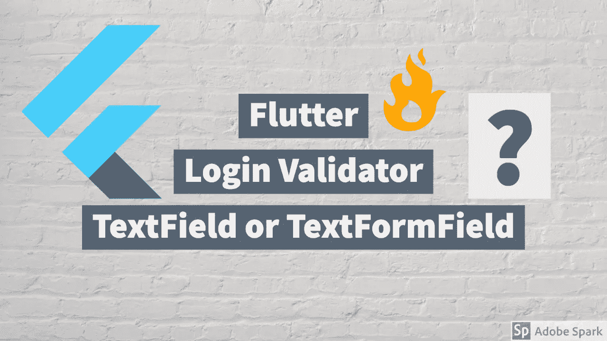

# Flutter 登录页面验证器变得简单🔥。

> 原文：<https://blog.devgenius.io/flutter-login-page-validator-made-easy-f29c75318a72?source=collection_archive---------5----------------------->

当你为你的 Flutter 应用程序设计一个登录页面或者注册页面的时候，验证你从用户那里得到的输入是非常重要的。默认情况下，flutter 提供了两个小部件，您可以从中获取用户的输入。它们是**文本字段**和**文本表单字段**让我们仔细看看**文本表单字段**，因为小部件能够接受输入，然后我们可以根据我们的标准验证输入，这样我们的登录或注册表单在到达服务器之前就可以在客户端进行验证，以防可能的崩溃🤓。

如果你是一个视频迷，那么看看下面的 Youtube 视频。

像往常一样，在 Flutter 开始一个新的新鲜项目。

并将下面的代码添加到 Main.dart 文件中。

现在，我们将实现一个登录页面，该页面将有一个电子邮件输入字段和密码输入字段，以及一个用于提交登录表单的按钮。

因为它是一个登录**表单**我们必须添加一个表单小部件到我们的代码中，所以让我们添加它。因此，现在在 Scaffold 中添加主体，它将包含一个表单小部件和一个带有两个 TextFormFields 和一个按钮的列，您可以参考下面的代码块。

正如您在这里看到的，我们在**表单**小部件中有一个属性“ **Key** ”，它被命名为 **formKey** 这个 formKey 将保存表单的当前状态，比如它的验证状态等。因此，我们将声明两个变量，它们将保存一个窗体的密钥和另一个脚手架的密钥，如下所示。

final scaffoldKey = new global key<scaffoldstate>()；</scaffoldstate>

final form key = new global key<formstate>()；</formstate>

以及两个字符串变量(_email，_pass)，用于保存验证成功时的电子邮件和密码值。

我们还有一个名为 **validator** 的属性，它拥有 **textformField** 将持有的验证标准的实际定义。

一旦 Sumit 按钮被按下，onPressed 中的代码将被执行。通过执行**formkey . current state . validate()，将在成功验证检查时执行 ShowSnackBar()函数。**它将通过访问 Scaffold 键变量来显示 SnackBar。

这是最终的 main.dart 文件的样子。

这是对登录页面中的验证如何工作以及如何使用 TextFormFileds 来验证输入字段的快速理解。

感谢阅读。你可以随时参考我的视频，如果你想要一个主题的视觉前景。再见，谢谢。