# 有扑动的类固醇地图

> 原文：<https://blog.devgenius.io/flutter-maps-on-steroid-cee34a99bcfc?source=collection_archive---------2----------------------->


谢栋豪在 [Unsplash](https://unsplash.com/s/photos/maps?utm_source=unsplash&utm_medium=referral&utm_content=creditCopyText) 上的照片

# 介绍

十年来，移动应用一直是消费在线和离线服务的新方式。对终端用户来说，最大的好处之一可能是它可以提供上下文相关的信息，特别是——但不仅仅是——关于用户的当前位置。

> **在哪里可以**吃/喝/睡/买/ <你的动词在这里>**附近？**

这就是为什么今天市场上有成千上万的应用程序，它们使用地图并试图提供丰富的用户体验来搜索各种各样的东西。

**但是在地图上显示正确的信息比你最初的想法更复杂:**如何在文本/颜色/标记之间找到合适的平衡，让用户专注于他们的搜索结果，并为他提供足够的信息，只点击有用的结果？

这一点尤其正确，因为:

*   贴图通常会填充视口
*   已经有很多细节/信息了
*   很难在不破坏用户界面的情况下添加一些信息
*   与地图有很多可能的互动

# 为什么颤动？

开发一个移动应用不是免费的午餐，尤其是当你的目标是 Android 和 iOS 的时候。此外，除非你在为一家大公司工作，否则你可能应该使用跨平台的工具包/框架/库来最小化开发成本。

如今有很多跨平台的工具包/框架/库，但在我看来，最强大的是[反应型](https://reactnative.dev/)和[颤振型](https://flutter.dev/)。

我不会在这里深究我为什么会爱上 **Flutter** 只是列举几个:

*   Dart —底层编程语言— **是一种快速、安全和优化的语言**
*   学习曲线很低，尤其是如果你来自 Java、Javascript、C#
*   颤振**是否包含电池**(工具、cli、分析、IDE 集成……)
*   Flutter **不依赖于平台的底层小部件**，因为它绘制了自己的小部件，这让你可以在两个平台**上发布具有完全相同的 UI/UX** 的应用**，没有任何故障**和**，而不会限制你的想象力**

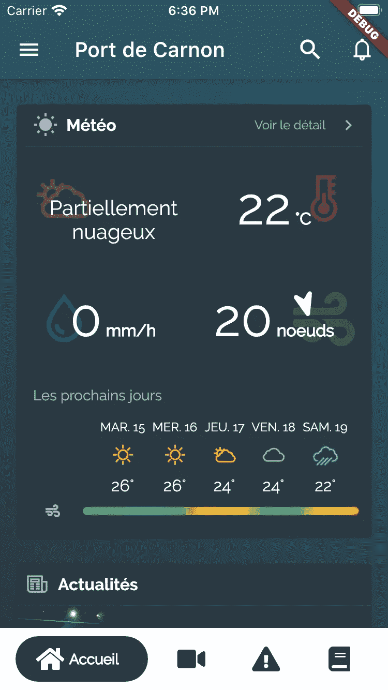

前一家公司在几个小时内完成的管理港口的 POC，它模仿了著名的天气预报应用程序 [Windy](https://play.google.com/store/apps/details?id=co.windyapp.android&hl=fr&gl=US) 的某些部分

*   Flutter 让你**在创纪录的时间内创造惊人的 UI，** **以 60 fps** 运行，我相信，经过打磨的 UI——有很多细节和微型动画*(1)*——是通往**提升用户体验**和**为用户创造愉快时刻**的途径

> (1)不要在网络上寻找微动画，这是一种个人表达，我用它来描述页面上动画的小部分，用户没有意识到，但它使你的应用变得生动。

# 在应用程序中使用地图

> 在本文中，我将主要使用谷歌地图，但也使用 OpenStreetMap(带传单)。请注意，在显示地图时，还有其他免费或付费的解决方案。

当显示地图时，您通常希望显示一些标记，让用户知道他们的结果位于何处。[Google Maps Flutter widget](https://pub.dev/packages/google_maps_flutter)提供了一种简单且声明性的方式，使用字段 **markers** 在地图中添加标记，该字段是 **Marker** 的**集合**。标记是一个简单的对象，它至少定义了一个唯一的 ID。

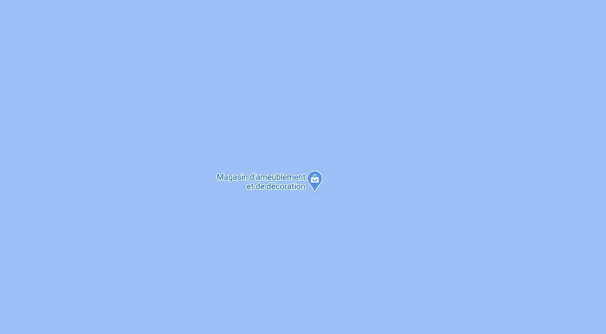

*顺便说一句:几个月前，一家家具店将其在* [*位置的业务定义为 0.00/0.00*](https://www.google.fr/maps/@0,0,15z) *，有一些有趣的评论，但它似乎已被删除*

****位置*** *字段不是必需的，但默认值为 0.00 / 0.00，位于南大西洋，因此除非您正在构建一个帆船比赛应用程序，否则您可能希望设置一个特定的位置。**

*创建带有标记的地图就像编写这 13 行代码一样简单*

*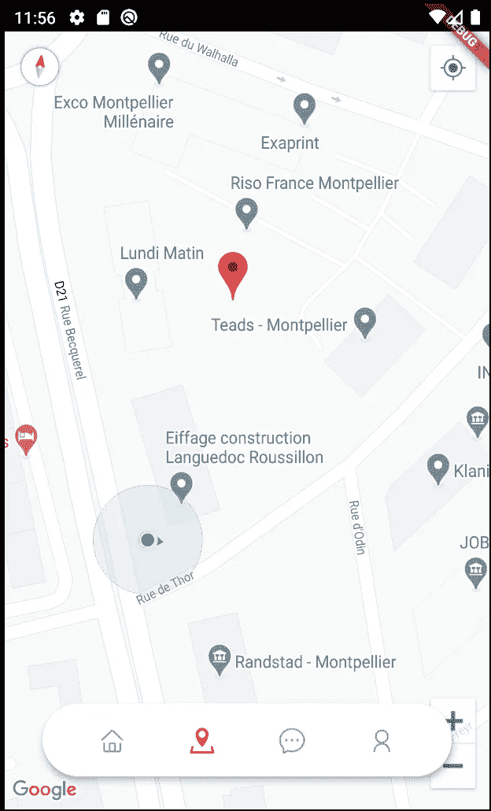*

*这将产生一个带有标记的简单地图。默认情况下，缩放按钮是启用的，但您可以使用许多其他选项:*

*   *启用倾斜手势(在屏幕上上下移动两个手指)*
*   *启用指南针*
*   *启用当前位置按钮*
*   *还有更多…*

*但是等等……你还记得吗？*

> *提升用户体验，为用户创造愉悦的时刻*

*你认为这个简单的地图提升了用户体验吗？它创造了一个愉快的时刻吗？该地图是否提供了与应用程序中其他页面相同的独特体验？**大概不会！***

*想想一些流行的应用程序，如 AirBnB、优步或 Waze。在你看来，他们是使用默认的样式，还是根据自己的身份来设计地图的样式，他们是否通过减少无用信息产生的噪音来关注结果？*

*他们当然会这么做:他们甚至用地图创建了自己的用户界面标识，所以用户感觉就像在家里一样舒适！*

# *在你的地图上添加类固醇*

## *1.设计地图样式*

*没有定制，你的地图使用默认的谷歌地图风格，我不得不承认，我不喜欢这种默认风格，对我来说，这似乎是一种过时的风格。*

*但比我个人想法更重要的是，它通常**与你自己的设计或配色**不太契合:它就像你面前的一个疣。*

*默认情况下，所有可用的信息都会显示出来(道路、商店、河流、花园等等)，最终用户可能会感到困惑/不知所措，或者他可能会认为你的应用程序没有提供他想要的有用结果，只是因为他获得了太多的信息。根据你的应用，**这些信息可能是大脑的噪音**，也可能**显示竞争对手的信息。我不是说不要显示它们，但是如果它们与你的应用程序无关，你应该尽量减少它们对用户界面的影响，或者完全删除它们。***

*作为一个例子，这里有一些用 Flutter 构建的跨平台应用程序的截图，我和工程系学生 Thomas Foulon 一起开发了这个应用程序来管理和查看蒙彼利埃(法国南部)的当地排球锦标赛。*

*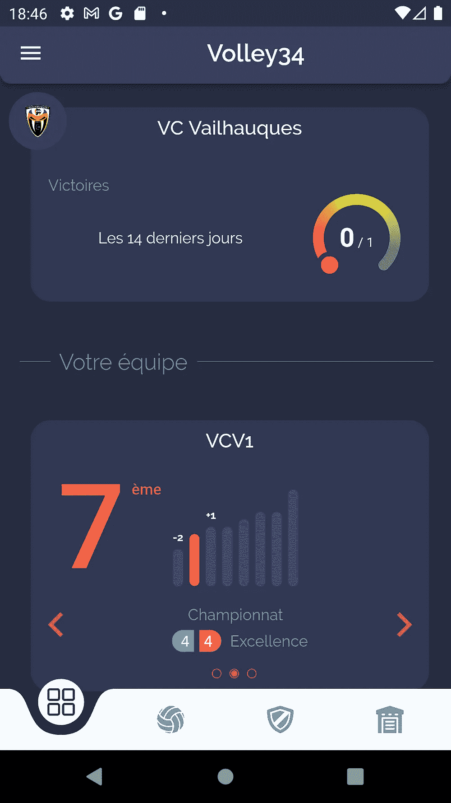**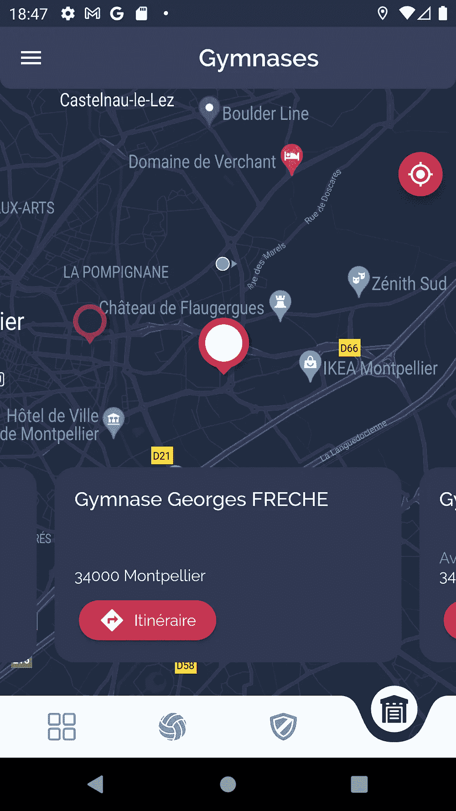*

*即使在地图上也要有统一的配色方案*

***左边**:蓝色/紫色配色方案的主页，是黑色主题的配色方案。*

***在右边**:体育馆的地图使用相同的配色方案，只有有用的信息，即使我也许应该去掉黄色道路的标签*

*幸运的是，有一种方法可以轻松地设置地图的样式:GoogleMap 小部件有一个**控制器**字段——仅在创建地图时可用——它控制地图的行为，但也可以用于设置地图的样式，只需几个步骤:

1——加载包含样式定义的 JSON 文件资产
2——加载 JSON 后，开始显示地图
3——创建地图后，设置样式*

*我通常更喜欢使用 FutureBuilder，而不是直接使用类的内部状态*

*有了这个 JSON 文件，你可以控制你的地图的每一个细节:物体的可见性(道路，高速公路，建筑物，商店…)，颜色，文本，...*

**完整参考可用* [*此处*](https://developers.google.com/maps/documentation/javascript/style-reference) *。**

*如果您不习惯手动编写这个文件，您可以使用在线可视化编辑器来创建自己的样式。谷歌有一个[基于云的编辑器](https://console.cloud.google.com/google/maps-apis/client-styles)(目前处于测试阶段——2021/01/25)，但在我看来，它有一个主要的局限性:创建的风格不是动态的(见下文)。另一方面，它有一个主要的好处:你不必在你的应用程序中管理你的风格，你可以更新它，而不用发布你的应用程序的新版本。*

*您也可以使用编辑器的[当前稳定版本](https://mapstyle.withgoogle.com/)，它不是基于云的，允许您下载包含样式定义的 JSON 文件。但是我更喜欢 [Snappy](https://snazzymaps.com/editor) ，它也是一个可视化编辑器，因为**你可以找到许多预定义的样式**——由其他用户创建——这通常是我自己的样式的一个很好的起点，你也可以通过颜色进行搜索，这是一个很棒的功能。*

***动态风格呢？***

> *我所说的动态风格是什么意思，你为什么需要它？*

*动态意味着一些值不是硬编码的:**风格可以根据上下文的值进行调整**。上下文可以是夜间模式，也可以是您的主题(当主题改变时自动调整您的地图样式，而无需修改样式文件)或一些应用程序功能，例如您的用户可以选择应用程序的主色，而您希望地图使用相同的颜色。*

*要解决这个问题，你可以首先创建你的样式文件(手动或用编辑器)，然后用特定的字符串/关键字替换一些硬编码值，如颜色。*

*我使用了关键字“{textTheme.bodyText2}”，而不是对文本笔画的颜色进行硬编码*

*然后，在将样式应用到地图之前，用从上下文中提取的特定值替换所有关键字。*

```
*ThemeData themeData = Theme.*of*(buildContext);
_mapStyle = _rawMapStyle
    .replaceAll("{textTheme.bodyText2}",
        themeData.textTheme.bodyText2.color.toHexWithoutAlpha())
    .replaceAll(
        "{canvasColor}", themeData.canvasColor.toHexWithoutAlpha())*
```

*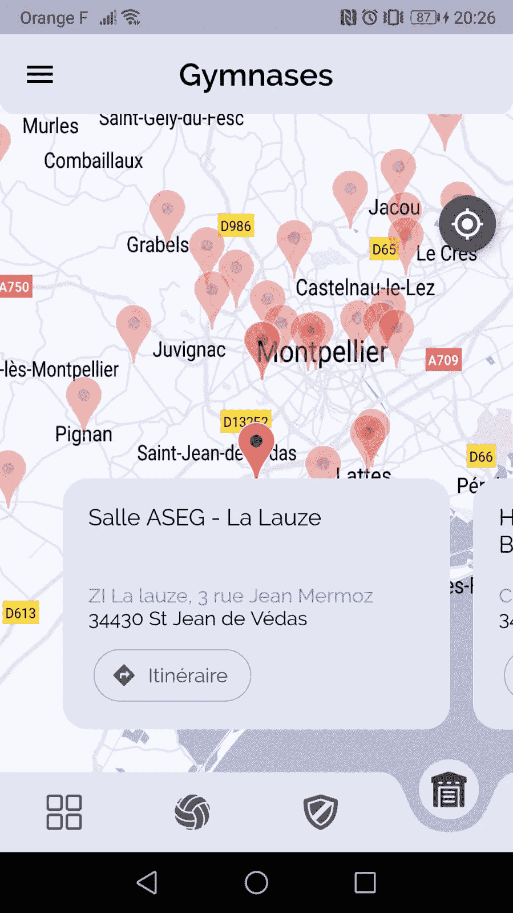*

*使用此技巧应用了灯光主题的排球应用程序*

## *2.不要使用默认的控制按钮*

*所以现在我们有了一个和我们的应用程序完全一样的配色方案的地图，我们已经通过修改样式最小化了一些无用信息的影响，但是下一步是什么？*

*如前所述，谷歌地图小部件有很多选项。其中一些旨在启用或禁用某些地图控件:*

*   *屏幕左上方的指南针*
*   *屏幕右下角的地图工具栏(仅适用于 Android)*
*   *屏幕右下角的缩放控件*
*   *屏幕右上角的“我的位置”按钮*

*不幸的是，你无法控制它们展示的位置，也无法控制它们的风格和形状。由于您正在构建一个令人惊叹的独特的应用程序，因此您不能使用这些默认控件。*

*我的建议是禁用所有这些选项，但提供您自己的小部件作为控制地图的替代。最简单的方法是把你的地图和这些部件放入一个**栈**中，由于 Flutter 非常简单，你还可以给你的部件添加一些非常酷的动画。*

*让我们来看看几个月前我制作的一个食品卡车应用程序的示例视频，并注意到一些事情:*

*1-指南针是一个自定义的指南针，根据地图倾斜和方位来投影北方，以增强方向感和倾斜度
2-“我的位置”按钮仅在当前位置超出当前可见范围时出现*

## *指南针按钮*

*对于指南针投影，用一个 [**变换**](https://api.flutter.dev/flutter/widgets/Transform-class.html) 小部件包装你的小部件并应用两个旋转是一样简单的:一个 X 旋转应用当前倾斜，一个 Z 旋转应用当前方位。*

*您可以通过使用 Google Maps 小部件上的 **CameraPositionCallback** 属性来检索最新和更新的倾斜和方位值:*

## *当前位置按钮*

*对于这两个按钮，当显示的信息没有用时(当指南针按钮的方向是北，并且当前位置在当前可见边界内时),我想隐藏它们。*

*Google maps controller 有一个方法来检索当前可见区域(即 **getVisibleRegion** )，该方法返回一个 **LatLngBounds** (包含可见区域的最小边框)。它工作正常，但只有当相机没有倾斜！如果倾斜应用于摄像机，那么应该返回一个梯形。如果您想要检测当前位置是否在地图的当前可见部分之外，这是非常重要的。*

*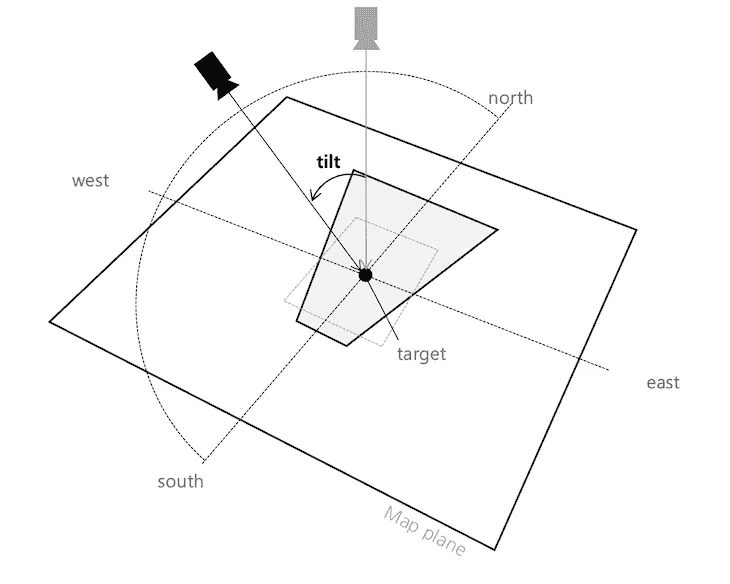*

*将倾斜应用于地图时的透视模式*

> ***因此，如果您启用了倾斜功能，并且如果您想要检测当前位置是否可见，则您不能使用#getVisibleRegion 方法**。*

*对这个特性的完整解释超出了本文的范围，但是我在 Google maps flutter 插件([https://github.com/flutter/flutter/issues/74888](https://github.com/flutter/flutter/issues/74888))上创建了一个问题，并且在这个问题的评论中提供了一个解决方法。完整的解释和解决方案请参考。*

## *3.用你自己的马克笔*

*标记可能是地图上显示的最重要的图形元素，因为它们提供了最重要的信息:POI(兴趣点)的位置。*

> *标记是地图的核心用户界面元素。他们应该在一个非常小的区域内最大限度地显示有用的信息，这很有挑战性:可读，足够但不要太多。*

*正如提到的地图风格，为标记提供一个独特的 UX 要好得多:用户会感觉舒适自在。当使用您自己的标记，而不是默认的标记，您可以改变颜色，图标，大小，形状根据每个兴趣点的信息。*

*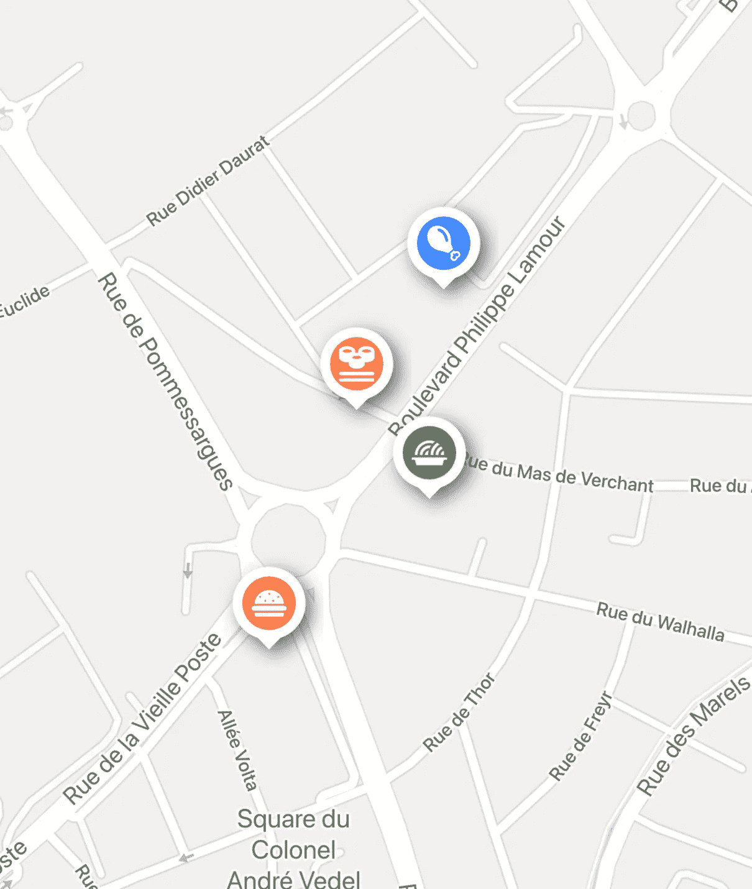*

*带有自定义标记的快餐车应用程序，这些标记取决于快餐车的特性*

*Google maps 提供了一个**标记**类，该类有一个必需的属性，即 **MarkerId** 类型的**markerId**(markerId 不需要全局唯一，只需要在列表中唯一)。*

*但是这个类也提供了一个类型为 **BitmapDescriptor** 的**图标**属性，其目的是描述一个位图图像。这个类提供了一个方便的静态方法来从资产中加载图标:*

> *如果你有几个图标和大量的标记，你最好先加载标记图标，然后用预加载的图标创建标记*

*您可能已经注意到， **fromAssetImage** 静态方法是异步的，这意味着您必须等待图像加载后才能显示标记。要在显示地图之前加载标记，您可以使用[**future builder**](https://api.flutter.dev/flutter/widgets/FutureBuilder-class.html)小部件:*

## *创建动态标记*

*使用资产图像来加载标记的图标是一个很好的功能，但是如果我希望我的快餐车标记根据快餐车的特色(意大利面、汉堡、亚洲菜、鸡肉等)来显示图标，而且根据快餐车的当前打开状态来使用背景颜色，该怎么办呢？或者更一般地说，如果我想显示来自我的模型的动态信息呢？*

> ***资产是静态图像，根据安讯士的数量(特色/营业时间/价格范围/ …)，创建所有可能的图像是一项艰巨的任务。***

*这就是动态标记发挥作用的地方！正如你所见，谷歌地图使用**位图描述符**来绘制标记。位图描述符是一个简单的类，描述了如何绘制位图。*

*Flutter 可以被视为一个绘图库:它不依赖于平台的底层小部件，但它使用 [Skia](https://skia.org/) (一个开源的 2D 图形库)绘制一切。这意味着 Flutter 有很多绘图功能，也可以描述位图…*

*绘图功能是在 [**画布**](https://api.flutter.dev/flutter/dart-ui/Canvas-class.html) 类中实现的。它有一个必需的参数类型 [**PictureRecorder**](https://api.flutter.dev/flutter/dart-ui/PictureRecorder-class.html) ，用于记录画布中的所有图形操作。当您结束记录时，您可以检索一个图像，然后创建一个 BitmapDescriptor。*

*用 PictureRecorder 记录并创建一个位图描述符*

*是的，Canvas 是一个用于绘画的低级类。当你开始，但你的想象力没有更多的限制。以前的食品卡车标记已经使用画布绘制了形状、阴影、图标(来自 SVG)、颜色等等。*

*但是你可以做得更多。下一个(也是最后一个)例子是我的一个朋友创建的一个攀岩应用程序。这个移动应用程序使用实时图像识别人工智能来识别攀岩路线，并旨在提供关于识别的攀岩路线的信息(名称、难度等)。我的朋友问我是否可以在这个应用程序上工作，用一个新的 UI/UX 重写应用程序。*

*像许多应用程序一样，它使用地图来查找和显示爬山、扇形以及某个位置周围的路线(取决于缩放级别)。以下是原始应用程序的一些截图:*

*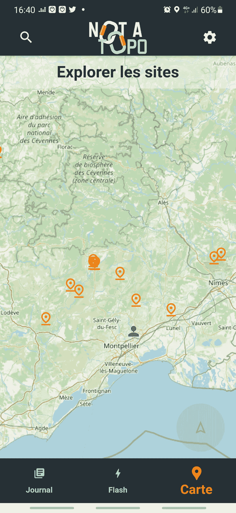**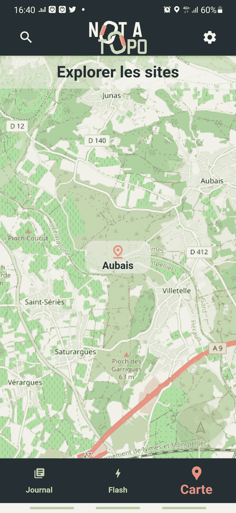**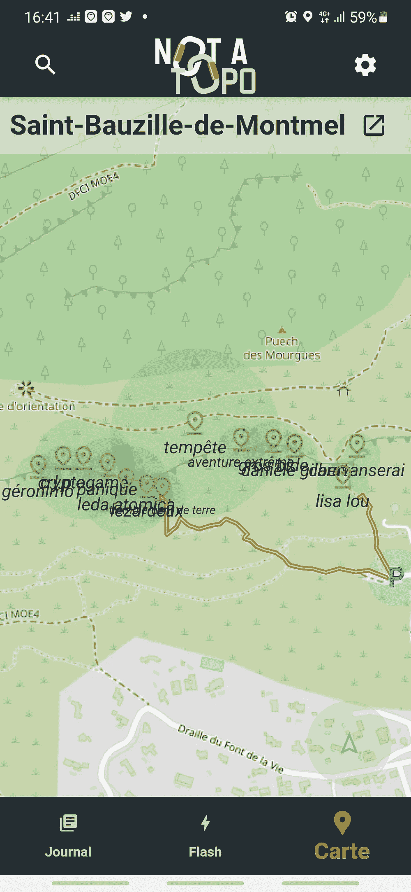**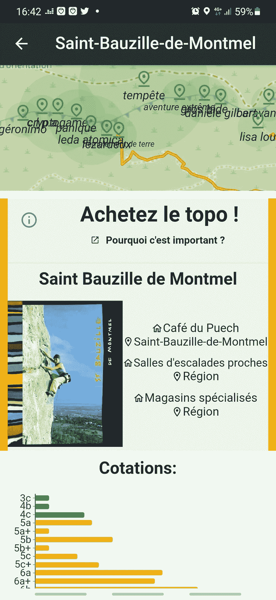*

*我放了 4 张截图(从左上到右下)给你看，用户必须点击 3 次(或缩放并点击)才能看到特定区域/山脉的等级分配。如果用户有孩子，并想找到一些容易附近的部门，那么**他将不得不点击 3/4 次他周围的每座山/部门**！*

*对于这个特殊的特性，我决定用径向渐变来显示标记内的等级重新划分:即使不是很准确，一切都是可见的，但它是合成的，足以让用户知道他是否想点击查看更详细的信息。*

*这个实现是用[**open street Map**](https://pub.dev/packages/flutter_map)插件完成的，这个插件与谷歌地图插件有一点不同，但是更容易实现，因为 **Marker** 类提供了一个 **WidgetBuilder** 。*

***CragMarker** 小部件是一个有 2 个子部件的堆栈(一个用于大头针本身+径向梯度，一个用于攀登路线的数量)。*

*最后，**爬坡刷**只是一个**定制刷**来刷**坡度**。*

*Tada！结果很有趣，有了微型动画，真的很漂亮。请注意，这段视频向您展示了一张小地图，上面有附近的峭壁列表。每个图块使用线性渐变来显示与径向渐变相同的信息。*

*如果你喜欢爬山，并且想测试这个应用程序(目前只有原始应用程序发布了)，你可以从商店安装它(见下面的链接)。该应用程序有法语和英语两种版本。*

*[**iOS**](https://apps.apple.com/fr/app/not-a-topo/id1553844102) 和**[**Android**](https://play.google.com/store/apps/details?id=fr.optimized.notatopo)***

***瞧啊！当然，没有单一的道路可走:它主要取决于您的应用程序、您的业务环境、您的约束。这些技巧必须适应你的情况。正如你所看到的，创建一个强大的地图并不容易，但不是因为技术，而是因为地图是一个没有或很少文字的信息摘要。***

***幸运的是，现在你能够在类固醇 **上创建一个**颤动** **地图，它有一个不妥协的独特身份，并且专注于重要的信息。*******

> ***为你的用户提供愉快的时刻是不够的，但这可能是成功的关键之一***

***如果你觉得这篇文章有用，请告诉我👏如果你发现了一个错别字，如果你想问一个问题或者其他什么，不要犹豫，留下你的评论。***

***快乐地图✋***