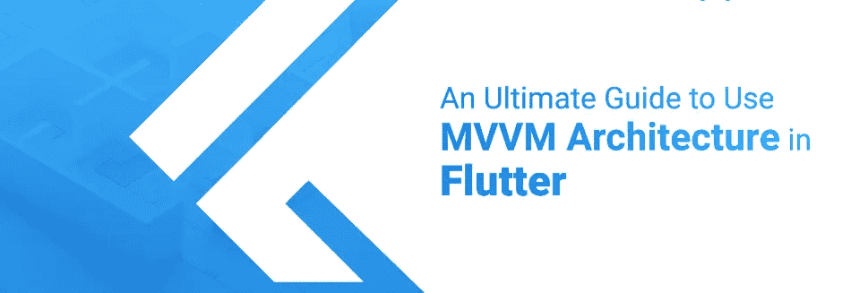
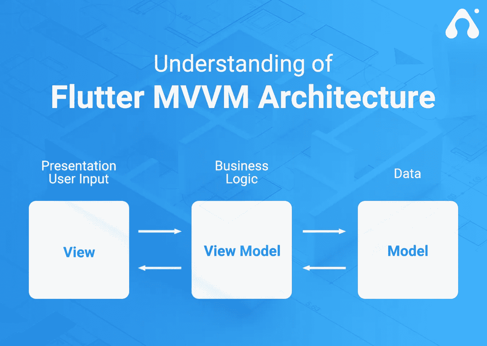
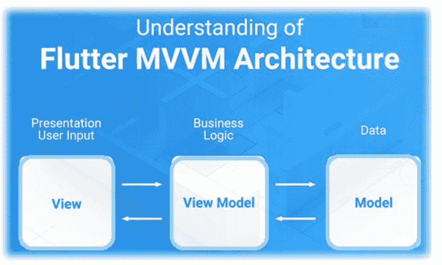
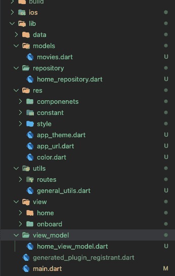
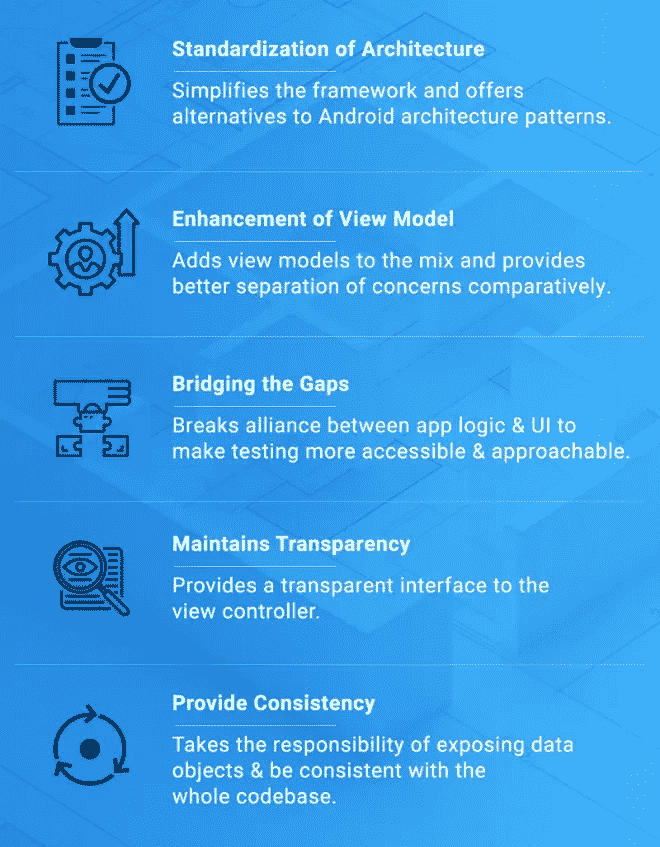

# 颤动的 MVVM 建筑

> 原文：<https://blog.devgenius.io/flutter-mvvm-architecture-with-provider-a81164ef6da6?source=collection_archive---------0----------------------->

## 什么是 **MVVM？**

> MVVM 代表模型视图视图模型

## **为什么我们需要 MVVM 在颤振？**

> 正如我们所知，flutter 不支持任何用于开发的架构。这意味着开发者有责任实现它。
> 
> 我们需要一个架构来在 UI 和业务逻辑之间进行通信，所以 MVVM 以一种简单的方式提供了这一点，因为你可以将所有的业务逻辑分别保存在 ViewModel 类和 UI 中。

## 使用 MVVM 的主要好处是

> 业务逻辑独立于 UI。
> 
> 视图独立于 ViewModel 类，只从 ViewModel 中读取状态。
> 
> 在逻辑和用户界面方面，代码将易于维护和更新。

# 什么是 MVVM 颤振？

> MVVM(模型-视图-视图模型)由三个主要组件控制，它们是模型、视图和视图模型。
> 
> 关键组件有助于建立 MVVM 设计模式的构建块，每个组件都有不同的功能和职责，在应用程序的开发过程中，组件之间良好的交互起着关键的作用。
> 
> 在 MVVM 架构中，视图模型用于与模型通信，视图用于与视图模型交互以进行数据绑定。

## **型号**

> 这一层负责从服务器或本地数据库获取数据，并传输到视图模型。

## **ViewModel**

> ViewModel 用于在视图和模型之间传递数据，它接受所有的用户事件并请求模型进行数据响应。一旦模型有了数据，它就返回到 ViewModel，然后 ViewModel 通知要查看的数据。
> 
> ViewModel 可以由多个视图使用，这意味着单个 ViewModel 可以向多个视图提供数据。

## **视图**

> 视图是用户与屏幕上显示的小部件进行交互的地方。用户事件从 ViewModel 请求一些数据，ViewModel 的其余部分按照对模型的请求处理事件。一旦 ViewModel 按照请求从模型中获得数据，它就会反映在用户视图上。
> 
> 现在，我们将看到演示 MVVM 体系结构的示例，我们将使用提供程序通知数据，并使用 HTTP 包请求服务器请求。
> 
> 另外，我们使用存储库层来完成请求，并通过 ViewModel 将数据传输回视图。

# **MVVM 建筑:**

> 我们的 MVVM 架构如下图所示，现在我简要介绍一下文件夹结构，以便了解 MVVM 的最佳实践

## **数据**

> 这个目录将保存所有网络和本地数据库相关的类。

## **型号**

> 该目录将保存 API 响应的所有模型类，并为每个 API 响应模型类创建内部目录。

## **储存库**

> 该目录将保存项目中用于与 ViewModel 通信的所有存储库类，并为项目的每个模块创建一个内部目录。

## **res**

> 这个目录将保存所有与颜色、样式和字符串文件相关的类。

## **utils**

> 这将包含项目的所有实用程序类。

## **查看**

> 这个目录将包含所有视图相关的类和子目录，如模块和部件以及项目。

## **视图 _ 模型**

> 如果需要，这个目录将保存所有与 ViewModel 相关的类及其子目录。

# Android 和 iOS 应用的 MVVM 架构优势

> 在应用程序开发中，移动应用程序架构模式的基本目标是使用基于行业和供应商特定标准的广泛技术来加强移动应用程序开发策略，最终推动应用程序(无论是 Android 还是 iOS)的形成。困扰大多数项目负责人的一个问题是— *为什么 MVVM 对你的应用很重要？*换句话说，这个问题提出了— *“这个设计模式对你的应用程序有什么作用。”*
> 
> MVVM 是模型视图视图模型的缩写变体，旨在将应用程序分成三个逻辑组件，并随后处理应用程序的特定开发方面。尽管市场上充斥着如此多的架构模式来提高应用程序性能和设备能力，但 MVVM 特别关注解决方案架构为用户提供更好的 UI 体验的重要性。除了管理和表示数据对象，MVVM 体系结构还有很多好处，下面列出了其中一些。

# 源代码

 [## GitHub-inamhusain/mvvm _ with _ provider

### 一个新的颤振项目。这个项目是颤振应用的起点。一些帮助您入门的资源…

github.com](https://github.com/inamhusain/mvvm_with_provider.git)