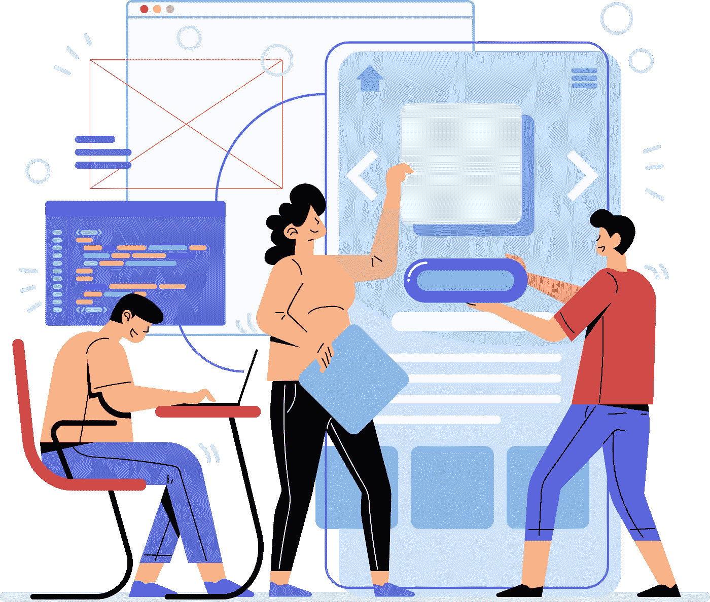
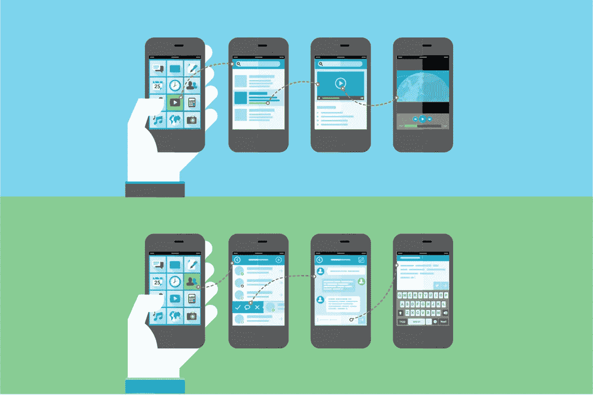

# 颤振第 1 部分——颤振与 Xamarin

> 原文：<https://blog.devgenius.io/flutter-part-1-flutter-vs-xamarin-a8ad36082aae?source=collection_archive---------1----------------------->

什么是颤振？它的利弊是什么？为什么值得学习和使用？它是如何工作的？它与其竞争对手相比如何(比如 Xamarin 表单，我有使用的经验)？我怎样才能了解它并开始使用它？

我最近开始钻研和学习 Flutter。要学的东西很多，我想分享的信息也很多，所以我会开门见山地回答这些显而易见的问题。

# 什么是颤振？

“Flutter 是 Google 的 UI 工具包，用于从单个代码库为移动、web、桌面和嵌入式设备构建漂亮的本地编译应用程序。”- [颤振](https://flutter.dev)。它是一个开源软件开发工具包(SDK)，主要由 Google 维护，用于开发主要针对 Android、iOS、Linux、Mac、Windows 和 web 的跨平台应用程序。Flutter 使开发人员能够构建非常灵活的 UI，同时允许重用 UI 和业务逻辑的定义来构建和部署到多个平台。在很多方面，它就像其他跨平台开发框架(对我来说，我认为是 Xamarin Forms)，但它有几个显著的差异，允许 Flutter 在其 UI 和动画功能上有更多的灵活性。

# [Flutter 的口号](https://flutter.dev/docs/resources/inside-flutter)——“一切都是小部件。”

Flutter 使用了一种激进的组合策略，从顶级根应用程序到最小的 UI 元素都是一个小部件。小部件可以在任意多的地方重用，每个使用的小部件都成为小部件树的一部分，用于呈现应用程序显示的每一帧。应用程序开发人员创建的大多数小部件都是由各种其他小部件组成的，这种小部件组合方法类似于 React 网站从组件中组合 UI 的方式，能够实现灵活性、一致性、代码重用和高效的性能。

由于我是从使用 Xamarin 表单开始学习 Flutter 的，所以在我继续解释 Flutter 的功能时，我也将展示许多与 Xamarin 表单相对应的等效细节，我希望这有助于突出 Flutter 的与众不同之处。

# 1 —部署目标及其工作方式

颤动:

> 可以部署到移动、桌面*、**网络、嵌入式设备**
> 
> **模仿**原生控件的显示和功能(并提供比原生控件**更广泛的小部件和功能**
> 
> 渲染到**画布控件**

Xamarin 形式:

> 可以部署到移动设备、台式机*
> 
> **将**代码和视图直接转换为本地控件(在某些情况下，**缺少本地控件中不存在的所需控件和特性**)
> 
> 渲染**本地控件**

* *截至 2021 年夏季，UWP 的 Flutter 桌面部署处于 alpha 发布阶段，WPF、MacOS 和 Linux 的测试阶段。MacOS 的 Xamarin Forms 部署处于预览发布阶段，UWP 是稳定的，Xamarin Forms 在早期阶段也有一些 web 平台支持。*

有一种很少使用的方法，可以在 Flutter 应用程序中托管原生移动控件(想想 Google Maps 控件)，但在 Flutter 中托管原生控件的性能很慢，应该(通常)避免。[参见[在一个抖动应用中渲染本地控件](https://flutter.dev/docs/resources/architectural-overview#rendering-native-controls-in-a-flutter-app) ]

移动应用程序中的 canvas 控件通常会占用应用程序的全部可用屏幕空间(在屏幕的顶部和底部有一个 SafeArea 小部件，为平台特定的需求留出空间)。

当 iOS 或 Android 操作系统更新包括本机控件的 UI 差异时，Xamarin 应用程序通常会立即看到这些变化；Flutter 应用程序(无论在何处尝试近似本机控件外观)将需要等待更新的 Flutter 版本的开发，该版本在为该平台构建以反映相应的平台本机控件时修改 Flutter 控件中的视觉显示或功能，然后应用程序开发人员将更新的 Flutter 版本应用于应用程序，然后在相应的应用程序商店中发布更新的应用程序。然而，为了在默认设置之外使用新引入的控制功能，Xamarin 应用程序将遵循与 Flutter 相同的模式，只是 Xamarin 库更新将简单地包装新功能，而不必构建匹配的功能。

# 2 —用户界面方法和热重装

颤动:

> **声明式 UI** : UI 是 app 状态的函数；每当相关状态改变时，显示器重新呈现
> 
> 由于画布层的缘故，热重新加载和热重启非常可靠{不仅仅是 UI 更改，几乎任何代码区域的更改都会适当地影响热重新加载，除了对应用插件/包依赖关系的更改。热重装是有状态的；热重启重启应用程序刷新}
> 
> 花哨/流畅的用户界面体验和**定制选项通常是开箱即用或通过软件包提供的**

Xamarin 形式:

> **命令式 UI** :渲染 UI；根据应用程序状态对呈现的用户界面进行必要的调整
> 
> 热重新加载和热重启有时会丢失关键的应用状态，导致需要完全重新部署
> 
> 一些可视化定制的 UI 体验可以在 Xamarin 表单中完成，但其他**定制可能需要开发人员付出过多的努力**使用特定于平台的 SDK 代码(包装在 C#中)来调整本地控件功能或渲染器，或者在每个平台中创建定制控件

Flutter for Web 目前支持热重启，但不支持热重载。更多信息请参见[用 Flutter 构建 web 应用](https://flutter.dev/docs/get-started/web)。

在 Flutter 中，动画和过渡更加容易和灵活，这是由于其庞大的小部件库的灵活性，小部件可以嵌套以呈现 UI 的多种方式，以及声明性 UI 允许小部件在如何重新呈现特定应用程序状态方面具有完全的灵活性。

Flutter 有几个专门为动画过渡或视觉变化而构建的小部件，或者自动，或者以自定义的方式(比如 AnimatedContainer 和 Hero 小部件)。]

[这里的](https://betterprogramming.pub/why-did-i-move-from-xamarin-forms-to-flutter-c5f4f8856b75)是一篇让我真正关注到 Flutter 热重装的影响的文章。

“在 Flutter 中，你可以编辑任何东西[…]。你的 UI，你的服务，你的业务逻辑。任何事。然后保存它，更改将同步到您的设备，您可以立即使用它们。即使您编写了全新的代码并设置了断点，当您保存它时，该断点将像它一直在那里一样被命中。”—更好的编程。

有关热重装特例[的详细信息，请查看](https://flutter.dev/docs/development/tools/hot-reload#special-cases)。

# 3 —设备访问和特定平台

颤动:

> 对主机设备特性的访问通常可通过 [pub.dev](https://pub.dev/) 插件包获得，其中异步消息在 Flutter UI 层和平台主机层之间发送，平台主机层将消息解释为本地调用和响应消息；本地或定制的 C/c++ API 也可以通过插件调用
> 
> 必备的特定于平台的适配会自动应用于 iOS 和 Android 中的库小部件/导航/手势，以匹配操作系统的期望，而 Flutter 通常包括在需要时显式产生平台约定效果的能力；参见[特定于平台的行为和适应性](https://flutter.dev/docs/resources/platform-adaptations)、[构建适应性应用](https://flutter.dev/docs/development/ui/layout/building-adaptive-apps)和[这些帖子](https://aloisdeniel.com/#/?id=blog)了解更多详情。

Xamarin 形式:

> 通常可通过 Xamarin 访问主机设备功能。Essentials 包或其他 [Nuget](https://nuget.org/) 包，其中 Xamarin 接口通常是本机接口的通用包装器
> 
> 由于使用了原生控件，控件在 iOS 和 Android 平台上的工作与用户预期的一样，除非进行了明确的定制

一些常用的 Flutter 插件有 camera、webview_flutter、geolocator、http、shared_preferences、url_launcher、device_info_plus、share_plus、connectivity_plus、path_provider、sensors_plus、sqflite。

Flutter 自动处理诸如过度滚动行为差异、图标差异、Android 后退按钮行为、文本编辑、文本选择和与文本相关的手势的差异等事情，但将平台约定的选项(如开关控件在一行的左侧或右侧的定位)留在应用程序开发人员手中(有时甚至提供遵循平台约定的基于平台的选项)。

# 4 —开发语言和选项

颤动:

> UI 和后端代码都是用 **Dart** 语言开发的
> 
> 在 **VS 代码**或 **Android Studio** 或 **IntelliJ** 开发；*每个目标平台都有开发机器要求(仅在 Mac 上运行 iOS)和必需的安装

Xamarin 形式:

> UI 是用 **XAML** (类似 XML，但有绑定)**和/或 C#** 开发的；后端代码用 **C#** 开发
> 
> 在用于 Android 和 UWP 的 **Visual Studio** 中开发，带有 iOS 所需的联网 Mac(用于调试的本地网络),或者在用于 Android 和 iOS 的 **Visual Studio for Mac** 中开发

Flutter for Android 需要完全安装 Android Studio 来提供其 Android 平台依赖项，尽管您可以在其他编辑器中开发代码。【安卓系统设置为 [MacOS](https://flutter.dev/docs/get-started/install/macos#android-setup) 和 [Windows](https://flutter.dev/docs/get-started/install/windows#android-setup) 。在使用 Visual Studio 代码(在 Windows 和 Mac 机器上)试用了 Flutter 之后，我对它作为我的 Flutter 开发环境非常满意，特别是在安装了几个至关重要的扩展(“Flutter”、“Dart”、“bloc”和“Git History”)之后。

UWP 的 Flutter 处于 alpha 阶段，需要安装最新的 Visual Studio(安装了适当的工作负载/工具)。[此处设置 Windows。](https://flutter.dev/docs/get-started/install/windows#windows-setup)

适用于 iOS 和 MacOS 的 Flutter 必须在 Mac 上构建和运行，并且需要在开发机器上安装 Xcode 和 CocoaPods。虽然共享代码 Flutter 开发可以在 Windows 机器上进行，Android 的热重装测试也可以在 Windows 机器上进行，但 iOS 和 MacOS 的 Flutter 构建、测试和签名必须在 Mac 上进行。[在此设置 iOS。](https://flutter.dev/docs/get-started/install/macos#ios-setup)

# 5 —历史和跨平台用户界面

颤动:

> [**Flutter 1.0**](https://flutter.dev/docs/development/tools/sdk/releases) ，首个稳定发布 **12/4/2018**
> 
> Flutter 发展迅速，但相对较新
> 
> Flutter 以其 **MaterialApp** widget 作为应用根，基于 Material Design，适用于所有支持 Flutter 的平台，而不仅仅是 Android
> 
> **CupertinoApp** 是基于苹果人机界面指南的主题，在非苹果设备上显示时必须使用备用字体
> 
> 小工具通常不会调整它们的显示来匹配它们的平台，所以这两个之间的**决定使得跨平台的应用程序 UI 要么是主题化的，如每个平台上的材料设计或苹果的人机界面指南**

Xamarin 形式:

> [**Xamarin.iOS**](https://en.wikipedia.org/wiki/Mono_(software)#Xamarin.iOS) (前身为 MonoTouch)于 2009 年 9 月 14 日首次发布
> 
> [**Xamarin。Android**](https://en.wikipedia.org/wiki/Mono_(software)#Xamarin.Android) (之前 Android 的 Mono)首次发布**2011 年 4 月 6 日**
> 
> [**Xamarin。**表格](https://en.wikipedia.org/wiki/Xamarin)首次推出**2014 年 5 月 28 日**
> 
> Xamarin 的研发力度更大
> 
> Xamarin 中的控件。将每个显示形成为平台特定的本机控件

除了必备的特定于平台的交互和一些具有基于平台的显示选项的小部件，小部件通常不会调整其显示以匹配其平台。通常，在你的 widget 树的顶部附近的 MaterialApp 或 CupertinoApp 之间的决定使得跨平台应用程序 UI 要么像 Material Design 或 Apple 的人机界面指南一样在每个平台上主题化，除非你编写两个版本的 UI 来最好地满足平台特定的显示预期，或者使用非标准的 UI。从我在各种讨论帖子中看到的情况来看，MaterialApp 似乎比 CupertinoApp 更健壮(错误更少)并且更广泛地用于 Flutter，所以除非你非常确定你想让每个平台都使用看起来像原生 iOS 控件的控件，否则我会建议使用 MaterialApp，至少在开始使用 Flutter 时是这样。

有一些包尝试，如 flutter_platform_widgets，使 MaterialApp 和相应的小部件在某些平台上更容易使用，而 CupertinoApp 和相应的小部件在其他平台上更容易使用，但在我对这些方法的评论中，它使 UI 开发变得非常复杂，基本上等同于编写大部分显示的两个版本，这是我通常会尽量避免的。

# 6 —未来的期望

颤动:

> 展望未来，【Flutter 的跨平台开发市场份额似乎正在增长，而除 React Native 之外的所有其他公司似乎都在萎缩
> 
> 对 [Flutter 库](https://github.com/flutter/flutter)的开发仍然非常活跃，因为目前有很多来自谷歌和开源贡献者对 Flutter 的支持

Xamarin 形式→。净毛伊岛:

微软对 Xamarin 的未来计划。将它完全融入。NET 6(2021 年 11 月)及以后为**。NET MAUI(多平台应用程序 UI)** ，这是一种更加跨平台的开发方法(除了 Android、iOS、Windows、Linux 之外，这将包括 macOS 作为目标)

> “Xamarin 的下一个主要版本。表单将在 2020 年 9 月左右发布，并通过发布继续更新。网毛伊岛与。NET 6。之后是 Xamarin。表格将继续获得 12 个月的优先服务。”(直到 2022 年 11 月，届时迁移路径将可用)——[xa marin](https://github.com/dotnet/maui/wiki/FAQs)
> 
> “作为 Xamarin 的一种进化。形式，您将能够使用所有 XAML 及其所有现有的功能，我们将继续改善 XAML，以帮助您更有成效。。NET MAUI 将继续支持 MVVM，同时为开发者提供使用 RxUI 和 MVU 的选项。”— [Xamarin](https://github.com/dotnet/maui/wiki/FAQs)
> 
> **RxUI** : ReactiveUI，一个功能性和反应性的模型-视图-视图模型(MVVM)框架
> 
> **MVU** :模型-视图-更新，单一状态流的应用架构

# 7 —相似性

两者:

> 开源
> 
> [2019 年和 2020 年跨平台移动框架使用排名前五的](https://www.statista.com/statistics/869224/worldwide-software-developer-working-hours/)
> 
> 有许多可用的包/插件
> 
> 拥有优秀的文档和社区
> 
> Flutter-sound[Dart 2.12 中的空安全](https://dart.dev/null-safety)和 Flutter 2/xa marin-c# 8 中的可空引用类型

## ——Tommy Elliott——AWH[软件开发团队负责人](http://awh.net)。我们正在帮助企业通过技术推动增长。