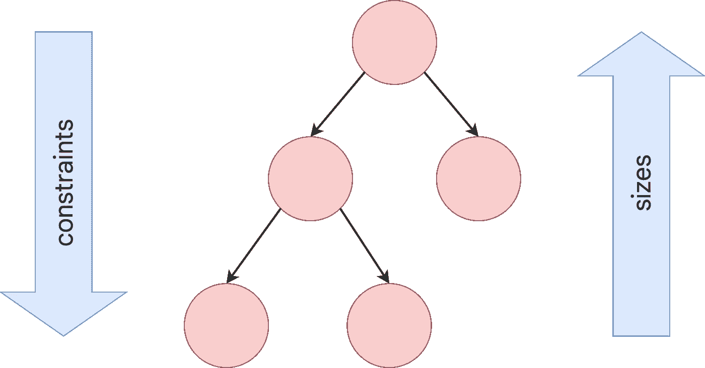

# 颤振第 2 部分-展示能力和首次开发基础

> 原文：<https://blog.devgenius.io/flutter-part-2-showcase-of-capabilities-and-first-time-development-basics-73f501c74f4?source=collection_archive---------1----------------------->

为什么 Flutter 值得学习和使用？我们已经看到了关于它是什么和如何工作的一些细节，我也提到了 Flutter 的一些重要方面，但如果我没有提供一些生动的应用程序示例供您查看，那将是我的失职。对我们来说幸运的是，一个名为 gskinner 的开发团队已经构建了一组[开源示例](https://github.com/gskinnerTeam/flutter_vignettes)，供公众审查，这些示例是专门用来展示一些 [Flutter 令人难以置信的 UI 功能](https://flutter.gskinner.com/vignettes)。如果你愿意，你甚至可以探索他们的代码。

【https://github.com/gskinnerTeam/flutter_vignettes 

[看看这些](https://flutter.dev/showcase)用 Flutter 创建的备受瞩目的现实生活应用。还有一个[网站](https://itsallwidgets.com/)展示和搜索数以千计用 Flutter 构建的应用，其中一些是开源的，一些是模板。

# 颤振建筑

移动/桌面颤振应用程序:

[https://flutter.dev/docs/resources/architectural-overview](https://flutter.dev/docs/resources/architectural-overview)

Web Flutter 应用程序:

[https://flutter.dev/docs/resources/architectural-overview](https://flutter.dev/docs/resources/architectural-overview)

*   [网页渲染](https://flutter.dev/docs/development/tools/web-renderers)选项:
*   **HTML** (HTML，CSS，Canvas，SVG)
*   **WebGL** (CanvasKit: Skia 编译成 WebAssembly)
*   自动(用于移动设备的 HTML，否则为 WebGL)
*   对于 Web，Dart 编译成 JavaScript
*   用于辅助功能体验的语义小部件

让 Flutter 架构在跨平台框架中独一无二的一点是，它在框架本身中引入了一个渲染层。这使得有机会消除本机 UI 或包装器中固有的 UX 约束，以实现多平台本机 UI 之间的共性，同时也给框架(或社区)带来了更多负担，以提供跨平台应用用户体验的必要构建块(UX)。

这里要注意的另一件事是，在移动和桌面目标中，Flutter 包括引擎层和嵌入层，引擎层连接到设备操作系统以实现关键功能，嵌入层处理特定于平台的细节和连接，而在 Web 目标中，操作系统是不可访问的，唯一需要的嵌入是到浏览器兼容内容和交互的翻译层。

# 颤振布局

为了执行布局，Flutter 以深度优先遍历的方式遍历渲染树，**将大小约束**从父节点传递到子节点。在决定它的大小时，孩子*必须*尊重父母给它的限制。在父对象建立的约束内，子对象通过**向上传递一个大小**来响应— [颤动](https://flutter.dev/docs/resources/architectural-overview)

“约束下去。尺寸会变大。父设置位置。— [颤动](https://flutter.dev/docs/development/ui/layout/constraints)

[https://flutter.dev/docs/resources/architectural-overview](https://flutter.dev/docs/resources/architectural-overview)

该图中的树表示应用程序的小部件树，其中顶部是应用程序的根小部件，底部是叶子(没有子部件的小部件)。这种方法使得布局过程既高效又直观。

# 颤振使用方法

Flutter 应用程序:使用 Flutter 构建的整个应用程序:“一切都是一个小部件”

*   应用程序使用和组合 Flutter 小部件/插件/包来完成应用程序的所有方面
*   根据需要，创建任意复杂级别的定制小部件，UI 由任意数量的其他可重用小部件组成
*   任何小部件都可以依赖于状态，并在状态改变时重新构建它所呈现的内容
*   用户交互、已完成的异步任务或 web 请求、设备传感器等都可能导致状态改变。

原生应用中的 Flutter 模块:导入到现有原生 Android 或 iOS 应用中的 Flutter 模块，用于在 Flutter 中渲染应用的一部分 UI(或者只是运行共享的 Dart 逻辑)

*   App 必须限制在 Flutter 支持的平台上
*   最近增加了对导入多个 Flutter 实例的支持(2021 年 3 月 3 日)
*   一些非官方的努力已经将 Flutter 用于应用程序 UI，将 Xamarin.Android/Xamarin.iOS 用于应用程序结构/包/视图模型([查看](https://www.flutnet.com/))，但是它的维护者很少

# 颤振发展第一次基础

1.  选择所需的**目标** (Android、iOS、Web、macOS、Linux、WPF、UWP)
2.  选择主集成开发环境(**IDE**)(Visual Studio Code/Android Studio/IntelliJ)
3.  **为期望的目标设置**开发机器，设置 IDE，设置测试设备(如果适用)。 *(a)用“颤振医生”命令验证开发机器设置*
4.  使用 IDE**创建**一个新的 Flutter 项目(新应用的代码在‘lib/main . dart’中)
5.  **在测试设备上从 IDE 运行**应用程序；仿真器；浏览器；或者桌面 app 或者可以配置任何种类的多个同时发射/运行，每个都激活热重装！
6.  在运行时修改**代码**
7.  还有[上下文帮助和宏(片段)](https://flutter.dev/docs/development/tools/vs-code#assists--quick-fixes)用于常见操作。 *(a) VS 代码可以配置为* ***“保存”或“全部保存”在更改文件后导致自动重新格式化和有状态热重装。****(b)***创建应用小部件、状态管理和测试，并找到和包含所需的包/插件**

*请注意，这里的第 7 步可以在应用程序运行时完成，以立即了解您的更改的影响；修改用过的包后热重启即可。*

*机床设置指令:[https://flutter.dev/docs/get-started/install](https://flutter.dev/docs/get-started/install)*

*IDE 设置指令:[https://flutter.dev/docs/development/tools/vs-code](https://flutter.dev/docs/development/tools/vs-code)*

*新应用创建说明:[https://flutter.dev/docs/get-started/test-drive?tab=vscode](https://flutter.dev/docs/get-started/test-drive?tab=vscode)*

*多个设备同时启动/运行/调试的来源和信息:
[https://github . com/flutter/flutter/wiki/Multi-device-debugging-in-VS-Code](https://github.com/flutter/flutter/wiki/Multi-device-debugging-in-VS-Code)
[https://www . jacoboakes . com/flutter _ multiple _ device _ debugging/](https://www.jacoboakes.com/flutter_multiple_device_debugging/)
[https://stack overflow . com/questions/51669258/flutter-hot-reload-to-Multi-devices](https://stackoverflow.com/questions/51669258/flutter-hot-reload-to-multiple-devices)*

*热重装和特例:[https://flutter . dev/docs/development/tools/hot-Reload #特例](https://flutter.dev/docs/development/tools/hot-reload#special-cases)*

# *你好世界*

*这张图片展示了一个基本的 Flutter 应用程序的代码。*

**

*[https://semaphoreci.com/blog/what-is-flutter](https://semaphoreci.com/blog/what-is-flutter)*

# *颤振发展——状态管理*

*   *了解为什么在 Flutter 中需要状态管理，有哪些选项:[https://Flutter . dev/docs/development/data-and-back end/state-mgmt/intro](https://flutter.dev/docs/development/data-and-backend/state-mgmt/intro)*
*   *一个强烈推荐的状态管理解决方案使用**提供者**来处理小部件树中的依赖注入，然后使用**块**(业务逻辑组件)来封装业务逻辑，使其与 UI 无关*
*   *提供者—[https://pub.dev/packages/provider](https://pub.dev/packages/provider)—“一个包装 InheritedWidget 的包装器，使它们更易于使用和重用。”*
*   *BLoC—[https://pub.dev/packages/flutter_bloc](https://pub.dev/packages/flutter_bloc)(包括[https://pub.dev/packages/bloc](https://pub.dev/packages/bloc))—“BLoC 使表示和业务逻辑分离变得容易，使你的代码快速、易于测试和可重用。”*

**

*[https://pub.dev/packages/bloc](https://pub.dev/packages/bloc)*

**

*[https://pub.dev/packages/bloc](https://pub.dev/packages/bloc)*

*在 bloc 包中有称为 bloc 的实体和称为 cubits 的 bloc 子集。对于 bloc，它通过流从 UI 接收事件，并通过流向 UI 发送状态。使用 cubit，它从 UI(不是通过流)接收对其函数的单独调用，并通过流向 UI 发送状态。*

*关于 Flutter 中状态管理的信息:
[https://Flutter . dev/docs/development/data-and-back end/state-mgmt/intro](https://flutter.dev/docs/development/data-and-backend/state-mgmt/intro)*

*关于 bloc 的来源及附加详情:
[https://www . didierboelens . com/2018/08/reactive-programming-streams-BLoC/](https://www.didierboelens.com/2018/08/reactive-programming-streams-bloc/)
(也是 BLoC 图片的来源)
[【https://bloclibrary.dev/#/coreconcepts](https://bloclibrary.dev/#/coreconcepts)(也是 cubit 图片的来源)
[https://bloclibrary.dev/#/flutterbloccoreconcepts](https://bloclibrary.dev/#/flutterbloccoreconcepts)
[https://github . com/tenhobi/flash cards/issues/12 # issuecomment-373922](https://github.com/tenhobi/flashcards/issues/12#issuecomment-373922966)*

*一些潜在有用的相关包:
[https://pub.dev/packages/bloc_code_generator](https://pub.dev/packages/bloc_code_generator)
https://pub.dev/packages/form_bloc*

*了解 BLoC in Flutter 的视频:
[https://www.youtube.com/watch?v=toPtm6eyyeE&list = plpths 0 zdjkt _ T-oNj _ 6Q98v-TB nvf-S _ o&index = 3](https://www.youtube.com/watch?v=toPtm6eyyeE&list=PLptHs0ZDJKt_T-oNj_6Q98v-tBnVf-S_o&index=3)(BLoC 核心概念——streams、BLoC、cubits)
[https://www.youtube.com/watch?v=NqUx-NfTts4&list = plpths 0 zdjkt _ T-oNj _ 6Q98v-TB nvf-S _ o&index = 4](https://www.youtube.com/watch?v=NqUx-NfTts4&list=PLptHs0ZDJKt_T-oNj_6Q98v-tBnVf-S_o&index=4)*

*使用单独提供商和集团方法的详细解释和示例:
[https://www . miquido . com/blog/flutter-architecture-provider-vs-BLoC/](https://www.miquido.com/blog/flutter-architecture-provider-vs-bloc/)*

# *使用 BLoC 的 Flutter 应用程序状态架构*

*这是使用 BLoC 进行状态管理的 Flutter 应用程序的建议文件夹结构。*

*lib/*

*business_logic/ *(可选:blocs/和 cubits/) —注意 VS 代码扩展“bloc”使用这些文件夹**

*数据/*

*数据提供者/*

*型号/*

*储存库/*

*演示/ *(可选:动画/和页面/和小工具/)**

*主.镖*

*…平台文件夹、包配置等。…*

*为了说明发出 web 请求的用户交互的数据流，让我们考虑一个用户启动一个 Flutter 应用程序，显示一个点击的城市的天气，然后点击一个按钮获得芝加哥的天气；发生以下过程。*

*0) [main.dart]应用程序启动*

*1)[演示]显示初始应用程序状态，并在用户点击芝加哥天气按钮时接收用户交互*

*2) [business_logic]将芝加哥选定事件传递给业务逻辑组件(也称为 bloc ), bloc 调用芝加哥天气模型的存储库请求，并将加载天气状态发送给表示层*

*3a)[呈现]呈现层构建并呈现装载天气状态的显示*

*3b)[存储库]存储库请求向数据提供者请求特定数据源的原始数据；在单个存储库请求期间，可能会与多个数据提供者进行通信*

*4) [data_providers]数据提供者执行对公共天气 API 的 http get web 请求，并将原始响应数据作为结果返回给存储库代码，否则抛出异常*

*5) [repositories]存储库层处理任何故障，或者使用模型类上的工厂函数，通过解析原始响应数据的特定数据源格式来创建模型实例。*

*6)[模型]模型工厂功能从原始数据创建模型*

*7)[存储库]存储库适当地微调模型，并将其作为响应发送给 bloc*

*8)[business _ logic]bloc 向表示层发送故障状态或天气负载状态*

*9) [presentation]表示层为新状态构建并显示适当的 UI(故障显示或芝加哥天气详细信息显示)*

*基于视频的文件夹结构和示例流程思路位于:
[https://www.youtube.com/watch?v=kLDfhamoqe0&list = plpths 0 zdjkt _ T-oNj _ 6q 98v-TB nvf-S _ o&index = 5](https://www.youtube.com/watch?v=kLDfhamoqe0&list=PLptHs0ZDJKt_T-oNj_6Q98v-tBnVf-S_o&index=5)(BLoC architecture-Presentation，Business Logic&Data Layer+Model，Repository，DataProvider)*

# *用 BLoC 进行颤振试验*

*   *使用**测试**和**阻塞测试**包*
*   *和可选的“==”的 **equatable** 包覆盖了扩展 equatable 的类型实例之间的值的比较，这对于状态对象是有好处的*
*   *创建一个与 **lib/** 文件夹对称的 **test/** 文件夹*
*   *使用与 lib/中相同的文件夹结构创建测试文件，并使用匹配的 dart 文件名，除了以“_ test”(before)作为名称的后缀**。dart") —这个后缀是测试包和 IDE 寻找的***
*   *在任何给定的测试文件中，创建一个 main 函数，创建一个组(将测试分组到一个命名的组中，该组可以共享设置步骤)*
*   *声明被测试类型的一个实例，并创建 **setUp** 和 **tearDown** 函数来创建和处理该实例，传递依赖关系的模拟*
*   *创建**测试**和 **blocTest** 函数，以测试场景和指定输入的预期结果*
*   *在 IDE 中执行一个测试组(组上方出现**运行**或**调试**)，或使用命令“颤振测试”*

*基于视频的测试信息—[https://www.youtube.com/watch?v=cVru6Gy4duQ&list = plpths 0 zdjkt _ T-oNj _ 6 q98v-TB nvf-S _ o&index = 6](https://www.youtube.com/watch?v=cVru6Gy4duQ&list=PLptHs0ZDJKt_T-oNj_6Q98v-tBnVf-S_o&index=6)(区块测试)和—[https://pub.dev/packages/bloc_test](https://pub.dev/packages/bloc_test)*

# *评估和优化 Flutter 应用的工具*

**

*[https://dartcode.org/docs/debugging-commands/](https://dartcode.org/docs/debugging-commands/)*

*   *Dart 和 Flutter 在 IDE 中提供的 DevTools 和其他语言特性*
*   *调试器、内存分析器、应用大小工具、热重启、保存时自动热重新加载、保存时自动格式化文档、**检查小部件**、天文台时间线、网络视图、切换性能叠加、切换慢速动画、切换调试模式横幅、切换重绘彩虹、灯泡代码建议/修复、片段、过期时获取包的提示、修复过时的 API、悬停/工具提示中的文档、转到定义(Ctrl + Click)、查找参考、*

*另外，顺便说一句，在 dart 中，像 private/internal/protected 这样的访问修饰符并不存在，所以一切都是公共的，除非顶级或成员字段标识符以下划线开头，这使得它对其库是私有的，默认情况下，库是它所在的 Dart 文件。*

*Dart 和 Flutter 提供的关于 DevTools 和许多其他特性的源代码:
[https://dartcode.org/](https://dartcode.org/)
[https://dartcode.org/docs/debugging-commands/](https://dartcode.org/docs/debugging-commands/)(可用调试命令列表及说明，也是 inspect 小部件 gif 的源代码)
[https://flutter.dev/docs/testing/debugging](https://flutter.dev/docs/testing/debugging)
[https://flutter.dev/docs/development/tools/devtools](https://flutter.dev/docs/development/tools/devtools)(关于 DevTools 入门的链接集合)
[https://flutter.dev/docs/development/tools/devtools/network](https://flutter.dev/docs/development/tools/devtools/network)
[https://flutter.dev/docs/development/tools/flutter-fix](https://flutter.dev/docs/development/tools/flutter-fix)*

# *颤振发展——投放使用*

*   ***一体化选项(如 Codemagic、Bitrise、Appcircle、App Center)** :在生产之前，配置并使用您选择的自动化连续交付(CD)选项，以部署到环境设备*
*   ***安卓**部署:创建应用捆绑包>使用捆绑工具生成安卓包(APK)>使用捆绑工具将 APK 部署到已配置的设备。 *(a)生产测试选项:创建应用捆绑包>将应用捆绑包上传到 Google Play >发布到内部测试轨道(内部测试人员数量有限)或 alpha 或 beta 渠道，以首先测试生产捆绑包**
*   ***iOS 部署**:在 App Store Connect 上设置捆绑包 ID 和应用>创建构建归档 iOS App Store 包(IPA) >在 TestFlight 中从 Xcode 验证并分发 IPA(等待 30 分钟)>，发布给测试人员(或 App Store)*
*   ***Web 部署**:构建发布的 app>部署`/build/web `文件夹到云端托管。 *(a)还可以被配置为可从查看托管网站的浏览器安装为支持离线的渐进式 Web 应用(PWA)**

*发布部署信息来源:
[https://flutter.dev/docs/deployment/cd](https://flutter.dev/docs/deployment/cd)
[https://pub.dev/packages/flutter_appcenter_bundle](https://pub.dev/packages/flutter_appcenter_bundle)
[https://developer . Android . com/platform/technology/App-Bundle](https://developer.android.com/platform/technology/app-bundle)—Android 应用捆绑包(而不是 APK)
[https://flutter . dev/docs/deployment/Android # test-the-App-Bundle](https://flutter.dev/docs/deployment/android#test-the-app-bundle)
[https://developer . Android . com/studio/command-line/bundletool # deploy _ with _ bundletool](https://developer.android.com/studio/command-line/bundletool#deploy_with_bundletool)*

# *Flutter 的利弊*

*颤振优点:*

*   *漂亮而灵活的用户界面选项和动画。 *(a)与原生控件相比，增加了现成 UI 的选择。(b)对渲染栈的完全控制。(c)组合和声明式用户界面使创建定制窗口小部件和重用窗口小部件变得容易**
*   *一个代码库可以被重用来创建一个面向**移动、网络和桌面**的应用程序*
*   ***Hot Reload** 在 UX(开发者/设计师/商业分析师(BA)/客户)上迭代/协作的速度让竞争对手望尘莫及*
*   *真棒 DevTools*
*   ***Performant** 渲染。 *(a) Dart 语言编译成高效的机器码和/或高效的 JavaScript，无论是实时(JIT)还是提前(AOT)**
*   *开发人员跨平台框架**的采用和社区支持的增长。** *(一)活跃的谷歌和开源贡献者**
*   ***众多资源**学习颤振*
*   *对于开发者和合作者来说，使用 Flutter 是一种享受！*

*颤振缺点:*

*   *状态管理方法和复杂性可能很难学习(provider 和 BLoC 是最常见的)*
*   *需要学习 Dart 语言 *(a)在 Flutter 和 Google 之外没有广泛使用(但是 Dart 看起来很容易掌握，有很好的文档和学习资源，ide 有几个宏可以加速开发)**
*   *相对不成熟的框架。*(一)早期可能很难招到专门针对旋舞或飞镖的人才。(b)大多数颤动的桌面目标仍然在 Alpha 或 Beta 中。(c ) Flutter for Web 目前的搜索引擎优化(SEO)能力较差**

*【https://github.com/flutter/flutter/graphs/commit-activity】—数据显示谷歌和开源贡献者对改善 Flutter
[的持续努力和支持 https://better programming . pub/why-Flutter-not-the-next-big-thing-e 268488521 F4](https://betterprogramming.pub/why-flutter-isnt-the-next-big-thing-e268488521f4)—Flutter
[的一些缺点 https://medium . com/@ carlolucera/why-Flutter-may-be-the-the-next-big-thing-15cc F6 a9c 358](https://medium.com/@carlolucera/why-flutter-may-be-the-next-big-thing-15ccf6a9c358)—一些反驳意见*

# *摘要*

*Flutter 的主要卖点包括:*

*   *开发效率(包括惊人强大的热重装体验，令人惊叹的 DevTools 工具，以及众多有用的宏和快速动作)，*
*   *用户界面(UI)美观、灵活、易于定制和制作动画，因为它有许多现成的小部件和声明性的组合结构，*
*   *广泛的目标平台，使用共享应用程序代码，在移动平台、桌面平台和 web 上进行高性能渲染，以及*
*   *来自 Google 和开源贡献者的广泛的开发支持以及包和插件库。*

*同样值得注意的是，尽管这主要是上述几点的副作用，但 Flutter 在[跨平台开发社区中的采用率非常高，并且还在不断增长。](https://www.statista.com/statistics/869224/worldwide-software-developer-working-hours/)*

*如果你正在考虑尝试一下 Flutter 开发，那就去做吧。Flutter 会一直存在，我敢打赌，你会喜欢用它来创造，你会对你能创造的 UI 感到满意，你会对你能如此快速地迭代变化感到满意。考虑到教授它的各种资源，你甚至会喜欢学习它。感谢你的阅读，我希望我能帮助你学到一些新东西。*

# *有用的资源*

*   *[https://flutter.dev/docs](https://flutter.dev/docs)文档的主要起点*
*   *[https://pub.dev/](https://pub.dev/)浏览软件包和插件(查看各自的自述文件和文档)*
*   *[https://flutter.dev/docs/resources/videos](https://flutter.dev/docs/resources/videos)(尤其是“本周颤振小部件”和“焦点颤振”)*
*   *[https://www.youtube.com/watch?v=l-YO9CmaSUM&t = 1s](https://www.youtube.com/watch?v=l-YO9CmaSUM&t=1s)Flutter 与 app 开发有何不同(4 分钟)*
*   *[https://www.youtube.com/watch?v=W1pNjxmNHNQ&list = pljxrf 2 q 8 rou 2 hdjqdjzoeo 6j 3 foflwr 2&index = 2](https://www.youtube.com/watch?v=W1pNjxmNHNQ&list=PLjxrf2q8roU2HdJQDjJzOeO6J3FoFLWr2&index=2)
    打造你的第一个颤振小工具(10 分钟)*
*   *[https://www.youtube.com/watch?v=oAUebVIb-7s&list = pljxrf 2 q 8 rou 23 xgwz 3km 7 sqzftdb 996 ig&index = 74](https://www.youtube.com/watch?v=oAUebVIb-7s&list=PLjxrf2q8roU23XGwz3Km7sQZFTdB996iG&index=74)
    clip path 小工具(1 分钟)*
*   *[https://www.youtube.com/watch?v=foQTKCQqVWk&list = pljxrf 2 q 8 rou 23 xgwz 3km 7 sqzftdb 996 ig&index = 102](https://www.youtube.com/watch?v=foQTKCQqVWk&list=PLjxrf2q8roU23XGwz3Km7sQZFTdB996iG&index=102)
    animated _ text _ kit 包(2 分钟)*
*   *[https://www.youtube.com/watch?v=n6Awpg1MO6M](https://www.youtube.com/watch?v=n6Awpg1MO6M)*
*   *【https://www.youtube.com/flutterdev】吨其他简明教学视频！*
*   *[https://www.youtube.com/watch?v=toPtm6eyyeE&list = plpths 0 zdjkt _ T-oNj _ 6q 98v-TB nvf-S _ o&index = 3](https://www.youtube.com/watch?v=toPtm6eyyeE&list=PLptHs0ZDJKt_T-oNj_6Q98v-tBnVf-S_o&index=3)
    BLoC 核心概念——流、Bloc、cubits (15 分钟)——此播放列表中的其他视频可能对 Bloc 和测试有所帮助*
*   *[https://dart.dev/guides/language/language-tour](https://dart.dev/guides/language/language-tour)镖语详解*
*   *[https://medium . com/flutter-community/decoding-dart-constructors-e3b 553 f 583 ef](https://medium.com/flutter-community/deconstructing-dart-constructors-e3b553f583ef)对 Dart 有帮助的演练，主要查看许多构造函数选项*
*   *[https://medium . com/Flutter/announcing-Flutter-2-2-at-Google-I-o-2021-92 f 0 fcbd 7 ef 9](https://medium.com/flutter/announcing-flutter-2-2-at-google-i-o-2021-92f0fcbd7ef9)Flutter 2.2 详情*
*   *[https://flutter.dev/docs/get-started/install](https://flutter.dev/docs/get-started/install)安装和开发设置步骤*
*   *[https://medium . com/flutter-community/flutter-visual-studio-Code-shortcut s-for-fast-and-efficient-development-7235 BC 6 C3 b7d](https://medium.com/flutter-community/flutter-visual-studio-code-shortcuts-for-fast-and-efficient-development-7235bc6c3b7d)VS 代码中至关重要的开发快捷方式*
*   *[https://github . com/flutter/Flutter/wiki/Multi-device-debugging-in-VS-Code](https://github.com/flutter/flutter/wiki/Multi-device-debugging-in-VS-Code)并发调试设置(以及 Flutter 贡献者的 wiki)*
*   *[https://flutter.dev/docs/codelabs](https://flutter.dev/docs/codelabs)一些指导性的颤振编码课程*
*   *[https://github.com/flutter/samples](https://github.com/flutter/samples)Flutter 存储库，包含一系列示例和演示*
*   *[https://flutter.github.io/samples](https://flutter.github.io/samples)目测样本指数*
*   *https://flutter.dev/community[寻求颤振帮助或讨论颤振的地方](https://flutter.dev/community)*
*   *[https://itsallwidgets.com/](https://itsallwidgets.com/)用 Flutter 构建的可搜索开放应用列表*
*   *https://flutterx.com/可搜索的颤振资源*
*   *[https://flutterevents.com/](https://flutterevents.com/)公开与颤振有关的事件*

## *——汤米·埃利奥特， [AWH](http://awh.net) 的软件开发团队负责人。我们正在帮助企业通过技术推动增长。*