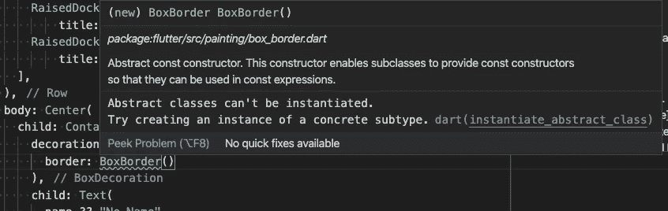
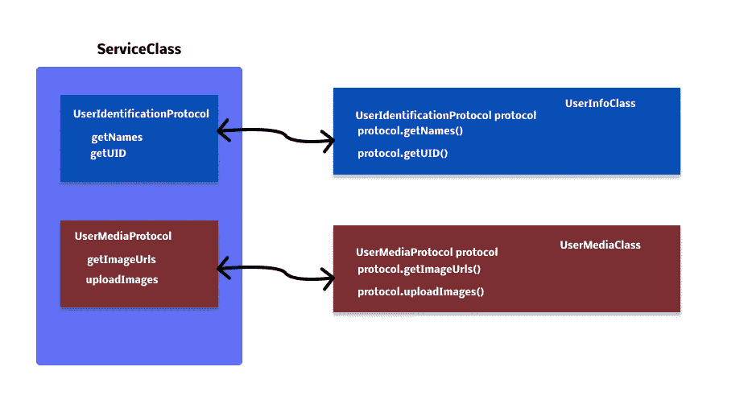
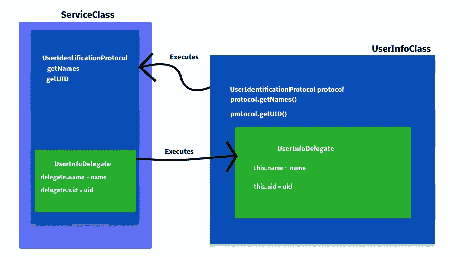

# 面向颤振协议的编程

> 原文：<https://blog.devgenius.io/flutter-protocol-oriented-programming-c27082af9bfc?source=collection_archive---------4----------------------->

## 抽象类实现

由 [Arian Darvishi](https://unsplash.com/@arianismmm?utm_source=medium&utm_medium=referral) 在 [Unsplash](https://unsplash.com?utm_source=medium&utm_medium=referral) 上拍摄的照片

# 为什么？

像 Swift 和 Kotlin 这样的语言大量依赖于面向协议的编程，因为它们有助于模块化、依赖注入、更简洁的代码和更容易的单元测试设置。

在 Flutter 的 Dart 语言中，我们有这样的`abstract`类:

# 这个怎么用？

它们不能被直接实例化，当您无意中试图实例化容器装饰的`border`属性的`BoxBorder`时，您可能已经看到了这一点。但是它需要的类型是 BoxBorder，那么我该如何使用它呢？您可以简单地创建一个实现它的类，IDE 将自动添加它应该具有的所有属性和方法。

抽象类是 Flutter 的协议类型，它不实例化对象，而是给其他类必要的功能和属性，以符合给定的目的。

这有助于**你**开发人员组织你的代码，确保一个特定的类包含必要的函数和变量，并对一个类进行分段，以便调用它的对象只能使用它特别需要的函数。

基于基本协议的交互可以是:

我们是否有一个`ServiceClass`包含两个不同类型的类所需的必要函数，但是依赖于 ServiceClass，因为它拥有获取函数的方法(想想 REST 端点、数据库等)。

和另外两个使用`ServiceClass`的类，但是通过不使用 ServiceClass()对象而是使用它的实现类，它们只需要特定的函数。

为了分解它，我们有我们的`abstract`类，我们的`ServiceClass`将实现它，这个类将包含处理我们在其他类上需要的信息的所有逻辑。

其他类使用相同的`ServiceClass`实例，但是只能访问协议允许它们使用的函数。为了确保它们使用正确的协议，你也可以为此创建新的`abstract`类。

你在这里的好处，只是更好地划分你的代码。

但这其中真正的妙处可以在下面看到。

如果我们给我们的时钟添加另一个“复杂因素”，我们实际上可以告诉`ServiceClass`以相同的分段方式执行来自我们其他类的代码，使我们的用户类更加简洁、整洁，并且只负责显示信息而不是处理信息的逻辑。

看起来会像这样:

我们的初始设置是这样的:

正如您所看到的，我们的委托的 setNameOrId 被重用了，现在我们不必编写两个单独的函数来管理 Id 或名称更新，它只需传递从 ServiceClass 发送的值。

这是这个例子的完整代码:

你可能已经注意到我在这里使用了另一个关键字，那就是 delegate。简单来说，委托是负责在另一个对象中执行代码的对象。当我们写 object.delegate = this 时，这是一种强调另一个对象将使用这个对象应该拥有的函数的方式，因此我们使用协议实现来确保我们拥有这个函数。

有关 dart 语言的更多信息，请查看官方文档:

[飞镖样品](https://dart.dev/samples#:~:text=more%20about%20mixins.-,Interfaces%20and%20abstract%20classes,you%20can%20implement%20any%20class.&text=You%20can%20create%20an%20abstract,implemented)%20by%20a%20concrete%20class.)

我绝不认为自己是不可毁灭的，所以欢迎任何建议或评论。

页（page 的缩写）我推迟了 delegate 关键字的使用，以保持对面向协议的交互的关注。