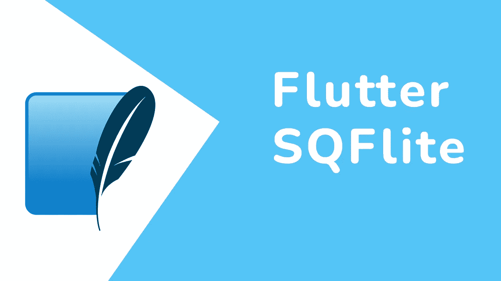
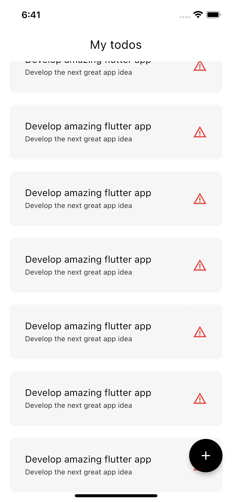
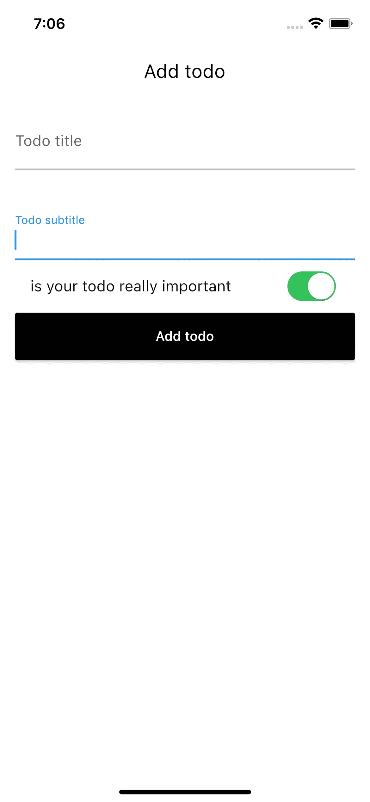
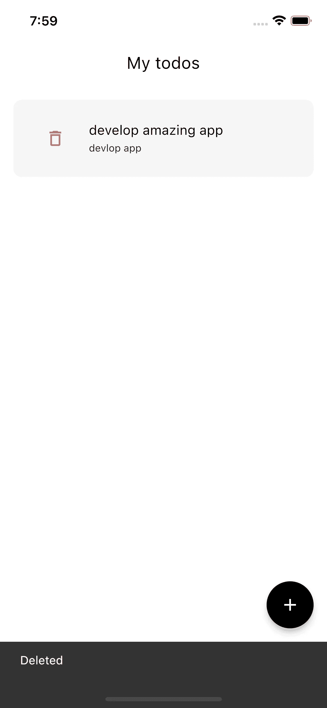
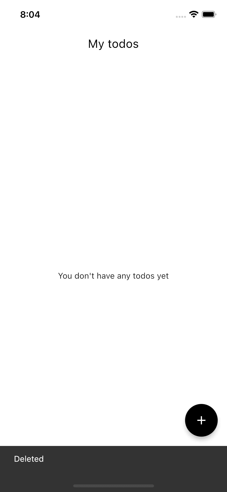
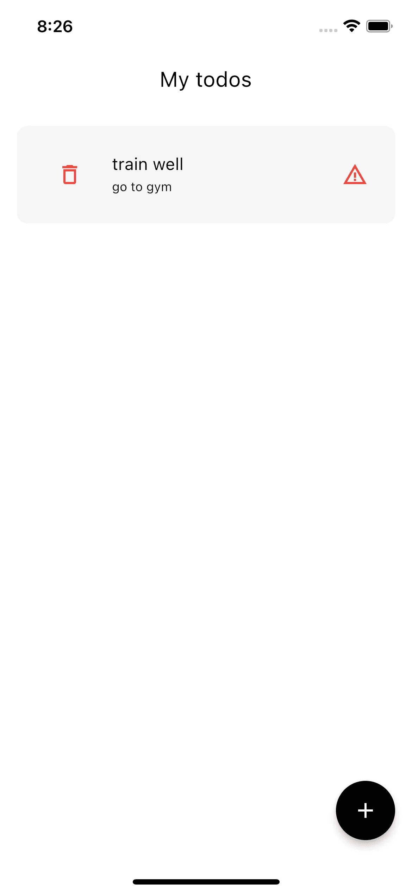
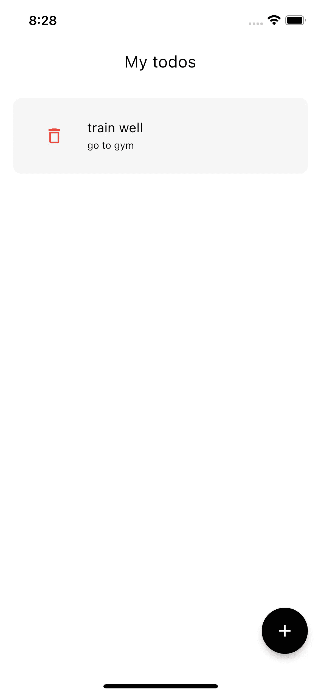

# 扑动 SQFlite 完整指南

> 原文：<https://blog.devgenius.io/flutter-sqflite-the-complete-guide-88ee2ae999f2?source=collection_archive---------0----------------------->

了解如何在你的 window 应用程序中使用 sqflie 本地数据库



**SQFlite** 是旋舞中的一个插件，用来在本地存储数据，它有很多操作，比如**创建、读取、更新**和**删除**，也叫 **CRUD** 操作

# 目录

> 我们要做什么
> 
> 添加 SQFlite
> 
> 创建数据库
> 
> 创建模型类
> 
> CURD Operations
> 
> GitHub Link

# 我们将做什么

实际上，解释 sqflite 最好的方法是在一个类似 todos 的应用程序上实现它，所以我们将使用它的所有操作来创建一个简单的 TODO 应用程序

# 添加 SQFlite

在项目内部创建项目后，转到**public spec。yaml** 并在依赖项下添加 sqfllite 依赖项:

```
dependencies:
  ...
  sqflite:
```

然后运行**旋舞酒馆得到**命令

我们将清除 window starter 代码，然后创建一个名为 **screens** 的新目录，并在其中创建一个名为 **home_screen.dart** 的新文件

你的 **main.dart** 文件应该是什么样子

```
import 'package:flutter/material.dart';
import 'package:flutter_sqflite/screens/home_screen.dart';

void main() {
  runApp(const MyApp());
}

class MyApp extends StatelessWidget {
  const MyApp({super.key});

  @override
  Widget build(BuildContext context) {
    return MaterialApp(
        title: 'Todo app',
        theme: ThemeData(
          primarySwatch: Colors.blue,
        ),
        home: HomeScreen());
  }
}
```

内部主屏幕 _。

```
import 'package:flutter/material.dart';

class HomeScreen extends StatefulWidget {
  const HomeScreen({Key? key}) : super(key: key);

  @override
  State<HomeScreen> createState() => _HomeScreenState();
}

class _HomeScreenState extends State<HomeScreen> {
  @override
  Widget build(BuildContext context) {
    return Scaffold();
  }
}
```

# 创建数据库

这就意味着我们需要创建一个 dabase 连接来存储数据。这一步将在每次使用 sqfllite 创建应用程序时进行，它只是一个由应用程序创建的文件，用于存储数据，例如 **todo.db**

创建一个名为 repository 的目录，然后在内部创建一个名为 database_repository.dart 或 wahtever 的 dart 文件

然后创建一个新类

```
class DatabaseRepository {}
```

文件导入内部

```
import 'package:sqflite/sqflite.dart';
```

数据库存储库类内部

创建一个可以为空的私有变量

```
Database?_database;
```

```
class DatabaseRepository {
  Database? _database;
}
```

然后我们需要创建的功能创建数据库这是未来将返回我们的数据库如果创建如果不是它将创建它

```
Future<Database> get database async {
  if (_database != null) return _database!;

  _database = await _initDB('todo.db');
  return _database!;
}
```

> 你会注意到 initDB，正如我们现在将要声明的那样，我们需要初始化数据库，正如前面提到的，数据库只是一个位于设备上的文件，要获得它，我们需要知道它的路径，因此为了初始化它，我们需要获得路径

```
Future<Database> _initDB(String filePath) async {
  final dbPath = await getDatabasesPath();
  final path = join(dbPath, filePath);

  return await openDatabase(path, version: 1, onCreate: _createDB);
}
```

如果您在 join 方法中注意到一个错误，请导入它与 sqfltie 相关联包，我们不需要再次重新添加它

```
import 'package:path/path.dart';
```

initDb 方法将定位路径，然后将其与文件连接，并返回 opeend 数据库

**> Create Dabase** ，我们需要创建一个 Dabase 方法，它将创建我们的数据库，定义它的规则以及它将如何工作，它将如何工作是一个简单的 sql 语言的规则，我们现在将查看它

我们将定义一些字符串来保持常量，因为我们将需要它们伴随着应用程序

然后声明这些函数

```
 Future _createDB(Database db, int version) async {
    await db.execute('''
create table ${AppConst.tableName} ( 
  ${AppConst.id} integer primary key autoincrement, 
  ${AppConst.title} text not null,
   ${AppConst.describtion} text not null,
  ${AppConst.isImportant} boolean not null)
''');
  }
```

我们只是简单地创建一个表，然后告诉数据库 id 是自动增量的，并且非字段可以为空

创建常量类

```
class AppConst {
  static const String isImportant = 'isImportant';
  static const String id = 'id';
  static const String title = 'title';
  static const String describtion = 'describtion';
  static const String tableName = 'todoTable';
}
```

在 lib 文件夹中创建一个名为 cosnt 的目录，并创建 **app_const.dart**

# 创建 DataModel

现在，在我们使数据库准备好之后，我们需要定义我们的数据类 whci，它将包含我们将用于进行我们的待办事项的数据

在你的 lib 文件夹中创建一个名为**模型**的新文件夹

然后创建 **model.dart** ，并实现这个类

```
class ToDoModel {
  final int id;
  final bool isImportant;
  final String title;
  final String discribtion;
  ToDoModel(
      {required this.title,
      required this.id,
      required this.discribtion,
      required this.isImportant});
}
```

然后，我们需要创建一个方法来将该对象转换为 json，以便易于被数据库以及工厂命名的构造函数理解，以便以对象的形式从数据库中检索它

```
factory ToDoModel.fromJson(Map<String, dynamic> map) {
  return ToDoModel(
    title: map['title'],
    id: map['id'],
    discribtion: map['discribtion'],
    isImportant: map['isImportant'],
  );
}
Map<String, dynamic> toMap() {
  return {
    'title': title,
    'id': id,
    'discribtion': discribtion,
    'isImportant': isImportant,
  };
}
```

整个类现在应该如下所示

```
class ToDoModel {
  final int? id;
  final bool isImportant;
  final String title;
  final String describtion;
  ToDoModel(
      {required this.title,
      this.id,
      required this.describtion,
      required this.isImportant});

  factory ToDoModel.fromJson(Map<String, dynamic> map) {
    return ToDoModel(
      title: map['title'],
      id: map['id'],
      describtion: map['describtion'],
      isImportant: map['isImportant'] == 1,
    );
  }
  Map<String, dynamic> toMap() {
    return {
      'title': title,
      'id': id,
      'describtion': describtion,
      'isImportant': isImportant == true ? 1 : 0,
    };
  }
}
```

> 我们注意到，我们将布尔作为 int 发送，而 recieing 也作为 int 发送。为什么呢？
> 
> 这是因为数据库只理解 uint8，所以我们定义 true = 1 false = 0，
> 
> 现在，我们将为我们的存储库创建一个单例
> 
> singleton 基本上意味着我们的类总是有一个实例，只是为了确保数据库只有一个实例
> 
> 在存储库类顶部添加

```
static final DatabaseRepository instance = DatabaseRepository._init();
DatabaseRepository._init();
```

现在我们需要去我们的主屏幕

创建 initdb 方法

```
void initDb() async {
  await DatabaseRepository.instance.database;
}
```

在“添加”屏幕的 initstate 内部

```
@override
void initState() {
  initDb();
  super.initState();
}
```

现在第一次应用程序启动时，它将创建数据库，然后如果存在，它将返回我们创建的一个

lset 现在运行应用程序，并添加一些用户界面部分

创建一个名为 widget 的新 fodler，然后创建一个新的 dart 文件 **todo_widget.dart**

```
import 'package:flutter/material.dart';

class TodoWidget extends StatelessWidget {
  const TodoWidget({Key? key}) : super(key: key);

  @override
  Widget build(BuildContext context) {
    return Container(
      padding: EdgeInsets.all(10),
      child: ListTile(
        trailing: Icon(
          Icons.warning_amber,
          color: Colors.red,
        ),
        subtitle: Text(
          'Develop the next great app idea',
          style: const TextStyle(color: Colors.black87, fontSize: 12),
        ),
        title: Text(
          'Develop amazing flutter app',
          style: const TextStyle(color: Colors.black, fontSize: 16),
        ),
      ),
      decoration: BoxDecoration(
          borderRadius: BorderRadius.circular(10),
          color: Colors.grey.withOpacity(0.1)),
    );
  }
}
```

然后返回**主屏幕 _ dart**

```
import 'package:flutter/material.dart';
import 'package:flutter_sqflite/repository/database_repository.dart';
import 'package:flutter_sqflite/widget/todo_widget.dart';

class HomeScreen extends StatefulWidget {
  const HomeScreen({Key? key}) : super(key: key);

  @override
  State<HomeScreen> createState() => _HomeScreenState();
}

class _HomeScreenState extends State<HomeScreen> {
  @override
  void initState() {
    initDb();
    super.initState();
  }

  void initDb() async {
    await DatabaseRepository.instance.database;
  }

  @override
  Widget build(BuildContext context) {
    return Scaffold(
      floatingActionButton: FloatingActionButton(
        backgroundColor: Colors.black,
        child: Icon(
          Icons.add,
          color: Colors.white,
        ),
        onPressed: () {},
      ),
      appBar: AppBar(
        title: const Text('My todos'),
      ),
      body: ListView.separated(
        separatorBuilder: (context, index) => const SizedBox(
          height: 20,
        ),
        padding: EdgeInsets.all(16),
        itemBuilder: (context, index) {
          return TodoWidget();
        },
        itemCount: 10,
      ),
    );
  }
}
```



看起来很棒…？

现在我们需要添加我们的真实数据

回到我们的数据库存储库，添加这个函数

```
Future<void> insert({required ToDoModel todo}) async {
  try {
    final db = await database;
    db.insert(AppConst.tableName, todo.toMap());
  } catch (e) {
    print(e.toString());
  }
}
```

现在，在我们添加了我们的插入函数之后，我们需要在应用程序中添加交互性来插入 todo

在“屏幕”文件夹内部，创建一个新的屏幕 add _ to osclone . dart

并添加此代码

```
import 'package:flutter/material.dart';

class AddTodoScreen extends StatefulWidget {
  const AddTodoScreen({Key? key}) : super(key: key);

  @override
  State<AddTodoScreen> createState() => _AddTodoScreenState();
}

class _AddTodoScreenState extends State<AddTodoScreen> {
  bool important = false;
  final titleController = TextEditingController();
  final subtitleControler = TextEditingController();
  @override
  void dispose() {
    titleController.dispose();
    subtitleControler.dispose();
    super.dispose();
  }

  @override
  Widget build(BuildContext context) {
    return Scaffold(
      appBar: AppBar(
        title: const Text('Add todo'),
      ),
      body: Padding(
        padding: const EdgeInsets.all(16.0),
        child: Column(
          children: [
            TextFormField(
              controller: titleController,
              decoration: const InputDecoration(
                  label: const Text('Todo title'),
                  hintText: 'Develop amazing app '),
            ),
            const SizedBox(
              height: 36,
            ),
            TextFormField(
              controller: subtitleControler,
              decoration: const InputDecoration(
                label: const Text('Todo subtitle'),
              ),
            ),
            SwitchListTile.adaptive(
              title: Text('is your todo really important'),
              value: important,
              onChanged: (value) => setState(
                () {
                  important = value;
                },
              ),
            ),
            MaterialButton(
              color: Colors.black,
              height: 50,
              minWidth: double.infinity,
              onPressed: () {},
              child: const Text(
                'Add todo',
                style: TextStyle(color: Colors.white),
              ),
            ),
          ],
        ),
      ),
    );
  }
}
```



在我的**主屏幕里。dart** 加上这个

```
List<ToDoModel> myTodos = [];
```

然后用这个替换主体属性

```
body: myTodos.isEmpty
    ? const Center(child: const Text('You don\'t have any todos yet'))
    : ListView.separated(
        separatorBuilder: (context, index) => const SizedBox(
          height: 20,
        ),
        padding: EdgeInsets.all(16),
        itemBuilder: (context, index) {
          return TodoWidget();
        },
        itemCount: myTodos.length,
      ),
```

这将只呈现我们的 todos，如果它现在存在它是空的它将显示一个常量文本为现在

再次返回以添加 _todo

加上这个

```
void addTodo() async {
  ToDoModel todo = ToDoModel(
      title: titleController.text,
      describtion: subtitleControler.text,
      isImportant: important);
  await DatabaseRepository.instance.insert(todo: todo);
}
```

在按钮 onPressed 属性中调用函数

```
MaterialButton(
  color: Colors.black,
  height: 50,
  minWidth: double.infinity,
  onPressed: addTodo,
  child: const Text(
    'Add todo',
    style: TextStyle(color: Colors.white),
  ),
),
```

> 你会注意到终端打印的波动:todoAdded
> 
> 因为我们在函数中添加了这个，如果这样做的话
> 
> 但我们没有发现列表仍然是空的，这是因为我们需要添加 get 函数

转到 todo_widget.dart 文件，并将代码替换为

```
import 'package:flutter/material.dart';
import 'package:flutter_sqflite/model/model.dart';

class TodoWidget extends StatelessWidget {
  final ToDoModel todo;
  const TodoWidget({Key? key, required this.todo}) : super(key: key);

  @override
  Widget build(BuildContext context) {
    return Container(
      padding: EdgeInsets.all(10),
      child: ListTile(
        trailing: todo.isImportant == true
            ? Icon(
                Icons.warning_amber,
                color: Colors.red,
              )
            : SizedBox(),
        subtitle: Text(
          todo.title,
          style: const TextStyle(color: Colors.black87, fontSize: 12),
        ),
        title: Text(
          todo.describtion,
          style: const TextStyle(color: Colors.black, fontSize: 16),
        ),
      ),
      decoration: BoxDecoration(
          borderRadius: BorderRadius.circular(10),
          color: Colors.grey.withOpacity(0.1)),
    );
  }
}
```

在主屏幕. dart 中的 listviewWidget 内部

将此添加到 itembuidler 函数内部

```
itemBuilder: (context, index) {
  final todo = myTodos[index];
  return TodoWidget(todo: todo);
},
```

现在返回 repsoitory 并声明这个从数据库中检索 todos 的方法

```
Future<List<ToDoModel>> getAllTodos() async {
  final db = await instance.database;

  final result = await db.query(AppConst.tableName);

  return result.map((json) => ToDoModel.fromJson(json)).toList();
}
```

然后在 **home_screen.dart** 中声明此函数

```
void getTodos() async {
  await DatabaseRepository.instance.getAllTodos().then((value) {
    setState(() {
      myTodos = value;
    });
  }).catchError((e) => debugPrint(e.toString()));
}
```

这个函数将从数据库中获取列表，然后将其值分配给此屏幕中的列表


现在我们需要删除或更新

在 todo_widget 中添加此 iconButton

```
leading: IconButton(
  onPressed: () {},
  icon: Icon(
    Icons.delete_outline,
    color: Colors.red,
  ),
),
```

然后在存储库文件中添加删除方法

```
Future<void> delete(int id) async {
  try {
    final db = await instance.database;
    await db.delete(
      AppConst.tableName,
      where: '${AppConst.id} = ?',
      whereArgs: [id],
    );
  } catch (e) {
    print(e.toString());
  }
```

转到 **todo_widget.dart** ，然后实现这个方法

```
void delete({required ToDoModel todo, required BuildContext context}) async {
  DatabaseRepository.instance.delete(todo.id!).then((value) {
    ScaffoldMessenger.of(context)
        .showSnackBar(const SnackBar(content: Text('Deleted')));
  }).catchError((e) {
    ScaffoldMessenger.of(context)
        .showSnackBar(SnackBar(content: Text(e.toString())));
  });
}
```

当我们删除 todo 时，我们希望看到一条消息，说明它已经完成，或者发生了什么错误

然后将其添加到 iconButton onpressed

```
leading: IconButton(
  onPressed: () {
    delete(todo: todo, context: context);
  },
  icon: Icon(
    Icons.delete_outline,
    color: Colors.red,
  ),
),
```

现在，让我们尝试删除此待办事项

# **DELETE**



它已经被删除了，但我仍然可以在屏幕上看到它，这是因为我们只在 initState 中引用了该列表，那么我们该怎么办呢？

实际上有许多解决方案，但我们将尝试最简单的方法，更新 todowidget like

```
class TodoWidget extends StatelessWidget {
  final ToDoModel todo;
  final VoidCallback onDeletePressed;

  const TodoWidget({
    Key? key,
    required this.todo,
    required this.onDeletePressed,
  }) : super(key: key);
```

把删除功能移到主屏幕，并更新它

```
: ListView.separated(
    separatorBuilder: (context, index) => const SizedBox(
      height: 20,
    ),
    padding: EdgeInsets.all(16),
    itemBuilder: (context, index) {
      final todo = myTodos[index];
      return TodoWidget(
        todo: todo,
        onDeletePressed: () {
          delete(todo: todo, context: context);
          getTodos();
        },
      );
    },
    itemCount: myTodos.length,
  ),
```



# 更新

在存储库中添加

```
 Future<void> update(ToDoModel todo) async {
    try {
      final db = await instance.database;
      db.update(
        AppConst.tableName,
        todo.toMap(),
        where: '${AppConst.id} = ?',
        whereArgs: [todo.id],
      );
    } catch (e) {
      print(e.toString());
    }
  }
```

然后在 **add_todo.dart** 屏幕中，更新

```
ToDoModel? todo;
AddTodoScreen({Key? key, this.todo}) : super(key: key);

@override
State<AddTodoScreen> createState() => _AddTodoScreenState();
```

如果用户需要更新，我们应该在我们的控制器中添加数据

```
 @override
  void initState() {
    addTodoData();
    super.initState();
  }
void addTodoData() {
  if (widget.todo != null) {
    if (mounted)
      setState(() {
        titleController.text = widget.todo!.title;
        subtitleControler.text = widget.todo!.describtion;
        important = widget.todo!.isImportant;
      });
  }
}
```

然后再次返回 todo_widget.dart

并用以下内容更新它

```
Widget build(BuildContext context) {
  return InkWell(
    onTap: () {
      Navigator.push(context, MaterialPageRoute(builder: (context) {
        return AddTodoScreen(
          todo: todo,
        );
      }));
    },
    child: Container(
      padding: EdgeInsets.all(10),
      child: ListTile(
```

在 add_todo.dart 中，更新 add addTodo

```
void addTodo() async {
  ToDoModel todo = ToDoModel(
      title: titleController.text,
      describtion: subtitleControler.text,
      isImportant: important);
  if (widget.todo == null) {
    await DatabaseRepository.instance.insert(todo: todo);
  } else {
    await DatabaseRepository.instance.update(todo);
  }
}
```

然后，我们需要添加一个好的包，它将帮助我们轻松地刷新您的 pubspec.yaml 中的数据

```
pull_to_refresh: ^2.0.0
```

然后在 homescreen.dart 中添加以下代码

```
List<ToDoModel> myTodos = [];
@override
Widget build(BuildContext context) {
  return RefreshIndicator(
    onRefresh: () async {
      getTodos();
    },
    child: Scaffold(
      floatingActionButton: FloatingActionButton(
        backgroundColor: Colors.black,
```

我现在将删除所有内容，然后创建一个新的待办事项



现在我将尝试更新它，我将使它不重要，并刷新看看是否更新



现在它；it’运转良好

拍手声👏如果这篇文章对你有帮助。

感谢你的阅读

# Github 知识库

【https://github.com/mohaberabi/flutter_sqflite 号