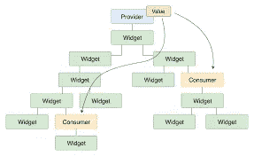

# 提供者的颤振状态管理

> 原文：<https://blog.devgenius.io/flutter-state-management-with-provider-5a57eca108f1?source=collection_archive---------0----------------------->

## **介绍提供者及其用途(动态主题变化、反例、购物车功能示例等)。)**


*颤振中的状态管理类型。*

*   供应者
*   Riverpod
*   设置状态
*   InheritedWidget & InheritedModel
*   Redux
*   鱼还原
*   阻塞/接收
*   GetIt
*   MobX
*   颤动命令
*   粘合剂
*   GetX
*   状态 _ 重建者
*   三重模式(分段状态模式)。

# 颤振是什么状态？

Flutter 中的“状态”指的是存储在小部件中的数据，可以根据当前操作进行修改。应用程序的状态可以在应用程序启动时或页面重新加载时更新或完全改变。

这意味着小部件需要处理从用户那里获取的数据，并在它们之间传递数据以执行一个或多个操作。Flutter 还可以使用状态向用户显示信息片段。


# 什么是提供商？

Remi Rousselet 创建的提供者包[旨在尽可能干净地处理状态。在 Provider 中，小部件监听状态的变化，并在得到通知后立即更新。](https://pub.dev/packages/provider)

因此，当出现状态更改时，不是重建整个小部件树，而是只更改受影响的小部件，从而减少工作量，使应用程序运行得更快、更流畅。

# 提供者的状态管理

回想一下我们之前讨论过的关于提供者的内容:小部件监听变化并在有重建时相互通知。一旦状态发生变化，这个特定的小部件就会重新构建，而不会影响树中的其他小部件。

三个主要组件使这一切成为可能:Flutter 中的`ChangeNotifier`类、`ChangeNotifierProvider`(主要用于我们的示例应用程序)和`Consumer`小部件。

从`ChangeNotifier`类观察到的任何状态变化都会导致监听小部件重新构建。提供商包提供了不同类型的提供商，下面列出了其中一些:

*   `Provider`不管值类型如何，该类接受一个值并公开它
*   `ListenableProvider`是用于 listenable 对象的特定提供程序。它会监听，然后要求依赖于它并受状态变化影响的小部件在任何时候调用监听器时进行重建
*   `ChangeNotifierProvider`与`ListenableProvider`类似，但针对`ChangeNotifier`对象，需要时自动调用`ChangeNotifier.dispose`
*   `ValueListenableProvider`监听一个`ValueListenable`并公开该值
*   `StreamProvider`监听流，公开发出的最新值，并要求依赖于流的小部件进行重建
*   `FutureProvider`接受一个`Future`类，并在未来完成时根据它更新小部件
*   `consumer`一个提供者包小部件，它对 ChangeNotifier 的更改做出反应，并调用构建方法来应用模型更新。不需要 UI 的所有部分都使用来自提供者**、**的状态数据，因此需要重新构建。可能任何屏幕的 50%的用户界面都不需要重建，在我们的例子中不是这样。因此，Consumer 是一个小部件，它允许您在 UI 的特定部分观察 ChangeNotifier 的状态变化，因此只有观察到的 UI 部分会被重新呈现。

> **让我们看看如何在提供商中实现消费者。**

**使用以下扩展方法读取值**

1.  **context . watch**<T>()让小部件监听 T 上的变化。
2.  **context.read**
3.  **context.select** < T，R >选择器允许你在一个提供者中选择一个特定的值来监听。然后，当且仅当选择的值改变时，由选择器的构建器方法返回的小部件将重新构建。

也可以使用静态方法 Provider.of <taskproviders>(context)，它的行为类似于 watch。</taskproviders>

当 listen 参数设置为 false(如在 Provider.of <taskproviders>(context，listen: false))时，它的行为类似于 read。</taskproviders>

值得注意的是，当值改变时，context.read <t>()不会重新构建小部件，并且它不能在 StatelessWidget.build/State.build.内部调用。另一方面，它可以在这些方法之外自由调用。</t>

> **让我们看看如何在提供者中实现上述方法。**

**代理供应商**

ProxyProvider 是一个提供程序，它将来自其他提供程序的多个值组合成一个新对象，然后将结果发送给该提供程序。它基本上将一个更改的值注入到另一个提供者中。每当使用一个以上的提供者并且一个提供者的值依赖于另一个提供者时，我们就使用 ProxyProvider。每当它所依赖的一个提供者也更新时，另一个提供者就更新它的值。

即:我们有两个提供者:人和工作。一个**任务**需要一个人进行初始化。在这种情况下，**作业**就是*代理*。这意味着工作是你可能想要接触的对象，但是它的价值依赖于**人**

> 让我们看看如何实现代理提供者。

**未来供应商:**

顾名思义，FutureProvider 提供了一个**未来值**，当获取该值的小部件已经可以使用时，这个值可能还没有准备好。这与 Flutter 中的**未来职业有很大关系。**

这与其他供应商有很大的不同。由于提供的值可能需要一段时间才能出现，因此它不能为 null。这就是为什么 FutureProvider 有一个必需的参数**“initial data”**，这是一个小部件可以使用的初始值，直到它获得正确的提供值。一旦数据准备就绪，FutureProvider 就与后代小部件通信，以重新构建并使用新值。

# 入门指南

> 从一个普通的计数器例子开始。

首先创建一个新项目，并将这一行添加到您的`pubspec.yaml`文件中的 dependencies 块: [**provider**](https://pub.dev/packages/provider)

```
dependencies:
 provider: ***Letest dependencies***
```

> 运行`pub get`命令获得包的本地副本:

```
flutter pub get
```

> 创建一个扩展“*change notifier”*的提供者类

```
class CounterProvider(Your Class Name) extends ChangeNotifier {}
```

> 为代码添加逻辑

```
class CounterProvider(Your Class Name) extends ChangeNotifier {int _count = 0;int get *getCountValue* => _count;//for Increment countervoid *incrementCounter*() { _count++; *notifyListeners*(); }//for Decrement countervoid *decrementCounter*() { _count--; *notifyListeners*();}//for reset countervoid *resetCounter*() { _count = 0; *notifyListeners*(); }}
```

***notify listeners 在 Flutter 中做什么？***

notifyListeners 方法空安全

每当对象改变时调用这个方法，**通知任何客户端对象可能已经改变**。在此迭代过程中添加的侦听器将不会被访问。在此迭代中移除的侦听器在被移除后将不会被访问。

> 将提供者添加到 ***main.dart*** 文件中

```
void *main*() {*runApp*(MultiProvider( providers: [ ChangeNotifierProvider( create: (context) => CounterProvider(), ), ChangeNotifierProvider( create: (context) => TimerInfo(), ), ChangeNotifierProvider( create: (context) => SalaryProvider(), ), ChangeNotifierProvider( create: (context) => ThemeProvider(), ), ChangeNotifierProvider( create: (context) => ItemProvider(), ), ], child: MyApp(), ), );}
```

> 从提供程序类获取数据。

```
class CounterScreen extends StatefulWidget {*const* CounterScreen({Key? key}) : super(key: key);@override_CounterScreenState *createState*() => _CounterScreenState();}class _CounterScreenState extends State<CounterScreen> {@overrideWidget *build*(BuildContext context) { *return* Scaffold( appBar: AppBar(), body: SafeArea( child: Center( child: Column( mainAxisAlignment: MainAxisAlignment.center, children: [ Consumer<CounterProvider>( builder: (context, value, child) { *return* Text( value.getCountValue.*toString*(), style: TextStyle(fontSize: 30), ); }, ), ], ), ),),floatingActionButton:  FloatingActionButton( onPressed: () { context.*read*<CounterProvider>().*incrementCounter*(); }, child: Icon(Icons.add), ),   ); }}
```



## 从 GitHub repo 获取源代码:[源代码](https://github.com/inamhusain/flutter_provider_example.git)

点击查看[更多更新](https://pub.dev/packages/provider)。