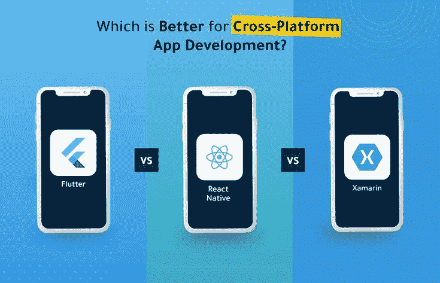
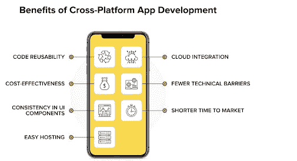

# flutter VS Xamarin VS React Native:2022 年选哪个？

> 原文：<https://blog.devgenius.io/flutter-vs-xamarin-vs-react-native-which-one-to-choose-in-2022-48368604be8?source=collection_archive---------1----------------------->

多年来，移动应用程序开发平台不断发展，不同的公司使用不同的技术来构建和设计受各种操作系统和设备支持的优秀应用程序。

这导致了当今市场上三种主要技术的出现——xa marin、React Native 和 Flutter。每一种都有自己的优点和缺点，在开发应用程序时选择使用哪一种可能是一个挑战。

此外，根据一份[报告](https://www.verifiedmarketresearch.com/product/cross-platform-and-mobile-advertising-market/)，2020 年跨平台市场价值为 636.4 亿美元，预计将达到约。到 2028 年底达到 3640 亿美元，从 2021 年到 2028 年以 26.31%的 CAGR 增长。

鉴于这种情况，当务之急是了解这些平台的能力，以及哪一个将满足您在 2022 年的需求。所以在今天的博客中，我们将讨论这些框架的优缺点。

我们还将使用各种参数对它们进行比较，如性能、社区支持、构建时间、设计语言、应用开发成本等，以便对您即将开展的移动项目中使用的最佳技术有一个清晰的概念。

开始了。

# 为什么选择跨平台移动开发？

来源:网络解决方案

您可能希望选择跨平台移动开发有一些重要的原因。以下是一些至关重要的问题。

*   **开发过程减少**

跨平台移动开发的主要优势之一是减少了开发过程。有了单一的代码库，您可以同时为多个平台进行开发，这加快了开发过程，节省了时间和金钱。

此外，跨平台开发工具往往非常用户友好，使得开发人员无需大量经验就能轻松创建高质量的应用程序。

*   **增幅达到**

跨平台移动开发的另一个优势是，它允许你用你的应用接触更多的人。通过为多个平台开发，你可以让你的应用面向更广泛的受众，从而增加销售额和利润。

*   **改善用户体验**

跨平台移动开发也可以改善用户体验。通过为多个平台开发，您可以创建为每个平台量身定制的应用程序，为用户提供更好的体验。

*   **性能提升**

跨平台移动开发也可以提高性能。因为您只开发一个代码库，所以您可以针对所有平台优化您的代码，从而在所有设备上获得更好的性能。

*   **质量提高**

跨平台移动开发也可以提高质量。通过为多个平台开发，你可以在各种设备上测试你的应用程序，并确保它在发布给公众之前是最高质量的。

*   **性价比**

最后，跨平台移动开发具有成本效益。因为你只需要开发一个代码库，所以可以节省开发成本。此外，跨平台开发工具通常比传统开发工具便宜得多。

相关博客:[**Flutter Vs React Native Vs Xamarin—顶级跨平台移动应用开发框架**](https://www.valuecoders.com/blog/technology-and-apps/flutter-vs-xamarin-vs-react-native-which-cross-platform-mobile-app-development-framework-to-choose/?utm_source=flutter_xamarin_react&utm_medium=Guest_Blog&utm_campaign=Medium&utm_id=NKY)

# 扑动与反应天然与 Xamarin:一项比较分析

## flutter vs . React Native vs . Xamarin:受欢迎程度

当我们比较这三个框架的流行程度时，很明显 React Native 处于领先地位。

但是，如果我们看看最近的发展，Flutter 也获得了良好的势头，并被谷歌、阿里巴巴和腾讯等知名品牌采用。你也可以 [**雇佣一个 react 原生开发者**](https://www.valuecoders.com/hire-developers/hire-react-native-developers?utm_source=hire_react_dev&utm_medium=Guest_Blog&utm_campaign=Medium&utm_id=NKY) 来创建一个高效的移动应用。

## flutter vs . React Native vs . xa marin:社区支持

与 Flutter 和 Xamarin 相比，React Native 拥有最大的社区支持。这主要是因为 React Native 是一个开源框架，并且比其他两个已经存在了很长时间。

社区对 Flutter 和 Xamarin 的支持正在成倍增加，它们与 React Native 相差不远。

## flutter vs . React Native vs . Xamarin:编程语言

React Native 使用 JavaScript 作为编程语言，广为开发者所知和使用。另一方面，Flutter 使用 Dart- Google 的内部编程语言。

而且，Xamarin 使用 C#-一种微软语言。所以，如果我们比较这三种语言，JavaScript 占上风，其次是 C#和 Dart。

## 颤动 Vs .反应本地 Vs. Xamarin:架构

React Native 使用 JavaScript Bridge 与本机组件进行通信。这使得它比原生应用程序慢。但是，该框架最近的发展使它变得更加有效。

Flutter 也使用桥与原生组件通信，但与 React Native 不同，它不使用 JavaScript 桥。这使得 Flutter 应用程序的响应速度更快。

Xamarin 也使用桥与原生组件通信，但它不使用 JavaScript 桥。然而，如果你想在下一个移动应用开发项目中使用 Xamarin，你可以**从顶级移动应用开发公司雇佣 Xamarin 开发人员**。

## flutter vs . React Native vs . xa marin:开发时间

与 Flutter 和 Xamarin 相比，React Native 在开发时间方面是最快的。这是因为它使用 JavaScript，一种流行的语言，并且易于学习。

与其他两个框架相比，Xamarin 的开发时间最长。此外，该框架已经存在了很长时间，因此可以获得更多的资源。然而，Flutter 也不甘落后，凭借其热重装特性，可以进一步缩短开发时间。

## 颤振与反应本机与 Xamarin:性能

这三个框架都提供了良好的性能。但是，如果我们比较它们，Flutter 领先，因为它不使用 JavaScript Bridge，而使用 Dart，这是一种编译语言。

此外，聘请 [**最好的 flutter 应用程序开发公司**](https://www.valuecoders.com/flutter-app-development-company?utm_source=flutter_dev_com&utm_medium=Guest_Blog&utm_campaign=Medium&utm_id=NKY) 也可以帮助你开发一个高效的应用程序，将你的业务带到一个新的高度。

React Native 也非常高效，但它使用 JavaScript Bridge，这使得它比 Flutter 稍慢。Xamarin 也提供了良好的性能，但它需要最长的开发时间。

## flutter vs . React Native vs . Xamarin:用户界面

这三个框架都提供了良好的用户界面。但是，如果我们比较它们，Flutter 有最好的用户界面，因为它的材料设计部件。React Native 也有不错的用户界面，但不如 Flutter 流畅。

Xamarin 也提供了很好的用户界面，但不如 Flutter 和 React Native。

## flutter vs . React Native vs . Xamarin:热门应用

当谈到流行的应用程序时，React Native 显然是赢家。在 React Native 中开发的一些受欢迎的应用程序有脸书、Instagram、Airbnb、沃尔玛和 Tesla。

像谷歌、阿里巴巴和腾讯这样的知名品牌也在使用 Flutter。而且，Xamarin 被微软用于它自己的流行应用程序。

又读: [**Flutter vs React Native:手机 App 开发哪个最好？**](https://www.valuecoders.com/blog/technology-and-apps/flutter-vs-react-native-which-is-the-best-one-for-mobile-app-development/?utm_source=flutter_react&utm_medium=Guest_Blog&utm_campaign=Medium&utm_id=NKY)

# 总结一下！

所有三个框架——React Native、Flutter 和 Xamarin 都有各自的优缺点。如果我们基于各种因素对它们进行比较，React Native 显然是赢家。

它拥有最大的社区支持，使用流行的语言(JavaScript)，遵循非常高效的架构，提供良好的性能，并拥有良好的用户界面。然而，React Native 的开发时间比 Flutter 稍长。

在开发时间、性能和用户界面方面，Flutter 与 React Native 相差不远。Flutter 唯一落后的领域是社区支持。但这一差距正在迅速缩小。

Xamarin 的开发时间最长，性能不如 React Native 或 Flutter，但它确实提供了一个很好的用户界面。

因此，根据项目的需求，这三个框架都是移动应用程序开发的好选择。向最好的 Xamarin 移动应用程序开发公司 咨询也可以帮助你开发出一款出色的应用程序。