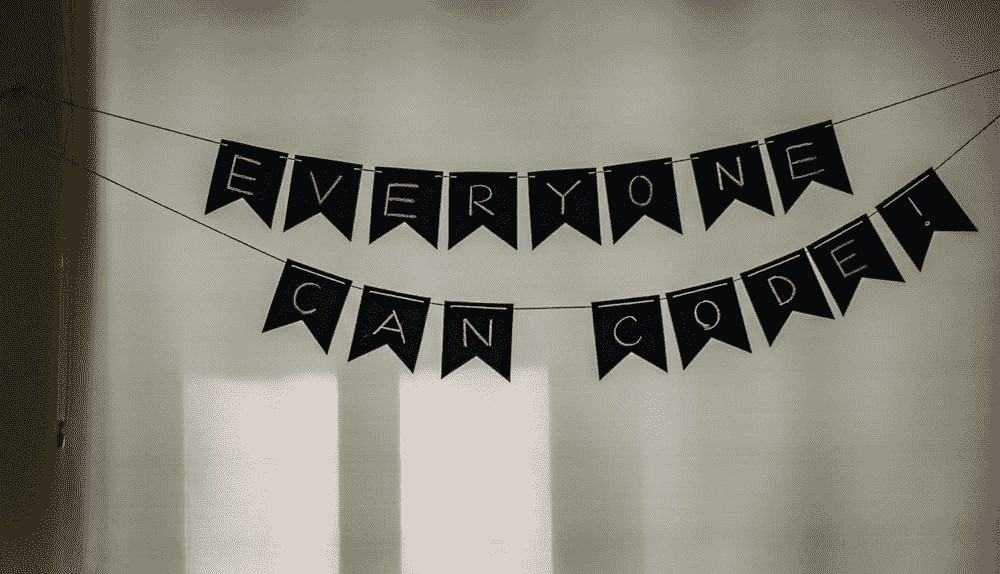

# Flutter:初学者#1 的小部件

> 原文：<https://blog.devgenius.io/flutter-widgets-for-starter-1-6aa0860039b6?source=collection_archive---------26----------------------->

照片由[阿迪·戈尔茨坦](https://unsplash.com/@adigold1)拍摄 [Unsplash](https://unsplash.com/?utm_source=medium&utm_medium=referral)

众所周知，在 **Flutter 中，一切都是 Widget。**

Widgets 是构建 Flutter 应用程序用户界面的基础。对于用户界面来说，每一个小部件都是不可变的。与其他框架不同，它将视图、布局、控制器和属性分离开来。Flutter 也有一致的统一模型。

widget 可以定义为*结构元素、布局方面、时尚元素以及其他更多可以定义为 widget 的元素。*

*widgets 的介绍到此结束。*

***你可以在此阅读更多*** [***链接***](https://flutter.dev/docs/resources/technical-overview#:~:text=few%20core%20principles.-,Everything's%20a%20widget,unified%20object%20model%3A%20the%20widget.)

GIF 由[Mediaset espaa](https://giphy.com/mediaset/)发自[https://giphy.com/](https://giphy.com/)

所以，让我们来看看可以帮助你成长的小部件吧！

# **1)正文**

在 Flutter 中，文本控件在应用程序中无处不在。这个小部件显示具有单一样式的文本字符串。该字符串可能会跨多行显示，也可能会显示在一行中。它总是取决于布局的约束。

如果你想在你的文本部件中添加样式，比如`font`、`font size`、`weight`，更多的样式可以添加到你的部件中！

*如果你想* ***阅读更多关于文字小工具*** *，不要犹豫点击这个* [***链接***](https://api.flutter.dev/flutter/widgets/Text-class.html) *。*

# **2)容器**

在 Flutter 中，容器是一个舒适的小部件，它融合了装饰、对齐和不同大小的小部件。大多数情况下，容器小部件用于添加装饰属性。

这里有一个简单的代码，可以让你的思维可视化。

是否可以添加其他属性，如`color`、`alignment`、`margin`和`padding`。答案是**是的。**

*   **颜色** —改变背景的绘画。

*   **对齐** —让小部件对齐到特定位置。

*   **边距** —指定小工具外部的空间。

*   **填充** —就像 margin 一样，但这次它在小部件内部添加了一个空格。

*容器小部件到此结束！* ***更多文档此处*** [***链接***](https://api.flutter.dev/flutter/widgets/Container-class.html) *。*

# **3)列**

在 Flutter 中，column 小部件非常有用。如果是摘要，它会创建一个垂直数组。请注意，该列是不可滚动的。

始终注意**子**和**子**是不同的。

*   儿童-单一分配。
*   孩子—多重分配。

*阅读更多关于专栏的文献—* [***这里***](https://api.flutter.dev/flutter/widgets/Column-class.html) *。*

# 4)排

在 Flutter 中，row 小部件非常有用。如果是摘要，它会创建一个水平数组。请注意，该行不可滚动。

在另一个术语定义中，**列和**行**与** **相似。**二者的区别在于 ***列是垂直位置*** 而***列是水平位置。***

*阅读更多关于行的文档—* [***这里***](https://api.flutter.dev/flutter/widgets/Row-class.html) *。*

# **5)展开**

在 Flutter 中，这个小部件扩展行、列甚至 Flex 小部件的子部件。因此，这个小部件填充了所有未分配的空间。

> ***永远记住，行小部件是针对横向的，列小部件是针对纵向的，扩展小部件是针对未分配空间的分配。***

*阅读更多关于资料片的文档—* [***这里***](https://api.flutter.dev/flutter/widgets/Expanded-class.html) *。*

这就是第一部分的小部件！

我希望你能从这篇文章中学到一些新的东西。继续学习！:D