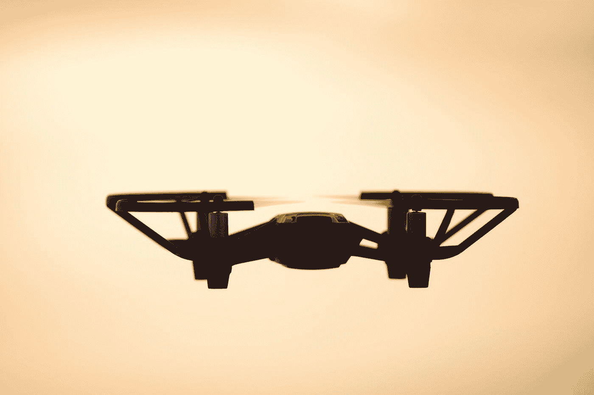
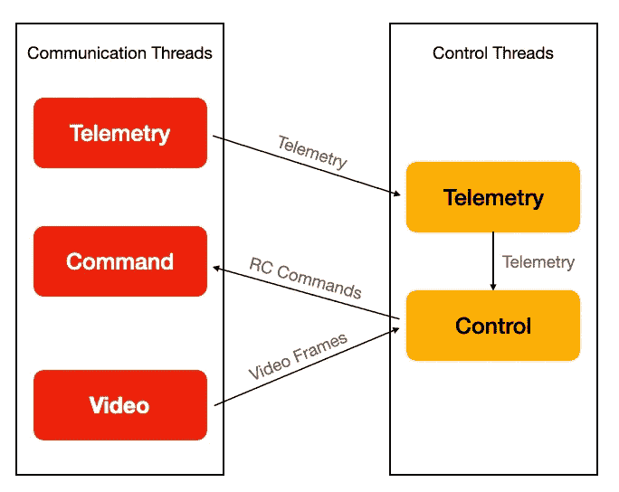

# 用 Python 驾驶无人机:设计控制系统

> 原文：<https://blog.devgenius.io/flying-a-drone-with-python-designing-the-control-system-385ff0beba2b?source=collection_archive---------5----------------------->

照片由 [Max](https://unsplash.com/@notquitemax?utm_source=medium&utm_medium=referral) 在 [Unsplash](https://unsplash.com?utm_source=medium&utm_medium=referral) 上拍摄

在机器人、物联网设备和其他融合了硬件和软件的应用中，系统通常有三个关键组件。有传感器，它从环境中读取信息；执行器，在环境中执行一些动作；以及计算单元，除了其他目的之外，该计算单元从传感器获取信息以确定致动器应该执行什么动作。完成这项工作的计算单元部分是**控制系统**。

在本文中，我将通过一个例子说明如何使用 Python 为 DJI·瑞泽·泰洛无人机设计控制系统。我们将浏览所有控制系统的抽象特征，并深入探究为泰洛创建控制系统的一种方法的细节。这将是几篇文章系列的第一部分，我将探索信号处理和控制理论的各种算法，并使用它们来驾驶无人机。这篇文章将特别介绍创建[泰洛控制库](https://pypi.org/project/tello-control)的逻辑，它实现了控制系统的关键特性，并使编写控制无人机的程序变得容易。

# DJI 泰洛

在进入控制系统之前，让我们先来看看无人机本身。DJI Ryze 泰洛无人机[是一种成本相对较低的室内商用无人机。它公开了一个](https://m.dji.com/product/tello) [SDK](https://dl-cdn.ryzerobotics.com/downloads/Tello/Tello%20SDK%202.0%20User%20Guide.pdf) ，让用户连接到无人机并以编程方式控制它。它还公布了机载传感器的测量结果，允许我们在飞行中访问其高度、速度和加速度等信息。还有一个前置摄像头，所以也可以用它来测试不同的计算机视觉算法。

# 控制系统

正如我前面提到的，控制系统是将传感器和执行器连接在一起的代码。设计控制系统时，需要问三个一般性问题。

1.  我们如何从传感器中读取信息？
2.  我们如何决定给执行器发送什么命令？
3.  我们如何向致动器发送命令？

这些问题没有单一的解决方案。在公司中，问题 1 和 3 通常由固件工程师和那些专门从事软件与硬件接口的人来决定。问题 2 通常由控制工程师等人员回答，他们专注于处理传感器信息，以计划和确定系统需要做什么来实现其目标。本文将回答问题 1 和 3，并涉及一些设计细节，以便我们在以后的文章中回答问题 2。

# 与无人机交流

回答问题 1 和 3 意味着确定我们将如何与无人机通信。泰洛无人机预计通信将通过 UDP 进行，UDP 是一种低延迟的网络协议，不需要双方在传输任何数据前进行“握手”来建立连接。然而，这也意味着我们与泰洛的连接将会有损耗。这意味着我们发送给泰洛的命令，以及泰洛发回的数据或视频帧可能会在传输中丢失。这不一定是个问题，但这是我们在设计代码时必须注意的。

我们需要四种不同类型的与泰洛的交流。

1.  我们需要能够发送命令。
2.  我们需要能够阅读命令响应。
3.  我们需要能够阅读泰洛州的信息。
4.  我们需要能够读取泰洛相机的画面。

这种通信通过三个不同的 UDP 套接字进行。

1.  通过 IP 地址 192.168.10.1 的端口 8890 发送和接收命令。
2.  泰洛以 10 Hz 的速率(每 0.1 秒一次)向 IP 地址为 192.168.10.1 的端口 8889 发布状态信息。
3.  泰洛将视频帧发布到默认 IP 地址为 0.0.0.0 的端口 11111。

这些信息都是由 DJI 决定的，不需要我们的设计投入。我们要设计的是通过这些 UDP 套接字读取和发送数据的代码。

泰洛控件库通过在不同的线程上处理这些 UDP 套接字来实现这一点。有一个线程用于发送命令和读取它们的响应，一个线程用于读取遥测数据，一个线程用于读取视频帧。该库在不同的线程上处理每个套接字，使得每个套接字相互独立。如果我们在等待对命令的响应，我们仍然可以在等待时接收到遥测和视频。同样，如果解码一个视频帧需要很长时间，那也不会阻止我们向无人机发送命令。这种设计的缺点是多线程很难推理。我们可以通过使每个线程尽可能简单来减轻这一点，仅仅从套接字消费数据或向其写入数据。线程之间也没有共享数据，这使得它们更容易处理。

第一个插座是**命令**插座。这是我们向泰洛发送包含指令的数据包的地方。每个包只是一个 UTF-8 编码的指令串。枚举包含了库支持的所有命令。`tello_control.CommandPacket` dataclass 是最终编码成字符串的内容，它包含我们需要与命令字符串一起发送的任何参数。例如，“land”命令不带参数，但“rc”(远程控制)命令带四个浮点值作为参数。收到命令时，泰洛会发回“ok”或错误消息。从套接字读取的所有数据都被放入一个同步的`messages`队列，该队列可以从其他线程读取。对于一些命令，如“起飞”和“着陆”，我们希望确保泰洛确认该命令，以便我们知道无人机是在空中还是在地面上。这些命令应该是*阻塞*操作，在那里我们在做任何其他事情之前等待来自泰洛的响应。其他命令，如“rc”，没有确认或不需要等待，所以这些是*非阻塞*，这意味着我们不等待泰洛响应它们。一个经验法则是，如果您下一个发送的命令依赖于来自泰洛的响应，那么您应该使用阻塞命令。为了等待阻塞响应，我们可以简单地等待一个对象被添加到命令套接字的`messages`队列中。使用[同步队列](https://docs.python.org/3/library/queue.html)可以让我们避免繁忙的循环，我们只是快速迭代而不做任何有价值的事情，这不必要地消耗了能量和 CPU 周期。这是因为在 Python 中从同步队列获取对象会阻塞调用`get`操作的线程。然而，由于 UDP 是一种有损耗的网络协议，我们还希望确保在数据包丢失的情况下不会永远等待，因此我们还必须设置一个超时，在此之后，我们将确定无人机没有响应。

第二个插座是**遥测**插座。这个套接字纯粹用于读取，因为泰洛向它发布数据，而不读取我们通过这个套接字发送给它的任何数据。遥测数据告诉我们重要的信息，如泰洛的姿态(方向)，它的速度，加速度和高度。因此，这个线程唯一的责任就是提供我们可以用来控制的信息。像命令套接字一样，这些数据被发布到一个`messages`队列，在那里其他线程可以处理它。

最后一个插座是**视频**插座。和遥测插座一样，这个是只读的，也可以用来控制。然而，要使用它进行控制，我们需要添加一些图像处理，将视频帧转换成类似位置或速度的信息。而在其他套接字中，泰洛控制库使用 Python 的内置`socket`模块，视频套接字使用 OpenCV 的`VideoCapture`，因为它会自动将帧解码为可用的图像数据。这些帧然后被发布到一个`messages`队列，在那里其他线程可以处理它。

总而言之，我们有三个线程负责处理与泰洛的通信。其中两个单独负责消耗数据，而第三个主要负责向无人机发送数据，并在适用时消耗响应。这个功能可以合并到一个线程中，但是将它分成三个线程可以保持与每个套接字的交互相互独立。

# 控制无人机

现在我们已经回答了问题 1 和 3，我们需要回答问题 2:我们如何决定向无人机发送什么命令？我们如何回答这个问题有很多深度。在使用遥测数据进行控制之前，我们可能会使用信号处理来处理它。我们可能会将计算机视觉应用于摄像头，以获取无人机周围的信息。为了确定无人机本身的输入，我们有很多方法，如反馈控制甚至强化学习，我们可以应用这些方法来接收相机和遥测数据，并产生下一个发送无人机的指令。这些是问题 2 的方面，我们将在以后的文章中探讨。然而，所有这些方法都有一个共同的基础结构。这是在`tello.TelloController`抽象类中实现的。首先，我们需要确定如何处理来自遥测线程和视频线程的数据。然后，我们需要确定如何在我们的控制算法中使用这些数据。

当调用`TelloController`的`start`方法时，它会创建一个新的线程，该线程从队列中读取遥测数据，遥测线程会将数据发布到该队列中。它只有一个目的:等待新的遥测数据可用，然后将其放入“邮箱”。控制算法然后可以从这个“邮箱”中读取。`start`方法创建的第二个线程是控制线程。该线程以称为**控制频率**的固定速率运行具有最新遥测数据的`step`功能。我们希望我们的控制频率尽可能快，因为我们向无人机发送命令越快，它对遥测数据的变化就越敏感。然而，因为我们仅以 10 赫兹的速率接收遥测，所以我们的控制频率高于 10 赫兹是没有结果的，因为我们不会足够快地接收到关于无人机状态的新信息。

如果我们把这两个函数放在同一个线程上，那么我们可能不会以相同的频率调用`step`函数。这是因为丢包或传输延迟会导致我们等待的时间比预期的长。这在我们的控制线程中引入了不确定性，这会导致难以解决的错误。只要有可能，控制系统应该努力实现确定性，这样整个系统的行为才是可预测的。有了这个架构，我们可以确保`step`函数以固定的速率运行，只要`step`函数本身不需要太长时间来执行。

有了这些基础设施，编写一个新的控制器就意味着子类化`tello_control.TelloController`并实现`step`功能。每个`step`应该产生一个四个数字的元组

1.  一个从-100 到 100 的浮点数，表示 X 方向的 RC 输入。
2.  一个从-100 到 100 的浮点数，表示 Y 方向的 RC 输入。
3.  一个从-100 到 100 的浮点数，表示 Z 方向的 RC 输入。
4.  一个从-100 到 100 的浮点数，表示顺时针旋转的 RC 输入。

这些数字对应于泰洛的“rc”命令的四个参数。这里是一个基本的**比例微分控制器**的例子，它告诉无人机旋转，使其旋转角度跟随 0.5 Hz 正弦波，顺时针在 20 到-20 度之间振荡。

在本文中，我不会讨论比例-微分控制器是如何或为什么工作的；我将把这个问题留给本系列的下一篇文章。

# 概述

经过这一切，我们有一个功能齐全的控制系统。我们总共有 6 个线程:3 个线程自动运行并与泰洛提供的 UDP 套接字接口，1 个线程向控制器提供遥测数据，1 个线程执行实际控制，主线程让我们向泰洛发送高级命令，如“起飞”和“着陆”。下图对此进行了总结。

该架构是围绕以下理念设计的:

1.  UDP 连接是不可靠的，所以我们应该能够优雅地处理传输延迟和丢包。
2.  我们应该尽可能地限制非决定论，并在可能的情况下完全消除它。

它实现了控制系统的三个关键特征

1.  从无人机的传感器读取数据
2.  确定向无人机发送什么命令
3.  向无人机的致动器发送命令

我只简单介绍了第二个特性是如何实现的。我们在这里可以做的事情有很大的多样性和创造性，这高度依赖于我们希望无人机做什么。请继续阅读本系列的后续文章，探索一些可能性。