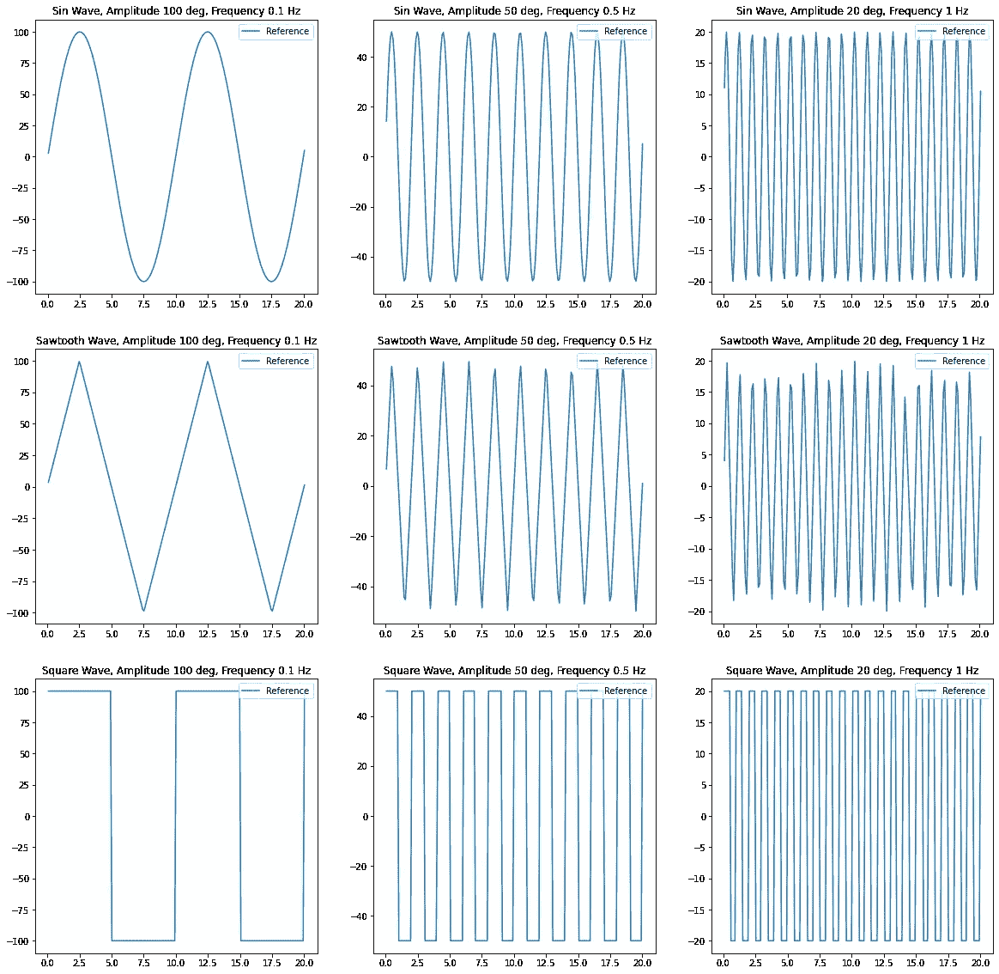
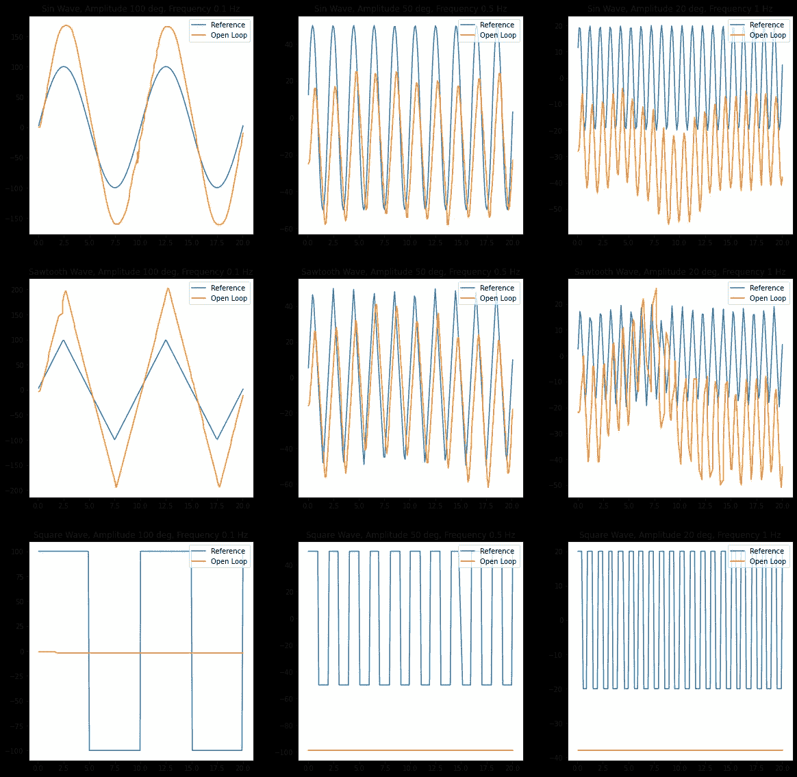
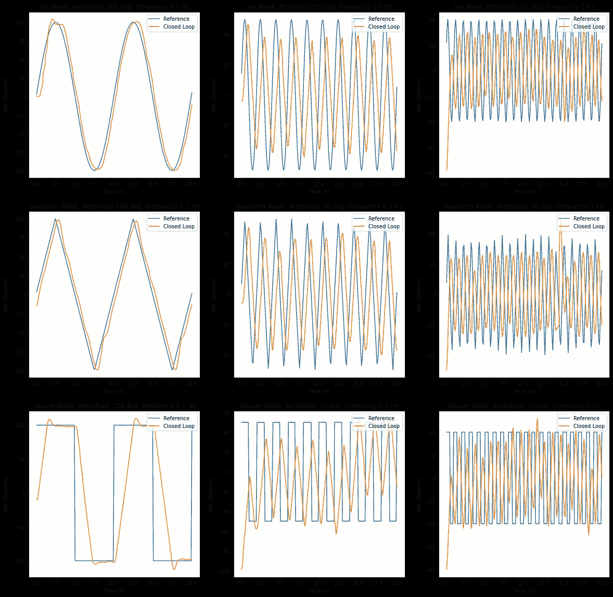
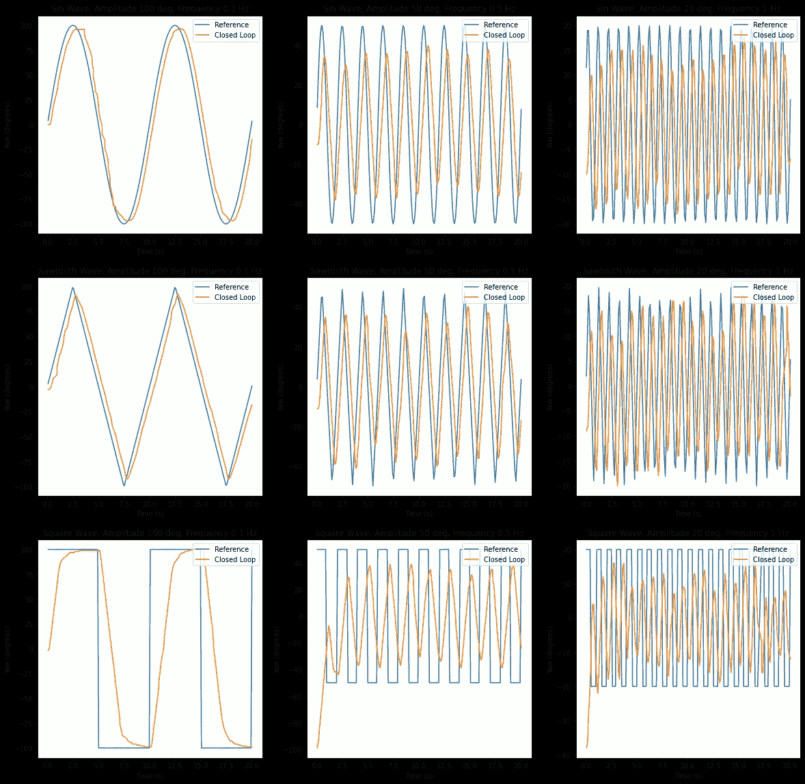
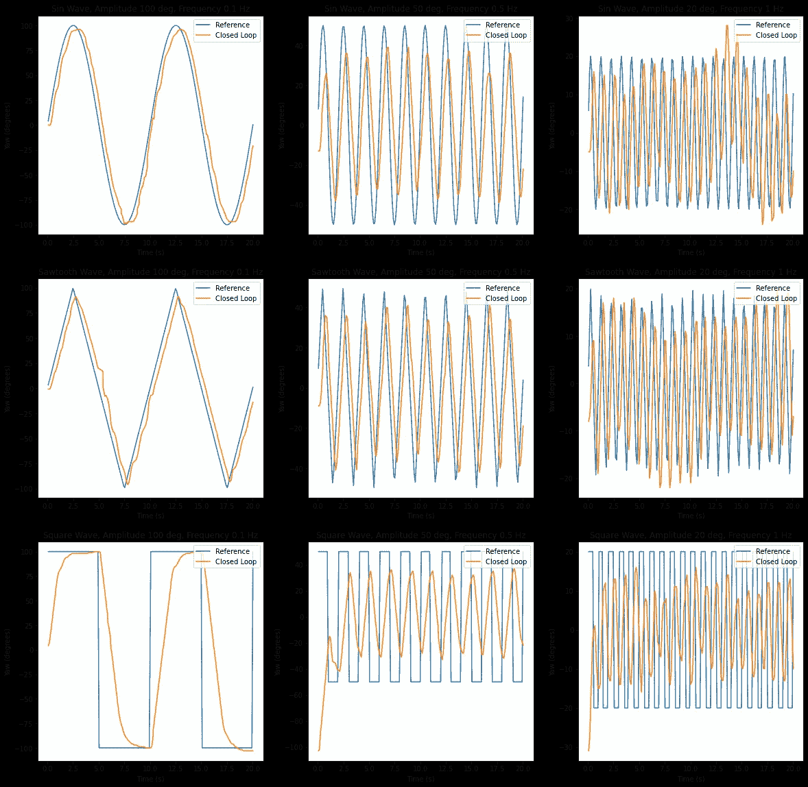

# 用 Python 飞无人机:PID 控制

> 原文：<https://blog.devgenius.io/flying-a-drone-with-python-pid-control-7001a41f54ac?source=collection_archive---------1----------------------->

[剂量介质](https://unsplash.com/@dose?utm_source=medium&utm_medium=referral)在 [Unsplash](https://unsplash.com?utm_source=medium&utm_medium=referral) 上拍照

*这是我“用 Python 飞无人机”系列的一部分。在阅读本部分之前，请查阅* [*【设计控制系统】*](/flying-a-drone-with-python-designing-the-control-system-385ff0beba2b) *。*

驾驶无人机的第一步是设计控制系统；第二部分是编写决定向无人机发送什么命令的算法。这些算法通常被称为*控制算法*，驱动这些算法的数学属于被称为*控制理论*的研究领域。

控制算法接收无人机的环境信息以及无人机的状态信息。*状态*是一个通用术语，它捕获关于无人机动态的信息，如其位置、速度、方向等。控制算法还接受一个*参考*，它是我们希望系统跟随的期望输出的向量。这些算法的输出是应该发送到无人机执行器的命令。在数学上，这由控制律`u = g(x, r)`表示，其中`x`是包含状态和环境信息的向量，`r`是参考，`g`是表示控制算法的函数，`u`是无人机的期望输入。控制工程是关于设计功能`g`以满足某些要求，如响应时间、能量消耗、误差等。

本文将关注一类被称为 *PID 控制器*的函数`g`。PID 代表比例积分微分。顾名思义，控制输入是比例、积分和微分元素的线性组合。PID 控制器是*反馈控制*的一种形式，这意味着它们实际上在参考和无人机状态`r-h(x)`之间的*误差*上运行，其中函数`h`捕获从无人机状态到参考的转换。

为了引入 PID 控制，我们将为无人机的偏航，即围绕垂直轴的旋转角度，创建控制器。我们将尝试让无人机根据形状、振幅和频率不同的参考信号来改变其偏航，以感受控制器在不同情况下的表现。具体来说，我们将测试频率为 0.1 Hz、0.5 Hz 和 1 Hz 的正弦波、锯齿波和方波。0.1 Hz 波的振幅为 100 度，0.5 Hz 波的振幅为 50 度，1 Hz 波的振幅为 20 度。

参考信号

我们将通过找到我们希望的无人机偏航(参考)和无人机实际偏航(状态)之间的*均方根误差* (RMSE)来评估我们的控制器做得有多好。RMSE 就是状态和参考之间的平均平方误差的平方根。数字越小，控制器的性能越好。每个实验将包括告诉无人机起飞，然后循环通过每个参考信号，在参考信号之间悬停 1 秒钟。所有参考完成后，无人机将着陆。

# 开环控制

在我们深入研究 PID 控制的工作原理之前，让我们首先解释一下为什么它是根据参考值和状态`r-h(x)`之间的误差而不是直接根据参考值来工作的。换句话说，让我们设计一个控制律`u = g(r)`。首先，让我们假设我们有一个数学模型`F`，它捕捉了一系列输入随着时间的推移`u(t)`将如何影响状态`x`(即`x(t) = F(u, t)`)。为了简单起见，让我们进一步假设我们的目标是让我们的状态跟踪我们的引用(即`h(x) = x`)。既然我们的目标是`r(t) = x(t)`，那么我们也要`r(t) = F(u, t)`。现在，人们可以想象我们可以计算出`F`的倒数，并将其作为我们的`g`。这就是*开环控制*背后的本质。这种做法可能行不通，原因有很多。

1.  我们可能没有数学模型`F`。泰洛就是这种情况，因为我们向制造商设计的系统提供输入，而我们不知道无人机会对我们的输入做出什么样的反应。
2.  `F`的逆运算可能难以置信地难以或不可能计算，这是大多数现实世界系统的情况。
3.  即使我们有一个可以轻松反演的数学模型`F`，该模型也可能没有考虑干扰、传感器噪声、建模误差和其他不可测量或不可预见的因素，这些因素会导致我们预期的无人机行为和实际行为之间的偏差。
4.  我们做了一个简化的假设，即`h(x) = x`，但更多情况下，`h(x)`是`x`上的一些不可逆变换。

我们甚至可以在最基本的任务中看到这一点。假设我们尝试将开环控制应用到控制无人机偏航的任务中。由于我们没有无人机如何响应改变其偏航的命令的模型，我们可以向它发送一系列命令来改变其偏航，并注意到它似乎根据一阶微分方程`dy/dt = c u`做出响应，其中`c`由实验确定。一旦我们有了这个模型，让无人机的偏航跟踪正弦曲线就像设置`u`为期望的速度除以`c`一样简单。这就是下面代码块中控制器的作用。

如果我们画出结果，我们可以看到它在我们选择的参考上表现不太好。

开环控制的结果

你可能注意到的第一件事是，无人机根本不对方波做出反应，它只是在原地盘旋。这是因为方波的瞬时速度总是 0。由于控制器不查看其传感器数据来确定它当前的偏航，它没有意识到它需要移动。您可能会注意到，对于 0.1 Hz 正弦波和锯齿波，我们的控制器比基准电压高出近 60 度。同样，它不知道自己已经做到了这一点，因为来自传感器的数据没有被输入控制器。最后，我们的控制器不能校正干扰。来自前一个基准的最终偏航误差总是传播到下一个基准。总而言之，正弦波的平均均方根误差为 35.5，锯齿波为 37.1，方波为 84.5。

# 反馈控制

为了解决开环控制的问题，我们需要在控制器中引入“反馈”。*反馈*意味着我们将控制结果反馈给控制器，这样它就知道自己做得有多好。这通常采取对参考和状态`e = r - h(x)`之间的误差进行运算的形式，其中`h`是状态的某种变换，代表我们实际可以测量的状态。

## 害虫控制

反馈控制的最基本形式称为 *P 控制*，因为控制与误差成比例:`u = k_p * e`。`k_p`是一个比例常数，所以更大的`k_p`将意味着控制器将更积极，因为当它遇到大的误差时，它将施加大的控制力。下面的图显示了当我们设置`k_p = 4`时会发生什么。

k_p=4 时 P-对照的结果

我们可以立即看到，这样一个简单的控制器比开环控制性能好得多。正弦波的平均均方根误差为 27.7，锯齿波为 23.3，方波为 60.2。对方波的响应显示有少量超调，但远未达到开环控制的 60 度超调。我们还可以清楚地看到，无人机启动偏航的误差很快得到纠正。例如，对于 1 Hz 正弦波，无人机从-40 度开始，但迅速移向基准振荡的位置。在锯齿波和正弦波中，基准和无人机的偏航之间确实出现了轻微的滞后，但这是预料之中的，因为接收传感器测量和无人机接收控制输入的往返时间为 0.2 秒。

## PD 控制

然而，P 控制往往没有给我们足够的能力来塑造无人机如何响应。如果我们不断增加`k_p`来减少滞后，我们会增加超调。另一方面，如果我们试图通过降低`k_p`来减少过冲，我们会导致无人机移动更慢，增加滞后。为了解决这个问题，我们可以在我们的控制器中添加一个*导数*项，制成一个 *PD 控制器*。我们的控制变为`u = k_p * e + k_d * e'`，其中`e'`是误差导数，而`k_d`是我们分配给导数项的权重。导数项保持无人机的响应时间不变，同时减少其超调量。

k_p=3 和 k_d=0.5 时 PD 控制的结果

加入导数项可以消除过冲，这在观察方波响应时很明显。然而，这也意味着控制器与锯齿波和正弦波的峰值不匹配。总之，PD 控制器的性能优于 P 控制器，正弦波的平均 RMSE 为 22.5，锯齿波为 19.1，方波为 57.2。PD 控制器的一个重要缺陷是，因为我们正在进行数值微分，所以我们计算的导数项将会受到数值不稳定性的影响。这可能表现为控制器输出和无人机行为中的抖动行为。`k_d`越大，抖动越明显。这可以通过在计算控制力之前将导数通过低通滤波器来减轻，如中值或均值滤波器，但我们在这里不这样做。抖动量也取决于你做的微分类型。我的实现做了一个简单的有限差分，但其他实现也可以。

## PID 控制

PD 控制为我们如何设计控制器增加了另一个自由度，但它仍然不足以解决我们看到的所有问题。也就是说，PD 控制仍然会有稳态误差。这在方波图中最为明显，我们接近基准电压，但并未完全达到基准电压。为了消除稳态误差，我们必须在控制器中增加一项:积分项。这就使得我们最终的 PID 控制律`u=k_p * e + k_d * e’ + k_i ∫e`。

积分项将整个历史上的误差加在一起。这有助于在稳态下将误差降至零。由于一开始没有太多的误差，常数`k_i`可以很小。

k_p=3，k_d=0.75，k_i=0.05 的 PID 控制结果

加入积分项后，从方波可以看出，我们消除了稳态误差。我们还提高了控制器满足锯齿波和正弦波峰值的能力，即使它与锯齿波的峰值不太匹配。然而，PID 控制器的性能最好，正弦波的平均 RMSEs 为 21.22，锯齿波为 18.44，方波为 55.08。

PID 控制器的代码如下所示。要创建 P 控制器，只需设置`k_d=0`和`k_i=0`，要创建 PD 控制器，设置`k_i=0`。PI 控制器是我们没有提到但有时也会用到的一种控制器。当我们可以用简单的 P 控制满足上升时间要求时，我们使用 PI 控制器，但是有稳态误差需要校正。要创建 PI 控制器，我们可以设置`k_d=0`。

# 整定 PID 控制器

在本文中，我已经给出了我能找到的`k_p, k_i`和`k_d`的最佳权重。我主要是通过反复试验来做到这一点的，不断进行实验，直到找到每种方法的最佳组合。有一些原则性的技术可以用来为这些值导出好的值，但是它们中的许多需要底层系统的知识(我们没有)，并且它们都值得单独写一篇文章。同时，[维基百科](https://en.wikipedia.org/wiki/PID_controller#Manual_tuning)有一个很棒的启发式列表，你可以用它来调整你的 PID 增益。

# 结论

PID 是一种极其简单但功能强大的控制算法，非常适合一大类系统。它使您能够控制系统的时间响应和稳态误差。然而，找到要使用的正确增益是高度手动的，并且可能很耗时，尤其是如果您没有系统的良好模型的话。它也没有考虑能量消耗和硬件限制等因素。尽管有这些缺点，它仍然有着令人难以置信的多功能性和广泛的用途。如果你想用不同的控制器运行你自己的实验，这篇文章的所有代码都可以在 [GitHub](https://github.com/aparande/tello-control/tree/master/examples/yaw_pid) 上找到。

展望未来，在本文中，我们演示了 PID 控制器如何跟踪参考信号，但我们跟踪的信号是预先确定的。为了让我们的 PID 控制器变得有用，我们需要一种方法来动态生成我们的引用(即我们希望无人机做什么)，这将是下一篇文章的主题。