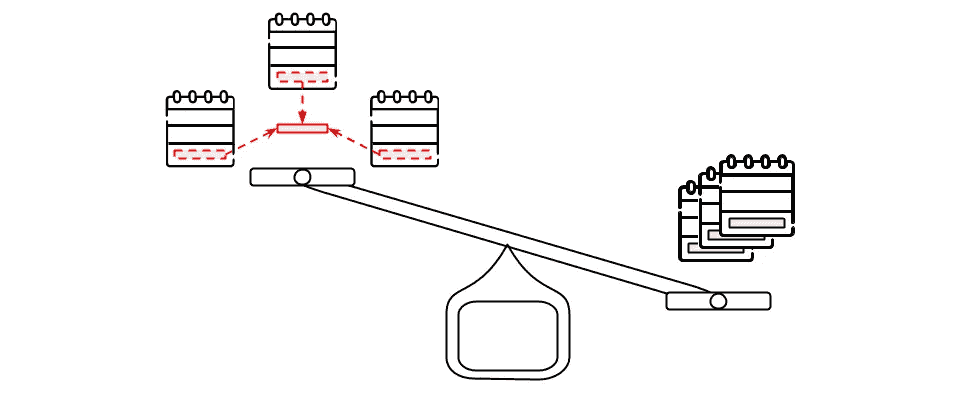

# 现代 C++中的 Flyweight 设计模式

> 原文：<https://blog.devgenius.io/flyweight-design-pattern-in-modern-c-a471bdd82c49?source=collection_archive---------3----------------------->



Flyweight 设计模式是 ***关注空间优化*** 的结构设计模式。这是一种通过与其他类似对象尽可能共享或避免冗余来最小化内存占用的技术。现代 C++中的 Flyweight 设计模式通常用于对象数量较多的情况，这种情况使用了不可接受的内存量。通常这些对象的某些部分可以共享&保存在公共数据结构中，可以被多个对象使用。

> */！\:本文已原创发表于我的* [*博客*](http://www.vishalchovatiya.com/flyweight-design-pattern-in-modern-cpp/) *。如果你有兴趣接收我的最新文章，* [*请报名参加我的简讯*](http://eepurl.com/gDNybv) *。*

如果你还没有看过我关于结构设计模式的其他文章，下面是列表:

1.  [**适配器**](http://www.vishalchovatiya.com/adapter-design-pattern-in-modern-cpp/)
2.  [桥**桥**桥](http://www.vishalchovatiya.com/bridge-design-pattern-in-modern-cpp/)
3.  [**复合**](http://www.vishalchovatiya.com/composite-design-pattern-in-modern-cpp/)
4.  [**装饰者**](http://www.vishalchovatiya.com/decorator-design-pattern-in-modern-cpp/)
5.  [**立面**](http://www.vishalchovatiya.com/facade-design-pattern-in-modern-cpp/)
6.  [**飞锤**](http://www.vishalchovatiya.com/flyweight-design-pattern-in-modern-cpp/)
7.  [**代理**](http://www.vishalchovatiya.com/proxy-design-pattern-in-modern-cpp/)

您在这一系列文章中看到的代码片段是简化的，而不是复杂的。所以你经常看到我不使用像`override`、`final`、`public`(同时继承)这样的关键字，只是为了让代码紧凑&可消费(大多数时候)在单一标准屏幕尺寸。我也更喜欢`struct`而不是`class`，只是为了节省代码行，有时不写`public:`，还会故意忽略[虚拟析构函数](http://www.vishalchovatiya.com/part-3-all-about-virtual-keyword-in-c-how-virtual-destructor-works/)，构造函数[，复制构造函数](http://www.vishalchovatiya.com/all-about-copy-constructor-in-cpp-with-example/)，前缀`std::`，删除动态内存。我也认为自己是一个务实的人，希望用尽可能简单的方式，而不是标准的方式或使用术语来传达一个想法。

***注:***

*   如果你是在这里被直接绊倒的，那么我建议你浏览一下[什么是设计模式？](http://www.vishalchovatiya.com/what-is-design-pattern/)一、哪怕是鸡毛蒜皮的小事。相信会鼓励你对这个话题进行更多的探索。
*   您在本系列文章中遇到的所有这些代码都是使用 C++20 编译的(尽管我在大多数情况下使用了 C++17 之前的现代 C++特性)。因此，如果你无法获得最新的编译器，你可以使用已经预装了 boost 库的[https://wandbox.org/](https://wandbox.org/)。

# 目的

> **存储数据时避免冗余** *。*

*   Flyway 设计模式非常简单，是一种空间优化技术。通过将一些公共数据存储到几个项目或几个对象中，你可以使用更少的内存。
*   我们将它存储在外部，并在实际需要时简单地引用(通过引用、指针或任何其他机制)它。

# C++中的 Flyweight 设计模式示例

*   如果我们存储大量数据，我们要做的一件事就是避免任何冗余。如果你一遍又一遍地重复同一个块，这就像图像或电影中的压缩。实际上，您可能希望避免该块占用内存。但是相反，你只是写下它，然后说它重复了多少次。
*   例如，假设你正在设计一个游戏。你将会有很多名字和/或姓氏完全相同的用户。你将会有很多人被称为`John Smith`。但是你也会有很多人被称为`John`，还有很多人的姓是`Smith`。
*   实际上，一次又一次地存储相同的姓和名的组合是没有意义的。因为你只是在浪费内存。所以你要做的是把一个名字列表存储在别的地方。然后你会保留指向这些名字的指针。

```
// Note: You can try following code at  https://wandbox.org/. #include <boost/bimap.hpp>struct User {
    User(string f, string l) : m_first_name{add(f)}, m_last_name{add(l)} { } string get_first_name() {return names.left.find(m_first_name)->second;}
    string get_last_name() {return names.left.find(m_last_name)->second;} friend ostream& operator<<(ostream& os, User& obj) {
        return os <<
            obj.get_first_name() << "(id=" << obj.m_first_name << "), " <<
            obj.get_last_name() << "(id=" << obj.m_last_name << ")" ;
    }protected:
    using key = uint32_t;
    static boost::bimap<key, string>        names;
    static key                              seed; static key add(string s) {
        auto it = names.right.find(s);
        if (it == names.right.end()) {
            names.insert({++seed, s});
            return seed;
        }
        return it->second;
    } key     m_first_name, m_last_name;
};User::key                           User::seed = 0;
boost::bimap<User::key, string>     User::names{};int main() {
    User john_doe {"John","Doe"};
    User jane_doe {"Jane","Doe"}; cout << "John Details: " << john_doe << endl;
    cout << "Jane Details: " << jane_doe << endl; return EXIT_SUCCESS;
}
/*
John Details: John(id=1), Doe(id=2)
Jane Details: Jane(id=3), Doe(id=2)
*/
```

*   如果你从上面的 flyweight 实现中看到本质，它只是通过处理冗余将数据存储在静态的限定数据结构中。以便它可以在相同[类型](http://www.vishalchovatiya.com/cpp-type-casting-with-example-for-c-developers/)的多个对象之间重用。

# 使用 Boost 实现 Flyweight 设计模式

*   Flyweight 设计模式并不新鲜。人们已经将这种缓存信息的方法打包到不同的库中供您使用。
*   所以不要用地图之类的东西来建造所有这些美妙的东西，你能做的只是使用一个库解决方案。

```
#include <boost/flyweight.hpp>struct User {
    boost::flyweight<string>   m_first_name, m_last_name; User(string f, string l) : m_first_name(f), m_last_name(l) { }
};int main() {
    User john_doe{ "John", "Doe" };
    User jane_doe{ "Jane", "Doe" }; cout<<boolalpha ;
    cout<<(&jane_doe.m_first_name.get() == &john_doe.m_first_name.get())<<endl;    // False
    cout<<(&jane_doe.m_last_name.get() == &john_doe.m_last_name.get())<<endl;      // True return EXIT_SUCCESS;
}
// Try @ [https://wandbox.org/.](https://wandbox.org/.)
```

*   如您所见，我们正在比较`main()`函数中 John 的姓和 Jane 的姓的地址，如果您运行上面的代码，就会显示为真，表明冗余被[boost::flyweight<>](https://www.boost.org/doc/libs/1_62_0/libs/flyweight/doc/index.html)完美地处理了。

# Flyweight 设计模式的好处

1.  促进许多细粒度对象的重用，使大量对象的利用更加高效。——逐字 GoF。
2.  改进数据缓存以提高响应时间。
3.  由于较少量的重对象，数据缓存提高了性能
4.  提供一个集中的机制来控制状态/公共属性对象。

# 常见问题汇总

**什么时候使用 Flyweight 设计模式？**

—需要大量的对象。
—当重复创建可由几个共享对象替换的重对象时

【Singleton 和 Flyweight 设计模式的区别？

—在单一设计模式中，不能创建多个对象。您需要在应用程序的所有部分重用现有的对象。在 Flyweight 设计模式中，你可以拥有大量相似的对象，这些对象可以共享一个公共的资源。

**Flyweight 设计模式的弊端？**

与 Singleton 设计模式相似，并发性也是 Flyweight 设计模式中令人头疼的问题。如果没有适当的措施，如果您在一个并发环境中创建 Flyweight 对象，您可能会最终拥有同一个对象的多个实例，这是不希望的。