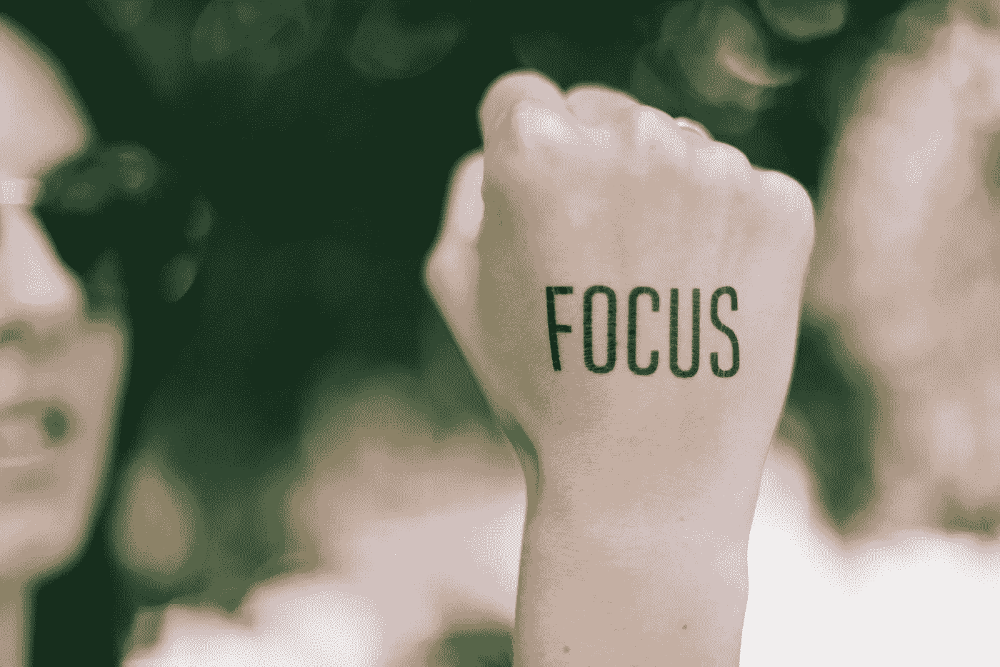

# 集中注意力，你会到达那里

> 原文：<https://blog.devgenius.io/focus-and-you-will-get-there-aea07638695a?source=collection_archive---------7----------------------->

管理和实现目标

*[*接受挑战*](https://club.ministryoftesting.com/t/bloggers-club-january-2021/46060)*

****

**照片由[蔡斯·克拉克](https://unsplash.com/@chaseelliottclark?utm_source=unsplash&utm_medium=referral&utm_content=creditCopyText)在 [Unsplash](https://unsplash.com/s/photos/focus?utm_source=unsplash&utm_medium=referral&utm_content=creditCopyText) 上拍摄**

**我个人喜欢首字母缩写词，因为它们有助于提醒重要的事情，还因为它们有助于以简单快捷的方式分享想法。所以我在想我是如何管理和实现我的目标的(在我的个人和职业生活中)，我想到的第一个词是专注。**

**如今，当我们有这么多分心的事情，并且通常想同时做这么多事情时，能够专注于某件事情是一个真正的挑战，也是一项技能，必须每天都在成长。专注是开始你的目标之路的第一步，也是在你的目标之旅中要保持的行动。我同意，如果你有一个聪明的目标，你已经向它迈进了一步，但今天我想用另一个缩写来谈论实现目标。**

**仅基本的**

**目标明确**

**总是保持创造性**

**可理解的目标**

**年代关于它的高峰**

**我总是对自己重复的一件事是:专注于什么是最重要的，什么是首先需要做的，否则我们会不停地把我们的思想从一件事转移到另一件事。所以，如果你想实现一个目标，最重要的是要知道你首先需要做的是什么，也许是你想实现它的主要原因。**

**与第一点紧密相关的，是要有一个**明确的目标**。类似于我们通常所说的 SMART，目标不必是相对的，否则就不是你拥有的明确目标，只是你想做的事情，这是不一样的，因为如果是“你想做的事情”，也许对你来说实现它并不重要。**

**我认为，我们都有内在的创造力，有时我们可以从童年开始开发它，而其他时候我们已经成年时才发现它，无论你何时发现并连接到你的创造力，你都必须保持它。我为什么这么说？很有可能你需要在通往目标的路上适应，并且你需要有创造力去实现它，否则，你会在路上只停留一步。**

**我们经常甚至不了解自己，我们怀疑，我们不知道我们到底想要什么(不仅仅是女人，每个人有时都有这种感觉)。因为这个原因对于**理解目标**很重要，分析一下它对我们意味着什么，我不是说我们是我们的心理学家，只是说我们需要理解目标的原因，它背后的欲望。**

**最后一点与我们的社交生活更相关，每当你有一个目标，并且**与一些朋友、家人或同事分享这个目标时，他们会多次鼓励我们，并且在职业道路上，他们可以帮助我们实现这个目标，可以牵着我们的手，与我们一起走在同一条道路上。****

****

**照片由[阿尔莫斯·贝托尔德](https://unsplash.com/@almosbech?utm_source=unsplash&utm_medium=referral&utm_content=creditCopyText)在 [Unsplash](https://unsplash.com/s/photos/magic?utm_source=unsplash&utm_medium=referral&utm_content=creditCopyText) 拍摄**

**我不相信神奇的解决方案，我知道没有对每个人都有效的方法，但这是帮助我的，也许现在也能帮助别人！**

**希望你喜欢它！**