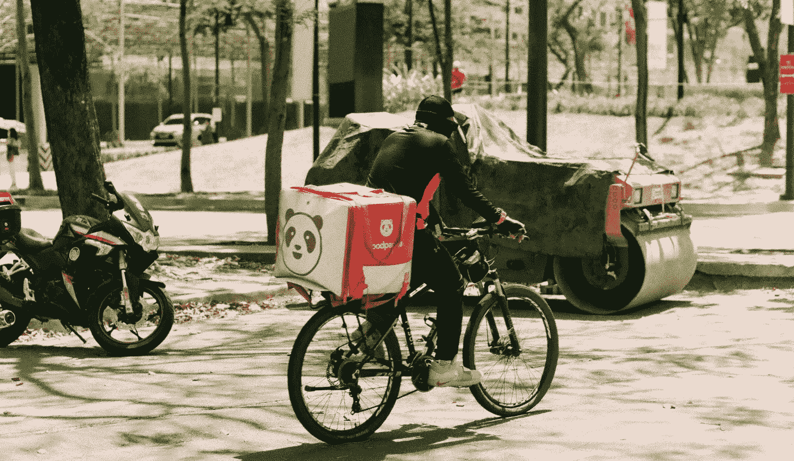
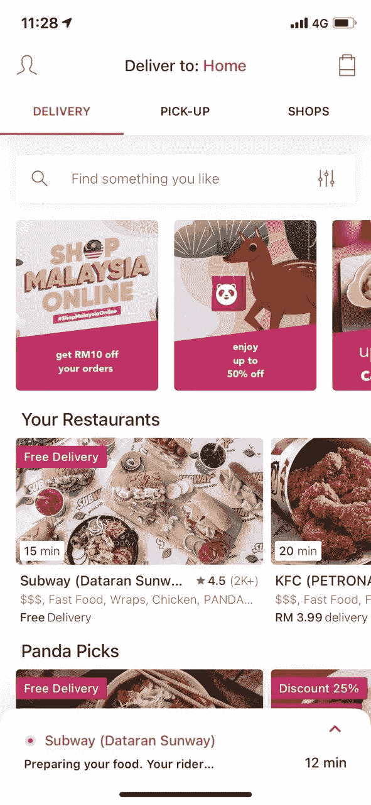
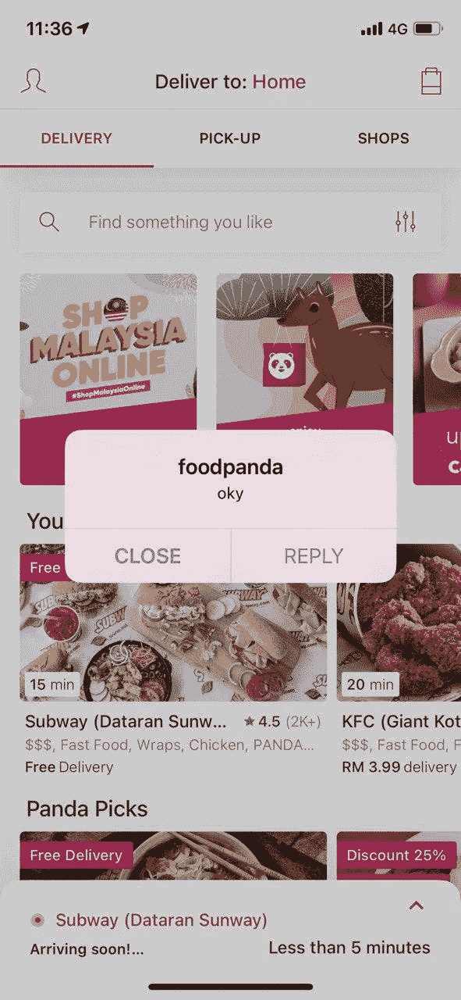
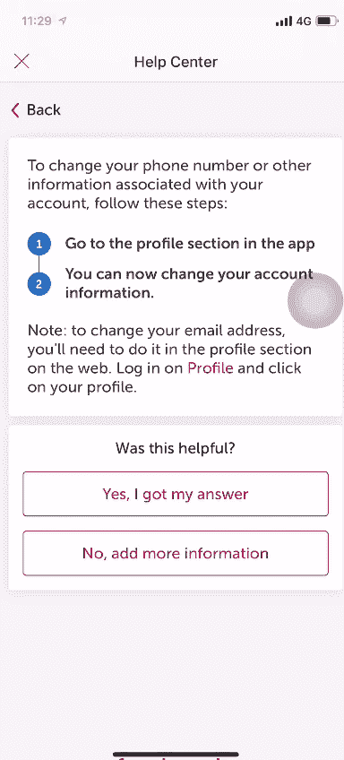

# FoodPanda 有烦人的虫子

> 原文：<https://blog.devgenius.io/foodpanda-got-annoying-bugs-f4c60939913f?source=collection_archive---------0----------------------->

生活在东南亚的每个人都知道 FoodPanda。FoodPanda 是一个移动食品配送市场，由总部位于柏林的 Delivery Hero SE 公司所有，在大约 50 个国家开展业务。它主要活跃在亚太地区、保加利亚和罗马尼亚。它的总部设在德国柏林。

我们也是该应用程序的定期用户，正如我们目前在新冠肺炎和所有疫情问题上的情况一样，食品配送应用程序有助于在不需要人工干预的情况下将食品送到家门口。

但是我们作为测试人员，我们很想知道应用程序的全部功能是什么，所以我们尽我们所能让它堆叠起来。

下面您将看到我们在尝试通过移动应用程序点餐时发现的问题或错误。

# BUG # 1(发生在 iOS 设备上)

每个用户通常都会注意到 FoodPanda 每周或每月提供的这些优惠。这是一个如此令人惊讶的报价(如图 A 所示)，但遗憾的是，当我们的一名测试人员点击其中一个报价时，他在第二张图片中看到弹出的消息(如图 B 所示)。

**发布**:

*   当用户点击报价时，他将看到另一个屏幕，显示应用了该报价的餐馆列表。但是在我们的例子中，我们得到了一个弹出消息，它是:

A.值得注意的是，显示的弹出消息是一条错误消息。

B.由于几种可能的原因，导航到下一个屏幕或窗口被中断。

**预期** **结果**:

*   显示该优惠适用的餐厅列表的新窗口屏幕。

**重新创建**的步骤:

1.  打开食品熊猫应用程序
2.  如果您尚未登录，请登录
3.  主页将显示如图片 A
4.  点击“马来西亚在线购物”优惠
5.  应该会出现一条弹出消息

**实际结果:**

*   出现如图 B 所示的弹出信息。

图片 A 在左边，图片 B 在右边

# BUG # 2(发生在 iOS 设备上)

我们不太确定为什么会出现这个错误，因为如果我们没有弄错的话，这个从最近的订单重新订购的模块是在应用程序中提供了 1 年的功能。

最糟糕的是，即使您多次从多家餐厅订购，该功能也不总是显示为该餐厅最近的订单。

**发布**:

*   用户点击最近显示的订单，并试图添加到购物车，但得到一个弹出消息，说“发生意外错误”。这样的错误消息不应该出现在用户面前，因为你可以注意到这个错误不应该在公共场合显示。

**预期** **结果**:

*   它应该直接将最近选择的订单中订购的内容添加到购物车中。

**重新创建**的步骤:

1.  打开食品熊猫应用程序
2.  如果您尚未登录，请登录
3.  主页将显示如下图
4.  点击您通常点餐的餐厅或最近点餐的餐厅
5.  点击最近的订单，并尝试将其添加到您的购物车中
6.  应该会出现一条弹出消息

**实际结果:**

*   “出现意外错误”弹出消息。

# BUG # 3(在 iOS 和 Android 设备上都出现)

每个应用程序都有一个帮助中心模块，奇怪的是我们几次注意到 FoodPanda 中的帮助中心工作不太好。我们注意到，当你试图真正联系到支持中心聊天或支持聊天，并与他们的支持中心交谈真的很难。

我们从几个朋友那里听说，用户应该多次经历这个过程，以获得支持聊天，与某人交谈并解释他们面临的问题。

**发布**:

*   在帮助中心菜单中，按下查询键，将会提供建议的解决方案。但是，如果按下“不，添加更多信息”，它会说“谢谢”并关闭标签，并且不会提示您添加任何信息。
*   通常，要进入支持团队聊天，您需要单击“否，添加更多信息”,但这需要花费一些时间。

**预期** **结果**:

*   它应该直接转到支持聊天，用户可以聊天或与支持团队交谈，以帮助他们。

**重新创建**的步骤:

1.  打开食品熊猫应用程序
2.  如果您尚未登录，请登录
3.  主页将出现在左上角的图标
4.  转到“帮助中心”
5.  在帮助中心有很多选择，比如说你选择“我的帐户”
6.  然后单击“我想更新我的帐户信息”
7.  上面提供了建议的解决方案，下面有一条消息说“这有帮助吗？”
8.  在那下面你有两个选择:

A.是的，我得到了我的答案

*   当您单击该按钮时，您将正常返回帮助中心

B.否，添加更多信息

*   这是你应该去的支持团队，与他们聊天，并添加你需要的信息，但相反，它给你与选择 a 相同的导航。

**实际结果:**

*   它再次返回帮助中心菜单，但没有提供解决方案或打开团队支持聊天。

# BUG # 4(发生在 Android 设备上)

送货/取件的概念成为食品配送应用服务中最有争议的选择之一。由于新冠肺炎，大多数人害怕送餐，所以他们自己去餐馆点餐和取餐。

这就是为什么 FoodPanda 有这个功能，因为它最初是自应用程序发布以来制作的，但没有人关注它，但现在由于环境的变化，人们开始使用这个拾取功能。这是用户开始注意到该模块中出现的问题的地方。

**发布**:

*   选择好想要的餐厅后，允许选择订单送达的时间和日期。最初，它将作为今天和尽快的时间。但是，当您打开时间选择列表并选择明天，但在按下更新之前，如果您按下顶部的递送/收件字样，它会将您的选择返回到最初的设置选择。

**预期** **结果**:

*   在点击“交付/提货”之前所做的选择应该被保存，因为系统有一个后端将它保存在缓存中。

**再造**的步骤:

1.  打开食品熊猫应用程序
2.  如果您尚未登录，请登录
3.  在主页上寻找你喜欢的餐馆
4.  挑选你的订单
5.  转到购物车，将交货或提货时间从尽快更改为另一个选择
6.  然后去顶部的送货/取件栏把它改成取件然后改回送货
7.  您会注意到，在第 6 步之前选择的交付时间被改回了原来的标准，即尽快

**实际结果:**

*   交货时间改回尽快。(遗憾的是，这一期没有拍摄照片)

# 结论

用户通常不会注意到这种错误，因为当他们使用这个应用程序时，他们专注于一个特定的任务，即点餐。所以我们只是想帮助提供一个更好的用户友好的应用程序，并向 FoodPanda 提供这些错误，他们可以改进他们的应用程序，给用户提供更好的应用程序使用体验。

> “质量从来不是偶然；它总是智慧努力的结果。”约翰·罗斯金

如果您正在寻找我们的服务，请在下面留言…

查看我们的社交媒体:

[脸书](https://www.facebook.com/StackedQA)，[推特](https://twitter.com/stackedqa)， [Instagram](https://instagram.com/stackedqa) ，& [Linkedin](https://www.linkedin.com/company/stackedqa)

 [## 通过我的推荐链接加入媒体-侯赛因巴申

### 作为一个媒体会员，你的会员费的一部分会给你阅读的作家，你可以完全接触到每一个故事…

husseinbaashen.medium.com](https://husseinbaashen.medium.com/membership)