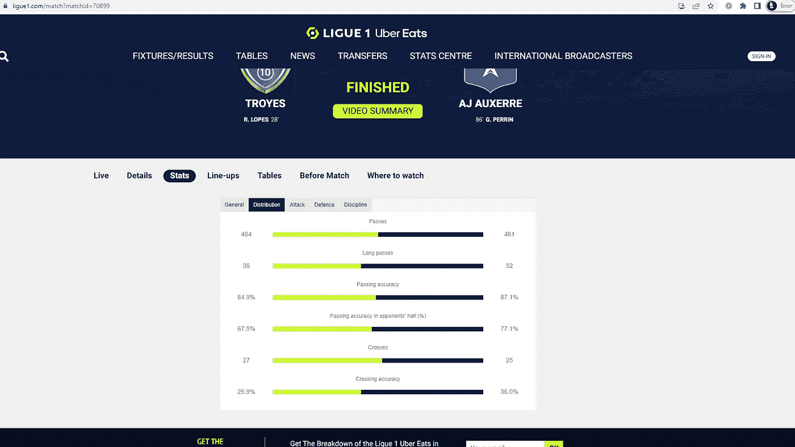
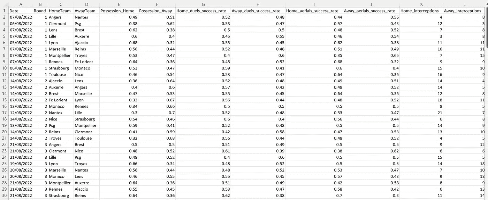
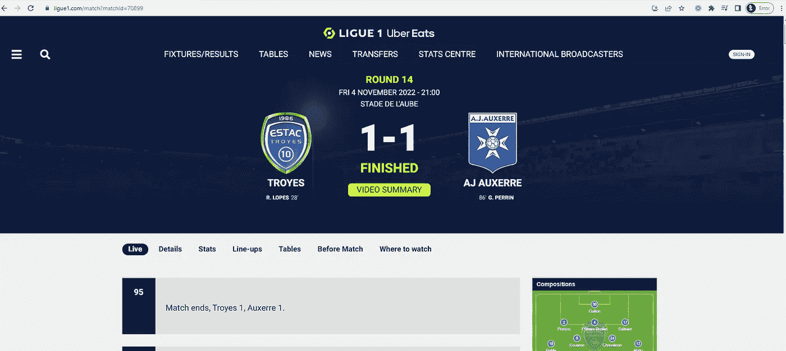
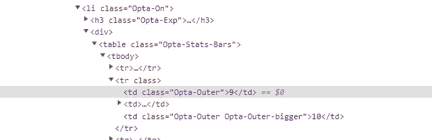
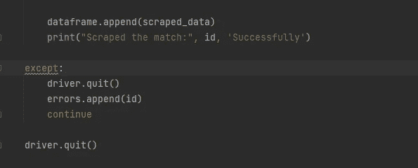

# 足球网络搜集:来自欧洲顶级联赛的数据收集——第一部分

> 原文：<https://blog.devgenius.io/football-webscraping-data-collection-from-a-top-european-league-e433dedb5d48?source=collection_archive---------6----------------------->

*“预测模型的好坏取决于提供给它的数据”* —保罗·科克兰，又名作者。但是我相信很多其他人以前也说过这句话。:)

今天，我将通过第一阶段为足球做一个预测模型。当然，有许多免费的开源网站提供了不错的足球统计数据。但当我浏览欧洲主要足球联赛时，法国法甲联赛的官方网站提供了许多经 Opta 验证的有趣统计数据。

从下面的截图中可以看到一些其他地方没有的统计数据，包括传球准确性，对手半场的传球准确性，禁区内的射门以及与传中有关的统计数据。如果你在每个标签中循环，大约有 25 个字段可用。这是一个很好的起点。



图 1:法国法甲官方网站。

# **数据**

csv 格式的最终数据帧如下所示。为了达到这一点，在熊猫中除了一些清洁工作之外，还有网页清扫。



图 2:最终数据帧。

所以让我们从数据收集方法开始。

# **网页抓取**

Python 是这里使用的语言，我发现它是最容易使用的，尽管这可以通过一些 r 知识来实现。与您选择的浏览器兼容的 web 驱动程序是一项要求，它的可执行路径存储在您的计算机上。你可以在这里下载 chrome 的 webdriver】。其他浏览器可下载的文件很容易通过在线搜索找到。

其他值得注意的库有:

熊猫:用于清洁。

时间:用于输入睡眠值，以确保 chrome 驱动程序在抓取游戏之间有一个喘息的时间。这允许加载所有数据，也有助于避免从网站上抓取软件。我首先导入库，然后建立一个空列表，用于存储循环中的所有游戏。

```
from selenium import webdriver
from selenium.webdriver.chrome.options import Options
from selenium.webdriver.support.ui import WebDriverWait
from selenium.webdriver.support import expected_conditions as EC
from selenium.webdriver import ActionChains
from selenium.webdriver.common.by import By
from time import sleep, time
import pandas as pd
import warnings

warnings.filterwarnings('ignore')

# set up empty dataframe in a list for storage.
dataframe = []
```

法国法甲网站有一个很好的功能，所有的游戏网址都用一个数字 ID 存储，比如:[https://www.ligue1.com/match?matchId=70899](https://www.ligue1.com/match?matchId=70899)

这使得(如果你读过我的其他文章，你会注意到这是不可能的)我可以一次自动抓取几个游戏，而不必手动粘贴 URL。根据一点研究，本赛季的第一场比赛的 ID 是 70760，而最后一场比赛，也就是世界杯开始前的最后一场比赛的 ID 是 70909。`range()`函数最多可以有三个参数:

```
range(start, stop, step)
```

start 参数包含了我们设置的 ID，但 stop 没有，这意味着我必须在 ID 上加 1，以确保赛季结束前的所有 150 场比赛都被取消。

我在 f 字符串中的变量 base_url 中提供了基本 url，这允许循环在每次迭代中使用 ID。其他参数是设置 chromedriver。Option.headless = False 让我们可以看到 chrome 驱动在做什么。传递你的可执行路径，你曾经存储你的 chromedriver 或其他浏览器的下载。Maximize_window 确实像它听起来的那样，只是最大化自动化浏览器的屏幕。每场比赛都会弹出一个 cookie，所以我将它设置为被接受，这样我们就可以继续了。

```
for id in range(70760,70910):

    base_url = f'https://www.ligue1.com/match?matchId={id}'

    option = Options()
    option.headless = False
    driver = webdriver.Chrome("C:/Users/paulc/Documents/Football Data project/DroppingOddsScraper/chromedriver.exe",options=option)
    driver.get(base_url)

    driver.maximize_window()

# click the cookie pop up
    WebDriverWait(driver, 10).until(EC.element_to_be_clickable((By.XPATH, "/html/body/div/div/div/div/div/div/div[3]/button[2]/span"))).click()
```

当 chromedriver 导航到该 URL 时，默认的着陆位置是这个页面，其中 live 选项卡是打开的。统计数据不在这里，除非我们告诉 chromedriver 点击统计选项卡打开页面，否则我们无法抓取。



图 3:默认着陆。

像下面这样传递 stats 选项卡的 xpath，并使用 actions.move_to_element 单击选项卡，得到我们需要的驱动程序。如果你保留 option.headless = False，你会看到 chrome 实时这样做，这很酷，至少第一次是这样的:)。

然后，我遍历感兴趣的信息，收集它的 xpath，并使用文本检索值，并将它们存储到一个变量中。因为这个页面在一个单独的类中存储更高的统计数据，所以分组不是一个选项，但是如果类都是这样的话，代码会少得多。



图 4:类。

```
# navigate to the stats - general tab.
    element = WebDriverWait(driver, 5).until(EC.element_to_be_clickable((By.XPATH, "//a[text()='Stats']")))
    actions = ActionChains(driver)
    actions.move_to_element(element).click().perform()

# scraping the general stats page.

    sleep(1)

    date = driver.find_element("xpath",
            '/html/body/main/div[1]/div/div/div[2]/div[1]/p[1]').text

    Round = driver.find_element("xpath",
            '/html/body/main/div[1]/div/div/div[2]/div[1]/h2').text

    home_team = driver.find_element("xpath",
            '/html/body/main/div[1]/div/div/div[2]/div[2]/div[1]/a/h2').text

    away_team = driver.find_element("xpath",
            '/html/body/main/div[1]/div/div/div[2]/div[2]/div[3]/a/h2').text

    home_possesion = driver.find_element("xpath",
            '/html/body/main/div[2]/div/div/div[2]/div[3]/div/div/div/div/div/ul/li[1]/div/table/tbody/tr[2]/td[1]').text

    away_possesion = driver.find_element("xpath",
            '/html/body/main/div[2]/div/div/div[2]/div[3]/div/div/div/div/div/ul/li[1]/div/table/tbody/tr[2]/td[3]').text

    home_duel_success_rate = driver.find_element("xpath",
            '/html/body/main/div[2]/div/div/div[2]/div[3]/div/div/div/div/div/ul/li[1]/div/table/tbody/tr[4]/td[1]').text

    away_duel_success_rate = driver.find_element("xpath",
            '/html/body/main/div[2]/div/div/div[2]/div[3]/div/div/div/div/div/ul/li[1]/div/table/tbody/tr[4]/td[3]').text

    home_aerial_success_rate = driver.find_element("xpath",
            '/html/body/main/div[2]/div/div/div[2]/div[3]/div/div/div/div/div/ul/li[1]/div/table/tbody/tr[6]/td[1]').text

    away_aerial_success_rate = driver.find_element("xpath",
            '/html/body/main/div[2]/div/div/div[2]/div[3]/div/div/div/div/div/ul/li[1]/div/table/tbody/tr[6]/td[3]').text

    home_interceptions = driver.find_element("xpath",
            '/html/body/main/div[2]/div/div/div[2]/div[3]/div/div/div/div/div/ul/li[1]/div/table/tbody/tr[8]/td[1]').text

    away_interceptions = driver.find_element("xpath",
            '/html/body/main/div[2]/div/div/div[2]/div[3]/div/div/div/div/div/ul/li[1]/div/table/tbody/tr[8]/td[3]').text

    home_offsides = driver.find_element("xpath",
            '/html/body/main/div[2]/div/div/div[2]/div[3]/div/div/div/div/div/ul/li[1]/div/table/tbody/tr[10]/td[1]').text

    away_offsides = driver.find_element("xpath",
            '/html/body/main/div[2]/div/div/div[2]/div[3]/div/div/div/div/div/ul/li[1]/div/table/tbody/tr[10]/td[3]').text

    home_corners = driver.find_element("xpath",
            '/html/body/main/div[2]/div/div/div[2]/div[3]/div/div/div/div/div/ul/li[1]/div/table/tbody/tr[12]/td[1]').text

    away_corners = driver.find_element("xpath",
            '/html/body/main/div[2]/div/div/div[2]/div[3]/div/div/div/div/div/ul/li[1]/div/table/tbody/tr[12]/td[3]').text
```

接下来的阶段重复导航每个选项卡和收集统计数据的过程。

```
sleep(1)
# move to distribution tab.

    element = WebDriverWait(driver, 10).until(EC.element_to_be_clickable((By.XPATH, "//a[text()='Distribution']")))
    actions = ActionChains(driver)
    actions.move_to_element(element).click().perform()

    home_passes = driver.find_element("xpath",
            '/html/body/main/div[2]/div/div/div[2]/div[3]/div/div/div/div/div/ul/li[2]/div/table/tbody/tr[2]/td[1]').text

    away_passes = driver.find_element("xpath",
            '/html/body/main/div[2]/div/div/div[2]/div[3]/div/div/div/div/div/ul/li[2]/div/table/tbody/tr[2]/td[3]').text

    home_long_passes = driver.find_element("xpath",
            '/html/body/main/div[2]/div/div/div[2]/div[3]/div/div/div/div/div/ul/li[2]/div/table/tbody/tr[4]/td[1]').text

    away_long_passes = driver.find_element("xpath",
            '/html/body/main/div[2]/div/div/div[2]/div[3]/div/div/div/div/div/ul/li[2]/div/table/tbody/tr[4]/td[3]').text

    home_pass_acc = driver.find_element("xpath",
            '/html/body/main/div[2]/div/div/div[2]/div[3]/div/div/div/div/div/ul/li[2]/div/table/tbody/tr[6]/td[1]').text

    away_pass_acc = driver.find_element("xpath",
            '/html/body/main/div[2]/div/div/div[2]/div[3]/div/div/div/div/div/ul/li[2]/div/table/tbody/tr[6]/td[3]').text

    home_pass_acc_opp_half = driver.find_element("xpath",
            '/html/body/main/div[2]/div/div/div[2]/div[3]/div/div/div/div/div/ul/li[2]/div/table/tbody/tr[8]/td[1]').text

    away_pass_acc_opp_half = driver.find_element("xpath",
            '/html/body/main/div[2]/div/div/div[2]/div[3]/div/div/div/div/div/ul/li[2]/div/table/tbody/tr[8]/td[3]').text

    home_crossing = driver.find_element("xpath",
            '/html/body/main/div[2]/div/div/div[2]/div[3]/div/div/div/div/div/ul/li[2]/div/table/tbody/tr[10]/td[1]').text

    away_crossing = driver.find_element("xpath",
            '/html/body/main/div[2]/div/div/div[2]/div[3]/div/div/div/div/div/ul/li[2]/div/table/tbody/tr[10]/td[3]').text

    home_crossing_acc = driver.find_element("xpath",
            '/html/body/main/div[2]/div/div/div[2]/div[3]/div/div/div/div/div/ul/li[2]/div/table/tbody/tr[12]/td[1]').text

    away_crossing_acc = driver.find_element("xpath",
            '/html/body/main/div[2]/div/div/div[2]/div[3]/div/div/div/div/div/ul/li[2]/div/table/tbody/tr[12]/td[3]').text

    sleep(1)
# move to attack tab.

    element = WebDriverWait(driver, 10).until(EC.element_to_be_clickable((By.XPATH, "//a[text()='Attack']")))
    actions = ActionChains(driver)
    actions.move_to_element(element).click().perform()

    home_goals = driver.find_element("xpath",
            '/html/body/main/div[2]/div/div/div[2]/div[3]/div/div/div/div/div/ul/li[3]/div/table/tbody/tr[2]/td[1]').text

    away_goals = driver.find_element("xpath",
            '/html/body/main/div[2]/div/div/div[2]/div[3]/div/div/div/div/div/ul/li[3]/div/table/tbody/tr[2]/td[3]').text

    home_shots = driver.find_element("xpath",
            '/html/body/main/div[2]/div/div/div[2]/div[3]/div/div/div/div/div/ul/li[3]/div/table/tbody/tr[4]/td[1]').text

    away_shots = driver.find_element("xpath",
            '/html/body/main/div[2]/div/div/div[2]/div[3]/div/div/div/div/div/ul/li[3]/div/table/tbody/tr[4]/td[3]').text

    home_shots_on_target = driver.find_element("xpath",
            '/html/body/main/div[2]/div/div/div[2]/div[3]/div/div/div/div/div/ul/li[3]/div/table/tbody/tr[6]/td[1]').text

    away_shots_on_target = driver.find_element("xpath",
            '/html/body/main/div[2]/div/div/div[2]/div[3]/div/div/div/div/div/ul/li[3]/div/table/tbody/tr[6]/td[3]').text

    home_blocked_shots = driver.find_element("xpath",
            '/html/body/main/div[2]/div/div/div[2]/div[3]/div/div/div/div/div/ul/li[3]/div/table/tbody/tr[8]/td[1]').text

    away_blocked_shots = driver.find_element("xpath",
            '/html/body/main/div[2]/div/div/div[2]/div[3]/div/div/div/div/div/ul/li[3]/div/table/tbody/tr[8]/td[3]').text

    home_shots_os_box = driver.find_element("xpath",
            '/html/body/main/div[2]/div/div/div[2]/div[3]/div/div/div/div/div/ul/li[3]/div/table/tbody/tr[10]/td[1]').text

    away_shots_os_box = driver.find_element("xpath",
            '/html/body/main/div[2]/div/div/div[2]/div[3]/div/div/div/div/div/ul/li[3]/div/table/tbody/tr[10]/td[3]').text

    home_shots_is_box = driver.find_element("xpath",
            '/html/body/main/div[2]/div/div/div[2]/div[3]/div/div/div/div/div/ul/li[3]/div/table/tbody/tr[12]/td[1]').text

    away_shots_is_box = driver.find_element("xpath",
            '/html/body/main/div[2]/div/div/div[2]/div[3]/div/div/div/div/div/ul/li[3]/div/table/tbody/tr[12]/td[3]').text

    home_shooting_acc = driver.find_element("xpath",
            '/html/body/main/div[2]/div/div/div[2]/div[3]/div/div/div/div/div/ul/li[3]/div/table/tbody/tr[14]/td[1]').text

    away_shooting_acc = driver.find_element("xpath",
            '/html/body/main/div[2]/div/div/div[2]/div[3]/div/div/div/div/div/ul/li[3]/div/table/tbody/tr[14]/td[3]').text

    sleep(1)

# move to defence tab.

    element = WebDriverWait(driver, 10).until(EC.element_to_be_clickable((By.XPATH, "//a[text()='Defence']")))
    actions = ActionChains(driver)
    actions.move_to_element(element).click().perform()

    home_tackles = driver.find_element("xpath",
            '/html/body/main/div[2]/div/div/div[2]/div[3]/div/div/div/div/div/ul/li[4]/div/table/tbody/tr[2]/td[1]').text

    away_tackles = driver.find_element("xpath",
            '/html/body/main/div[2]/div/div/div[2]/div[3]/div/div/div/div/div/ul/li[4]/div/table/tbody/tr[2]/td[3]').text

    home_tackles_success_rate = driver.find_element("xpath",
            '/html/body/main/div[2]/div/div/div[2]/div[3]/div/div/div/div/div/ul/li[4]/div/table/tbody/tr[4]/td[1]').text

    away_tackles_success_rate = driver.find_element("xpath",
            '/html/body/main/div[2]/div/div/div[2]/div[3]/div/div/div/div/div/ul/li[4]/div/table/tbody/tr[4]/td[3]').text

    home_clearances = driver.find_element("xpath",
            '/html/body/main/div[2]/div/div/div[2]/div[3]/div/div/div/div/div/ul/li[4]/div/table/tbody/tr[6]/td[1]').text

    away_clearances = driver.find_element("xpath",
            '/html/body/main/div[2]/div/div/div[2]/div[3]/div/div/div/div/div/ul/li[4]/div/table/tbody/tr[6]/td[3]').text

    sleep(1)

# move to discipline tab.

    element = WebDriverWait(driver, 10).until(EC.element_to_be_clickable((By.XPATH, "//a[text()='Discipline']")))
    actions = ActionChains(driver)
    actions.move_to_element(element).click().perform()

    home_fouls = driver.find_element("xpath",
            '/html/body/main/div[2]/div/div/div[2]/div[3]/div/div/div/div/div/ul/li[5]/div/table/tbody/tr[2]/td[1]').text

    away_fouls = driver.find_element("xpath",
            '/html/body/main/div[2]/div/div/div[2]/div[3]/div/div/div/div/div/ul/li[5]/div/table/tbody/tr[2]/td[3]').text

    home_yellows = driver.find_element("xpath",
            '/html/body/main/div[2]/div/div/div[2]/div[3]/div/div/div/div/div/ul/li[5]/div/table/tbody/tr[4]/td[1]').text

    away_yellows = driver.find_element("xpath",
            '/html/body/main/div[2]/div/div/div[2]/div[3]/div/div/div/div/div/ul/li[5]/div/table/tbody/tr[4]/td[3]').text

    home_reds = driver.find_element("xpath",
            '/html/body/main/div[2]/div/div/div[2]/div[3]/div/div/div/div/div/ul/li[5]/div/table/tbody/tr[6]/td[1]').text

    away_reds = driver.find_element("xpath",
            '/html/body/main/div[2]/div/div/div[2]/div[3]/div/div/div/div/div/ul/li[5]/div/table/tbody/tr[6]/td[3]').text

    sleep(1)

# move to lineups tab to get referee.

    element = WebDriverWait(driver, 10).until(EC.element_to_be_clickable((By.XPATH, "//a[text()='Line-ups']")))
    actions = ActionChains(driver)
    actions.move_to_element(element).click().perform()

    referee = driver.find_element("xpath",
            '/html/body/main/div[2]/div/div/div[2]/div[4]/div/div/div[3]/div/div/div[2]/ul/li[1]/span[2]').text
```

这使得大量信息存储在变量中。还记得我在开始时设置的空列表吗？此时，我可以将每个匹配变量存储到一个名为 scraped_data 的列表中，并将其附加到 dataframe 中。continue 行告诉 webdriver 循环到下一个匹配，最后当它通过提供的范围时，它将退出。

```
scraped_data = [date,Round,home_team,away_team,home_possesion,away_possesion,home_duel_success_rate,away_duel_success_rate,home_aerial_success_rate,away_aerial_success_rate,
            home_interceptions,away_interceptions,home_offsides,away_offsides,home_corners,away_corners,home_passes,away_passes,home_long_passes,away_long_passes,home_pass_acc,away_pass_acc,home_pass_acc_opp_half,away_pass_acc_opp_half,home_crossing,away_crossing,home_crossing_acc,away_crossing_acc,home_goals,away_goals,
            home_shots,away_shots,home_shots_on_target,away_shots_on_target,home_blocked_shots,away_blocked_shots,home_shots_os_box,away_shots_os_box,home_shots_is_box,
            away_shots_is_box,home_shooting_acc,away_shooting_acc,home_tackles,away_tackles,home_tackles_success_rate,away_tackles_success_rate,home_clearances,away_clearances,
            home_fouls,away_fouls,home_yellows,away_yellows,home_reds,away_reds,referee]

dataframe.append(scraped_data)

continue

driver.quit()
```

# **清洁**

所以现在我们所有的比赛数据都是一个非常脏的形式，需要进行清理，这样我才能让数据帧正常工作。我设置了一个包含所有列名的空列表，每个队一个，并将存储每个匹配数据的列表转换为 pandas 数据帧，为其提供列名。

```
columns = ['Date','Round','HomeTeam','AwayTeam','Possession_Home','Possession_Away','Home_duels_success_rate','Away_duels_success_rate','Home_aerials_success_rate','Away_aerials_success_rate','Home_interceptions','Away_interceptions','Home_offsides','Away_offsides','Home_corners','Away_corners','Home_passes','Away_passes',
 'Home_long_passes','Away_long_passes','Home_passing_acc','Away_passing_acc','Home_passing_acc_opp_half','Away_passing_acc_opp_half','Home_crosses','Away_crosses',
 'Home_crossing_acc','Away_crossing_acc','HomeGoals','AwayGoals','HomeShots','AwayShots','HomeSOT','AwaySOT','Home_blocked_shots','Away_blocked_shots','Home_Shots_OB','Away_Shots_OB','Home_Shots_IB','Away_shots_IB','Home_shooting_acc','Away_shooting_acc','HomeTackles','AwayTackles','Home_Tackle_success_rate','Away_Tackle_success_rate',
  'HomeClearances','AwayClearances','HomeFouls','AwayFouls','HomeYellows','AwayYellows','HomeReds','AwayReds','Referee']

final_df = pd.DataFrame(dataframe)
final_df.columns = columns
```

接下来的几行清理了数据，提供的注释解释了我为什么这么做以及我在做什么。球队的名字也很有趣，这就是为什么我用字典给他们重新命名，让他们更好看。

```
#cleaning

# strip ROUND from round

final_df['Round'] = final_df['Round'].str.strip('ROUND')

# extract time from date

final_df['Time'] = [i.split("-")[1] for i in final_df['Date']]

# turn date column into datetime.

final_df['Date'] = pd.to_datetime(final_df['Date'])
final_df['Date'] = final_df['Date'].dt.date

# fix capitalisation of string columns

final_df['HomeTeam'] = final_df['HomeTeam'].str.title()
final_df['AwayTeam'] = final_df['AwayTeam'].str.title()
final_df['Referee'] = final_df['Referee'].str.title()

# remove % sign

final_df = final_df.replace('\%','',regex=True)

# turn columns into float.

final_df[['Round','Possession_Home','Possession_Away','Home_duels_success_rate','Away_duels_success_rate','Home_aerials_success_rate','Away_aerials_success_rate','Home_interceptions','Away_interceptions','Home_offsides','Away_offsides','Home_corners','Away_corners','Home_passes','Away_passes',
 'Home_long_passes','Away_long_passes','Home_passing_acc','Away_passing_acc','Home_passing_acc_opp_half','Away_passing_acc_opp_half','Home_crosses','Away_crosses',
 'Home_crossing_acc','Away_crossing_acc','HomeGoals','AwayGoals','HomeShots','AwayShots','HomeSOT','AwaySOT','Home_blocked_shots','Away_blocked_shots','Home_Shots_OB','Away_Shots_OB','Home_Shots_IB','Away_shots_IB','Home_shooting_acc','Away_shooting_acc','HomeTackles','AwayTackles','Home_Tackle_success_rate','Away_Tackle_success_rate',
  'HomeClearances','AwayClearances','HomeFouls','AwayFouls','HomeYellows','AwayYellows','HomeReds','AwayReds']] = final_df[['Round','Possession_Home','Possession_Away','Home_duels_success_rate','Away_duels_success_rate','Home_aerials_success_rate','Away_aerials_success_rate','Home_interceptions','Away_interceptions','Home_offsides','Away_offsides','Home_corners','Away_corners','Home_passes','Away_passes','Home_long_passes','Away_long_passes','Home_passing_acc','Away_passing_acc','Home_passing_acc_opp_half','Away_passing_acc_opp_half','Home_crosses','Away_crosses','Home_crossing_acc','Away_crossing_acc','HomeGoals','AwayGoals','HomeShots','AwayShots','HomeSOT','AwaySOT','Home_blocked_shots','Away_blocked_shots','Home_Shots_OB','Away_Shots_OB','Home_Shots_IB','Away_shots_IB','Home_shooting_acc','Away_shooting_acc','HomeTackles','AwayTackles','Home_Tackle_success_rate','Away_Tackle_success_rate','HomeClearances','AwayClearances','HomeFouls','AwayFouls','HomeYellows','AwayYellows','HomeReds','AwayReds']].astype(float)

# reformat % columns by dividing by 100.

final_df[['Possession_Home','Possession_Away','Home_duels_success_rate','Away_duels_success_rate','Home_aerials_success_rate','Away_aerials_success_rate','Home_passing_acc','Away_passing_acc','Home_passing_acc_opp_half','Away_passing_acc_opp_half','Home_crossing_acc','Away_crossing_acc','Home_shooting_acc','Away_shooting_acc','Home_Tackle_success_rate','Away_Tackle_success_rate']] = final_df[['Possession_Home','Possession_Away','Home_duels_success_rate','Away_duels_success_rate','Home_aerials_success_rate','Away_aerials_success_rate','Home_passing_acc','Away_passing_acc','Home_passing_acc_opp_half','Away_passing_acc_opp_half','Home_crossing_acc','Away_crossing_acc','Home_shooting_acc','Away_shooting_acc','Home_Tackle_success_rate','Away_Tackle_success_rate']].div(100).round(2)

# apply dictionary to remap names.

teams_dict = {"Rc Lens":"Lens",
              "Angers Sco":"Angers",
              "Fc Nantes":"Nantes",
              "Losc":"Lille",
              "Ol":"Lyon",
              "Ogc Nice":"Nice",
              "Om":"Marseille",
              "As Monaco":"Monaco",
              "Ac Ajaccio":"Ajaccio",
              "Aj Auxerre":"Auxerre",
              "Toulouse Fc":"Toulouse",
              "Fc Lorient":"Lorient"}

for key, value in final_df['HomeTeam'].iteritems():
    final_df['HomeTeam'] = final_df['HomeTeam'].apply(lambda x: teams_dict.get(x,x))

for key, value in final_df['AwayTeam'].iteritems():
    final_df['AwayTeam'] = final_df['AwayTeam'].apply(lambda x: teams_dict.get(x,x))

final_df
```

然后我可以使用 final _ df . to _ CSV(' Ligue 1 _ 2223 . CSV '，index=False)将它本地存储在我的 PC 上。下面是我加载的一个 youtube 视频，展示了 webscraper 的运行。

视频演示。

# **可能的改进**

错误处理是一个大问题。目前，webscraper 能够处理将近半个赛季的数据，但如果它在某个特定的游戏中出错，那么失去进展将是一种耻辱。将这些实例存储到一个列表中，并允许 webscraper 继续前进，这是我将做的事情，并在未来的编辑中更新。

我的 [github](https://github.com/socrstats/webscraping) 上提供了完整的代码和数据，以节省您的时间。

# **编辑**

为了考虑可能的错误处理，我在 try 块中重新格式化了 scraper。我创建了一个空列表来存储潜在的错误。这将允许刮刀在遇到任何错误时继续工作。匹配的 id 将在你的笔记本/IDE 中打印出来。更新的刮刀在 github 中，取代了原来的刮刀。它是为了刮 21/22 赛季而设立的。



网络抓取的计算成本很高，当我尝试做一个完整的赛季时，我遇到了 chrome 驱动程序问题，我一直到第 34 轮都没有问题，所以可能值得将 21/22 的结束范围设置为 69238，以将抓取分成两次运行。

希望你喜欢，在不久的将来，我将在这篇文章的基础上进行一个基于这些数据(和前几年)的建模项目，所以请跟我来保持更新。

**进一步编辑:我已经编辑了这里使用的代码，以自动进行每周数据的抓取。更新的 scraper 在 GitHub 链接上。它会查找结果页面上显示的所有 id，默认着陆是最近一轮。它通过漂亮的 soup 将这些 id 存储到一个列表中，for 循环遍历存储的 id，而不是 range 函数。**

第 2 部分现在可用了，我从这里的[创建了一个 Rshiny 仪表板。](https://leftsidedcentrehalf.medium.com/football-webscraping-data-collection-from-a-top-european-league-part-2-dashboard-creation-6352b13ced78)

谢谢，

保罗