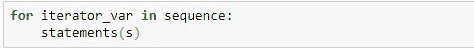
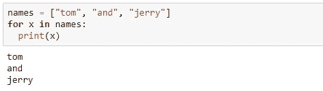
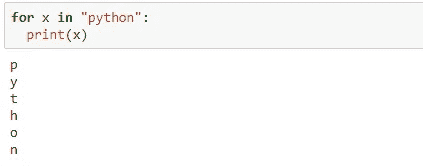
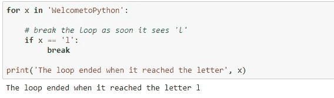
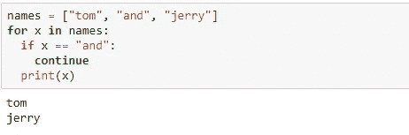
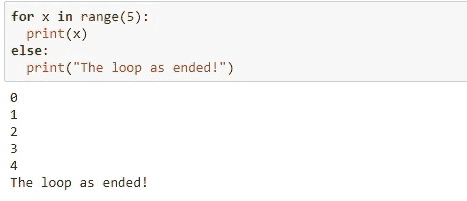
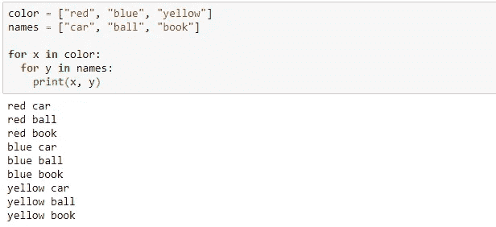
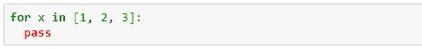

# Python 中的 For 循环

> 原文：<https://blog.devgenius.io/for-loops-in-python-5601768961a2?source=collection_archive---------4----------------------->

## 如何在 Python 中使用 For 循环

纳蕾塔·马丁在 [Unsplash](https://unsplash.com?utm_source=medium&utm_medium=referral) 上的照片

在上一个教程中，我们学习了 while 循环。在本教程中，让我们来看看循环的**。**

## 对于循环

For 循环用于迭代序列。语法是:

让我们看一个简单的例子来理解 for 循环是如何工作的:

在上面的例子中，' *x* '遍历列表，然后打印元素。

我们还可以使用 *for 循环*来迭代一个*字符串:*

## 在 for 循环中使用“break”和“continue”语句:

**Break 语句:**在循环完所有项目之前停止循环。它基本上将控制带出循环。让我们来看一个例子:

**Continue 语句:**将控制返回到循环的开始处。它基本上停止了循环的当前迭代，并继续下一次迭代。

## 对 for 循环使用“else”语句:

由于在' *for'* 循环中没有终止执行的条件，这是 while 循环中的情况，else 块将在' *for* 块完成执行后立即执行。

## 嵌套循环:

嵌套循环是循环中的循环。“内循环”在“外循环”的每次迭代中执行一次。

## Pass 语句:

出于某种原因，如果我们有空循环，那么我们可以使用 pass 语句。

## 结论

在本教程中，我们看到 *for 循环*可以迭代任何可迭代对象(例如:列表、集合、字典、元组或字符串)。此外，借助示例，我们看到了 for 循环如何与 break、continue 和 else 语句一起工作。