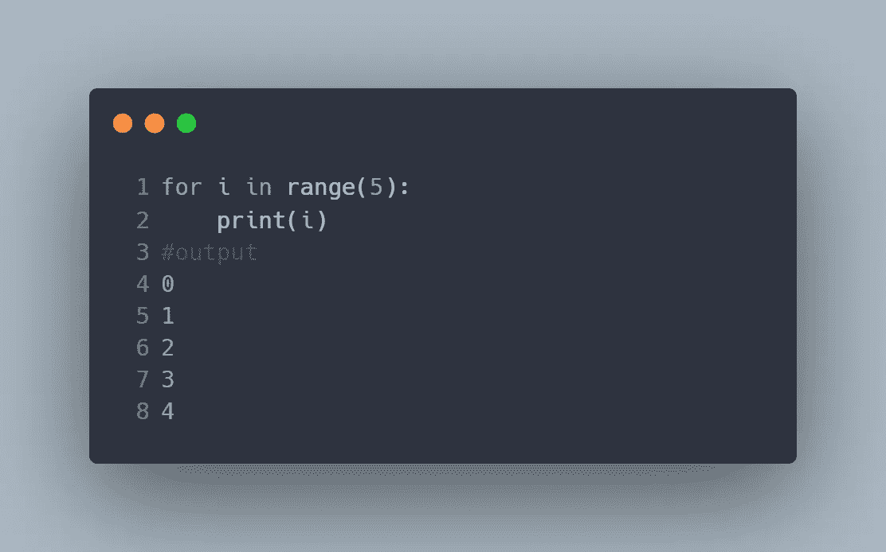
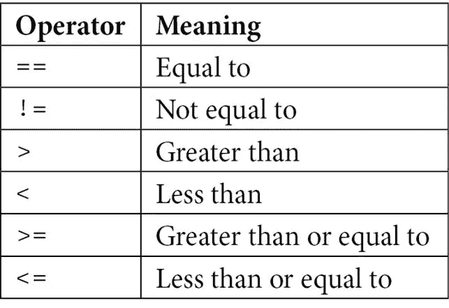
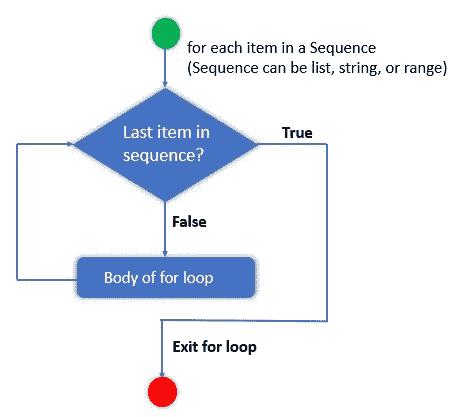
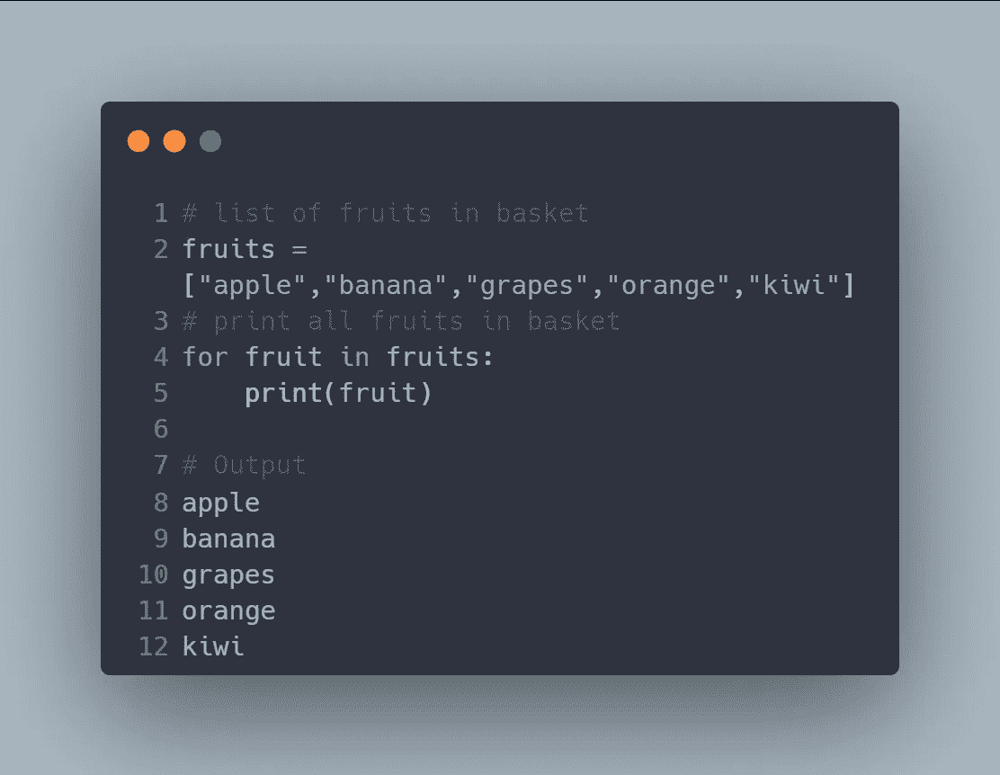
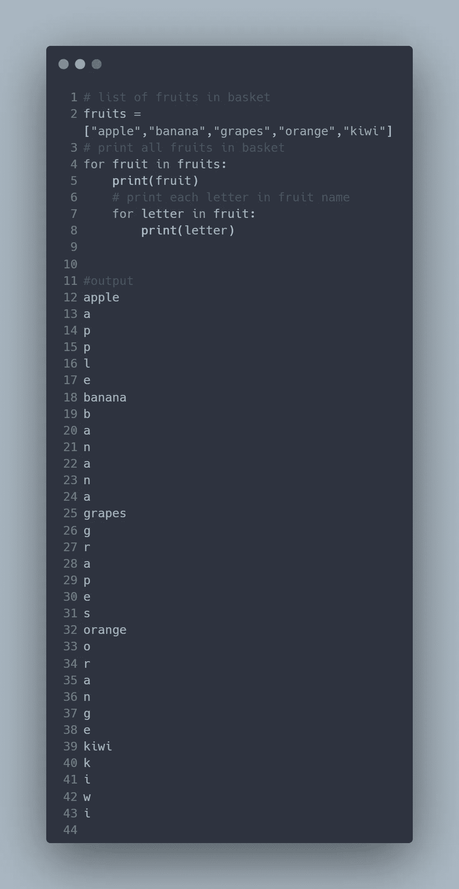
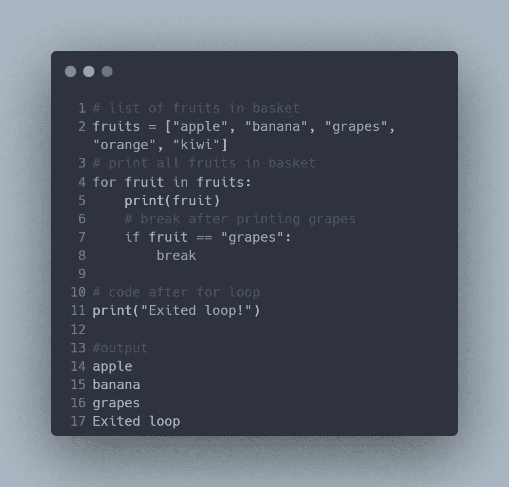
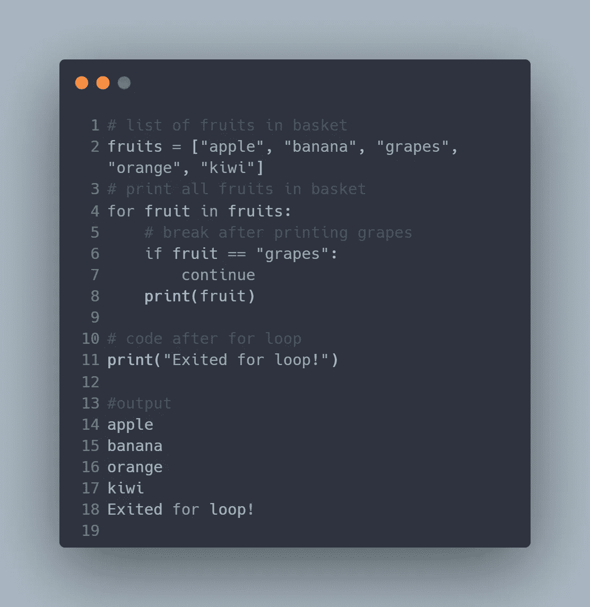
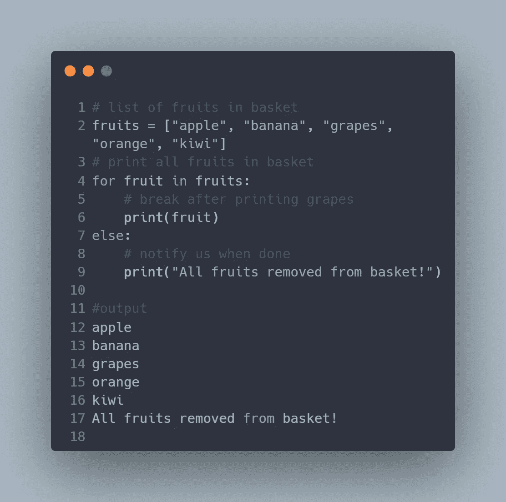

# Python 中的 For 循环

> 原文：<https://blog.devgenius.io/for-loops-in-python-77f54312a3c6?source=collection_archive---------16----------------------->

## 关于 Python for 循环的简短示例教程

## 介绍

在您的编程之旅中，您很快会遇到需要多次重复某个特定时间的情况。重复编写相同的代码是低效的。对于这样的任务，我们依赖于某种循环结构。循环使得在预定义的条件下重复特定的代码块变得容易。Python 有两种类型的循环 while 循环和 for 循环。在之前的教程中，你学习了 while 循环。本教程将向你介绍 for 循环，这是目前最流行的循环类型。


照片由[Tine ivani](https://unsplash.com/@tine999?utm_source=unsplash&utm_medium=referral&utm_content=creditCopyText)在 [Unsplash](https://unsplash.com/s/photos/loop?utm_source=unsplash&utm_medium=referral&utm_content=creditCopyText) 上拍摄

## **量程功能**

在深入 for 循环之前，让我们先讨论一下 Python 内置的 ***range()*** 函数，它通常与 for 循环一起使用。当您需要迭代一系列数字时，它会很方便。这个函数返回一个由 n 个数字组成的序列，默认情况下从 0 开始递增 1。它具有以下语法:

```
range(start, stop, step)
```

*其中:*

*   **是可选参数。它是一个整数，用于指定起点。默认值为 0。**
*   ***是必需参数。它是一个整数，指定序列将在哪里停止。它不包含在序列中。***
*   *****步骤*** *是另一个可选参数，指定归罪号，默认为 1。***

**例如，下面的代码将生成一个从零开始的 5 个数字的序列。**

```
**range(5) 
#output 
range(0,5)** 
```

**要检查序列的长度，我们可以使用 len 方法:**

```
**print(len(range(5))) #output 
5**
```

**我们可以使用 for 循环来打印 range 函数生成的序列。我们将很快讨论 for 循环的语法和细节。**

```
**for i in range(5):
    print(i)**
```

****

## **比较运算符**

**在使用 for 循环时，理解 Python 中不同的比较运算符也很重要。比较运算符提供了一种比较两个值并返回布尔值(真/假)的方法。Python 有以下比较运算符。**

****

**Python 比较运算符**

## **For 循环语法**

**现在您已经对 *range()* 函数有了基本的了解，并且熟悉了 python 的比较运算符，让我们回到我们对 for 循环的讨论。for 循环提供了一种迭代序列(如字符串、列表、元组或字典)的方法。它具有以下语法:**

```
**for var in iterable:
    statement(s)** 
```

***哪里:***

*   *****为*** *为关键词***
*   *****var*** *是一个用户自定义的迭代器，它从列表中一个接一个地取出条目***
*   *****iterable****:字符串、列表、元组等序列。***
*   ****语句(s** ): *构成循环体***

**您应该注意到语句是如何缩进来表示循环体的。此外，循环会一直运行，直到到达序列中的最后一个元素。**

**下面的流程图显示了 for 循环的逻辑:**

****

**For 循环流程图。来源: [pynative](https://pynative.com/python-for-loop/)**

**为了获得直觉，让我们想象你有一个装满水果的篮子，想把每个水果一个一个拿出来。所以，你写一个程序，在我们拿水果的时候打印出每个水果，直到没有水果。它看起来会像这样:**

```
**# list of fruits in basket
fruits = ["apple","banana","grapes","orange","kiwi"]
# print all fruits in basket 
for fruit in fruits:
    print(fruit)**
```

****

**简单的 for 循环打印篮子里的所有水果**

## **嵌套 for 循环**

**还可以在 for 循环中包含另一个 for 循环。这称为嵌套 for 循环。例如，假设您现在想要打印出组成每种水果名称的字母。我们将修改我们的代码如下:**

```
**# list of fruits in basket
fruits = ["apple","banana","grapes","orange","kiwi"]
# print all fruits in basket
for fruit in fruits:
    print(fruit)
    # print each letter in fruit name 
    for letter in fruit:
        print(letter)**
```

****

**嵌套 for 循环示例**

## **for 循环中的 Break 语句**

**类似于 [while 循环](/a-tutorial-on-python-while-loops-681f0a5e578c)，在 for 循环中使用 break 语句来立即退出循环。在 for 循环之后，程序照常继续运行。为了了解这是如何工作的，让我们修改前面的代码，在打印完葡萄后中断。**

```
**# list of fruits in basket
fruits = ["apple", "banana", "grapes", "orange", "kiwi"]
# print all fruits in basket
for fruit in fruits:
    print(fruit)
    # break after printing grapes
    if fruit == "grapes":
        break

# code after for loop
print("Exited loop!")**
```

****

**for 循环中的 Break 语句**

## **连续语句**

**continue 子句类似于 break 语句，因为它会中断 for 循环的流程。然而，与 break 语句不同，continue 语句并不完全存在于循环中。相反，它跳过循环的当前迭代，继续下一次迭代。让我们回到前面的例子，更改 break 继续查看输出是如何变化的。您将会注意到，为了实现这一点，我们必须将 print 语句放在 continue 语句之后。**

```
**# list of fruits in basket
fruits = ["apple", "banana", "grapes", "orange", "kiwi"]
# print all fruits in basket
for fruit in fruits:
    # break after printing grapes
    if fruit == "grapes":
        continue
    print(fruit)

# code after for loop
print("Exited for loop!")**
```

****

## **for 循环中的 Else 语句**

**在使用 if 语句时，您可能很熟悉 else 子句。Python 还允许在 for 循环中使用可选的 else 子句。只有当 for 循环通过穷举正常终止时，才会执行此操作。但是，如果循环由于 break 或 return 语句而提前终止，则它不会执行。我们可以使用 else 语句修改我们的水果代码，让我们知道什么时候所有的水果都已经从购物篮中取出。**

```
**# list of fruits in basket
fruits = ["apple", "banana", "grapes", "orange", "kiwi"]
# print all fruits in basket
for fruit in fruits:
    # break after printing grapes
    print(fruit)
else:
    # notify us when done
    print("All fruits removed from basket!")**
```

****

**for 循环中的 Else 语句**

**结论**

**我们现在已经到了教程的结尾。如果您遵循了这些示例，您现在应该对循环以及如何使用 else、break 和 continue 语句有了基本的了解。现在轮到你练习了。访问[这个网站](https://www.w3resource.com/python-exercises/python-conditional-statements-and-loop-exercises.php)获取你可以开始的练习列表。一如既往，最好的学习方法是实际练习做你想学的事情。**