# 对于非程序员:在 Excel 中建立一个自定义类别的财务跟踪器

> 原文：<https://blog.devgenius.io/for-non-programmers-build-a-finance-tracker-with-custom-categories-in-excel-3de96675ca69?source=collection_archive---------4----------------------->

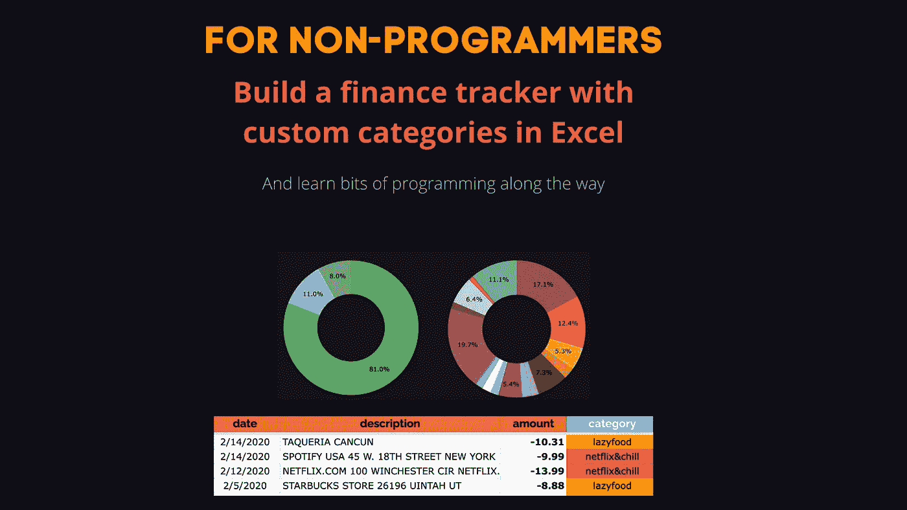

我试过很多预算应用程序来记录我的财务状况。

但是他们中很少有人有自定义类别。他们中的极少数也没有广告，没有出售我的财务数据，没有故障，实际上可以连接到我的银行，并把它们都带到一个地方。

没有编程知识也可以在 Excel 中为自己创建这样一个 app。

在本指南中，我将向您展示如何创建一个财务跟踪器，它可以根据关键字自动对您的交易进行分类。

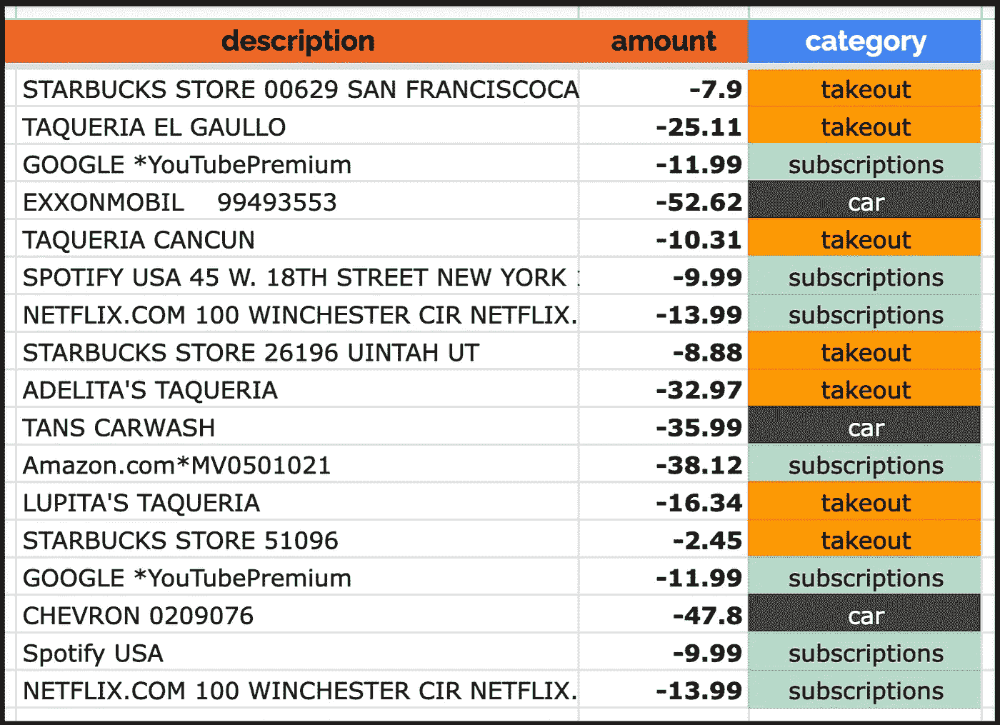

您可以添加完全自定义的类别。

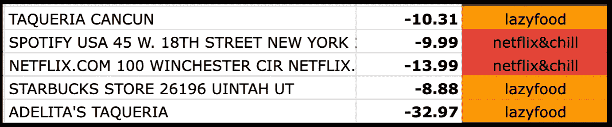

你可以有每月的，历史的观点，你可以过滤你的数据。完全自定义和可扩展。你可以根据自己的需要调整它。

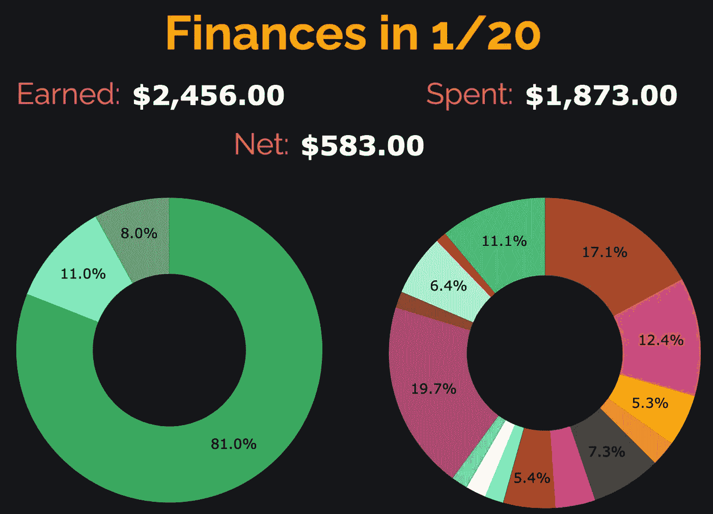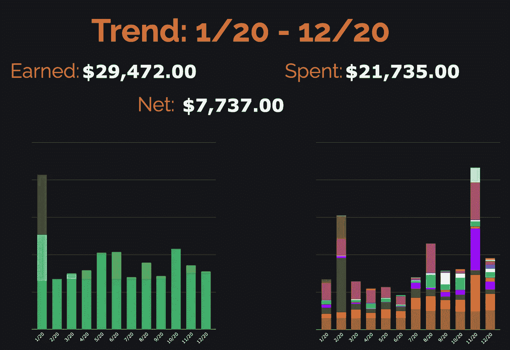

你可以在这个过程中学习一点编程。双赢。

**下面是这篇文章的提纲:**

*   将我们的交易输入谷歌表单
*   基于关键词构建自动分类器
*   理解编程中的函数是什么
*   将交易细节作为输入传递给函数
*   编写分类函数的核心内容
*   添加更多关键词和类别
*   自己完成分类程序
*   我们已经完成了分类程序

# 将我们的交易输入谷歌表单

我们实际上将使用谷歌表，因为我不是很熟悉 Excel😅。但应该和 Excel 相当类似。

首先，让我们创建一个 Google 工作表(您可以通过在地址栏中键入 [sheet.new](http://sheet.new) 来创建一个工作表)，并将一个工作表重命名为 *Transactions* 。

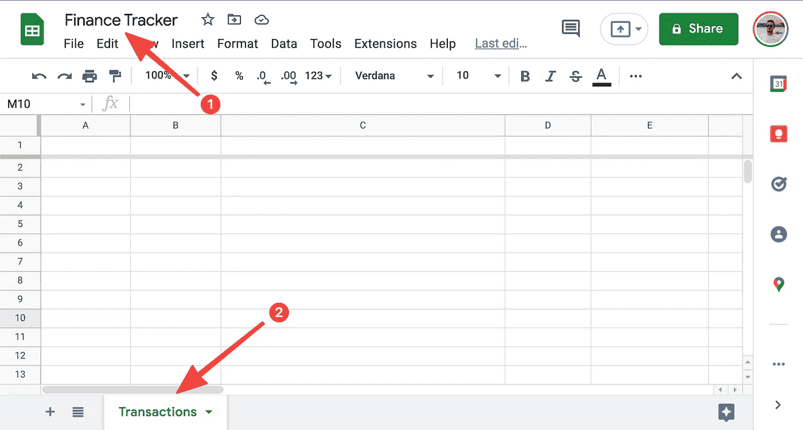

创建 4 个列标题:

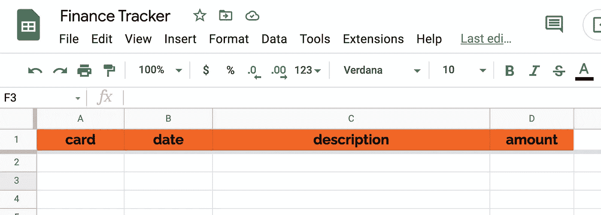

现在，我们准备将我们的交易上传到 Google Sheets。你通常可以从银行下载你所有交易的 CSV 文件。只需在谷歌上快速搜索一下，就可能给你指出下载交易的正确方向。然后，您可以像这样粘贴这些事务:

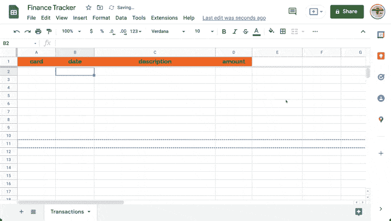

您可以按日期对所有交易进行排序，如下所示:

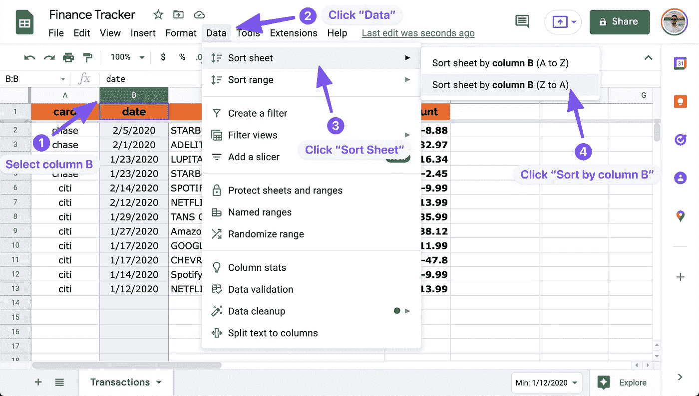

# 基于关键词构建自动分类器

现在我们的电子表格中已经有了所有的交易，我们想将每一笔交易分类如下:

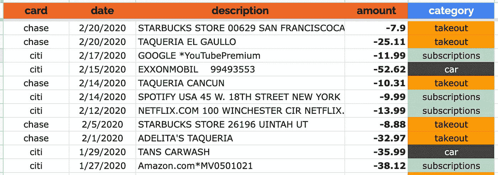

但是每笔交易都要手动完成，非常烦人，也非常耗时。因此，让我们建立一个机器人，它将根据关键字自动对我们的交易进行分类。例如，您可能希望将描述中包含单词“Starbucks”的所有交易归类为“外卖”，或将单词“网飞”归类为“预订”。

要创建我们的机器人，请点击`Extensions -> AppScript`。

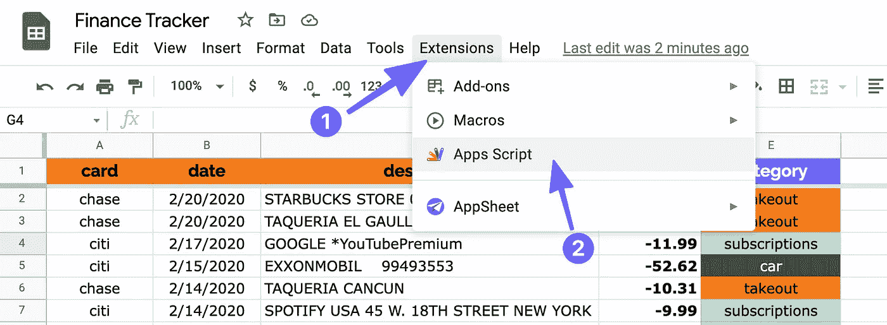

这将打开一个新屏幕，如下所示:

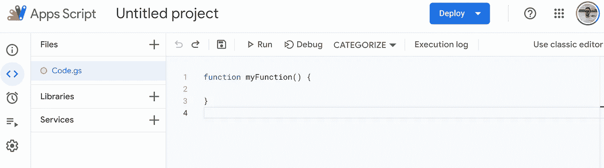

让我们来分析一下这个新屏幕的作用。

# 理解编程中的函数是什么

该屏幕用于为您的电子表格编写自定义“函数”。什么是函数？只是一些可重复使用的计算。例如，您可能已经在 Google Sheets 中使用了函数`SUM`。例如，当您编写`=SUM(A1:A5)`时，输出将是 A 列中 5 个数字的和:

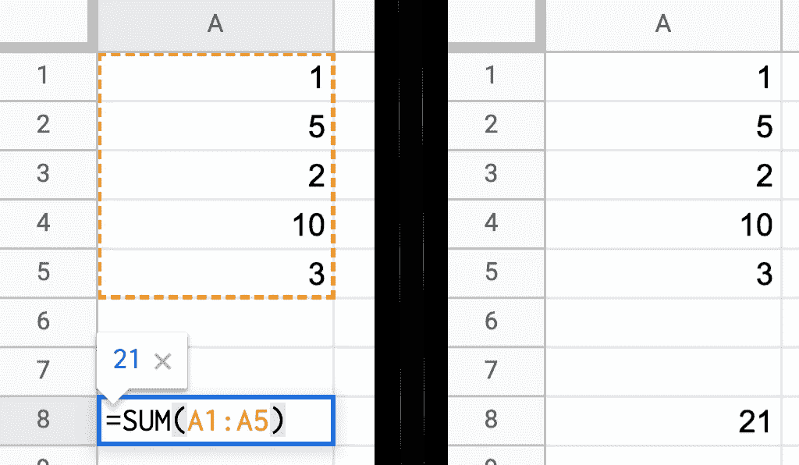

`SUM`在这种情况下只是一些可重复使用的计算。更具体地说，它计算给定数字的总和。您可以在任意多的地方重用这个函数。

我们可以在新的 AppScript 屏幕中创建自己的自定义函数，并在电子表格中使用它。让我们把我们的函数命名为 CATEGORIZE。继续把`myFunction`改成`CATEGORIZE`。

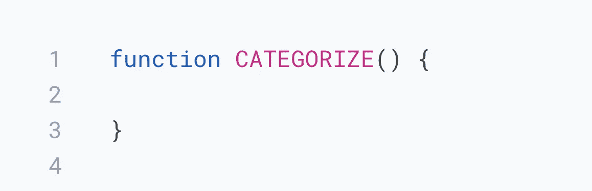

`SUM`功能的输出是其所有输入的总和。`CATEGORIZE`的输出应该是什么？这将取决于交易描述的关键字。但是现在，仅仅为了举例说明，让我们只让`CATEGORIZE`的输出总是`“takeout”`(不管是什么关键字)。

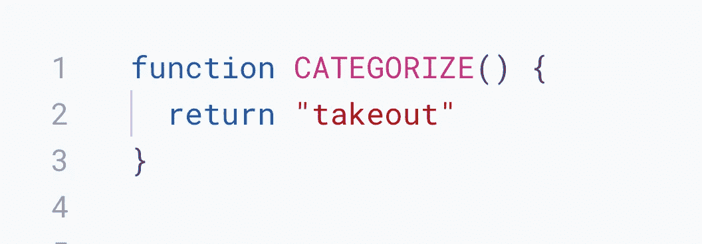

`return`只是告诉程序我们函数的输出应该是什么的一种方式。

在 Mac 上点击`COMMAND + S`(或者在 Windows 上点击`CTRL + S`)保存我们对功能的更改。现在我们可以在电子表格中使用新的自定义函数了。

为类别创建一个新列，编写 category()并按 enter 键对事务进行分类。您将看到它按照预期输出`“takeout”`。

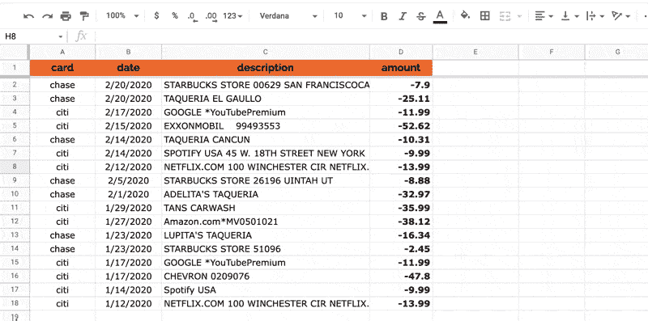

通过将输出值从`“takeout”`更改为其他值，尝试使用`CATEGORIZE`功能。保存该函数，并查看您的电子表格如何更新。

希望现在你明白什么是函数了。我们的`CATEGORIZE`函数在这一点上没有做太多。无论关键字是什么，它总是输出`“takeout”`。让我们解决这个问题，根据事务关键字对我们的事务进行分类。

# 将交易细节作为输入传递给函数

首先，我们需要知道`CATEGORIZE`函数的“输入”。将是所有的交易明细:`card`、`date`、`description`、`amount`。我们如何向我们的功能提供这些输入？通过像这样将单元格`A2:D2`传递给我们的函数:

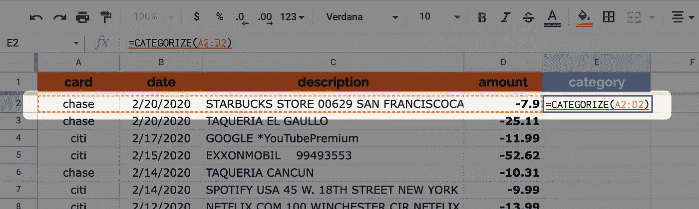

我们传入了卡、日期、描述和金额。现在，我们如何从函数内部读取这些提供的输入呢？像这样:

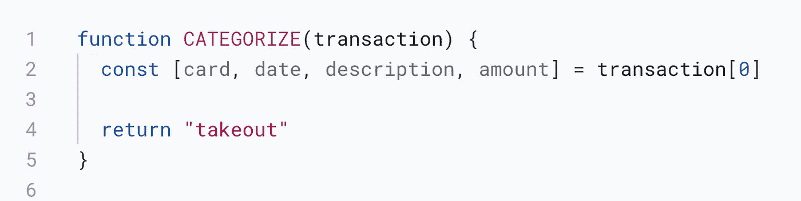

看起来很奇怪。但你不必在意。这样才行得通。如果你真的很好奇为什么会这样写，那就跟着我多了解编程吧。

现在谈谈分类逻辑。

# 编写分类函数的核心内容

现在，我们将交易细节作为函数的输入。我们的工作是为所提供的事务输出类别。为了对事务进行分类，我们将测试描述中是否有关键字。

这是您检查交易描述中是否有关键字“Starbucks”的方法。

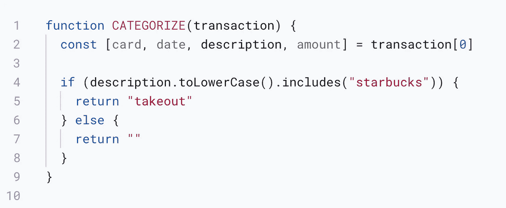

让我一行一行的解释。

*   首先是第 4 行的`if`条件。看起来是这样的如果(条件){
    在那种情况下我们该怎么办
    }

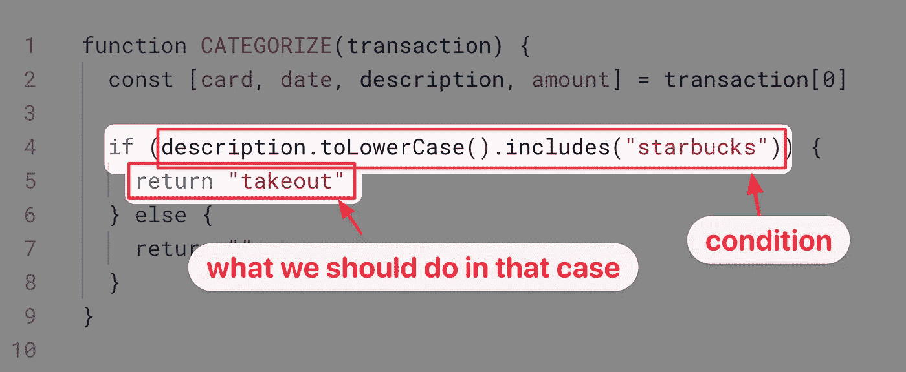

*   我们的条件看起来像`description.toLowerCase().includes(“starbucks”)`。我们首先将描述变成小写，这样我们的分类器就不区分大小写了。然后我们检查小写描述是否包含关键字`“starbucks”`。

1.  如果条件为真，那么我们函数的输出将为 `“takeout”`，否则将为空`“”`。

我知道这很难接受。但希望我没有失去你。您可以将单词`“starbucks”`更改为您想要使用的任何关键字，并将`“takeout”`更改为您想要的任何类别。然后点击 `COMMAND + S`(或`CTRL + S`)保存功能，并检查您的交易。`CATEGORIZE`功能是否达到了你的预期？

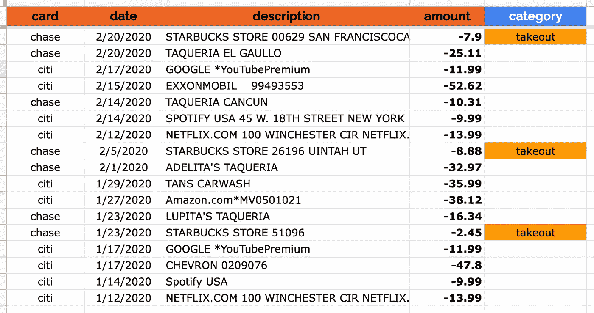

提示:您可以通过拖动单元格将分类功能应用于所有事务，如下所示:

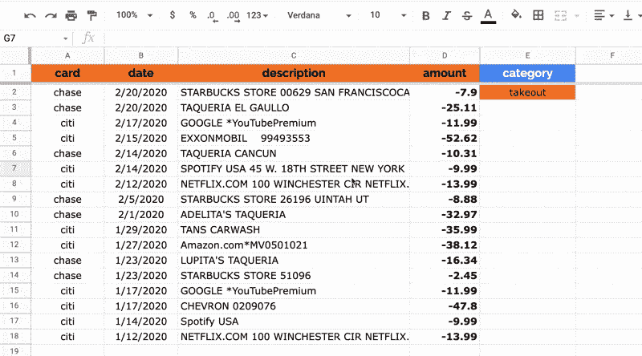

只需确保每一行都专门传递该行的事务细节。

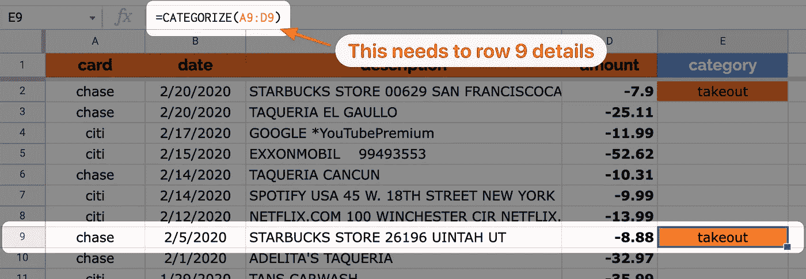

# 添加更多关键词和类别

如果我们的应用程序只对`Starbucks`进行分类，它就不会是一个非常有用的应用程序。让我们添加更多的关键字和更多的类别。你可以这样做:

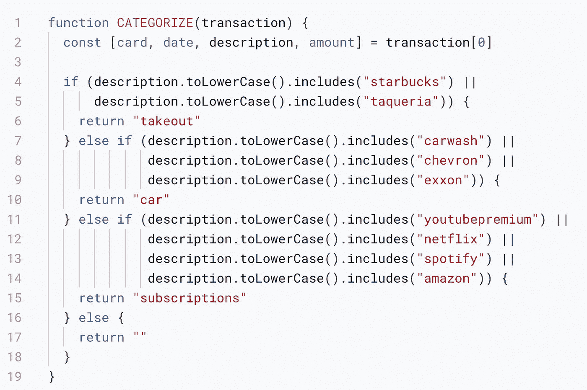

下面是您可以轻松复制/粘贴的相同代码:

希望这段代码做的事情有意义。和我们之前的很像。除了这个小符号`||`:

*   `||`是一个“或”运算符。它表示这个
    if(条件 1 或条件 2) {
    然后做这个

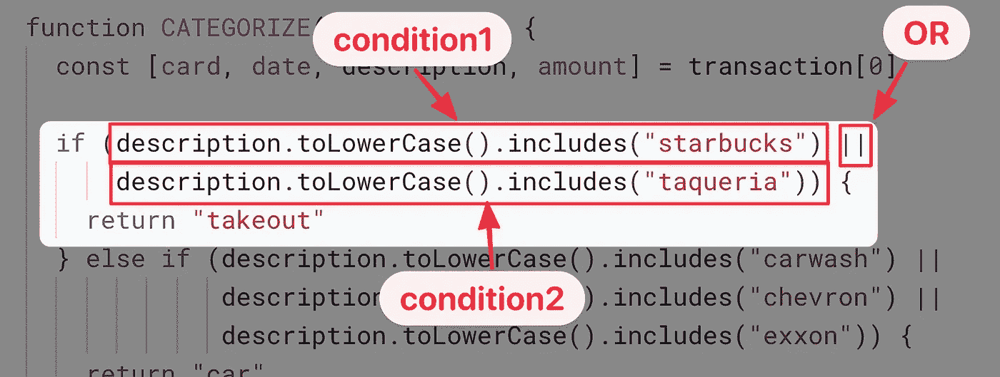

*   还有一个类似于`&&`的“与”运算符

代码看起来很复杂，但是如果你一行一行地读，就很简单了。保存代码并查看电子表格是如何更新的。

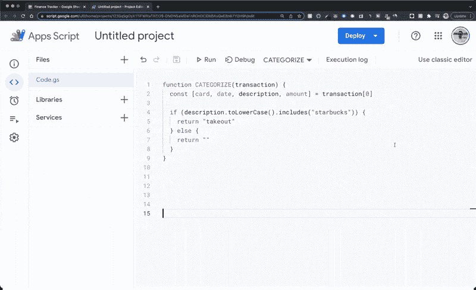

# 自己完成分类程序

让它适应你的需要。添加更多关键字和类别。

你甚至可以根据描述，也可以根据`card`、`date`、`amount`进行想象和分类。例如，下面是如何检查`amount`是否大于零

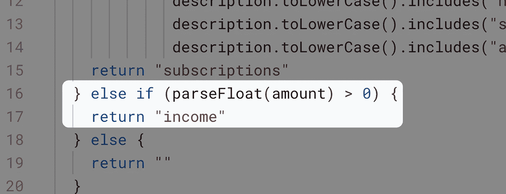

或者以下是如何检查交易是否来自某张卡:

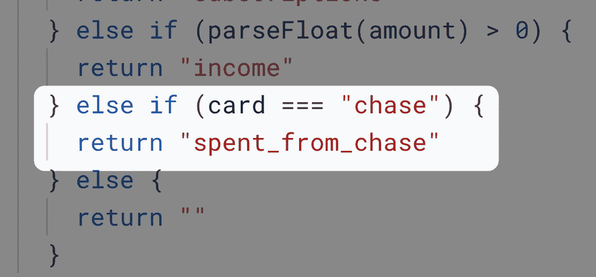

或者这里有一个更复杂的条件:

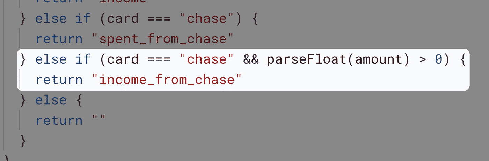

如果你有一个特定的条件，你想检查，留下评论，我会告诉你怎么做。

# 我们已经完成了分类程序

这是我们所做的总结。

*   我们将交易上传到电子表格中。
*   为交易类别创建了一个列，并使用了一个`CATEGORIZE`函数。我们将交易的细节作为输入传递给函数。
*   我们编写了一个名为`CATEGORIZE`的大函数，它接收交易细节作为输入，并根据关键字输出推断的类别。
*   我们将该函数应用于每一行(每一笔交易)。每一行都将提供输入，我们的函数将在这个特定的事务上运行，类别将被返回。下一行将进行完全相同的操作，但输入不同。这就是我所说的函数是“可重用的计算”

你可以在这里找到我在本教程中使用的谷歌表单[。](https://docs.google.com/spreadsheets/d/1BcfRQ1ESVVApUlmEdhFMMXK3Nj8dkyzdhqodk5Ua0e8/edit?usp=sharing)

我希望这篇文章有助于你创建自己的定制财务跟踪器，也有助于你涉足编程领域。编程可能看起来很可怕，但是当你一行一行地读的时候，它是简单明了的。(没有必要去揣摩言外之意😜)

这是关于构建我们的定制财务跟踪器的系列文章的第 1 部分。在接下来的部分，我们将添加图表和更多的视觉效果来形象化我们的消费习惯。

在 [Medium](https://medium.com/@nazar_ilamanov) 和 [Twitter](https://twitter.com/nazar_ilamanov) 上关注我，听听下一部何时上映。

```
**Want to Connect With the Author?** Follow me on [Twitter](https://twitter.com/nazar_ilamanov).
```