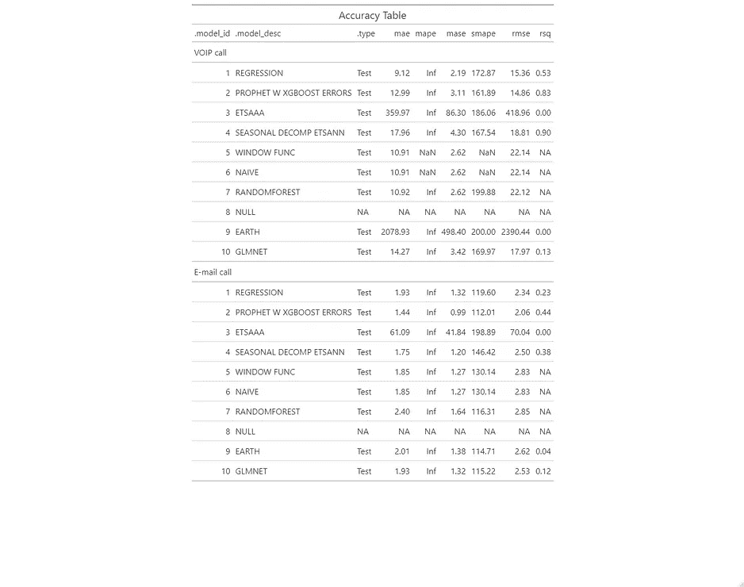
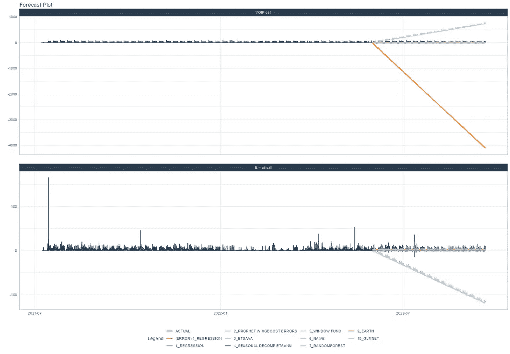

# 预估需水量

> 原文：<https://blog.devgenius.io/forecasting-demand-42c856ec8261?source=collection_archive---------2----------------------->

## 使用 timetk 和 modeltime 创建预测管道

这篇文章将着重于为一个需求问题建立一个预测管道。案例本身的细节已经在[这里](https://medium.com/mlearning-ai/understanding-the-patterns-of-a-demand-question-f5b34362249)和[这里](https://medium.com/mlearning-ai/understanding-the-patterns-of-a-demand-question-part-2-9eaaf17d890d)描述过了，所以重点只是向你展示如何构建它。管道的细节将严重依赖于 **timetk** 和 **modeltime** 包——后者类似于机器学习操作的完整生态系统。因此，只需搜索 **timetk** 和 **modeltime** 就可以找到更多的信息。目前，这篇博文只是另一个实际例子。

让我们开始吧。

```
## parallel computing ----
modeltime::parallel_start(6, .method = "parallel")
## Create data frame ----
TC_df<-df%>%
  dplyr::mutate(newdate = with(., ymd(Date) + hours(Hour)),
                RecordTpe = factor(RecordType))%>%
  #dplyr::mutate(newdate = with(., ymd(Date)))%>%
  group_by(RecordType, newdate)%>%
  filter(!RecordType %in% c("AgentState", "Callback call"))%>%
  filter(CallDirection=="Incoming" & 
           DoneInIVR==0 & AgentSequence==1)%>%
  count()%>%
  group_by(RecordType) %>%
  imputeTS::na_kalman(.) %>% 
  select(RecordType, newdate, n)%>%
  as_tsibble(key = RecordType, index = newdate) %>%
  fill_gaps(n = 0, .full = end())%>%
  as_tibble()%>%
  arrange(RecordType, newdate)%>%
  ungroup()%>%
  select(RecordType, newdate, n)
str(TC_df)
```

数据的结构是稳定的，这就足够了。由于这个管道围绕着 **tidyverse** 和 **tidymodels** 包，所以不需要创建 *ts* 或 timeseries 对象。因此，理论上你可以用管子把前面和后面连接起来。

以上我创建了 tibble，现在我将分裂它。

```
splits <- time_series_split(TC_df, 
                            assess = "8 week", 
                            cumulative = TRUE)
splits
<Analysis/Assess/Total>
<22446/3057/25503>

splits %>%
  tk_time_series_cv_plan() %>%
  plot_time_series_cv_plan(newdate, n,
                           .facet_ncol = 2,
                           .interactive = interactive)
```


蓝色是历史，红色是分裂——训练和测试。如果你读了关于这个案例研究的前两篇博客，你会发现实际上有两个时间序列混合在一起。靠近底部，你会看到对电子邮件的需求。然而，数据集和模型都不关心，所以我们可以按原样运行一切。

tidy 生态系统的另一个重要补充是使用了一个**食谱**——它真的像一个食谱一样工作。所以下面我首先分割数据，添加新的时间序列数据(分解变量，如日、周、月等。)，添加傅立叶变换，使所有虚拟变量标称化，并排除仅包含单个值的变量(零方差变量)。因此，**配方**类似于**插入符号**流水线的预处理阶段。

```
recipe_spec <- recipe(n ~ ., 
                      training(splits)) %>%
  step_timeseries_signature(newdate)%>%
  step_fourier(newdate, period = c(1/3,1/6,1/7,1/8,1/9,1/100), K = 1) %>%
  step_dummy(all_nominal())%>%
  step_zv()
summary(prep(recipe_spec))
# A tibble: 57 x 4
   variable          type    role      source  
   <chr>             <chr>   <chr>     <chr>   
 1 newdate           date    predictor original
 2 n                 numeric outcome   original
 3 newdate_index.num numeric predictor derived 
 4 newdate_year      numeric predictor derived 
 5 newdate_year.iso  numeric predictor derived 
 6 newdate_half      numeric predictor derived 
 7 newdate_quarter   numeric predictor derived 
 8 newdate_month     numeric predictor derived 
 9 newdate_month.xts numeric predictor derived 
10 newdate_day       numeric predictor derived 
```

我们现在可以用这个食谱开始烹饪，但在此之前，我们需要看看我们要用厨房的哪些部分，因此我想如何准备食物。这就是模型发挥作用的地方，同样，使用 tidy 生态系统几乎太容易了。事实上，建造这样一条管道会给你相当多的工程控制。但是你也不应该忘记深入研究模型。下面，你可以看到我准备从 ARIMA 到随机森林模型的几个模型。为了简洁起见，我将只使用标准函数，让额外的信息来自食谱本身。

```
model_fit_arima_no_boost <- arima_reg() %>%
  set_engine(engine = "auto_arima") 
model_fit_arima_boosted <- arima_boost(
  min_n = 2,
  learn_rate = 0.015) %>%
  set_engine(engine = "auto_arima_xgboost") 
model_fit_ets <- exp_smoothing() %>%
  set_engine(engine = "ets")
model_spec_prophet <- prophet_reg() %>%
  set_engine("prophet")
model_spec_prophet_boost <- prophet_boost() %>%
  set_engine("prophet_xgboost", yearly.seasonality = TRUE) 
model_fit_lm <- linear_reg() %>%
  set_engine("lm") 
model_spec_mars <- mars(mode = "regression") %>%
  set_engine("earth") 
model_spec_glmnet <- linear_reg(penalty = 0.01, mixture = 0.5) %>%
  set_engine("glmnet")
model_spec_rf <- rand_forest(trees = 500, min_n = 20) %>%
  set_engine("randomForest")
```

现在，我已经指定了我的模型，我可以列出它们，我选择了其中的四个。

```
models <- list(ets = model_fit_ets,
               prophet_boost=model_spec_prophet_boost,
               rf=model_spec_rf,
               mars=model_spec_mars)
$ets
Exponential Smoothing State Space Model Specification (regression)

Computational engine: ets 

$prophet_boost
PROPHET Regression Model Specification (regression)

Engine-Specific Arguments:
  yearly.seasonality = TRUE

Computational engine: prophet_xgboost 

$rf
Random Forest Model Specification (unknown)

Main Arguments:
  trees = 500
  min_n = 20

Computational engine: randomForest 

$mars
MARS Model Specification (regression)

Computational engine: earth
```

通过指定模型并将它们连接成一组，我可以创建一个工作流。如果你仔细看开头，你会看到我正在建立一个并行计算系统。该系统现在将发挥作用，事实上它承认我将六个核心归因于这些模型的分析。

```
model_set <- workflow_set(list(recipe_spec), 
                          models, 
                          cross = TRUE)

control_fit_workflowset(
  verbose   = TRUE,
  allow_par = TRUE)
workflowset control object
--------------------------
allow_par : TRUE 
cores     : 6 
verbose   : TRUE 
packages  : modeltime parsnip workflows dplyr stats lubridate tidymodels timetk rsample recipes yardstick dials tune doParallel parallel iterators foreach gt modeltime.ensemble modeltime.resample workflowsets tidyr tibble purrr modeldata infer scales broom forecast fable fabletools tsibble data.table ggplot2 DataExplorer readr graphics grDevices utils datasets methods base

# A workflow set/tibble: 4 x 4
  wflow_id             info             option    result    
  <chr>                <list>           <list>    <list>    
1 recipe_ets           <tibble [1 x 4]> <opts[0]> <list [0]>
2 recipe_prophet_boost <tibble [1 x 4]> <opts[0]> <list [0]>
3 recipe_rf            <tibble [1 x 4]> <opts[0]> <list [0]>
4 recipe_mars          <tibble [1 x 4]> <opts[0]> <list [0]>
```

现在是时候将一切结合起来，让工作流在训练集上运行。每次都要检查模型是否真的运行，这一点很重要。

```
model_parallel_tbl <- model_set %>%
  modeltime_fit_workflowset(
    data    = training(splits),
    control = control_fit_workflowset(
      verbose   = TRUE,
      allow_par = TRUE
    )
  )

# Modeltime Table
# A tibble: 4 x 3
  .model_id .model     .model_desc         
      <int> <list>     <chr>               
1         1 <workflow> RECIPE_ETS          
2         2 <workflow> RECIPE_PROPHET_BOOST
3         3 <workflow> RECIPE_RF           
4         4 <workflow> RECIPE_MARS 
```

和大多数事情一样，我们可以使用滑动窗口来应用交叉验证。在这里，我指定前 30 周是训练数据，每个新窗口包含接下来的两周，其中一周被评估。总共做了 44 片。

```
resamples_tscv <-timetk::time_series_cv(TC_df, 
                                        initial="30 weeks",
                                        skip= "1 week",
                                        asses = "1 week", 
                                        cumulative=FALSE)
# Time Series Cross Validation Plan 
# A tibble: 44 x 2
   splits              id     
   <list>              <chr>  
 1 <split [10281/504]> Slice01
 2 <split [10113/504]> Slice02
 3 <split [10080/369]> Slice03
 4 <split [10080/336]> Slice04
 5 <split [10080/336]> Slice05
 6 <split [10080/336]> Slice06
 7 <split [10080/336]> Slice07
 8 <split [10080/336]> Slice08
 9 <split [10080/336]> Slice09
10 <split [10080/336]> Slice10
# ... with 34 more rows

resamples_tscv  %>%
  tk_time_series_cv_plan() %>%
  plot_time_series_cv_plan(newdate, n, .facet_ncol = 2, .interactive = FALSE)
```

我现在可以在这些切片上运行模型，并评估每个切片的模型表现如何。我要寻找的是模型破坏其性能的点。

```
resamples_fitted <- model_parallel_tbl %>%
  modeltime_fit_resamples(
    resamples = resamples_tscv,
    control   = control_resamples(verbose = FALSE))

# Modeltime Table
# A tibble: 4 x 4
  .model_id .model     .model_desc          .resample_results
      <int> <list>     <chr>                <list>           
1         1 <workflow> RECIPE_ETS           <rsmp[+]>        
2         2 <workflow> RECIPE_PROPHET_BOOST <rsmp[+]>        
3         3 <workflow> RECIPE_RF            <rsmp[x]>        
4         4 <workflow> RECIPE_MARS          <rsmp[x]> 

resamples_fitted %>%
  plot_modeltime_resamples(
    .point_size  = 3, 
    .point_alpha = 0.8,
    .interactive = FALSE) 
```


似乎 ETS 和 Prophet 模型是唯一成功的模型——不确定随机森林和样条(火星)模型发生了什么，但现在我们不应该担心。如您所见，MAPE 指标没有填满，这很好，因为在某些时间点我们没有任何数据。这是间歇性需求数据，MAPE 也应如此使用。

从上面可以清楚地看出，在制作的切片上，精度测量值肯定是不相同的。每当这种情况发生时，这可能意味着模型遇到了他们不确定如何处理的模式，也可能意味着模型通常不擅长处理两周水平的数据。我不确定是否诚实。

从这些重采样中，我们可以得到一个精度表，通过它可以对所有切片的值进行平均。Prophet 模型明显优于 ETS 模型[，这并不奇怪](https://medium.com/mlearning-ai/understanding-the-patterns-of-a-demand-question-part-2-9eaaf17d890d)。

```
accuracy_resamples<-resamples_fitted %>%
  modeltime_resample_accuracy(summary_fns = mean)
 accuracy_resamples
# A tibble: 2 x 10
  .model_id .model_desc          .type         n   mae  mape  mase smape  rmse   rsq
      <int> <chr>                <chr>     <int> <dbl> <dbl> <dbl> <dbl> <dbl> <dbl>
1         1 RECIPE_ETS           Resamples    44 12.9    Inf 1.28   159\. 15.3  0.186
2         2 RECIPE_PROPHET_BOOST Resamples    44  2.44   Inf 0.243  142\.  4.73 0.881
```

从原始表中，我们还可以得到一个校准表，其中将包括预测的不确定性。由于我们已经根据来电类型(VOIP 或电子邮件)对表格进行了分组，我们可以根据*记录类型*要求单独的校准表格。随机森林和火星模型继续失败，我怀疑这与我如何建立食谱有关。我遇到的一件事，也是很好记住的一件事，就是每个模型都有它的优点、缺点、假设和特别的需求。因此，为每一个模型创建单独的方法并不是一个坏主意，这样可以充分利用每一个模型的优点，防止出错。请记住，所有这些都发生在测试数据上，而不是训练数据上。

```
calib_tbl <- model_parallel_tbl %>%
  modeltime_calibrate(
    new_data = testing(splits), 
    id       = "RecordType")

# Modeltime Table
# A tibble: 4 x 5
  .model_id .model     .model_desc          .type .calibration_data   
      <int> <list>     <chr>                <chr> <list>              
1         1 <workflow> RECIPE_ETS           Test  <tibble [3,057 x 5]>
2         2 <workflow> RECIPE_PROPHET_BOOST Test  <tibble [3,057 x 5]>
3         3 <workflow> RECIPE_RF            NA    <lgl [1]>           
4         4 <workflow> RECIPE_MARS          Test  <tibble [3,057 x 5]>

model_accuracy<-
  calib_tbl %>%
  modeltime_accuracy(acc_by_id = TRUE)

# A tibble: 8 x 10
  .model_id .model_desc          .type RecordType    mae  mape   mase smape  rmse      rsq
      <int> <chr>                <chr> <chr>       <dbl> <dbl>  <dbl> <dbl> <dbl>    <dbl>
1         1 RECIPE_ETS           Test  Chat call   12.0    Inf 14.6    183\. 13.7   0.00113
2         1 RECIPE_ETS           Test  E-mail call  7.92   Inf  5.01   142\.  9.19  0.00690
3         1 RECIPE_ETS           Test  VOIP call   16.6    Inf  4.11   164\. 18.9   0.0583 
4         2 RECIPE_PROPHET_BOOST Test  Chat call    2.06   Inf  2.51   184\.  3.05  0.148  
5         2 RECIPE_PROPHET_BOOST Test  E-mail call  1.51   Inf  0.957  130\.  2.12  0.547  
6         2 RECIPE_PROPHET_BOOST Test  VOIP call    2.36   Inf  0.584  150\.  3.86  0.958  
7         3 RECIPE_RF            NA    NA          NA       NA NA       NA  NA    NA      
8         4 RECIPE_MARS          Test  NA          NA       NA NA       NA  NA    NA 
```

我们现在准备在测试集上绘制预测。

```
calib_tbl %>%
  modeltime_forecast(
    new_data    = testing(splits),
    actual_data = TC_df,
    conf_by_id  = TRUE
  ) %>%
  group_by(RecordType) %>%
  plot_modeltime_forecast(
    .facet_ncol  = 1,
    .interactive = FALSE)
```


不能说这个输出真的有用。我也不能说这些模型做得很好——尽管采用了一些模式，但就需求预测而言，对 VOIP 的预测远远没有达到应有的水平。

最后但同样重要的是，我们可以在整个数据集上应用模型，并预测未来。

```
refit_tbl <- calib_tbl %>%
  modeltime_refit(data = TC_df)
# Modeltime Table
# A tibble: 4 x 5
  .model_id .model     .model_desc          .type .calibration_data   
      <int> <list>     <chr>                <chr> <list>              
1         1 <workflow> UPDATE: ETS(A,N,A)   Test  <tibble [3,057 x 5]>
2         2 <workflow> RECIPE_PROPHET_BOOST Test  <tibble [3,057 x 5]>
3         3 <workflow> RECIPE_RF            NA    <lgl [1]>           
4         4 <workflow> RECIPE_MARS          Test  <tibble [3,057 x 5]>
```

```
future_tbl <- TC_df %>%
  group_by(RecordType) %>%
  future_frame(.length_out = 336, .bind_data = FALSE)

# A tibble: 1,008 x 2
# Groups:   RecordType [3]
   RecordType newdate            
   <chr>      <dttm>             
 1 Chat call  2022-12-13 18:00:00
 2 Chat call  2022-12-13 19:00:00
 3 Chat call  2022-12-13 20:00:00
 4 Chat call  2022-12-13 21:00:00
 5 Chat call  2022-12-13 22:00:00
 6 Chat call  2022-12-13 23:00:00
 7 Chat call  2022-12-14 00:00:00
 8 Chat call  2022-12-14 01:00:00
 9 Chat call  2022-12-14 02:00:00
10 Chat call  2022-12-14 03:00:00

refit_tbl %>%
  modeltime_forecast(
    new_data    = future_tbl,
    actual_data = TC_df, 
    conf_by_id  = TRUE
  ) %>%
  group_by(RecordType) %>%
  plot_modeltime_forecast(
    .interactive = F,
    .facet_ncol  = 1
  )
```


清楚地表明一些模型不能胜任这项任务。

尽管建立预测渠道很容易，但这个案例也表明，仅仅使用标准的模型设置来模拟需求是多么的危险和简单。 **tidy** 生态系统在包括时间序列建模和预测的各种基本方面方面非常出色，但重要的是你也要使用它们。而不是只专注于应用随机森林、Xgboost 或 Prophet 等最新的机器学习模型。

## 嵌套数据

在第二部分中，我想通过使用 **modeltime** 包的嵌套函数来重复并扩充第一部分。许多你以前见过的东西你将会再次看到，但最大的不同是，这些模型是针对每种*记录类型*——VOIP 电话或电子邮件单独运行的。

```
TC_df<-df%>%
  #dplyr::mutate(newdate = with(., ymd(Date) + hms(QuarterHour)),
                #RecordTpe = factor(RecordType))%>%
  dplyr::mutate(newdate = with(., ymd(Date) + hours(Hour)),
                RecordTpe = factor(RecordType))%>%
  group_by(RecordType, newdate)%>%
  filter(!RecordType %in% c("AgentState", "Callback call"))%>%
  filter(CallDirection=="Incoming" & 
           DoneInIVR==0 & AgentSequence==1)%>%
  count()%>%
  group_by(RecordType) %>%
  imputeTS::na_kalman(.) %>% 
  select(RecordType, newdate, n)%>%
  as_tsibble(key = RecordType, index = newdate) %>%
  fill_gaps(n = 0, .full = end())%>%
  as_tibble()%>%
  arrange(RecordType, newdate)%>%
  ungroup()%>%
  select(RecordType, newdate, n)
str(TC_df)
### Create holiday dataset ----
holiday<-c("Nieuwjaarsdag", "Goedevrijdag", "Paasdag1", "Paasdag2",
           "Koningsdag","Bevrijdsdag","Hemelvaartsdag","Pinksteren1", "Pinkesteren2",
           "Kerstmis1", "Kerstmis2", "Oudjaarsdag")
ds<-c(as.Date('2022-01-01'),
      as.Date('2022-04-15'),
      as.Date('2022-04-17'),
      as.Date('2022-04-18'),
      as.Date('2022-04-27'),
      as.Date('2022-05-05'),
      as.Date('2022-05-26'),
      as.Date('2022-06-05'),
      as.Date('2022-06-06'),
      as.Date('2022-12-25'),
      as.Date('2022-12-26'),
      as.Date('2022-12-31'))
lower_window<-rep(0,12)
upper_window<-rep(1,12)
holidays <- dplyr::bind_cols(holiday, ds, lower_window, upper_window)
colnames(holidays)<-c("holiday", "ds", "lower_window", "upper_window")
holidays

### Create nested dataset with splits ----
nested_data_tbl <- TC_df %>%
  extend_timeseries(
    .id_var        = RecordType,
    .date_var      = newdate,
    .length_future = 24*7*4) %>% # predicting a month ahead
  nest_timeseries(
    .id_var        = RecordType,
    .length_future = 4*24*7*4) %>%
  split_nested_timeseries(
    .length_test = 4*24*7*4)
nested_data_tbl
# A tibble: 2 x 4
  RecordType  .actual_data          .future_data         .splits            
  <chr>       <list>                <list>               <list>             
1 VOIP call   <tibble [10,563 x 2]> <tibble [2,688 x 2]> <split [7875|2688]>
2 E-mail call <tibble [10,539 x 2]> <tibble [2,688 x 2]> <split [7851|2688]>
```

此外，我会告诉你更多你可以做的食谱。老实说，他们时不时地让我几乎发疯。尽管提供了巨大的自由度，但是为不同的模型制作不同的配方也意味着你并不总是能确定为什么一个模型会以这样的方式运行。在建模中，预处理对实际模型的影响很大，甚至更大。

```
rec_none<- recipe(n ~ newdate, 
                         extract_nested_train_split(nested_data_tbl))

rec_diff<- test<-recipe(n ~ newdate, 
                  extract_nested_train_split(nested_data_tbl))%>%
  step_diff(n)

rec_timesignature<- recipe(n ~ newdate, 
                  extract_nested_train_split(nested_data_tbl))%>%
  step_timeseries_signature(newdate)%>%
  step_corr()

rec_boxcox<- recipe(n ~ newdate, 
                             extract_nested_train_split(nested_data_tbl))%>%
  step_BoxCox(n)

rec_harmonic<- recipe(n ~ newdate, 
                           extract_nested_train_split(nested_data_tbl))%>%
  step_timeseries_signature(newdate)%>%
  step_harmonic(newdate, frequency = 1, cycle_size = 24*365.24)

rec_fourier<- recipe(n ~ newdate, 
                      extract_nested_train_split(nested_data_tbl))%>%
  step_timeseries_signature(newdate)%>%
  step_fourier(newdate, period = c(9,45), K = 4) %>%
  step_dummy(all_nominal())%>%
  step_zv()%>%
  step_corr()

rec_xgb <- recipe(n ~ ., extract_nested_train_split(nested_data_tbl)) %>%
  step_timeseries_signature(newdate) %>%
  step_harmonic(newdate, frequency = 1, cycle_size = 24*365.24)%>%
  step_rm(newdate) %>%
  step_zv(all_predictors()) %>%
  step_dummy(all_nominal_predictors(), 
             one_hot = TRUE) 

recipe_mars <- recipe(n ~ newdate, 
                      extract_nested_train_split(nested_data_tbl)) %>%
  step_timeseries_signature(newdate)%>%
  step_rm(newdate)

recipe_glmnet <- recipe(n ~ newdate, 
                        extract_nested_train_split(nested_data_tbl)) %>%
  step_timeseries_signature(newdate) %>%
  step_rm(matches("(.iso$)|(.xts$)")) %>%
  step_normalize(matches("(index.num$)|(_year$)")) %>%
  step_harmonic(newdate, frequency = 1, cycle_size = 24*365.24)%>%
  step_dummy(all_nominal())
```

因为我们可以构建单独的配方，所以我们也可以构建单独的工作流程。通常，一个工作流包括首先添加一个模型，然后添加一个配方。我可以从我已经做好的食谱中选择。从这个意义上说，工作流就像运行一个作业。

```
wflw_arima<- workflow() %>%
  add_model(
    arima_reg() %>%
      set_engine("auto_arima")) %>%
  add_recipe(rec_diff)

wflw_prophet <- workflow() %>%
  add_model(
    prophet_boost() %>%
      set_engine("prophet_xgboost", 
                 yearly.seasonality = FALSE, 
                 holidays = holidays
                 )) %>%
  add_recipe(rec_fourier)

== Workflow ======================================================================================================
Preprocessor: Recipe
Model: prophet_boost()

-- Preprocessor --------------------------------------------------------------------------------------------------
5 Recipe Steps

* step_timeseries_signature()
* step_fourier()
* step_dummy()
* step_zv()
* step_corr()

-- Model ---------------------------------------------------------------------------------------------------------
PROPHET Regression Model Specification (regression)

Engine-Specific Arguments:
  yearly.seasonality = FALSE
  holidays = holidays

Computational engine: prophet_xgboost 

wflw_smooth<- workflow() %>%
  add_model(exp_smoothing(
    seasonal_period  = 24*7,
    error            = "multiplicative",
    trend            = "multiplicative",
    season           = "multiplicative") %>%
    set_engine("smooth_es")) %>%
  add_recipe(rec_none)

wflw_croston<- workflow() %>%
  add_model(exp_smoothing(
    smooth_level = 0.2) %>%
    set_engine("croston")) %>%
  add_recipe(rec_fourier)

wflw_seasonal<- workflow() %>%
  add_model(
    seasonal_reg(seasonal_period_1 = 24,
                 seasonal_period_2 = 24*7) %>% 
      set_engine("stlm_ets")) %>%
  add_recipe(rec_none)

wflw_window<- workflow() %>%
  add_model(
    window_reg(window_size=4*24) %>% 
      set_engine( engine          = "window_function",
                  window_function = median,
                  na.rm           = TRUE)) %>%
  add_recipe(rec_fourier)

wflw_snaive<- workflow() %>%
  add_model(
    naive_reg(
      seasonal_period = c(96,672) %>% # per hour, per day and per week 
      set_engine("snaive")))%>%
  add_recipe(rec_fourier)

wflw_rf <- workflow() %>%
  add_model(rand_forest(trees = 500, min_n = 20) %>%
              set_engine("randomForest")) %>%
  add_recipe(rec_none)  

wflw_nnetar <- workflow() %>%
  add_model(nnetar_reg() %>%
              set_engine("nnetar")) %>%
  add_recipe(rec_timesignature)

wflw_xgb <- workflow() %>%
  add_model(boost_tree("regression") %>% set_engine("xgboost")) %>%
  add_recipe(rec_xgb)

wflw_mars <- workflow() %>%
  add_model(
    mars(mode = "regression") %>%
      set_engine("earth")) %>%
  add_recipe(recipe_mars)

wflw_glmnet <- workflow() %>%
  add_model(linear_reg(
    mixture = 0.9,
    penalty = 4.36e-6) %>%
      set_engine("glmnet")) %>%
  add_recipe(recipe_glmnet)

== Workflow ======================================================================================================
Preprocessor: Recipe
Model: linear_reg()

-- Preprocessor --------------------------------------------------------------------------------------------------
5 Recipe Steps

* step_timeseries_signature()
* step_rm()
* step_normalize()
* step_harmonic()
* step_dummy()

-- Model ---------------------------------------------------------------------------------------------------------
Linear Regression Model Specification (regression)

Main Arguments:
  penalty = 4.36e-06
  mixture = 0.9

Computational engine: glmnet 
```

这些工作流可以组合成一个模型表，然后应用于嵌套数据集。

```
nested_modeltime_tbl <- modeltime_nested_fit( 
  nested_data = nested_data_tbl,
  wflw_arima,
  wflw_prophet,
  wflw_smooth,
  wflw_seasonal,
  wflw_window,
  wflw_snaive,
  wflw_rf,
  wflw_xgb,
  wflw_mars,
  wflw_glmnet)

# Nested Modeltime Table
  Trained on: .splits | Model Errors: [1]
# A tibble: 2 x 5
  RecordType  .actual_data          .future_data         .splits             .modeltime_tables      
  <chr>       <list>                <list>               <list>              <list>                 
1 VOIP call   <tibble [10,563 x 2]> <tibble [2,688 x 2]> <split [7875|2688]> <mdl_time_tbl [10 x 5]>
2 E-mail call <tibble [10,539 x 2]> <tibble [2,688 x 2]> <split [7851|2688]> <mdl_time_tbl [10 x 5]> 
```

上面你可以非常清楚地看到实际数据有多大，未来数据有多大，分割有多大，以及我在评估中包括了多少个模型。所有这些将导致一个表格，在该表格中对每个*记录类型*的每个模型进行评估。首先要检查的是你是否遇到了错误。当然，我们有——增强的 treee 模型没有运行。所以这种模式已经过时了。在此基础上，我们可以开始评估两个时间序列中每个模型的准确性

```
nested_modeltime_tbl %>% 
  extract_nested_error_report()

# A tibble: 2 x 4
  RecordType  .model_id .model_desc .error_desc
  <chr>           <int> <chr>       <chr>      
1 VOIP call           8 BOOST_TREE  ""         
2 E-mail call         8 BOOST_TREE  ""

nested_modeltime_tbl %>% 
  extract_nested_test_accuracy() %>%
  group_by(RecordType) %>%
  table_modeltime_accuracy(.interactive = FALSE) 

nested_modeltime_tbl %>% 
  extract_nested_test_forecast() %>%
  group_by(RecordType) %>%
  plot_modeltime_forecast(
    .facet_ncol  = 1,
    .interactive = FALSE,
    .conf_interval_show = FALSE)
```



左侧是精度表，右侧是通过将模型预测叠加到实际数据上绘制的精度。有些模特似乎真的迷失了方向。

从上表中，我们可以为每个时间序列选择最佳模型。看起来 boosted Prophect 模型是最好的。然后，我们可以检查该模型的图形外观——它是否很好地符合它所使用的数据？

```
best_nested_modeltime_tbl <- nested_modeltime_tbl %>%
  modeltime_nested_select_best(
    metric                = "rmse", 
    minimize              = TRUE, 
    filter_test_forecasts = TRUE)
best_nested_modeltime_tbl %>%
  extract_nested_best_model_report()

# Nested Modeltime Table
  Trained on: .splits | Model Errors: [1]
# A tibble: 2 x 10
  RecordType  .model_id .model_desc              .type   mae  mape  mase smape  rmse   rsq
  <chr>           <int> <chr>                    <chr> <dbl> <dbl> <dbl> <dbl> <dbl> <dbl>
1 VOIP call           2 PROPHET W XGBOOST ERRORS Test  13.0    Inf 3.11   162\. 14.9  0.831
2 E-mail call         2 PROPHET W XGBOOST ERRORS Test   1.44   Inf 0.988  112\.  2.06 0.444

best_nested_modeltime_tbl %>%
  extract_nested_test_forecast() %>%
  group_by(RecordType) %>%
  plot_modeltime_forecast(
    .facet_ncol  = 1,
    .interactive = FALSE,
    .conf_interval_show = FALSE) 
```


我不能说它有——一点也没有！

让我们看看如果我们重新调整整个数据集和预测的数据会发生什么。我想我知道会发生什么，但我会祈祷好运(顺便说一句，这是建模师的坏习惯)。

```
nested_modeltime_refit_tbl <- best_nested_modeltime_tbl %>%
  modeltime_nested_refit(
    control = control_nested_refit(verbose = TRUE))

i [1/2] Starting Modeltime Table: ID VOIP call...
√ Model 2 Passed PROPHET W/ XGBOOST ERRORS.
√ [1/2] Finished Modeltime Table: ID VOIP call

i [2/2] Starting Modeltime Table: ID E-mail call...
√ Model 2 Passed PROPHET W/ XGBOOST ERRORS.
√ [2/2] Finished Modeltime Table: ID E-mail call

Finished in: 12.83333 secs. 
```

```
nested_modeltime_refit_tbl %>%
  extract_nested_future_forecast() %>%
  group_by(RecordType) %>%
  plot_modeltime_forecast(
    .interactive = FALSE,
    .facet_ncol  = 2,
    .conf_interval_show = FALSE)
```


这两个时间序列都有所回升，但没有达到应有的水平。

预测时要做的最好的事情之一是运行多个模型，并让它们相互补充——就像让一组玩家一起工作一样。这并不完全是集成的工作方式(集成在事后合并信息，而不是在过程本身)，但它的表现优于单个模型。所以我们应该试一试——尤其是考虑到我们正在处理的棘手的需求模式。

```
nested_ensemble_1_tbl <- nested_modeltime_tbl %>%
  ensemble_nested_average(
    type           = "mean", 
    keep_submodels = TRUE)
nested_ensemble_1_tbl %>% 
  extract_nested_test_accuracy() %>%
  group_by(RecordType) %>%
  table_modeltime_accuracy(.interactive = FALSE)
```


这里的集合肯定不会超过单一模型，而且永远也不可能——因为它使用平均值来平均它被吸引向表现糟糕的地球模型。

我们可以把上面的表格再放在下面。

```
accuracy_rmse<-nested_ensemble_1_tbl %>% 
extract_nested_test_accuracy()
accuracy_rmse%>%print(n=22)
# A tibble: 22 x 10
   RecordType  .model_id .model_desc                 .type     mae  mape    mase smape    rmse      rsq
   <chr>           <dbl> <chr>                       <chr>   <dbl> <dbl>   <dbl> <dbl>   <dbl>    <dbl>
 1 E-mail call         1 "REGRESSION"                Test     1.93   Inf   1.32   120\.    2.34  0.228  
 2 E-mail call         2 "PROPHET W XGBOOST ERRORS"  Test     1.44   Inf   0.988  112\.    2.06  0.444  
 3 E-mail call         3 "ETSAAA"                    Test    61.1    Inf  41.8    199\.   70.0   0.00373
 4 E-mail call         4 "SEASONAL DECOMP ETSANN"    Test     1.75   Inf   1.20   146\.    2.50  0.384  
 5 E-mail call         5 "WINDOW FUNC "              Test     1.85   Inf   1.27   130\.    2.83 NA      
 6 E-mail call         6 "NAIVE"                     Test     1.85   Inf   1.27   130\.    2.83 NA      
 7 E-mail call         7 "RANDOMFOREST"              Test     2.40   Inf   1.64   116\.    2.85 NA      
 8 E-mail call         8 "NULL"                      NA      NA       NA  NA       NA    NA    NA      
 9 E-mail call         9 "EARTH"                     Test     2.01   Inf   1.38   115\.    2.62  0.0447 
10 E-mail call        10 "GLMNET"                    Test     1.93   Inf   1.32   115\.    2.53  0.119  
11 E-mail call        11 "ENSEMBLE (MEAN): 9 MODELS" Test     6.94   Inf   4.75   193\.    8.08  0.0266 
12 VOIP call           1 "REGRESSION"                Test     9.12   Inf   2.19   173\.   15.4   0.525  
13 VOIP call           2 "PROPHET W XGBOOST ERRORS"  Test    13.0    Inf   3.11   162\.   14.9   0.831  
14 VOIP call           3 "ETSAAA"                    Test   360\.     Inf  86.3    186\.  419\.    0.00279
15 VOIP call           4 "SEASONAL DECOMP ETSANN"    Test    18.0    Inf   4.30   168\.   18.8   0.896  
16 VOIP call           5 "WINDOW FUNC "              Test    10.9    NaN   2.62   NaN    22.1  NA      
17 VOIP call           6 "NAIVE"                     Test    10.9    NaN   2.62   NaN    22.1  NA      
18 VOIP call           7 "RANDOMFOREST"              Test    10.9    Inf   2.62   200\.   22.1  NA      
19 VOIP call           8 "NULL"                      NA      NA       NA  NA       NA    NA    NA      
20 VOIP call           9 "EARTH"                     Test  2079\.     Inf 498\.     200  2390\.    0.00174
21 VOIP call          10 "GLMNET"                    Test    14.3    Inf   3.42   170\.   18.0   0.131  
22 VOIP call          11 "ENSEMBLE (MEAN): 9 MODELS" Test   199\.     Inf  47.6    200\.  226\.    0.0107 
```

另一种更好的叠加系综的方法是使用逆权重。这意味着表现最差的系综被包含得最少或者根本不包含。

```
nested_ensemble_2_tbl <- nested_ensemble_1_tbl %>%
  ensemble_nested_weighted(
    loadings        = c(10,9,8,7,6,5,4,3,2,1),  
    metric          = "rmse",
    model_ids       = c(1,2,3,4,5,6,7,8,9,10), 
    scale_loadings  = TRUE,
    control         = control_nested_fit(allow_par = FALSE, verbose = TRUE))

i [1/2] Starting Modeltime Table: ID VOIP call...
i We have detected a possible intermittent series, you can change the default metric set to the extended_forecast_accuracy_metric_set() containing the MAAPE metric, which is more appropriate for this type of series.
√ Model 12 Passed ENSEMBLE WEIGHTED.
√ [1/2] Finished Modeltime Table: ID VOIP call

i [2/2] Starting Modeltime Table: ID E-mail call...
i We have detected a possible intermittent series, you can change the default metric set to the extended_forecast_accuracy_metric_set() containing the MAAPE metric, which is more appropriate for this type of series.
√ Model 12 Passed ENSEMBLE WEIGHTED.
√ [2/2] Finished Modeltime Table: ID E-mail call

# Nested Modeltime Table
  Trained on: .splits | Model Errors: [0]
# A tibble: 2 x 5
  RecordType  .actual_data          .future_data         .splits             .modeltime_tables      
  <chr>       <list>                <list>               <list>              <list>                 
1 VOIP call   <tibble [10,563 x 2]> <tibble [2,688 x 2]> <split [7875|2688]> <mdl_time_tbl [12 x 5]>
2 E-mail call <tibble [10,539 x 2]> <tibble [2,688 x 2]> <split [7851|2688]> <mdl_time_tbl [12 x 5]>
```

让我们看看这套服装与其他服装和其他模特相比表现如何。

```
nested_ensemble_2_tbl %>% 
  extract_nested_test_accuracy() %>%
  group_by(RecordType) %>%
  table_modeltime_accuracy(.interactive = FALSE)
```


第二，加权，集合更接近，但仍然不够接近。它确实优于也不能优于一些独立的模型，这些模型仍然是有意义的。当组合苹果、桔子、葡萄和香蕉时，模型只能处理水果。没有一个水果。

那么，哪一种才是最好的模式呢？惊喜惊喜。

```
best_nested_modeltime_tbl <- nested_ensemble_2_tbl %>%
  modeltime_nested_select_best(
    metric                = "rmse", 
    minimize              = TRUE, 
    filter_test_forecasts = TRUE)
best_nested_modeltime_tbl %>%
  extract_nested_best_model_report() %>%
  table_modeltime_accuracy(.interactive = FALSE)
```


```
best_nested_modeltime_tbl %>%
  extract_nested_test_forecast() %>%
  group_by(RecordType) %>%
  plot_modeltime_forecast(
    .facet_ncol  = 1,
    .interactive = FALSE,
    .conf_interval_show = FALSE)
```


因此，还是一样的可怕。

而如果我重新改装，再次预测呢？

```
nested_modeltime_refit_tbl <- best_nested_modeltime_tbl %>%
  modeltime_nested_refit(
    control = control_nested_refit(verbose = TRUE))
nested_modeltime_refit_tbl %>%
  extract_nested_future_forecast() %>%
  group_by(RecordType) %>%
  plot_modeltime_forecast(
    .interactive = FALSE,
    .facet_ncol  = 1,
    .conf_interval_show = FALSE)
```


嗯，合身不是那么差，但也不够。一点也不。

在这篇[文章](https://medium.com/mlearning-ai/understanding-the-patterns-of-a-demand-question-part-2-9eaaf17d890d)中，我将向你展示如何把先知模型变成一个更好的模型。但是建模部分不是这篇博文的关键部分——它是关于展示建立一个预测管道是多么容易。

在未来，我将向您展示如何投入生产！