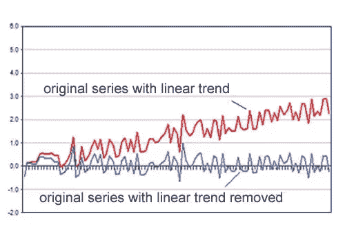

# 预测足球热

> 原文：<https://blog.devgenius.io/forecasting-football-fever-fe46fa779b69?source=collection_archive---------5----------------------->

## 探索深水港的季节性数据集

阿迪蒂亚·佩思

戴夫·阿达姆松在 [Unsplash](https://unsplash.com?utm_source=medium&utm_medium=referral) 上拍摄的照片

每年九月到一月，足球接管美国。游戏主宰了周日和周一晚上的电视节目，我哥哥每周都为他一直表现不佳的梦幻球队而焦虑不安。当季后赛来临的时候，炒作似乎达到了一个无法忍受的程度。

但是，有没有一种方法来衡量和预测这种炒作呢？我决定使用我最喜欢的 NFL 球员之一，培顿·曼宁，来探索 Deephaven 的 Jupyter 笔记本的季节性。使用从 2008 年到 2016 年 8 年期间曼宁的维基百科搜索频率的[数据集](https://github.com/facebook/prophet/blob/master/examples/example_wp_log_peyton_manning.csv)，我的目标是打破足球炒作如何在整个赛季中演变。

为此，我决定采用两种方法来分析季节性。第一个是传统的 ARIMA 模型，第二个是更新的 Fbprophet 库。我会用这两种方法来拟合、预测和验证模型，看看哪种方法更能理解 NFL 的炒作。

# **我们的数据**

我们可以使用以下代码在 Deephaven 中绘制数据:

粗略看来，我们的数据是大约 8 年来每天对培顿·曼宁的维基百科页面浏览量的日志转换。这些数据似乎显示了一些我们可以研究的强烈的季节性趋势。

此外，在我们开始分解数据之前，我们需要一种一致的方式来可视化我们的预测。我们可以创建一个函数，将我们的训练、测试和任何预测数据与 Deephaven 一起绘制出来。这使我们能够将来自多个库和方法的分析与 Deephaven 强大的交互式绘图相结合。

# **ARIMA**

ARIMA 模型代表自回归综合移动平均模型。

模型的自回归或 AR 分量是前 N 个季节滞后的线性组合。对于我们的培顿·曼宁模型，这意味着前 N 周、前 N 个月或前 N 年的线性组合。

模型的移动平均分量是前 N 个季节滞后的误差项的线性组合，如下所示:

给定三个参数作为输入，ARIMA 模型将估计这两种线性组合的系数:

*   **p:** 自回归模型的阶数(滞后项的个数)，在上面的 AR 方程中描述。
*   **问:**移动平均线模型的阶数(滞后项的个数)，在上面的 MA 方程中有描述。
*   **d:** 使时间序列平稳所需的差数。平稳时间序列本质上是一个没有时间相关趋势的时间序列，不包括季节性。

在下面的示例中，蓝色时间序列被认为是平稳的，而红色时间序列则是非平稳的，尽管两者都可能呈现出季节性模式。

现在我们知道了我们需要找到什么参数，我们可以分析我们的培顿·曼宁数据。乍一看，我们的数据似乎是稳定的。除了季节性波动之外，似乎没有与时间相关的趋势，但我们可以使用扩展的 Dickey-Fuller 检验来检验这一点。

我们的测试返回了远低于显著性水平的 p 值，因此我们可以确认我们的模型确实是稳定的。d 的参数值为零。

现在我们需要找到 P 和 q 的参数值。为了做到这一点，我使用了自相关图。自相关和偏自相关图可以显示滞后项与给定观察值的相关性有多强。虽然部分自相关图显示了滞后项与其他滞后项的相关性，但自相关图将其他滞后项的“惯性”考虑在内。因此，我们可以使用部分自相关来估计 P 的参数，使用自相关来估计 q 的参数。

两个图都显示滞后的周期性行为，每个长度约为 7 天。这是有道理的——培顿·曼宁搜索频率可能会在比赛之夜增加，当足球比赛正在进行时。事实上，这些自相关图甚至显示了轻微的 6 天相关性，这很可能是由于周日晚上的足球比赛。但是由于 7 天的滞后与观察值的相关性最高，我们可以估计 P 和 Q 都是 7。

我应该指出，这些自相关图提出了一个问题。ARIMA 参数没有考虑到超过 10 的滞后输入，这意味着观察年度(365)或月度(30)季节性将非常困难。

现在我们有了参数，我们可以生产我们的 ARIMA 模型。

在我们做出预测之前，我们可以用残差图和密度图来检查模型假设的方差和正态性。

因为残差看起来是随机分布的，并且核概率密度图看起来是正态的，所以我们的模型假设是正确的。

绘制我们的模型会产生以下结果:

正如我们所看到的，没有其他季节性尺度会损害这个模型的可行性。不能捕捉多个季节趋势意味着 ARIMA 一次只能被一个季节所限制。不管怎样，我们可以返回一些误差估计量来验证我们的模型。

*   **均方误差**(均方误差):0 . 46860 . 48686868661
*   **MAPE** (平均绝对百分误差):0.1。36866.88868688661

# **萨里玛**

我们实际上可以使用来自 pmdarima 的 auto-SARIMA 模型来验证我们的 ARIMA 模型。auto-SARIMA 模型为我们估算了 **p** 、 **q** 和 **d** 的参数值，因此不需要上述前奏。此外，SARIMA 将季节性周期 m 作为一个参数。不幸的是，模型参数限制再次将我们限制在 **m < 10** 内，因此我们可能只关注每周的季节性。

拟合和绘制我们的模型给我们提供了以下内容:

最后，我们可以用误差指标来验证我们的模型:

*   均方差(均方误差):0 . 46860 . 48686868661
*   MAPE (平均绝对百分比误差):0.1000000000001

我们看到，我们的萨里玛模型与我们的 ARIMA 模型表现几乎相同，事实上，我们的 ARIMA 模型给出的平均绝对百分比误差比萨里玛略低。我们可以高兴的是，我们选择了最佳参数来拟合我们的 ARIMA 模型。

# **先知**

对于我们的最终模型，我们将使用 Fbprophet。

Fbprophet 是脸书的一个库，用于处理季节性时间序列数据集。Prophet 实现了一个基于加法模型预测时间序列数据的过程，其中非线性趋势与每年、每周和每天的季节性以及假日影响相适应。一般来说，使用 prophet 比我们的 ARIMA 模型需要更少的手工操作，而且在大多数情况下，我们可以像这样直接将数据输入 Prophet:

这使我们能够预测未来一年的情况，并将实际数据与预期值及其界限进行比较。

此外，Prophet 允许我们将这些数据分解为季节性的组成部分:

曼宁的页面浏览量在 2012-2013 年达到顶峰，这是他的 MVP 年。不出所料，周一晚上的足球赛是大多数球迷看起来像男子汉的时候，月度季节性细分显示，12 月和 3 月的疯狂高点与夏季的大旱形成鲜明对比。

Prophet 可以做得更多，并在数据中添加变化点，这是趋势最有可能发生变化的地方。

利用这个特性，Prophet 粗略估计了赛季的开始和结束，尤其是捕捉到了季后赛的窗口期。

仅通过视力测试，我们的先知模型看起来比 ARIMA 更好，更连贯。但是我们可以使用 MSE 和 MAPE 再次验证模型预测。

*   平均误差(均方误差):0.30000363636767
*   MAPE (平均绝对百分比误差):0.0000000000001

# **结论**

两个误差估计器都明确指出 Prophet 是更准确的模型。对于具有多个季节性的大型时间序列数据，ARIMA 有许多缺点。在预测更复杂的时间序列数据集时，简单地使用以前滞后的回归来估计未来值是行不通的。ARIMA 可能适用于具有简单季节效应的更有限的数据集，但特别是对于传感器数据、页面浏览量或能耗等数据，需要复杂的非线性模型(如 Prophet)来进行预测。

Deephaven 与 Jupyter 笔记本的集成允许用户拥有独特的、特定于库的绘图方法和操作以及 Deephaven 功能。Deephaven 的绘图特别是在与 fbprophet 等新的尖端库结合使用时，在交互式绘图中提供了用户友好的可视化选项。