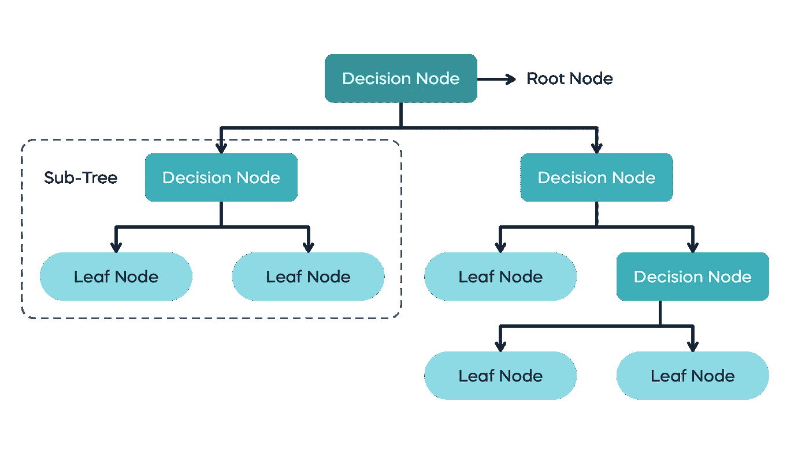
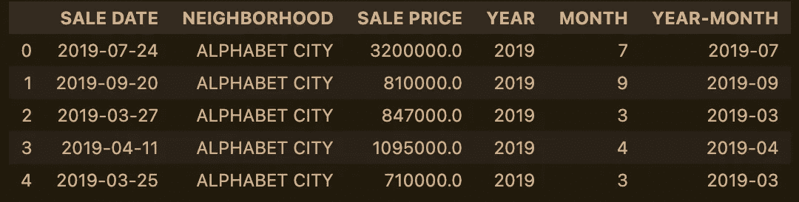
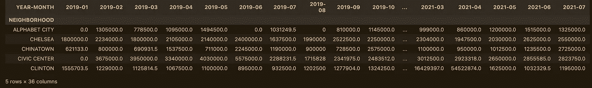
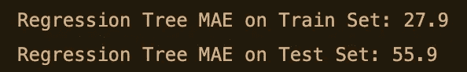
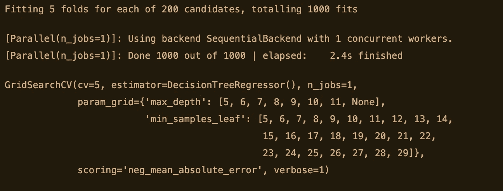
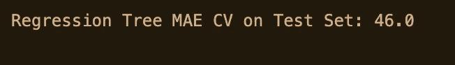

# 用回归树和 GridSearchCV 预测曼哈顿房产销售价格

> 原文：<https://blog.devgenius.io/forecasting-manhattan-properties-sale-prices-with-regression-trees-and-gridsearchcv-7ca0d20a6f3d?source=collection_archive---------3----------------------->

## 决策树用于预测两种类型的数据:分类树和回归树。这种监督学习算法背后的思想是提出几个“问题”，以便创建导致找到“答案”的决策规则。

*本文中使用的数据集是用来自纽约市财政局***的数据构建的。**

**

*照片由[安德拉·里基茨](https://unsplash.com/@drezart?utm_source=medium&utm_medium=referral)在 [Unsplash](https://unsplash.com?utm_source=medium&utm_medium=referral) 上拍摄*

*我认为隐含性是决策树的主要特征。这个算法基本上是*猜猜谁的匹配？*在游戏中，你向对手提问，以预测他们的角色是什么:“你的角色是女人吗？”、“是的”、“她唱歌吗？”、“不是”、“那你的角色是小威廉姆斯”、“是！”。所以用更专业的术语来说，这些树是建立在由边(是/否答案)连接的节点(问题)结构上的。通过获得这些问题的答案，该树对数据进行分类，以便得出一个结果；这个结果称为叶节点，一个决策树可以有多个叶节点。*

**

*决策树算法图解—图片由 [365 数据科学](https://365datascience.com/tutorials/machine-learning-tutorials/decision-trees/)提供*

*在围绕决策树的简短解释之后，我们将利用两种类型中的一种:回归一。这适用于数字数据。如果你想预测分类数据，你需要使用分类树。我们将尝试实现的是建立一个预测模型，该模型可以根据历史数据预测曼哈顿房产在 n+1 期间的销售价格。所使用的数据集包含 2019 年至 2021 年在曼哈顿出售的房产的信息。*

**

*杰森·克里格在 [Unsplash](https://unsplash.com?utm_source=medium&utm_medium=referral) 拍摄的照片*

*第一步是导入我们将要使用的库和模块。我们还阅读数据集，查看前五行，以便熟悉其中包含的信息。*

**

*曼哈顿房产销售数据集—图片由[作者](https://medium.com/@hiram_martinez)提供*

*如您所见，我们可以从这个集合中获得的数据点有:销售日期、房产所在的街区、销售价格以及从销售日期提取的年份和月份。现在我们知道了这一点，我们需要将我们的数据转换成所需的格式，使树回归量适合它。为此，我们将使用 pandas 的 pivot_table 函数。*

**

*数据透视表由数据集创建—图片由[作者](https://medium.com/@hiram_martinez)*

*由于上一步，我们现在有了一个数据框架，其中包含曼哈顿每个街区以及 2019 年 1 月至 2021 年 12 月每个月的平均销售价格。有了正确格式的数据，是时候使用一个函数将整个数据集分成训练集和测试集了，在这种情况下，我们将使用 Nicolas Vandeput 在他的书*供应链预测的数据科学*中建立的方法从头定义它(如果你想获得关于这个函数的更多细节和更多有趣的知识，请在他的 *SupChains* [网站](https://supchains.com/books/#book1)中购买 Nicolas 的书)。*

*在这种情况下，我们将指定函数将 16 个月的数据传递给训练集，将 16 个月的数据传递给测试集，因此模型可以预测未来 1 个月(在这种情况下为 2022 年 1 月)。一旦我们的 train-test-split 函数被定义，我们就可以在我们的数据帧上使用它。在此之后，剩下的唯一步骤是将树回归量放入我们的训练集，并在我们的测试集中进行预测。*

*在对测试的预测结束后，我们将能够通过计算平均绝对误差(MAE)来评估我们的回归模型的性能。如下所示，我们的模型在我们的训练集上表现更好，MAE 为 27.9%，而在我们的测试集上，MAE 为 55.9%。这种 28 个百分点的业绩损失可能是过度拟合的迹象。*

*毫无疑问，我们应该尝试优化模型，因为这将转化为类似这样的事情:假设你已经决定搬到曼哈顿的一个社区，并将使用你一生的积蓄在那里购买一处房产。你不知何故知道这个模型的存在，并想尝试一下。预测模型表明下个月的房产价格将达到 10 万美元，所以你会说:“哇，太棒了！就是我银行账户里的钱”。对预测充满信心，你开始准备买公寓的一切。当你带着你真正的房地产经纪人来的时候，他会这样说:“实际上，房地产销售价格大幅下跌，现在我们你可以只花 4.4 万美元就能买到你的公寓”。太好了！比你的预算少 56%；但如果反过来会怎样:“实际上，房产销售价格大幅上涨，你的公寓将花费你 15.6 万美元”。你肯定需要推迟一点搬进曼哈顿的计划。*

**

*训练集和测试集的 MAE 分数—图片由[作者](https://medium.com/@hiram_martinez)提供*

*为了实现回归器的优化，我们需要找到 max_depth 和 min_samples_leaf 参数的最佳值。我们将执行 GridSearchCV，而不是键入随机数来寻找最优解。简而言之，这是一个 scikit-learn 类，它通过对您提供的参数网格执行交叉验证的网格搜索来找到“最佳”参数。在这种情况下，我们将此网格设置为 max_depth 的范围从 5 到 12，min_samples_leaf 参数的范围从 5 到 30。完成后，我们实例化一个新的决策树回归器，并将其与参数网格一起传递到 GridSearchCV 中。接下来的步骤与我们对第一个模型所做的一样。*

**

*GridSearchCV 在行动——图片由[作者](https://medium.com/@hiram_martinez)提供*

**

*MAE 使用 GridSearchCV 优化分数—图片由[作者](https://medium.com/@hiram_martinez)*

*如您所见，我们通过使用 GridSearchCV 找到的参数(本例中 max_depth= 5，min_samples_leaf= 13)将预测误差降低了 9.9 个点。虽然这是一个很好的降幅，接近 18%，但我仍然认为比你的预测多支付 46%不会太好。*

*我希望你学会了如何使用决策树回归器创建预测。虽然这种算法可能容易理解和实现，但它有一些限制。如你所见，过度拟合是其中之一。此外，如果对数据集中的内容进行了更改(无论更改有多小),树结构也可能会不稳定。无论如何，我建议你试一试，并与其他预测方法进行比较，看看哪一种预测方法的 MAE 得分最高。*

*参考资料:*

*尼古拉·范德普特。(2021).供应链预测的数据科学。*