# 基于 Core-ML 的前景背景分离

> 原文：<https://blog.devgenius.io/foreground-background-separation-using-core-ml-82efbe7e7fc8?source=collection_archive---------1----------------------->

阿里·沙阿·拉哈尼在 [Unsplash](https://unsplash.com?utm_source=medium&utm_medium=referral) 上拍摄的照片

最近，我对使用深度学习的图像分割非常感兴趣，每当我学习到与机器和深度学习相关的东西时，它们都只是停留在 Jupiter 笔记本上，我没有对这些模型做任何事情，也没有任何部署它们的经验。因此，在查看了 ML-Kit、Flask 和 IOS 等许多框架之后，我决定创建一个简单的应用程序。

最后，我决定使用 IOS，原因有两个

1.  我从未在 IOS 上工作过，所以通过做一个 IOS 项目，我会学到一些新的东西，在阅读了关于 Core-ML 的内容后，我很兴奋，并渴望用它做点什么。
2.  我只是苹果迷。

对于这篇文章，我不打算详细介绍图像分割，我会留到其他时间，我相信你们都知道什么是图像分割，这就是为什么你登陆这个页面。

但是，仅供参考:**图像分割**是将图像分割成区域，以便提取图像中的多个不同对象。下面是一个简单的例子。图像分割用于医疗成像、安全、自动驾驶汽车等各种任务，最近我们大多数人都在视频通话应用中使用这种技术，如 hangout、zoom 或 teams，因为它们提供了改变背景的功能。

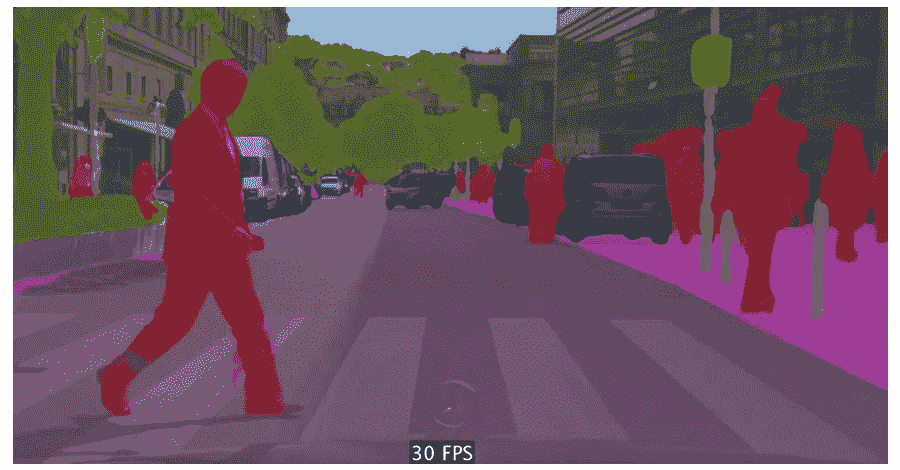

我保持这个项目有点简单，而不是在视频上工作，我将在静态图像上做图像分割，主要任务是前景提取。作为参考，这是我们希望使用该应用程序实现的。

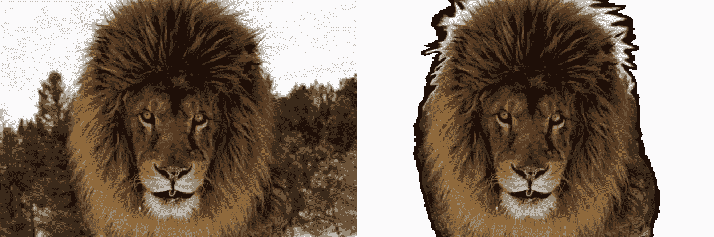

# DeepLab (V3):

对于图像分割，我将使用谷歌 DeepLab(V3)模型，该模型已被用于创建 Pixel 2 和 Pixel 2 XL 智能手机的“肖像”模式。这是一个用于语义图像分割的先进的深度学习模型，其目标是为输入图像中的每个像素分配语义标签(例如，人、狗、猫等)。

使用该模型的主要原因是我们不能将 Pytorch 和 Tensorlflow 模型直接用于 Core-ML，而是苹果提供了一个已经转换的版本 [DeepLabV3](https://developer.apple.com/machine-learning/models/) ，这使得工作更加容易，但是您可以训练自己的模型，并使用 [CoreML-Tools](https://coremltools.readme.io/docs) 转换模型。但对于这一点，我会坚持使用苹果提供的模型。

# 入门指南

## 创建新项目:

前往 Xcode 并创建一个新项目，选择一个单一视图应用程序作为模板并填写所有信息，并确保选择“故事板”作为用户界面。

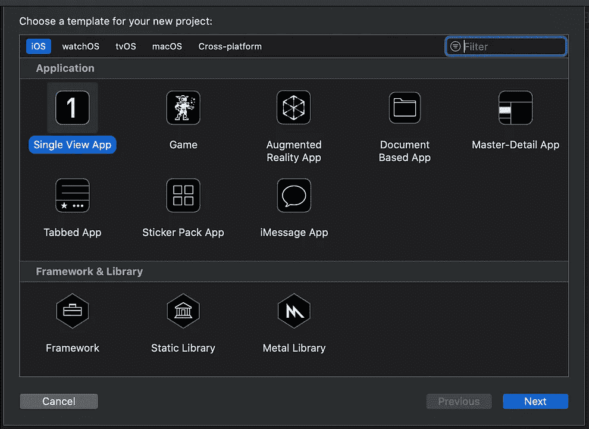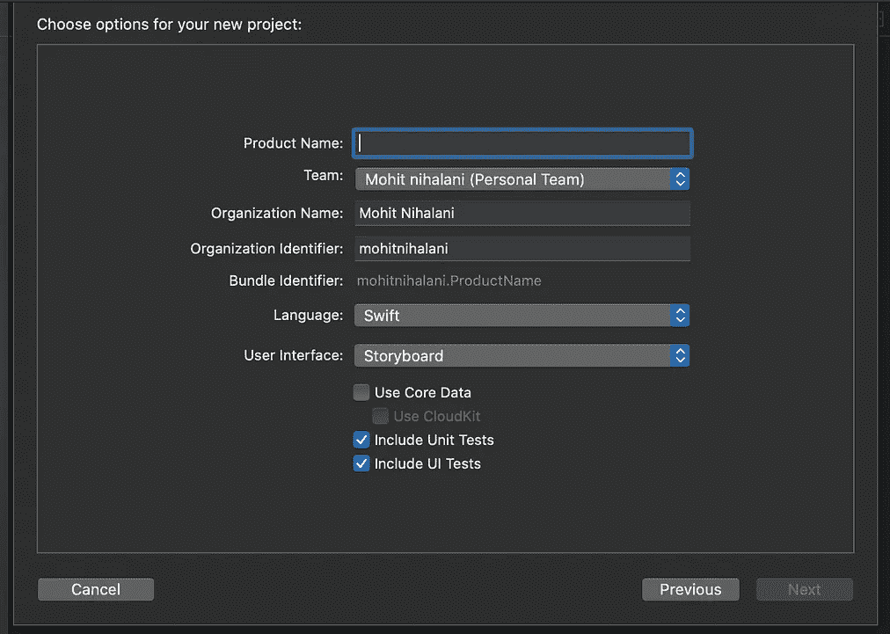

# 设置视图

现在让我们用按钮和徽标来设置 ViewController。我们将有一个图像视图，和一个 UI 按钮来启动遮罩。

现在，我们需要添加功能来选择图像。为此，我决定在导航栏上创建两个按钮。一个将从照片库中上传图像，另一个用于从相机中拍摄照片。让我们将它们添加到`**viewdidload**` 中，然后我们将设置我们的视图和布局。

在上面的代码中，我添加了一个带有两个 UI 按钮的导航栏，这将在导航栏的右边给你两个按钮。

更改 Info.plist 文件并添加一个属性很重要，这样就可以向用户解释为什么我们需要访问相机和库。在“*隐私—图片库使用说明*”中添加一些文字。

现在我们需要为所有三个按钮创建一个“选择器动作”方法，记住我们为照片库、照相机和分段按钮各有一个按钮，每次按下相应的按钮时都会调用这些方法。

在按下相机和照片库按钮时，我们希望`Image Picker Controller`变为活动状态，它是一个控制器，用于管理拍照、录制电影和从用户的媒体库中选择项目的系统界面。让我们创建一个方法`showImagePickerController`，为我们激活控制器。

在这种情况下，我们将传递图像控制器的源，它可以是`.photogallery`或`.camera.`，现在我们需要创建一个回调实例函数，通知代理用户选择了一个静态图像或电影，这样我们就可以在我们的 UI 视图上显示选择的图像。

这个函数获取图像并将其分配给 imageView，然后通过调用图像上的`image.fixOrientation()`方法做一些有趣的事情，我将在后面解释。这里的`self.originalImage`只是一个简单的`UIImage`类型的变量。

# 核心-ML

现在有趣的部分开始了。创建一个 Core-ML 组，并添加您下载的所有 Deep-Lab 模型文件。

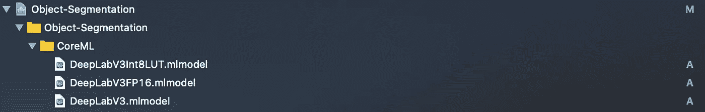

现在我们需要建立一个视觉，这是苹果的框架，用我们的 Core-ML 模型处理计算机视觉相关的工作。

首先，创建一个 Core-ML 模型的实例和类型为`[VNCoreMLRequest](https://developer.apple.com/documentation/vision/vncoremlrequest)`的模型属性，然后我们将设置一个模型，如果你仔细观察的话，我们在`viewDidLoad()`中调用了`setUpModel()`，现在我们将添加它要做的事情。

在上面的代码中，我们首先创建一个 vision 模型，然后将该模型传递给一个请求处理程序，该处理程序将创建一个 vision 请求，我们还将使用对象的完成处理程序来指定一个方法，以便在您运行请求后从该模型接收结果。

当我们的模型设置完成后，我们可以选择一幅图像，现在剩下的唯一事情就是开始分割，为此我们用要处理的图像创建`[VNImageRequestHandler](https://developer.apple.com/documentation/vision/vnimagerequesthandler)`对象。

这里发生的事情是，我们使用`[VNImageRequestHandler](https://developer.apple.com/documentation/vision/vnimagerequesthandler)`创建获取图像的请求，按照 Core-Ml 模型的指定进行预处理，将图像发送到 Core-ML 模型，并获得输出。这里`perform([])`方法传入一个视觉请求数组。

现在唯一剩下的事情就是处理 Core-ML 模型的结果。但在此之前，我们应该注意到，我们的 Core-ML 模型的输出只是数组大小为`512`乘以`512`。数组内容只是一个整数值(0，7，15，9 等)。每个数字代表一种颜色。如果我们的 CoreML 模型识别出图像中存在杂项/背景区域，那么构成背景/杂项区域的所有像素将被赋予一个值，比如说`0`。这只是一个数组，不是图像，所以我们不能直接用它作为原始图像的遮罩。

仅供参考的输出是`MLMultiArray`的类型，它只是苹果版本的 2D 阵列。

## MLMultiArray -> UIImage

添加一个新文件`MLMultiArrayToUIImage`并将这段代码添加到下面的代码中。大部分代码取自 [CoreMLHelpers](https://github.com/hollance/CoreMLHelpers) ，但我做了一些调整以满足我的需求。

在这里，我们迭代 MLMultiArray 并将这些值转换为灰度像素，我对语义分割不感兴趣，语义分割意味着对图像中的不同类别进行分类，我只对从前景中去除背景感兴趣，因此所有属于类别`0` 的背景都被分配了`255(white)`像素，并且所有被识别的对象都被转换为黑色`0`像素。

现在我们有了一个`UInt8`像素的数组，我们将使用这些像素值将其转换为灰度图像，为此我们必须使用像素数据创建一个`CGContext`，然后使用这些像素数据创建一个图像，这是通过上面代码中的`fromByteArray`函数完成的。我已经为灰度做了这个，但是你也可以为`RGB`调整这个。

## 调整遮罩图像的大小

在创建一个处理程序来处理我们的 Core-ML 模型的输出之前，还有一件事要做。记住，Deep-Lab 模型返回一个`512 x 512`蒙版，但是我们的原始图像可能有不同的大小，所以我们不能直接将蒙版应用到图像上。所以我们有两个选择，要么缩小原始图像，要么放大蒙版图像，谢天谢地，有一个简单的方法可以做到这一点。继续创建一个文件`UIImageExtension.swift`和下面的代码。

这里，我们再次创建了一个上下文，但这次没有任何像素数据，然后在`CGcontex` t 中绘制我们的`maskImage`，并将图像调整到所需的形状。

## 处理分割结果

现在我们需要添加处理程序来处理分割结果。Vision 请求的完成处理程序指示请求是成功了还是导致了错误。如果成功，它的`[results](https://developer.apple.com/documentation/vision/vnrequest/2867238-results)`属性包含`[VNCoreMLFeatureValueObservation](https://developer.apple.com/documentation/vision/vncoremlfeaturevalueobservation)`，这是由我们的 Core-ML 模型生成的输出字典，字典中的第一个对象是我们的结果。

这个结果字典包含了`MLfeaturevalue`一个将我们的结果和它的值包装在一起的对象，我们只需要从中取出`multiArrayValue`。然后我们如上所述将这个数组转换成一个图像，然后根据原始图像的大小调整 image 的大小。调整图像大小后，我们需要对原始图像应用遮罩。内联`9`我们正在执行`maskOriginalImage()`函数，让我们来实现它吧。

## 掩蔽原始图像

为了遮蔽图像，我们首先需要从我们的遮罩创建一个图像遮罩，然后将该图像遮罩应用于我们的原始图像。

最后，我们已经把所有的部分都准备好了，但是等一下，如果你记得当我们从`UIImagePickerController.`中选择一个图像时，我给图像添加了`fixOrientation()`，这背后的原因是 UIImage 在转换成`CGImage`时失去了它的方向。它会影响自动设置为风景模式的肖像图像。我不知道为什么会发生这种情况，但是图像被旋转了`90⁰`，你可以通过调用`fixOrientation()`方法的注释行来检查这一点。

要解决这个问题，请在`UIImageExtension.swift`中添加以下代码。您可以了解更多关于 ios 上[定向如何工作的信息。](https://medium.com/@eorvain_app/image-orientation-on-ios-abaf8321820b)

最后，我们添加了所有功能，现在我们可以构建代码并进行测试。这是示例输出。

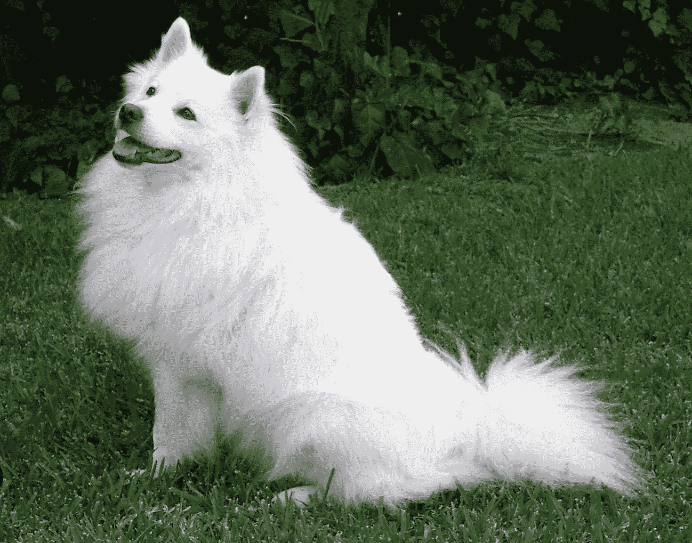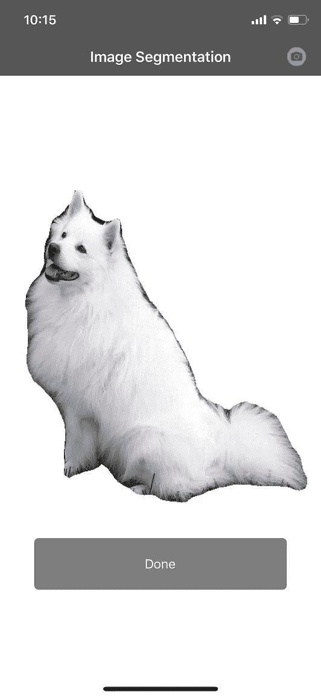

我们可以很容易地注意到，它工作得很好，但不是在边缘，原因是 Deep-Lab 是一个图像分割模型，不是为了显著性检测，对于这项任务，我们需要一个为显著对象检测设计的深度学习模型，我最近了解到的一个模型是 [BasNet](https://github.com/NathanUA/BASNet) ，它工作得非常好，这里有一些样本图像遮罩。

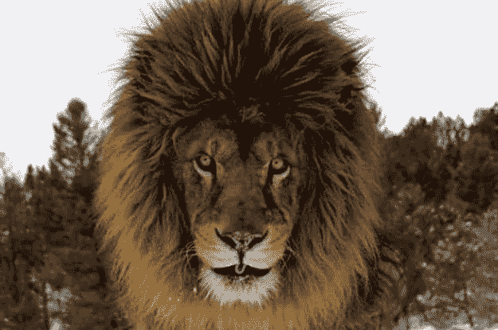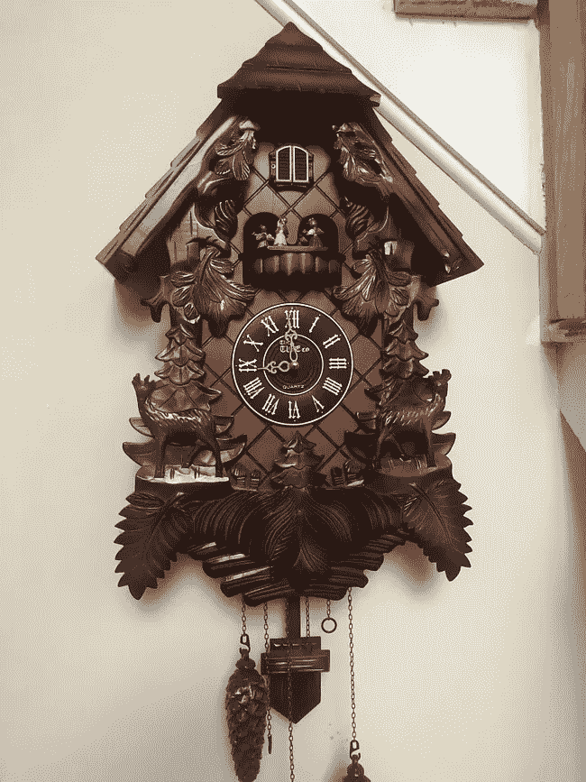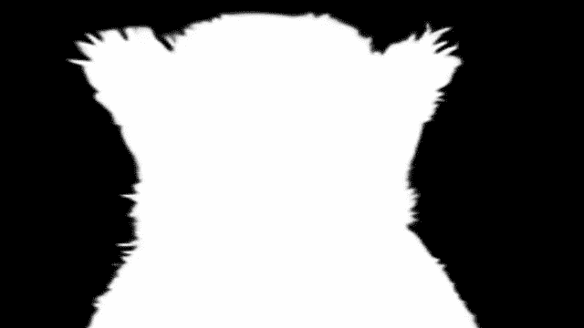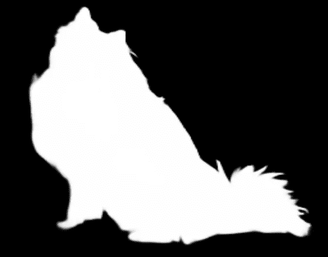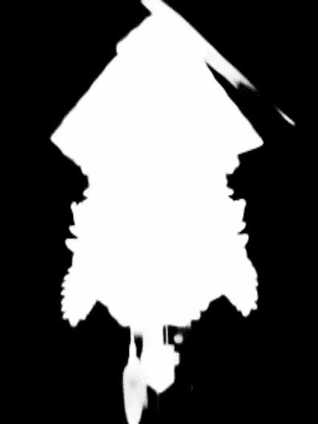

我们可以很容易地注意到掩模图像之间的差异，以及它在检测对象边界方面有多好。但不幸的是，没有 Core-ML 模型，我使用 Python 创建了这些图像。有一些转换工具可以将 PyTorch 模型转换成 Core-ML，但是我不太喜欢这些工具，因为它们仍然有很多限制。我正致力于将`BasNet` 转换成 Core-ML，一旦我成功了，我会更新我的博客并分享这个模型，但在此之前，这就是我们所拥有的。

我希望你喜欢并学到了新的东西，如果你喜欢，请留下一些掌声。👏👏👏

[参考文献]

1.  秦，x，张，z，黄，c，高，Dehghan，m .，& Jagersand，M. (2019)。BASNet:边界感知显著目标检测。*IEEE 计算机视觉和模式识别会议(CVPR)* 。
2.  陈良杰、朱玉坤、乔治·帕潘德里欧、弗洛里安·施罗夫和哈特维格·亚当(2018)。用于语义图像分割的阿特鲁可分离卷积编解码器。在 *ECCV* 。