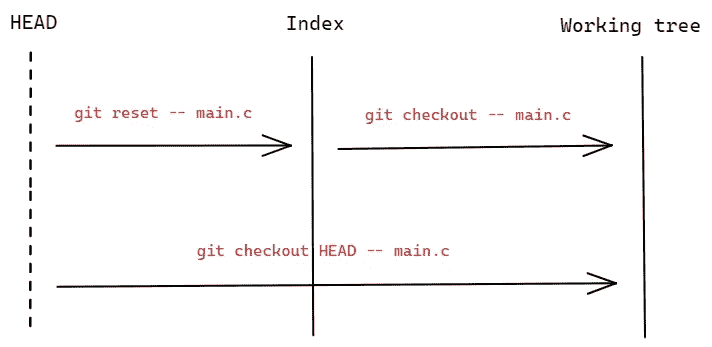
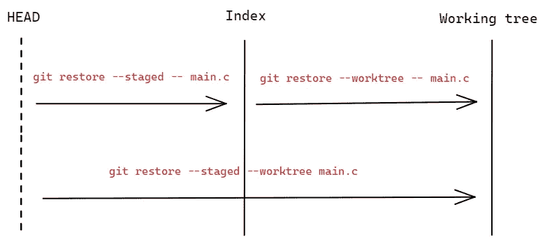

# 忘记 Git 检验，使用 Git 开关和 Git 恢复

> 原文：<https://blog.devgenius.io/forget-git-checkout-use-git-switch-and-git-restore-78fb01a55011?source=collection_archive---------3----------------------->

## 它仍然存在，但应该被遗忘


[布鲁斯·马尔斯](https://unsplash.com/@brucemars?utm_source=medium&utm_medium=referral)在 [Unsplash](https://unsplash.com?utm_source=medium&utm_medium=referral) 上的照片

如果在日常工作中使用 Git，`git checkout`是一个常用命令。经常用来切换分支，看[文档](https://git-scm.com/docs/git-checkout)可以看到*“切换分支或者恢复工作树文件”*这句话。但是 UNIX 应该是 [*做一件事并且做好*](https://en.wikipedia.org/wiki/Unix_philosophy#Do_One_Thing_and_Do_It_Well) 。这令人困惑，所以 Git 2.23 带来了一对实验命令来代替它。

在介绍它是如何工作的之前，我们需要简要地理解它相关的 Git 概念。

*   工作副本(工作树文件):是指出现在硬盘上的存储库中的文件。
*   索引(暂存区或缓存):它指的是你已经执行了`git add` -ed，或者，如果你要运行`git commit`会提交什么。
*   HEAD:指的是“当前的”或者“活动的”分支，当我们需要签出一个分支时(指的是你试图将分支与工作副本中的内容进行匹配)，一次只能签出一个。

`git checkout`可以签出一个分支或创建一个新分支并签入其中:

```
# Switched to branch 'test'
**$ git checkout test**# Switched to a new branch 'test'
**$ git checkout -b test**# Switch back to the previous branch
**$ git checkout -**# Switched to a commit
**$ git checkout master~1**
```

而`**git switch**`是用来接管分公司相关的，所以它也可以做:

```
# Switched to branch 'test'
**$ git switch test**# Switched to a new branch 'test'
**$ git switch -c test**# Switch back to the previous branch
**$ git switch -**# Switched to a commit
**$ git switch -d master~1**
```

而且就像我们开头说的，`git checkout`也可以恢复工作树文件。这部分功能由`**git restore**`接手。

过去，我们可以使用`git checkout -- main.c`从索引中恢复工作树文件，语法是`git checkout [treeish] -- <filename>`，其中`treeish`可以指定为源。简单的例子:

```
# Restoring the working tree from the index
**$ git checkout -- ./main.c**# Restoring index content from HEAD
**$ git reset -- ./main.c**# Restoring the working tree and index from HEAD
**$ git checkout HEAD -- ./main.c**
```

注意，从头恢复索引内容时，我们只能使用`git reset`，而`git checkout`没有对应的选项。

用图表显示:



`**git restore**`更容易确定哪些文件将被恢复，以及它们将被恢复到哪里。以下选项指定还原位置:

```
-W
--worktree
-S
--staged
```

默认情况下，`-W`和`--worktree`将从索引中恢复工作树，就像没有指定选项一样(比如`git restore -- ./main.c`)。而`-S`和`--staged`将从头恢复索引内容。当两者都通过时，索引和工作树将从头恢复。

例如:

```
# Restoring the working tree from the index
**$ git restore -- ./main.c**
# Equivalent to
**$ git restore --worktree -- ./main.c**# Restoring index content from HEAD
**$ git restore --staged -- ./main.c**# Restoring the working tree and index from HEAD
**$ git restore --staged --worktree ./main.c**
```

用图表显示:



上面提到的是默认设置，如果我们想从不同的提交中恢复，我们可以使用`--source`选项。例如:

```
# Restore `./main.c` in the working tree with the last commit
**$ git restore -s HEAD^ -- ./main.c**
# Equivalent to
**$ git restore --source=HEAD^ -- ./main.c**
```

另一个有用的情况可能是恢复一个处理不当的文件。例如:

```
# Incorrectly deleted files
$ rm -f ./main.c# Quickly restore main.c from index
**$ git restore ./main.c**
```

对于批量恢复:

```
# Restore all C source files to match the version in the index
**$ git restore '*.c'**# Restore all files in the current directory
**$ git restore .**# Restore all working tree files with top pathspec magic
**$ git restore :/**
```

# 结论

`git checkout`的功能划分得很清楚:`git switch`用于切换分支，`git restore`用于恢复工作树文件。它们提供了更明确的语义，符合 UNIX 的理念。

这两个命令都是在 2019 年提出的，截至目前，它们都是实验性的。可能会有变化，但通常不会太多，所以你现在可以使用它们，它们更容易理解，更少混淆。

# 参考

[1][https://git-scm.com/docs/git-switch](https://git-scm.com/docs/git-switch)

[2][https://git-scm.com/docs/git-restore](https://git-scm.com/docs/git-restore)

*感谢阅读。如果你喜欢这样的故事，想支持我，请考虑成为* [*中等会员*](https://medium.com/@islizeqiang/membership) *。每月 5 美元，你可以无限制地访问媒体内容。如果你通过* [*我的链接*](https://medium.com/@islizeqiang/membership) *报名，我会得到一点佣金。*

你的支持对我来说很重要——谢谢。