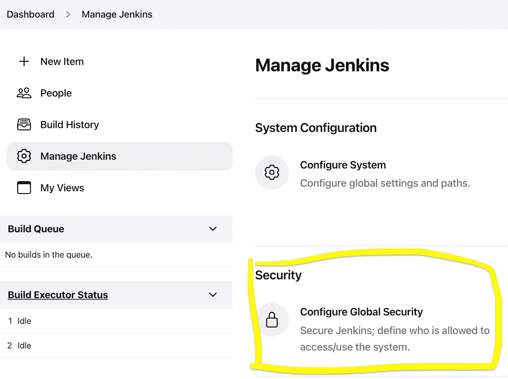
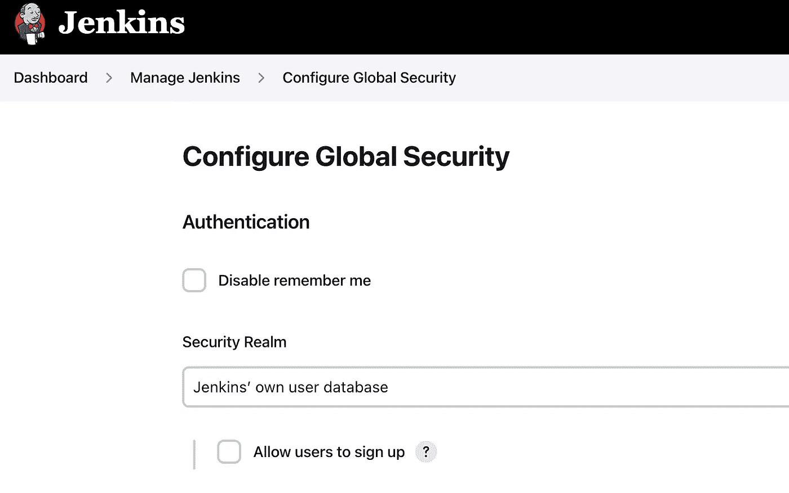
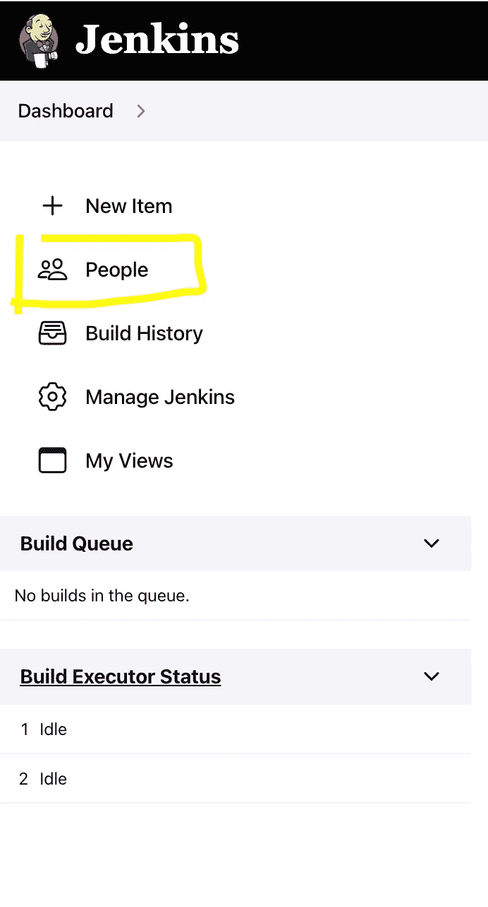

# 忘记了 Jenkins 管理员用户/密码

> 原文：<https://blog.devgenius.io/forgotten-jenkins-admin-user-password-d7de780fa5bb?source=collection_archive---------0----------------------->


[托尼克](https://unsplash.com/@thetonik_co?utm_source=medium&utm_medium=referral)在 [Unsplash](https://unsplash.com?utm_source=medium&utm_medium=referral) 上拍摄的照片

如果您忘记了 Jenkins 管理员用户或密码，并且无法以管理员身份登录 Jenkins 用户界面(UI ), Jenkins 不会提供一种简单的方法来重置管理员帐户密码。
您可以通过 SSH 连接到 Jenkins 服务器并重置 Jenkins 管理员密码。

最简单的解决方案是完全禁用`/var/lib/jenkins/config.xml`文件中的安全性。

因此，我们将遵循以下步骤:

1.  用 ssh 连接到您的 Jenkins 服务器。
2.  让我们看看 config.xml 文件

```
$ cd /var/lib/jenkins
$ ls
```

> 重要提示:您将看到 config.xml 文件，您必须复制一份 Jenkins 配置文件。

3.制作 Jenkins 配置文件的备份副本。

```
$ cp /var/lib/jenkins/config.xml /var/lib/jenkins/config.xml.back
$ ls
```

> 用 ls 命令检查 config.xml.back 文件。

4.打开配置文件`/var/lib/jenkins/config.xml`禁用安全性:

```
$ sudo vi /var/lib/jenkins/config.xml
```

按下`i`进入 **vim** 插入模式。修改`<useSecurity>`标签之间的值，并将该值设置为`false`

> config.xml 文件中的`<useSecurity>true</useSecurity>`将被`<useSecurity>false</useSecurity>`改变

按`ESC`保存更改，然后输入`wq`写入更改，然后退出编辑器。

5.重新启动 Jenkins 服务:

```
$ systemctl restart jenkins
```

> 重启后，您可以使用`sudo systemctl status jenkins`命令检查 Jenkins 服务是否正在运行。

转到 Jenkins UI，这次不会要求您提供任何凭证，因为您将以匿名用户的身份登录到 Jenkins

并重置管理员密码:

1.  导航至`"Manage Jenkins"`->-`"Security"`->-`"Configure Global Security"`->-`"Authentication"`



2.选择`"Security Realm"`(如`"Jenkins’ own user database"`)并点击`"Save"`



3.进入`"Dashboard"`->-`"People"`->点击您想要更改密码的用户名(如`admin`)->-`"Configure"`->在`"Password"`和`"Confirm password"`字段输入新密码，然后点击`"Save"`



重置管理员密码后，恢复之前的`/var/lib/jenkins/config.xml`文件并重启 Jenkins:

```
$ mv /var/lib/jenkins/config.xml.back /var/lib/jenkins/config.xml
$ systemctl restart jenkins
```

# 感谢阅读！

*如果你喜欢我的工作并想支持我…*

1.  *最好的办法就是跟着我上媒* [*这里*](https://hivelkrasniqi.medium.com/) *。*
2.  请随意鼓掌或写评论，这样我就知道这篇文章对你有多大帮助了。