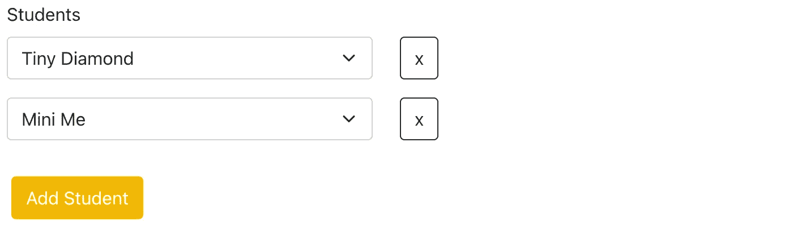

# 在 React 中格式化表单输入以在 Rails 中使用 accepts_nested_attributes_for

> 原文：<https://blog.devgenius.io/formatting-form-inputs-in-react-to-use-accepts-nested-attributes-for-in-rails-7eca7902fed0?source=collection_archive---------6----------------------->



# 介绍

在之前的一篇[文章中，我描述了类方法](/passing-a-nested-array-of-objects-to-a-controller-to-update-associated-records-in-rails-38913ae01f6c)`[accepts_nested_attributes_for](https://edgeapi.rubyonrails.org/classes/ActiveRecord/NestedAttributes/ClassMethods.html)`如何允许你通过父类保存相关记录的属性，这在 Rails 中是默认关闭的。它允许您将嵌套属性传递到控制器操作中，这些操作可以创建、更新和删除相关记录。我还演示了如何在我的应用程序中配置模型和控制器来利用这一功能。

我将描述我如何设置`CourseForm.js`来处理创建添加了学生的课程和更新现有课程中的学生。

# 设置状态

我需要设置一些状态变量来跟踪学生在表单中的输入。

```
const [listId, setListId] = useState(1)
const [addedStudents, setAddedStudents] = useState([])
const [formData, setFormData ] = useState({
  ...
  students: []
})
```

*   我使用`listId`为每个学生输入创建一个唯一的键，因为新的输入没有学生 id 来引用。
*   我用`addedStudents`按住已经添加的学生的`id`。这样，后续的下拉菜单就不会将它们作为`<option>`包含在内。
*   `formData`保存表单的数据，并包含一个包含所有学生的数组的`students`键。

# 格式化来自 API 的学生数据

因为我使用了相同的 React 组件来创建一个新类和更新一个当前类，所以我需要格式化 API 中的数据以便在表单中使用。大多数代码都是您的程序所独有的，所以我将只讨论与创建表单相关的代码。

```
const { classId } = useParams()if(**course** && addedStudents.length < 1) {
 **let initialListId = 0**  const formattedCourse = formatCourse(course)
  **const studentsWithListIds = course.students.map(student => {
    initialListId++
    const studentCourseId = student.student_courses.find(
        crs => crs.course_id === course.id
      ).id
    return {
      listId: initialListId,
**      full_name: student.full_name,
 **student_id: student.id,
      course_id: classId,
      student_course_id: studentCourseId
    }
  })**
  **setAddedStudents(
    studentsWithListIds.map(student => student.student_id)
  )**
 **setFormData({...formattedCourse, students: studentsWithListIds})
  setListId(initialListId)** }
```

*   我使用 Redux 和`class`来引用从 API 接收的那个类的数据。如果我没有使用 Redux，那么我会使用 useState。
*   `initialListId`保存一个数字，每添加一个学生就增加一个，以防止 React 中出现重复的键。我没有使用`listId`，因为更新它会导致页面刷新。
*   `studentCourseId`查找与此`course`匹配的`student_course`的`id`。如果学生被用户从课程中删除，我将需要它。

在代码块结束时，我为`addedStudent, formData, and listId`更新状态。现在，我准备创建学生输入。

# 在表单中创建学生输入


我使用了与 [React Bootstrap 类似的逻辑:当我创建输入时，使用灵活的输入数量](/react-bootstrap-creating-controlled-forms-to-add-and-update-data-with-a-flexible-number-of-inputs-6d2e4e6977c7)创建受控表单来添加和更新数据。

我正在使用 [React Bootstrap](https://react-bootstrap.github.io/forms/overview/) 来设计我的表单。我在表格上加了这个:

```
<Row>
  <Form.Label>Students</Form.Label>
  {renderStudents}
</Row>
<Row>
  <Button variant=’yellow’ onClick={addStudent}>Add Student</Button
</Row>
```

`renderStudents`为每个学生创建一个输入:

```
const renderStudents = formData.students.filter(
  student => student.listId !== undefined).map(
    student => <AddStudent
      key={student.listId}
      student={student}
      updateStudent={updateStudent}
      removeStudent={removeStudent}
      addedStudents={addedStudents}
    />
  )
```

*   首先，我过滤掉`formData`中的学生，只包括那些有`listId`的学生。
*   然后，我映射每个学生并传递道具，我将在下面解释。

## 创建<addstudent>组件</addstudent>

`<AddStudent />`组件创建一个下拉输入和一个按钮来删除学生。

```
const AddStudent = ({
  addedStudents,
  removeStudent,
  updateStudent,
  student
}) => {
  return (
    <Row>
      <Col>
        <AddStudentDropDown
          key={student.listId}
          addedStudents={addedStudents}
          student={student}
          updateStudent={updateStudent}
        />
      </Col>
      <Col>
        <Button
          onClick={() => removeStudent(student)}
          variant='outline-dark'
        >x</Button>
      </Col>
    </Row>
  )
}export default AddStudent;
```

要添加学生:

```
const addStudent = () => {
  setListId(listId + 1)
  setFormData({...formData, students: [
    ...formData.students, {
      listId: listId + 1,
      full_name: '',
      student_id: '',
    }
  ]})
}
```

*   我增加了`listId`以防止重复，并给`formData.students`添加了一个新学生。
*   这个函数不包含关于学生的信息，所以我只添加了一个学生输入。

## 创建`<AddStudentDropdown />`

`<AddStudentDropdown />`需要创建一个`<option>`用于:

*   所有未注册的学生
*   被传承的学生，如果有一个被传承的话。

我在`studentOptions`中使用了 if/else 语句。

```
import { Form } from "react-bootstrap";
import { selectAllStudents } from "../students/studentsSlice";
import { useSelector } from "react-redux";const AddStudentDropDown = ({
  student, 
  updateStudent, 
  addedStudents 
}) => { const students = useSelector(selectAllStudents)
  **const studentOptions** = students.length > 0 ? students.map((std) => {
 **//display the student passed down, if one is passed down**    if(std.id === student.student_id){
      return <option
        value={student.student_id}
        key={student.student_id}
      >{student.full_name}</option>
 **//display all students not already in the class**    }else if(!addedStudents.includes(std.id)){
      return <option
        value={std.id}
        key={std.id}
      >{std.full_name}</option>
    }
  }): null return (
    <Form.Group className="mb-3" controlId="students">
      <Form.Select 
        value={student.student_id} 
        **onChange={e => updateStudent(
          e.target.value, 
          student.listId
        )}**
      >
      <option>Select a Student</option>
      {studentOptions}
      </Form.Select>
    </Form.Group>
  )
}
export default AddStudentDropDown;
```

当学生被选中时，它触发`updateStudent`并通过学生的`id`和`listId`。

# 处理更新学生

## 场景规划

我开始为添加、删除和更新学生时可能出现的不同场景做计划。我不得不解释:

*   向新课程添加学生
*   从新课程中删除学生
*   向现有课程添加学生
*   从现有课程中删除学生

## 更新表单数据中的学生

```
const updateStudent = (id, listId) => {
  const newStudent = students.find(
    student => student.id === parseInt(id, 10)
  )
  const added = []
  const updatedStudents = formData.students.map(student => {
    **if (student.listId === listId) {
      const studentObj = {
        listId: listId,
        full_name: newStudent.full_name,
        student_id: newStudent.id,
      }**
      added.push(studentObj.student_id)
      return studentObj
    }else{
      added.push(student.id)
      return student
    }
  })
  setAddedStudents(added)
  setFormData({...formData, students: updatedStudents})
}
```

*   在`updatedStudents`中，我通过`formData.students`映射并用匹配的`listId`更新对象，并更新`addedStudents`和`formData`。`formData.students`中的每个对象都有一个`listId`，所以这将更新链接到该输入的学生信息。

## 从表单数据中删除学生

```
const removeStudent = (studentToRemove) => {
  **if (!course || (course && !course.students.find(student => student.id === studentToRemove.student_id)))** {
    setFormData({
      ...formData, 
      students: formData.students.filter((student) => student !== studentToRemove)
    })
  }else{
    const updatedStudents = formData.students.map( student => {
 **if(student.student_id === studentToRemove.student_id) {**        **return {
          id: studentToRemove.student_course_id, 
          _destroy: '1'
        }**
      }else{
        return student
      }
    })
 **setFormData({...formData, students: updatedStudents})**  }
  **setAddedStudents([...addedStudents.filter(
    id => id !== studentToRemove.id)]
  )**
}
```

`if (!course || (course && !course.students.find(student => student.id === studentToRemove.student_id)))`

*   这将检查这是否是一个新的课程(`!course`)，或者它是否是一个现有的课程，并且在加载该课程时该学生不是该课程的一部分(`course && !course.students.find(student => student.id === studentToRemove.student_id)`)
*   如果是这种情况，那么该学生可以从`formData.students`除名

如果不是这样，那么需要更新`formData.students`中的条目，以销毁表单提交中的`student_courses`实例。

*   `id:`被设置为`student_course`的`id`并且`_destroy: 1`被添加到对象。这是`accepts_nested_attributes_for` [要求](https://api.rubyonrails.org/classes/ActiveRecord/NestedAttributes/ClassMethods.html)的格式。

# HTTP 请求

## 发布创建新类的请求

```
const coursePost = () => { const strongParams = {
    course: {
      name: parseInt(formData.name),
      meeting_day: parseInt(formData.meeting_day),
      status: parseInt(formData.status),
      setting: parseInt(formData.setting),
      start_date: formData.start_date,
      start_time: formData.start_time,
      level: parseInt(formData.level),
 **student_courses_attributes: formData.students**    },
  } fetch('/courses', {
    method: "POST",
    headers: {
      ...headers,
      ...getToken()
    },
    body: JSON.stringify(strongParams) ...
  }
}
```

对于 POST 请求，我需要更新 formData，如上所示。Rails 要求包含嵌套关联数据的键被命名为`associated_table_name_attributes`，在本例中，关联表是`student_course`，我使用了`student_courses_attributes`，因为有许多`student_courses`与每个`course`相关联。

## 更新现有课程的补丁请求

```
const coursePatch = () => {
 **const existingIds = course.students.map(student => student.id)**  const strongParams = {
    course: {
      name: parseInt(formData.name),
      meeting_day: parseInt(formData.meeting_day),
      status: parseInt(formData.status),
      setting: parseInt(formData.setting),
      start_date: formData.start_date,
      start_time: formData.start_time,
      level: parseInt(formData.level),
      **student_courses_attributes: formData.students.filter(student => !existingIds.includes(student.student_id))** },
  } fetch(`/courses/${classId}`, {
    method: "PATCH",
    headers: {
      ...headers,
      ...getToken()
    },
    body: JSON.stringify(**strongParams**)
  })
  ...
}
```

*   这里，我从 student 对象的`student_courses_attributes`数组中过滤掉所有未更改的学生记录。这确保我在提交表单时不会创建任何重复的记录。

现在表单的这一部分是可操作的！

按照本教程和我的[上一篇](/passing-a-nested-array-of-objects-to-a-controller-to-update-associated-records-in-rails-38913ae01f6c)关于在后端设置的教程，你可以创建一个具有灵活数量输入的表单，并在你的 Rails 后端创建、更新和删除相关记录！

我希望这篇文章能帮助你在你的项目中实现同样的事情。如果是这样，请留下你的回购评论，让我可以看到你的工作！此外，如果你觉得这篇文章很有帮助，请鼓掌并跟我来查看未来的文章。