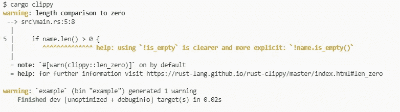
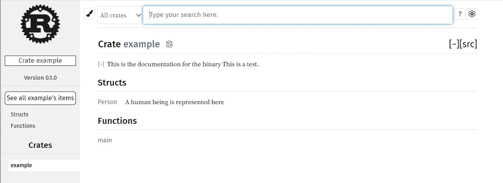
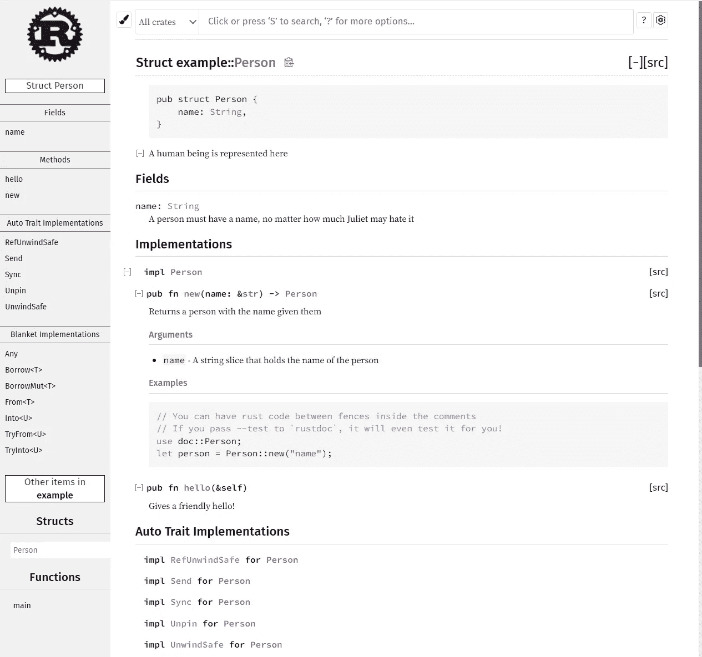

# 用 Rust 格式化、林挺和记录

> 原文：<https://blog.devgenius.io/formatting-linting-and-documenting-with-rust-eb7b189ade65?source=collection_archive---------6----------------------->

本文将简要概述 Rust 的格式化、内衬和文档化过程。

Missy，在看了一些没有文档也没有应用格式或 linter 的代码之后。

我最喜欢的一句与软件工程相关的名言是:

> **编写代码时，要始终把最终维护你代码的人当成一个知道你住哪儿的暴力精神病患者。**(出自约翰·伍兹)

编写清晰易懂的代码应该是任何软件工程师/开发人员的首要目标。

格式化程序、linter 和文档生成器是一些工具，如果正确和持续地使用，它们可以帮助我们创建干净和可维护的代码。

因此，继上周的文章《我为什么爱上 Rust》(这里是[这里是](https://anismousse.medium.com/why-you-should-learn-rust-fa52d0139b85))之后，这篇文章将旨在回顾 Rust 中有助于生成干净代码的不同工具。

## Rust 中的格式

格式化程序是一种工具，旨在根据所使用的编程语言的样式准则来固定源代码的样式。

**Rustfmt** 不要与模块**STD::fmt(**[**doc**](https://doc.rust-lang.org/std/fmt/)**)，**是 Rust 代码格式化程序，可通过`rustfmt.toml` *或* `.rustfmt.toml`完全配置。

Rust 代码格式不正确的示例

我们可以通过运行命令`**cargo fmt**`将 **Rustfmt** 应用到这段代码中。该命令将重新格式化我们项目中的源代码，这将导致我们的示例产生以下结果:

如果你使用的是最新版本的 Rust， **Rustfmt** 应该已经安装了。如果不是这样，您可以在此找到所有安装细节和更多[。](https://github.com/rust-lang/rustfmt)

## 生锈的林挺

Linter 旨在分析应用于的任何代码，捕捉潜在的错误，建议最佳实践，并优化现有的解决方案。

虽然 Rust compiler (cargo)已经非常严格，但 Rust 的 linter 旨在识别和呈现任何可能的坏的或非最佳的实践。

Rust 的最新版本默认预装了 **Clippy** ，但是快速浏览一下**Clippy**GitHub pages[**这里的**](https://github.com/rust-lang/rust-clippy) 会让你很好地了解如何安装和配置它。

下面的 rust 代码是可编译和可执行的，但是包含一些次优的实践。

次优的可编译和可运行的 rust 代码示例

通过命令`**cargo clippy**`在这个代码示例上运行 Clippy 将生成以下警告:

如你所见， **Clippy** 已经在我们的代码示例中发现了一个次优的实践，并为我们提供了一个更好的选择。

这再次很好地说明了 Rust 的一个强大特性，即能够帮助您准确识别任何潜在问题或次优实践，并提供最佳替代方案。

## Rust 文档

文档旨在解释项目的特性，告知我们如何使用它们，并帮助我们理解其功能，同时允许 defacto 降低入职成本。

因此，项目文档是任何软件开发过程的重要部分。

Rustdoc 是 Rust 项目的标准文档生成工具。可以通过以下命令生成并打开文档:`**cargo doc --open**`

但是 Rustdoc 如何知道将源代码的哪一部分添加到文档中呢？在这里评论一下**文件评论**拯救。

创建文档注释的主要方法是在行首使用三个*斜线(`///`)。需要注意的是，该文档注释仅在项目出现时有效；这些是内部文档注释。*

您还可以通过开始一行`//!`来创建文档注释，使文档注释适用于注释的父项，而不是后面的项。

下面是一个 rust 代码源代码的例子，带有一些文档注释和 Rustdoc 生成的相关文档。

带有一些文档注释的 rust 代码

rustdoc 制作的文档

rustdoc 制作的文档

rust 文档注释还有更多的内容，比如集成一些示例代码，这可能会有所帮助。文档中的那些源代码示例可以在 rust 项目上运行我们的测试时进行测试(我们将在以后的文章中讨论 Rust 中的测试，因为我仍在探索它)。

## 结论

正如我们刚刚看到的，Rust 有多种工具可以帮助您生成最佳和干净的代码。更好的是，您可以通过利用 **Git 预提交钩子**中的所有工具来简化您的过程，以确保您将要上传以供审查/接受的任何代码都将应用最少量的检查和平衡。

下周，我打算转移一下 Rust 的话题，谈谈科技领域的年龄歧视问题。

自从几周前我分享了下面的推文，以及到这个周末我将长大一岁的事实后，我对这个话题有了很多想法:

在那，有一个伟大的一周！！鼓掌，评论，跟着都是欢迎的！！

**附加资源**

Git 预提交钩子:模式细节[在这里](https://git-scm.com/book/en/v2/Customizing-Git-Git-Hooks)。

Rust 文档:更多细节[在这里](https://doc.rust-lang.org/rustdoc/how-to-write-documentation.html)。