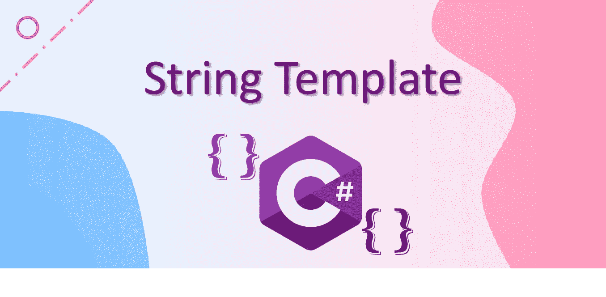

# 在 C#中使用模板格式化字符串

> 原文：<https://blog.devgenius.io/formatting-strings-using-templates-in-c-ba74ca53c07f?source=collection_archive---------1----------------------->

## 如何在 C#中呈现字符串模板

C#有一个特性，字符串插值，以灵活和可读的方式格式化字符串。下面的例子演示了当我们事先有数据时，我们通常如何输出一个字符串，然后将数据传递给模板字符串。

[要诀链接](https://gist.github.com/changhuixu/29b616dd54b4ac7b966ec841817af6f2)

另一方面，当我们希望按照预定义的模板格式化某些字符串时，字符串插值在某些情况下不起作用。例如，该字符串可以是日志消息、警报、电子邮件模板等。

为了解决这个问题，我们可以使用一些 NuGet 包(例如， [Nustache](https://github.com/jdiamond/Nustache/) ，[胡茬](https://github.com/StubbleOrg/Stubble)， [mustache#](https://github.com/jehugaleahsa/mustache-sharp) )通过用期望值替换特定语法中包装的参数来呈现模板。这些库像视图引擎一样工作，能够用复杂的逻辑编译模板。

在本文中，我将向您展示用字符串模板中的值替换参数的两种简单方法，而不是使用这些库。完整的解决方案可以在[我的 GitHub 库](https://github.com/dotnet-labs/StringTemplates)中找到。

# 字符串。格式()

格式化字符串最常见的方法是使用`string.Format()`方法。该方法采用一个包含索引作为占位符的模板，并采用一个对象列表来剔除索引参数。让我们看看下面的例子。

[要点链接](https://gist.github.com/changhuixu/a34d690f73aace67719ff3c7c5787a43)

在上面的代码中，第 1 行定义了字符串模板，它是一个常量，包含两个索引:0 和 1。除了索引，我们还可以为每个对象添加格式化程序。第 2 行基于两个对象生成一个字符串，第 3 行将该字符串写入控制台。类似地，第 4 行将一个字符串直接写入控制台。

使用`string.Format()`方法，我们可以很容易地用所需的值替换占位符。唯一的问题是，当我们阅读代码时，索引并没有传达太多的意义。因此，当参数数量较少时，这种方式效果最好。

# 模板建模

如果一个字符串模板包含许多参数，我们可能希望使用命名参数而不是索引来提高可读性。然后，我们需要利用某种模板语法，如小胡子或车把。我们可以自己快速实现一些东西，而不是安装第三方库。我将这种方式命名为“模板建模”，因为我们将把目标字符串建模为一个类。

让我们看看下面的例子。

要点链接

在上面的代码片段中，我们定义了一个类`MyString`来建模预定义字符串模板的构造和呈现。在`MyString`类中，私有字典`_parameters`用于存储字符串占位符及其值。命名占位符可以用一些不同于模板中其他内容的转义字符包装。

第 9 行到第 16 行的构造函数可以用作参数的验证器，以确保它们是正确的或者有一些后备值，并且可以用作值转换器，以使每个模板段可以根据业务逻辑用转换后的值替换。

最后，public `ToString()`方法只是根据静态模板和输入参数返回格式化后的字符串。在`ToString()`方法中，第 20 行使用了一个 LINQ 表达式，它用存储的值优雅地替换了所有模板段。

这种方式允许我们轻松地用不同的参数编写单元测试。

需要注意的是，您可能想要清理对象，以便它们不会与您的模板混淆。例如，净化 HTML 电子邮件模板的输入以避免注入是一个好主意。另外，不要使用这些方法来生成 SQL 查询或语句。实体框架已经有了[一个生成原始 SQL](https://docs.microsoft.com/en-us/ef/core/querying/raw-sql) 的方法。

今天到此为止。同样，代码在[我的 GitHub 库](https://github.com/dotnet-labs/StringTemplates)中。感谢阅读。