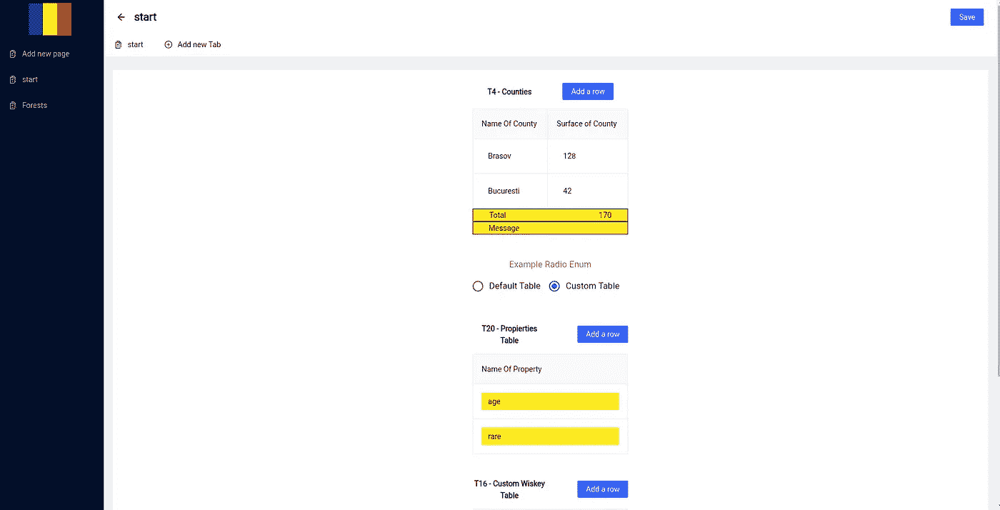
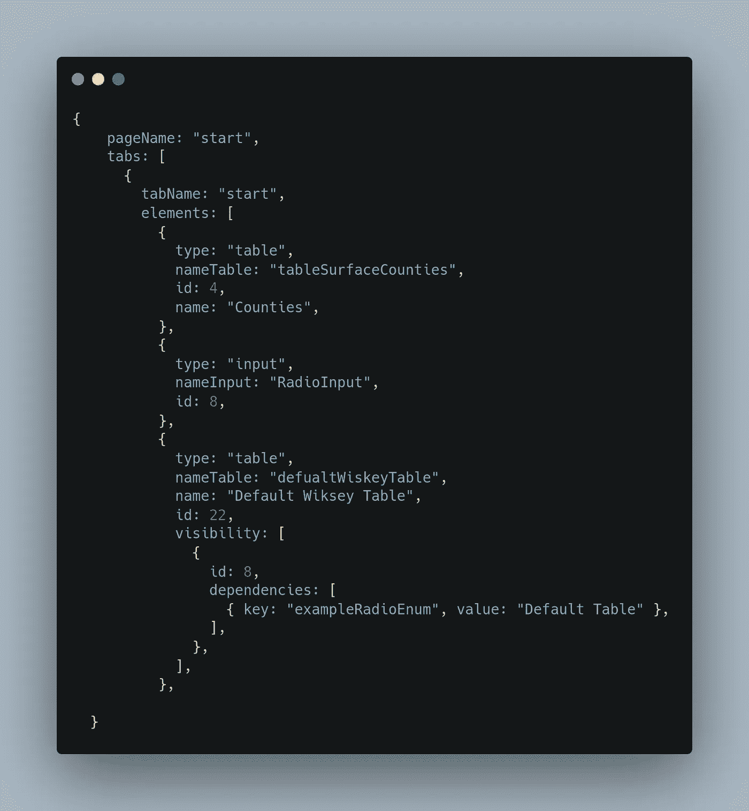
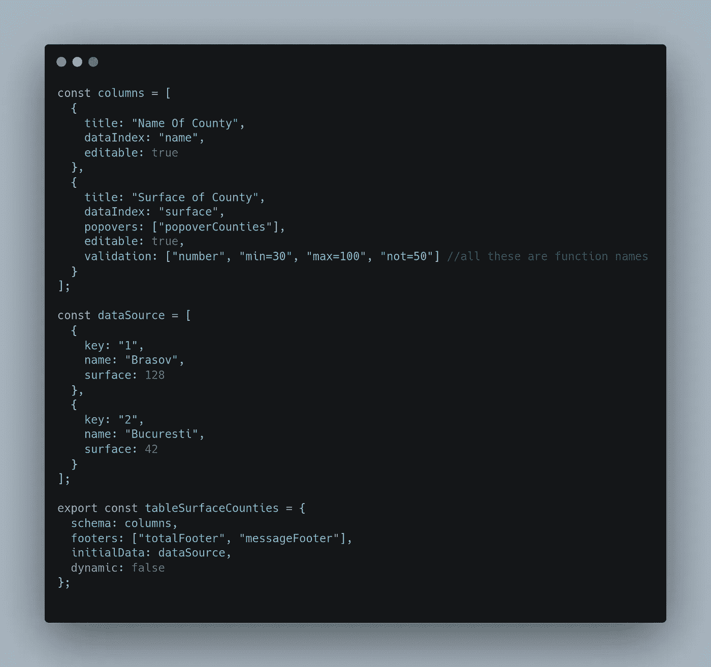
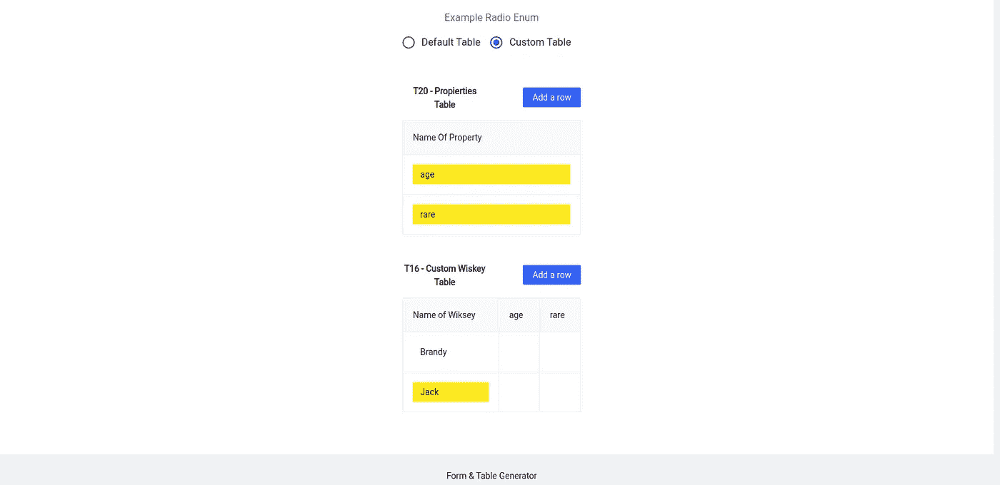
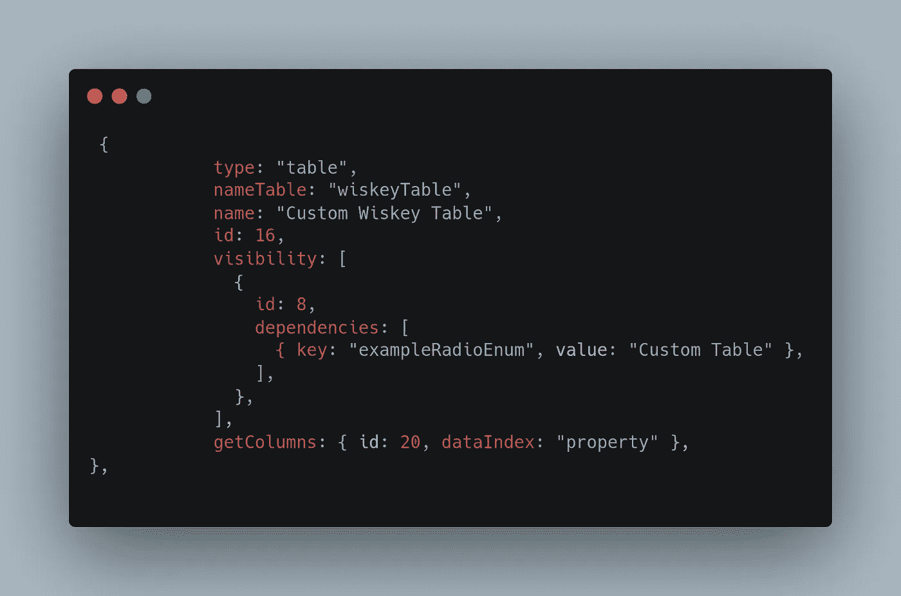

# 使用 REACT 从 JSON/对象数组生成公式和表格

> 原文：<https://blog.devgenius.io/formularies-and-tables-generator-from-json-array-of-objects-with-react-28265bee2faa?source=collection_archive---------8----------------------->

这些天，我被指示做一项重复的任务:创建不同的和多余的表格和处方集。这导致了大量乏味而艰苦的工作。当我行动迟缓的时候，一个想法突然出现在我的脑海中，如果我做一个生成器，它将从 JSON 模式为我创建网站。

# 任务和问题

我必须为更多的国家创建一个网站。每个国家将有一个包含更多页面和子页面的部分，每个国家将有一名代表，并以表格和处方集的形式介绍数据。该屏幕截图是罗马尼亚的部分。在左边，我们有页面:开始和森林。当前页面是“开始”，我们有一个名为“开始”的子页面。这听起来并不难编码或重复，但考虑到我不得不为 100 多个国家这样做，每个页面/子页面将有许多表格，其中许多将是相同或略有相同的。这是重复的！

# 解决办法

我们不要编写整个应用程序。相反，让我们创建一个生成器，它将为每个国家获取一个 JSON，并呈现 country 部分。让我们看看子页面“start”在 JSON 模式中是什么样子。

我们有 pageName，即“start ”,以及一组子页面/选项卡。数组的每个元素代表一个子页面/选项卡。每个选项卡都有一个元素数组，其中包含所有的表格/处方集。每个表都有一个单独的模式，因为表是重复的，并且保持了页面模式的整洁。此外，每个元素都可以有一个可见性属性。使用 visibility 属性，我们可以根据另一个元素的值来显示该元素。

## 表格模式

现在我们知道了页面模式是什么样子，让我们看看表模式是什么样子。

表模式由列和数据源组成。columns 数组的每个元素代表表中的一列。再来看国家一栏的表面。该列有标题、数据索引、弹出窗口、可编辑的验证键。“dataIndex”用于引用另一个表或函数中的列。您可以在此表格的单元格上创建弹出窗口。为此，您需要创建一个函数，该函数接受表的值并返回 popover 消息。不要忘记在 popovers 数组中写入函数名。验证用于在单元格上创建验证。您可以创建一个验证函数，该函数将被赋予值并返回错误或不返回错误。此外，函数名应该写在验证数组中。表格支持页脚，如总页脚(见应用截图)。要创建页脚，我们需要创建一个函数来接收表的值并返回文本和值。正如我之前说过的，函数的名字应该放在指定的数组中。在 plus 中，所有将被修改的值将有不同的背景颜色

## 动态表格

表可以从另一个表中获取列。

如您所见，T16 的列是从 T20 的值导入的。让我们看看这个模式会是什么样子

getColumns 属性将从 T20 元素导入位于 dataIndex = "property "列上的值。

# 结论

作为网站开发者，我们不应该做苦力。相反，找到创新的解决方案。在本文中，我向您展示了这个生成器对于从 JSON 创建如此复杂的网站有多么大的帮助。我没有向你展示我是如何做到的，也没有展示这个网络应用的所有功能。好奇的话可以下载回购联系我。

GITHUB 回购:[https://github.com/dobri1408/generator](https://github.com/dobri1408/generator)

联系我:dobriceanionut1408@gmail.com