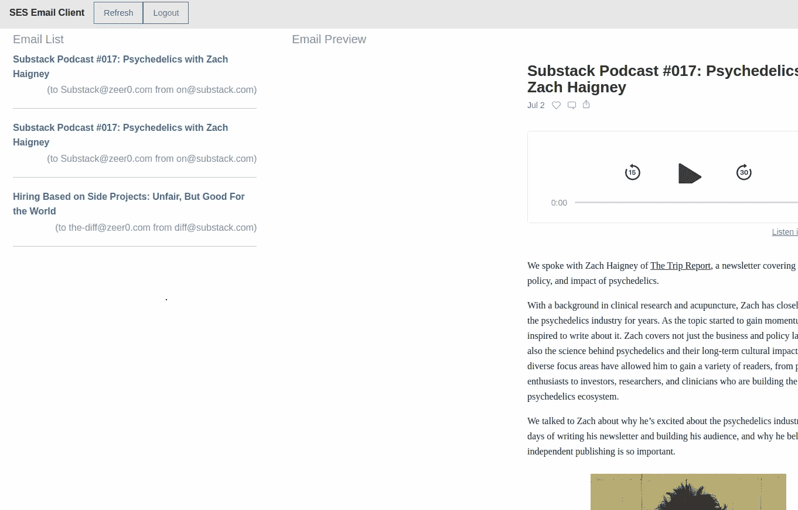
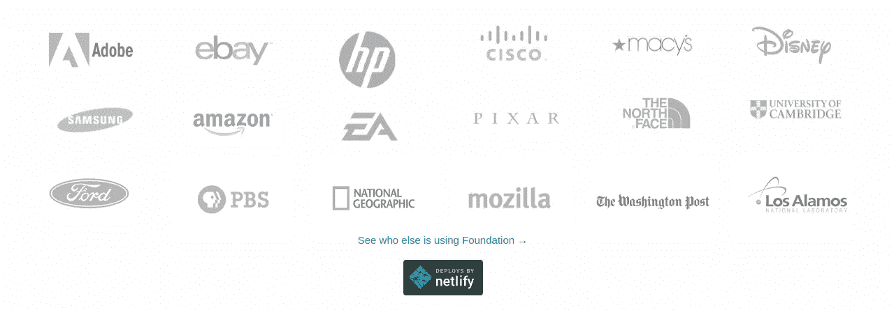

# 基础 CSS —第一印象

> 原文：<https://blog.devgenius.io/foundation-css-first-impressions-a540db056934?source=collection_archive---------31----------------------->

***TL；dr；****——它完成了工作，但是我对文档和实现没有什么印象*

在我与 Nua 的咨询工作中，我把这个团队介绍给了布尔玛，

> 超过 200，000 名开发人员使用的免费开源 CSS 工具包

在 Nua 之前，我只在玩具项目中使用过布尔玛，但一直对其文档的质量印象深刻。

所以，当我们用布尔玛和 Vuejs 在一周内从零开始建立了一个完整的产品页面和结账流程时，我对布尔玛及其文档的欣赏只会加深。

然而，当需要为 SES 构建一个 UI[电子邮件客户端时，我以真正黑客的方式，决定尝试](https://medium.com/@ssr233/building-a-serverless-email-client-for-aws-ses-933234244f3c) [Foundation CSS](https://get.foundation) 。

# 在开始之前

让我用一个总括性的免责声明作为下面所有内容的开头——我不是 CSS 开发人员。我不知道口出狂言。迄今为止，混合蛋白仍是个谜。

我只知道基础 CSS，因为我在 CSS 库的一些 HackerNews 帖子中听到过它。

我对 Foundation CSS 的感觉可能源于对 UI 编码范例完全缺乏了解。

当然，很多开发人员和我一样——我们构建系统，但努力为它构建一个好的皮肤，所以我希望这篇文章能够关注 Foundation CSS 的一些方面，帮助这些开发人员选择他们的下一个 UI 框架。

设置:我用的是基金会团队搭建的托管在 jsdelivr 上的 stock (v6.6.3)基金会 CSS 和 JS。

# 第一印象

断然否定

虽然我最终能够构建一个还过得去的 UI，但我必须给基金会网站和库都打 f。

# 为什么网站很烂

首先，让我们看看为什么网站会得 f。

## 大量断开的链接

该网站充斥着断裂的链接和 404 页。

例如，即使他们的[展示页面](https://zurb.com/responsive)链接在顶部导航菜单的右侧，也会导致 Zurb.com 的死页。

## 厨房水槽网站

基金会网站是各种事情的起点。

您可以访问 CSS 上的教程，观看视频课程，为您的团队组织定制的培训课程，学习如何编写更好的电子邮件，下载 HTML 模板和初学者工具包，获得基础认证，找到并加入他们的讨论组，等等。

对我来说唯一有价值的东西——让我构建 UI 的 CSS 文档——被藏在一个名为**开始**的 CTA 按钮旁边的 [Docs](https://foundation.zurb.com/sites/docs/) 下。

再一次，这是 UX 的乌龙球，基金会将会很好地解决这个问题。

***注*** :哦，以免我把你搞糊涂了，他们的文档深处还有一个名为厨房水槽的链接。这个厨房水槽是一个 CSS 控件和组件的主列表，列在一个页面上。

## 可怕的搜索

该文档有一个搜索功能，到目前为止，一切顺利。

它只支持关键字搜索。

> Drats！！

对你没有语义搜索！如果你曾经尝试过自学一种不公开语义搜索 UI 的技术，你就会明白这是多么的局限和对开发者的敌意。

接下来，让我们看看框架本身

# 为什么框架很糟糕

## 非标准组件名称

很快的，告诉我名为 **Reveal** 的组件可能是什么？原来 Reveal 是一个模态的基础 CSS 名称。

旋转木马被称为**轨道**。

锚标签和页面内导航被称为**麦哲伦**大概是为了唤起航海、世界探索的原始方式。

我停止我的案子。

## 新的 HTML 组件

Foundation 引入了新的 HTML 组件，比如定义列表——这很有用——但是如果你没有找到正确的地方，就很难发现。

事实上，SES UI 使用定义列表在左侧列出电子邮件。

## XY 网格

对于我来说，我不理解 XY 网格 Foundation 引入的另一个布局概念。

我理解对二维网格的需求，但是除了给它一个名字，我看不出 XY 网格有什么用。

我觉得这是一个 UI 开发人员会比像我这样只想构建一个基本屏幕的人更欣赏的东西之一。

# 结果

总之，我能够为我的 SES 邮件客户端建立一个 UI，甚至用基础 CSS 美化它。

我确实对这种体验失望过几次，以至于想要放弃一切，在 [TailwindCSS](https://tailwindcss.com/) 中构建整个 UI，这是另一个我想测试的 CSS 库，我在 HackerNews 上听说过它。

现在 UI 已经构建好了，我开始更加欣赏布尔玛的文档和对惯例的遵守。

另一方面，使用 Foundation CSS 的公司和项目列表确实令人印象深刻，所以也许他们知道一些我不知道的事情。

品牌使用基金会

*图片来源:图片由* [*麦斯威尔*](https://unsplash.com/@maxcodes?utm_source=medium&utm_medium=referral) *上* [*下*](https://unsplash.com?utm_source=medium&utm_medium=referral)