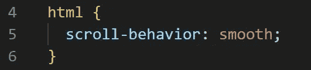
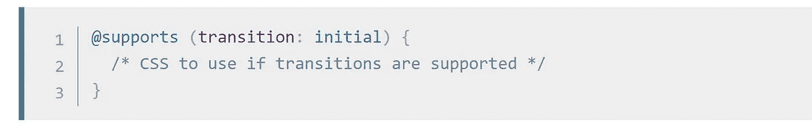
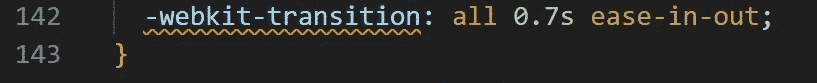
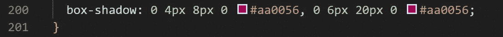
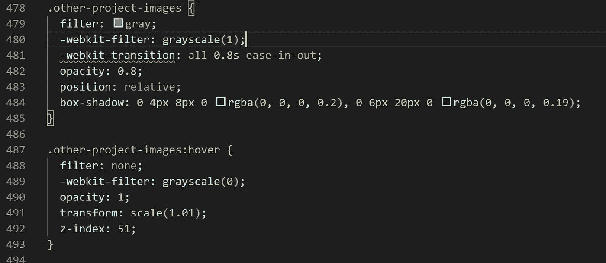

# 给人留下深刻印象的四个快速 CSS 技巧

> 原文：<https://blog.devgenius.io/four-quick-css-tricks-to-impress-79673c5edf6e?source=collection_archive---------31----------------------->

将任何或所有这些令人敬畏的 CSS 片段添加到您的工具箱中，为您的下一个前端或全栈项目带来一点额外的流行。

克里斯托夫·高尔在 [Unsplash](https://unsplash.com?utm_source=medium&utm_medium=referral) 上拍摄的照片

# #1 平滑滚动

顾名思义，将这一小段代码添加到您的 CSS 中将会带来更加流畅的体验(看到我做了什么吗？)给你的用户。如果页面上有链接，可以让用户从不同的部分垂直移动，这真的可以增强用户体验，而不仅仅是元素之间的瞬间跳转。

毫无疑问是我的最爱之一！

# # 2 Webkit-过渡

Webkit-transition 曾经是我用来在转换之间增加一些额外时间的工具，比如悬停效果。然而，在撰写本文时，MDN 建议使用基于“支持”的新语法，请点击此[链接](https://developer.mozilla.org/en-US/docs/Web/CSS/@media/-webkit-transition)了解更多信息。

这是检查是否支持转换的正确语法，请点击上面的链接了解更多信息。

现在应该避免这种情况——我需要在几个网站上更新这种情况。

# #3 方框阴影/字体阴影

想给你的字体或其他元素增加一些深度吗？使用框阴影或字体阴影将帮助您实现这一效果，这将添加一个可怕的附加，并真正使您的元素弹出。尝试不同的像素大小，颜色和位置，以达到你想要的效果，这可能是微妙的或巨大的！

框阴影非常适合添加一些 3D 效果。

# #4 灰色(或其他)悬停时的颜色

你有没有遇到过一个网站，上面有一些美丽的灰色图片，然后随着时间的推移，或者在卷轴上，或者在悬停时，它们充满了所有奇妙的颜色？如果使用得当，这是我最喜欢看到的效果之一，通过使用下面的剪辑作为基础，你也可以将这些伟大的效果添加到你的下一个网站或应用程序中。

请记住，该代码片段在以下情况下激活并着色。悬停在其他项目图像上，当悬停完成时，它会返回到灰度级。你可以换掉灰色滤镜，尝试其他颜色！

另外，请记住跳过-webkit-transition，更多信息请参见上文。

我已经坐了几个小时跳过图像，看着它们着色，然后又变回灰色。

我喜欢将这些快速技巧添加到我的前端代码中，以帮助增加用户体验。你有任何喜欢的代码片段，你总是想添加到你的 CSS 文件中，如果有，在 [Twitter](https://twitter.com/garlick_jake) 上给我发消息，我总是在市场上学习更多！