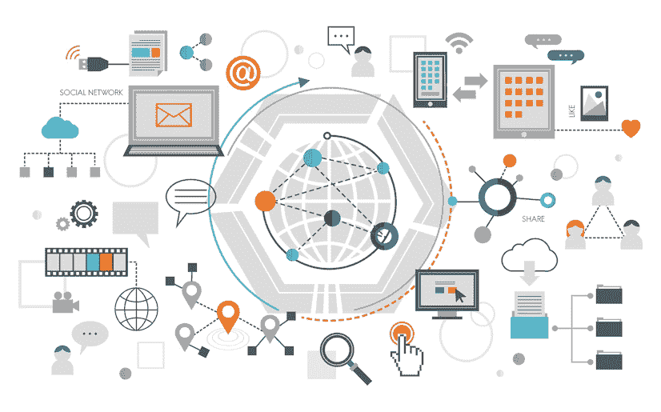
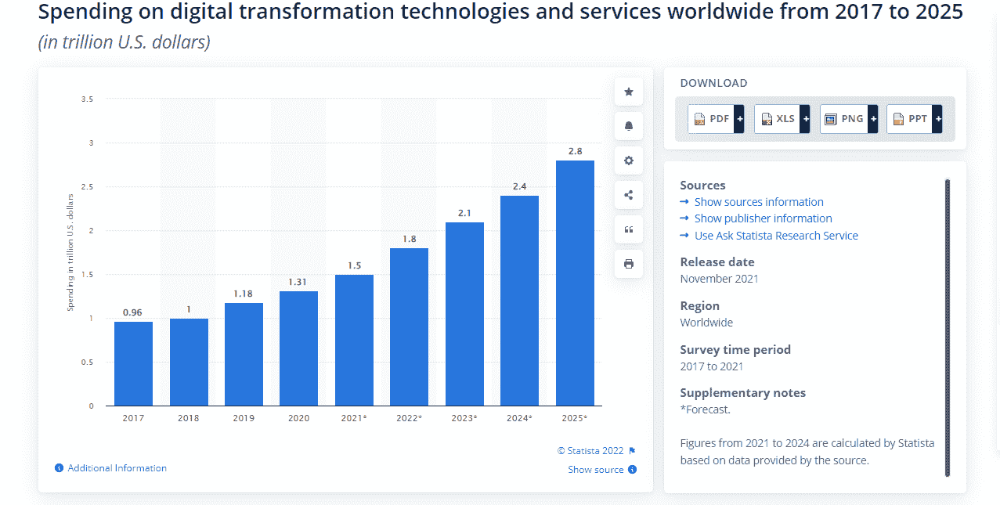

# 你需要知道的四种数字化转型

> 原文：<https://blog.devgenius.io/four-types-of-digital-transformation-you-need-to-know-6a77c71f593f?source=collection_archive---------10----------------------->

自互联网时代开始以来，企业一直在转变其数字战略，这意味着这是一个持续的过程，很可能会持续到未来。让我们探讨一下在推进您的计划之前，您需要了解的关于数字化转型的四个关键要素。

追求数字化转型有许多原因，从跟上竞争到保持行业趋势的领先，很难知道从哪里开始，应该采取什么步骤，以及如何衡量自己的成功。

[来源](http://freepik.com)

这里有四种类型的数字化转型可以帮助您的企业走向巨大的成功。

# 技术变革

数字化转型是一个需要时间才能理解的时髦词。以下是你应该了解的四种数字化转型，以及它们将如何影响你的日常生活。

*   **移动**——据[统计](https://www.statista.com/statistics/330695/number-of-smartphone-users-worldwide/)称，如今，全球有超过 60 亿智能手机用户，预计这一数字在未来几年将增加数亿。中国、印度和美国拥有最多的智能手机用户。
*   **分析** —在过去，企业会收集数据，然后弄清楚这些数据意味着什么。数据分析使我们能够实时从数据中获得洞察力。这就像为您的业务运营提供了一个 x 光视角。
*   **机器人学** —机器人不会像人类一样累或无聊；它一天 24 小时都在工作，没有任何休息(或抱怨)。
*   **虚拟现实** —虚拟现实可以在专业人员的培训项目中发挥重要作用，如外科医生，在这些领域，安全至关重要。

# 业务变化

**数字化转型**不仅与您使用的技术有关，还与您如何使用它有关。记住这一点，四种类型的数字化转型可以帮助您更好地了解您的业务可能需要什么样的变化:自上而下、自下而上、由内向外和由外向内。了解这些转型是什么很重要，这样您就可以在数字化转型工作中获得最大的成功机会。

数字化的兴起是许多企业寻求 [**数字化转型服务公司**](https://www.valuecoders.com/digital-transformation-development-services) 拓展业务的一个原因。

# 文化变迁

数字转型不仅仅是实施新技术。它是关于我们生活、工作和娱乐的方式。这是一个文化转变。这意味着它不仅仅是流程或系统的变化——它影响人们交流、互动和协作的方式。您也可以[**聘请软件开发商**](https://www.valuecoders.com/hire-developers/hire-software-developers-india) 帮助您进行数字转型。

要在数字转型中取得成功，您需要了解您试图实现的变革类型，以及它们将如何影响您的公司文化。您也可以与 [**顶级数字转型咨询公司**](https://www.valuecoders.com/blog/technology-and-apps/top-10-digital-transformation-companies-you-must-consult-to-adapt-modern-tech/) 联系，他们会为您提供最好的建议。

# 客户体验创新

需要的不仅仅是继续提供相同类型的产品或服务。作为消费者，我们总是在寻找新的更好的东西。我们希望我们在公司或产品中的经历是积极有效的。

数字转型正在各行各业发生，公司必须跟上这一趋势，保持竞争力。公司正在通过虚拟现实(VR)来创新他们的客户体验。他们在 [**雇佣开发人员**](https://www.valuecoders.com/hire-developers) 为他们的客户提供最好的东西。

尽管虚拟现实技术已经存在了一段时间，但直到最近它才在全球范围内变得更容易使用。这种可访问性意味着公司可以在其产品或服务中使用虚拟现实技术，为客户提供身临其境的体验。

# 为什么数字转型很重要？

数字转型的重要性体现在它如何塑造了我们的生活、工作和娱乐方式。它改变了企业的运作方式、人们与周围世界的互动方式以及组织的合作方式。

随着如此多的变化同时发生，企业领导者必须明白将资源优先用于何处。这就是为什么我们确定了您应该了解的四种关键类型的数字转型。

*必读:* [*知道全新的数字转型策略&为您的企业带来益处*](https://www.valuecoders.com/blog/technology-and-apps/know-all-new-digital-transformation-strategies-benefits-for-your-business/)

**2022 年数字化转型的投资估计为 1.8 万亿美元，而到 2025 年，全球支出预计将达到 2.8 万亿美元。**

[来源](https://www.statista.com/statistics/870924/worldwide-digital-transformation-market-size/)

# 如何创建数字化转型战略

数字化转型是一个用来描述当今正在发生的事情的时髦词。它包含了从新技术到商业模式变化的许多转变。

要为您的公司成功创建数字化转型战略，您需要了解四种最常见的类型:

1.**客户驱动的转型**关注客户希望如何与产品和服务互动。

**2。过程驱动的转变**强调调整系统和程序来更好地为客户服务。

3.**产品创新变革**涉及生产和营销新产品或服务。

4.**技术创新变革**强调投资下一代技术，让您的组织更高效、更具竞争力。

# 数字化转型使用案例和示例

利用数字化转型前景的最佳方式是了解行业中发生的各种转型。这四种类型的修改包括:

1) **自动化-** 利用能够更快完成任务或更少人工干预的系统和软件提高效率。

2) **聚合**——连接人、地点、事物，让他们无缝共享数据。

3) **融合**——将业务流程、云计算、移动设备、社交媒体和其他技术集成到一个无缝的操作系统中。

4) **授权**——让员工能够访问信息或协作工具，以便他们能够高效地完成工作。

*必读:* [*人工智能如何重新定义数字化转型战略的成功？*](https://www.valuecoders.com/blog/technology-and-apps/how-artificial-intelligence-is-redefining-success-of-digital-transformation-strategies/)

# 数字化转型的真实案例

数字化转型正在我们身边以多种形式发生。对于商业领袖、企业家和思想领袖来说，理解不同的数字化转型及其对公司的意义至关重要。

1.当一家公司在其网站或移动应用上推出在线聊天功能时，就会发生对话式的转变。通过对话方式，客户服务团队可以通过这种渠道直接联系客户，而不是让客户通过电话或电子邮件联系他们。

2.**一种增强现实**类型的转变发生在当一个人使用 AR 来完成一项任务时，否则这项任务将使用另一种工具来完成。例如，有人可能会在购买之前使用 AR 来找到与他们的客厅装饰相匹配的家具。

3.**自动驾驶汽车**正在改变交通方式，它完全不需要司机，而是使用 GPS 导航系统和自动驾驶软件，让汽车能够在监控交通状况、道路危险和其他汽车运动的同时自动驾驶。

4.**机器学习**是一个宽泛的术语，涵盖了自动从数据中提取洞察力的算法，而无需显式编程去哪里寻找模式。一个流行的机器学习应用程序是亚马逊的推荐引擎，它根据用户过去的购买和访问的网站来建议用户可能喜欢的行为。机器学习算法也用于脸书的定向广告系统，网飞电影推荐，等等！

另请阅读:[数字化转型如何成为业务转型的决定性因素|了解要点](https://www.valuecoders.com/blog/technology-and-apps/all-about-digital-transformation/)

# 结论

了解你正在经历哪种类型的数字化转型将有助于你理解正在发生的事情以及你需要采取的下一步措施。我们希望这篇文章能帮助你更好地理解数字化转型以及它们对企业的影响。你可以 [**外包一家软件产品开发公司**](https://www.valuecoders.com/outsource-software-product-development-services) 帮你探索前景。