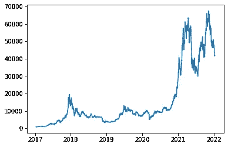
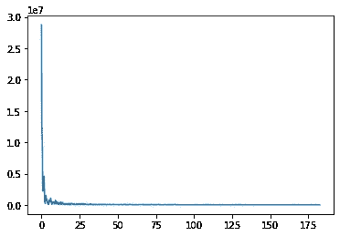
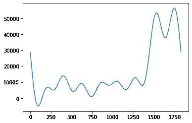
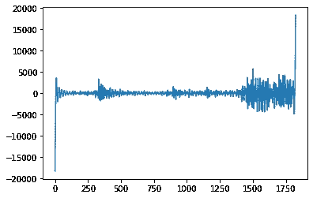

# 比特币价格的傅立叶变换

> 原文：<https://blog.devgenius.io/fourier-transform-on-bitcoin-prices-aaae397ef28?source=collection_archive---------3----------------------->

## 了解傅立叶变换和金融时间序列

傅立叶变换将时间序列中的信号转换成频率分解。通常用在声音或图片上。它的用途正在扩展到其他领域。这个故事研究了如何在金融时间序列上使用傅立叶变换，更具体地说是在比特币价格上。


Pawel Czerwinski 在 [Unsplash](https://unsplash.com?utm_source=medium&utm_medium=referral) 上的照片

## 傅立叶变换背后的基本直觉

教程经常将傅立叶变换比作将思慕雪分解成它的成分。也就是说，把一个整体分解成它的组成部分。在声音信号的情况下，傅立叶变换提取单独的振动。在我们的例子中，傅立叶变换试图将价格运动分解成几个周期。[彼得·布莱恩](https://medium.com/u/1aa55ad9da8a?source=post_page-----aaae397ef28--------------------------------)提供了[一系列精彩的帖子](https://medium.com/towards-data-science/the-fourier-transform-1-ca31adbfb9ef)，用越来越多的技术细节解释傅立叶变换的直觉。

## 科学与傅立叶变换

傅立叶变换获取时域中的数据，并返回频域。这是将信号分解成不同的频率。我们将使用 **scipy** 库及其傅立叶变换实现。与傅立叶相关的所有 **scipy** 函数的更详细概述可从[这里](https://realpython.com/python-scipy-fft/)获得。

## 来自雅虎财经 API 的比特币价格

首先让我们得到我们的数据集。我们将从雅虎金融 API 请求比特币价格。我们将取 5 年的每日数据。返回的值将是一个熊猫时间序列，你可以在我的[上一篇文章](https://medium.com/p/abc84d957650)中学习如何处理它们。

```
from matplotlib import pyplot as plt
import yfinance as yfdf = yf.download("BTC-USD", interval="1d", period="5y")
```



2017 年以来的比特币价格

## 用 rfft 变换到频域

我们可以观察到比特币价格的大量变动。我们希望将其分解成周期(例如，每日、季节性、整体趋势)。因此，让我们使用 [rfft](https://docs.scipy.org/doc/scipy/reference/generated/scipy.fft.rfft.html) 来转换时间序列。

```
from scipy.fft import rfft, rfftfreq, irfftyf = rfft(df["Open"].values)
xf = rfftfreq(len(df),1/365)plt.plot(xf, np.abs(yf))
plt.show()
```



比特币价格的频域

这是我们之前讨论过的频域。该图显示了周期的幅度(y 轴)和频率。这里的频率是指给定时间段内重复的次数。我们可以把 x 轴上的刻度解释为这个周期在一年中发生的次数。我们使用 1/365 作为 [**rfftfreq**](https://docs.scipy.org/doc/scipy/reference/generated/scipy.fft.rfftfreq.html) 函数的第二个参数，这将比例调整为每年的周期数。否则在整个时间周期中会有循环。

我们频域的分布符合预期。大多数情况下，频率越低，振幅越大，反之亦然。为了直观地说明我们的数据，每周的变化应该小于每年的变化。

## 过滤频率和逆傅立叶变换

现在我们已经有了频域，我们可以过滤掉某些周期，然后使用 [**irfft**](https://docs.scipy.org/doc/scipy/reference/generated/scipy.fftpack.irfft.html) 来重建时间序列，即傅立叶逆变换。

## 用傅里叶变换提取趋势

首先，我们将过滤掉较高的频率来平滑数据集。这类似于使用移动平均线或查看季节分解的趋势。

```
smooth = yf.copy()
smooth[int(len(smooth)*0.01):] = 0plt.plot(irfft(smooth))
```



比特币价格——更低的频率

正如你所看到的，价格波动显得更加平稳。除了第一个百分比的频率，我们将所有较高的频率设置为零，然后我们进行傅立叶逆变换。你可以在这里试验不同的频率间隔来设置为零。

## 用傅立叶变换去除趋势

我们可以做的另一件事是去除所有较低的频率。这将导致一个没有趋势的时间序列。如果你对短期走势更感兴趣，并且不想让我们的分析被整体趋势所破坏，这将是很有用的。

```
high_freq = yf.copy()
high_freq[:int(len(high_freq)*0.10)] = 0plt.plot(irfft(high_freq))
```



比特币价格——更高的频率

时间序列现在显得更加平稳。尽管我们看到仍有一些非常强劲的波动，大致对应于比特币价格的爆炸性波动。

## 比特币价格的傅立叶变换综述

希望这篇教程能帮助你获得一些关于金融时间序列傅立叶变换应用的直觉。所有代码都可以在我的 Github 上的 Jupyter 笔记本中找到。

感谢您的阅读。