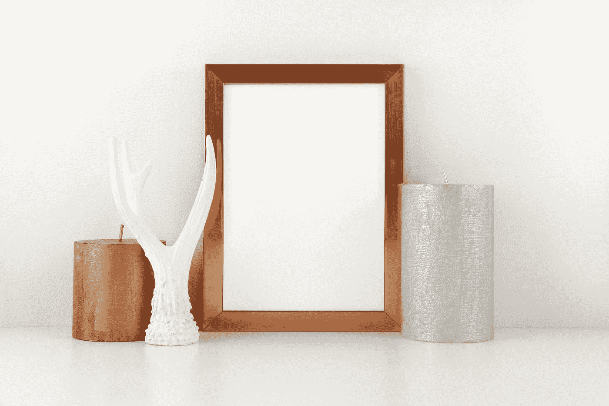

# 成帧器运动—校正变形和布局动画

> 原文：<https://blog.devgenius.io/framer-motion-correcting-distortions-and-layout-animations-b8eb6fa65a7e?source=collection_archive---------3----------------------->



安格尔·坎普在 [Unsplash](https://unsplash.com?utm_source=medium&utm_medium=referral) 上拍摄的照片

有了成帧器运动库，我们可以轻松地在 React 应用程序中渲染动画。

在这篇文章中，我们将看看如何开始与帧运动。

# 标度校正

布局动画是用`transform`属性执行的，所以我们看到平滑的动画。

动画可能会扭曲子元素。

我们可以用`layout`道具解决这个问题。

例如，我们可以写:

`App.js`

```
import React, { useState } from "react";
import { motion } from "framer-motion";
import "./styles.css";export default function App() {
  const [isOpen, setIsOpen] = useState(false); return (
    <motion.div
      layout
      data-isOpen={isOpen}
      initial={{ borderRadius: 50 }}
      className="parent"
      onClick={() => setIsOpen(!isOpen)}
    >
      <motion.div layout className="child" />
    </motion.div>
  );
}
```

`styles.css`

```
html,
body {
  min-height: 100vh;
  padding: 0;
  margin: 0;
}* {
  box-sizing: border-box;
}body {
  background: green;
  background-repeat: no-repeat;
  display: flex;
  justify-content: center;
  align-items: center;
}.App {
  font-family: sans-serif;
  text-align: center;
}.parent {
  background: white;
  width: 100px;
  height: 100px;
  display: flex;
  justify-content: center;
  align-items: center;
}.parent[data-isOpen="true"] {
  width: 200px;
  height: 200px;
}.child {
  width: 40px;
  height: 40px;
  background: green;
  border-radius: 50%;
}
```

当我们点击外部 div 时，我们通过扩展它来激活它。

我们给内部的 div 添加了`layout`道具，这样当我们给外部的 div 制作动画时就不会扭曲了。

变换也会扭曲`boxShadow`和`borderRadius`值。

为了保持它们不变，我们可以在`initial`属性中设置:

`App.js`

```
import React, { useState } from "react";
import { motion } from "framer-motion";
import "./styles.css";export default function App() {
  const [isOpen, setIsOpen] = useState(false); return (
    <motion.div
      layout
      data-isOpen={isOpen}
      initial={{ borderRadius: 50 }}
      className="parent"
      onClick={() => setIsOpen(!isOpen)}
    >
      <motion.div layout className="child" initial={{ borderRadius: "20%" }} />
    </motion.div>
  );
}
```

`styles.css`

```
html,
body {
  min-height: 100vh;
  padding: 0;
  margin: 0;
}* {
  box-sizing: border-box;
}body {
  background: green;
  background-repeat: no-repeat;
  display: flex;
  justify-content: center;
  align-items: center;
}.App {
  font-family: sans-serif;
  text-align: center;
}.parent {
  background: white;
  width: 100px;
  height: 100px;
  display: flex;
  justify-content: center;
  align-items: center;
}.parent[data-isOpen="true"] {
  width: 200px;
  height: 200px;
}.child {
  width: 40px;
  height: 40px;
  background: green;
}
```

我们设置了子 div 的`initial`道具。

我们将`border-radius`从`styles.css`中移除。

# 自定义布局动画

我们可以用`transition`属性定制布局动画。

例如，我们可以写:

`App.js`

```
import React, { useState } from "react";
import { motion } from "framer-motion";
import "./styles.css";export default function App() {
  const [isOpen, setIsOpen] = useState(false);
  return (
    <motion.div
      layout
      data-isOpen={isOpen}
      initial={{ borderRadius: 50 }}
      className="parent"
      onClick={() => setIsOpen(!isOpen)}
      transition={{
        layoutX: { duration: 0.3 },
        layoutY: { delay: 0.2, duration: 0.3 }
      }}
    >
      <motion.div layout className="child" />
    </motion.div>
  );
}
```

`styles.css`

```
html,
body {
  min-height: 100vh;
  padding: 0;
  margin: 0;
}
* {
  box-sizing: border-box;
}
body {
  background: green;
  background-repeat: no-repeat;
  display: flex;
  justify-content: center;
  align-items: center;
}
.App {
  font-family: sans-serif;
  text-align: center;
}
.parent {
  background: white;
  width: 100px;
  height: 100px;
  display: flex;
  justify-content: center;
  align-items: center;
}
.parent[data-isOpen="true"] {
  width: 200px;
  height: 200px;
}
.child {
  width: 40px;
  height: 40px;
  background: green;
  border-radius: 50%;
}
```

我们设置`transition`道具，在我们制作`y`方向动画时添加一个延迟。

我们还将动画在`y`方向的持续时间设置为 0.3 秒。

并且我们将`x`方向的动画设置为 0.3 秒。

# 结论

我们可以用布局动画来纠正扭曲。

我们可以控制布局动画如何用帧运动来渲染。