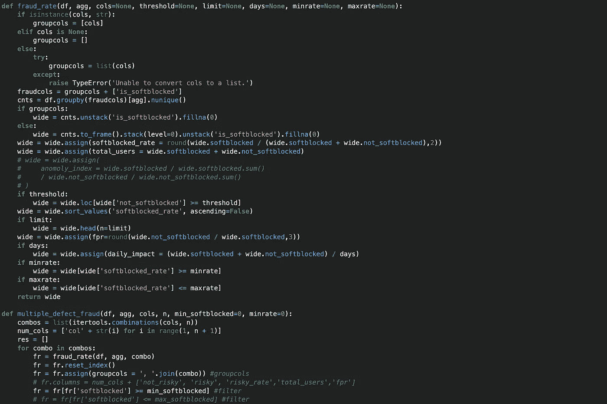
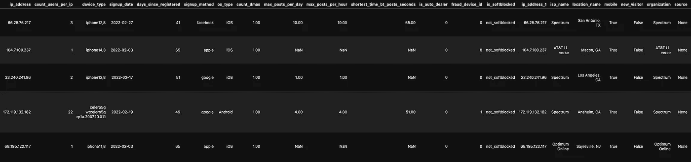
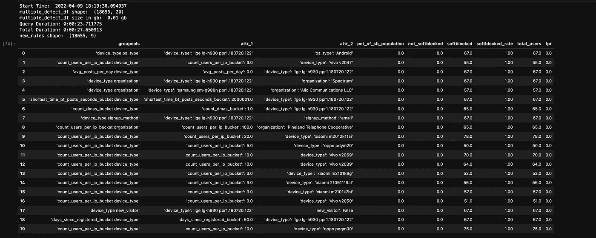
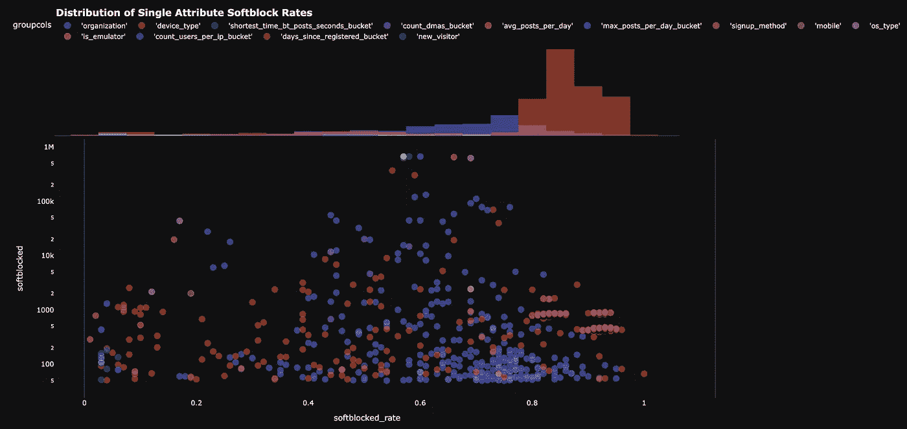
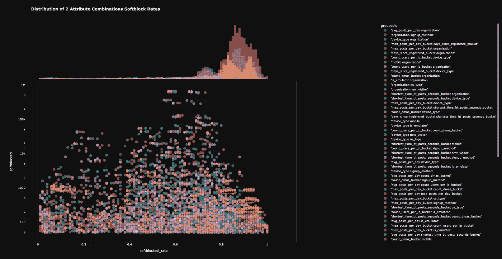

# 使用 Python 自动推荐欺诈风险规则

> 原文：<https://blog.devgenius.io/fraud-risk-rule-recommendations-with-python-fff2919fd35e?source=collection_archive---------7----------------------->

对于欺诈书呆子的利基市场



# 我们谈谈吧

我也说不清我看了多少这样的中等帖子。每次我偶然发现一些 python 主题，很明显我想要作弊代码，都是相同的无聊故事。这是我们将要建立的，这是维基百科或 pypy 页面，一步一步来。没有前戏。没有积累。连意见都不多。我的意思是，这不应该是一个专栏，但给我一些东西。我们为什么会这样？

好吧，输入 Max。我不是典型的数据科学家。当然，我更喜欢尽可能高效地做事，但我喜欢一点娱乐。这就是为什么，如果你曾经读过我以前的帖子，我打字就像说话一样。但是少一些“兄弟”和脏话。

好了，现在回到主题，用我能理解并喜欢阅读的话来说。

## 我们是 guna build…！！…一个没有机器学习的诈骗模型:)**！**

**我们需要什么？**

1.  我们需要一些数据。因为我为这个人工作，我不能使用我所有的 PII 的数据。因此，我们将使用大多数公司都有的一些基本属性。
2.  一些图书馆。zzzZZzzZ
3.  一些 Jupyter。zZZzZZZzzz
4.  一些酒精。等等……什么？？
5.  一些图表。实际上这些很有趣。
6.  和..需要在某个地方使用它…否则你为什么会在这里？你在跟踪我吗，兄弟？
7.  好了，够了。

# 数据大家好

你得到的只是一张截图——但是这张表的大意是它是`user`数据。你们都知道那意味着什么。你在十亿个你不需要的应用程序中的一个上创建了帐户..现在你被总结为一个数字来表示应用程序。感觉不错。



为什么在这里放大图像不再直观..字面谷歌如何增加图像尺寸。不管怎样，放大就行了。

好的，我们有大约一百万行，大约一个月的数据，我们有一个名为 is_softblocked 的目标，更改它以满足您的需要，函数很容易修改为您的目标，它只需要是一个二进制分类。并确保您要传递给下面函数的列是体面的特性。这里是其他人张贴维基百科页面或一些废话的地方。不。我不这么做。自己去发现什么是特色。没人付钱让我这么快就写出来。

## 我使用的功能——看起来还不错吧？

```
'avg_posts_per_day'
,'max_posts_per_day_bucket'
,'days_since_registered_bucket'
,'shortest_time_bt_posts_seconds_bucket'
,'count_users_per_ip_bucket'
,'count_dmas_bucket'
,'device_type'
,'is_emulator'
,'mobile'
,'organization' (isp)
,'new_visitor'
,'signup_method'
,'os_type'
```

哇哦 [Medium](https://medium.com/u/504c7870fdb6?source=post_page-----fff2919fd35e--------------------------------) 你的破应用要走的路——我试图弄乱图像大小，而你只是抛出这个红色错误，却忘了如何保存我的草稿。失败者。隐藏我的帖子。我谅你也不敢。

无论如何。

您将需要的贪睡节函数(修改变量和列以匹配您的数据):

我不得不在谷歌上搜索^

因此，上述所有函数将帮助您识别高风险行或低风险行。一个缺失的值代表熊猫的好运。

## 接下来实际上是用我们的数据调用这些函数。激动人心。

我不太想解释…这是我和所有老板的主要问题。比如你就不能..想明白了吗？你知道，走管理路线的人和保持个人贡献的人之间的区别是自我。不，好吧，这可能是一点钱和一点谈话的乐趣。我对后者一无所知。打字不算。你不能把我误解成一个女孩，就像美国电话电报公司每次我和客户服务部谈话时那样。你说得对，有点愤懑。

## 好的，应用这个函数应该会得到这样的结果:



还是小。抱歉。

列非常直观:

```
gruoupcols - list of attributes/features you used
attr_1 - the actual attribute's data
attr_2 - the second attr you used (if you passed n=2+
pct of total softblocked - the % of total 1’s in your population
not softblocked - 0s
softblocked - 1s
softblocked rate - rate...
total - total...
fpr - false postivies
```

# 现在是最精彩的部分——图表！

**上面的代码会给你这样的东西:**



每个规则建议都是一个分散点。向右上方是目标。

上面有一个小小的柱状图，上面写着`plotly`爱图书馆。但以上只是单属性规则。通常不会超级有帮助。您需要迭代一个列列表，并传入 N 列进行迭代(2、3、4 等。)在 4 之后变得相当计算繁重。给聪明人的一句话。

## 现在针对 2 个属性组合:



太漂亮了

我在图中添加了一个颜色变量，以查看实际的属性组合分组。如果你问我，我会觉得很有帮助。

很快——自动化将是下一个部分。但是有很多方法可以实现这种自动化——cron、airflow、一些 bi 工具等等。总的想法是让类似这样的东西按照某个时间表运行..可能是每天或每周，生成表格—存储表格以便于查询，然后在其他脚本(可能是 ML)中使用表格的结果，或者将其传递给策略团队，他们可以在您的风险引擎中对其进行编码。

但相信我，你的老板应该关心的是对提议规则的分析。测试和部署可能是你口中说出的最没意思的事情。尽量保持高水平。更少的话语能走得更远。不客气

****我相信我会收到你的电子邮件，告诉我代码中的某些东西是什么，或者我为什么这样做。我不在乎预测你的问题，所以让我们有它。***

好的，就这样。怎么样，妈妈？太磨人？还在努力。

最好的，

最大