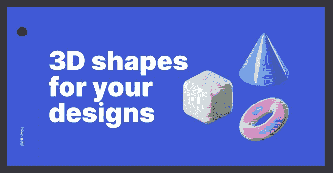

# 为您的项目提供免费 3D 插图。

> 原文：<https://blog.devgenius.io/free-3d-illustrations-for-your-project-187481a08279?source=collection_archive---------2----------------------->

3D 内容是网页设计的热门趋势。它让网站从看起来一般的状态中脱颖而出。3D 插图吸引人，引人入胜，给游客一种非凡的感觉。如果你的网站有 3D 内容，它会突然变得引人注目，给人一种未来感。

# 1.handz-three dee 的 3D 插图库

[Handz by ThreeDee](https://www.handz.design/)

HANDZ 是一个 3D 手势库，用于创建美味的图形设计。你可以把它们用在任何你想用的地方——社交媒体帖子、登陆页面、博客、时事通讯等等。

免费版本在 CC0 许可下。这意味着它对商业和个人使用都是免费的:不需要信用、许可或任何东西。

[网站下载链接](https://www.handz.design/)

# 2.绒毛- 3D 图标免费

[绒毛 3d 图标](https://fabrx.co/fluff-free-3d-icons/)

Fabrx 设计公司免费设计的 3d 图标，2D 的 20 个图标伪装成 3D。

[下载的网址链接](https://fabrx.co/fluff-free-3d-icons/)

# 3.BAM 免费 3d 插图套件

[嘭](https://gumroad.com/l/bamillu)

BAM Design 创建了一组最常用的 3D 图标。现代和丰富多彩的三维插图。任何使用都是免费的。但唯一的条件是，你不能把它们作为你的作品转卖，你要把它们的名字记在你的名下。

[下载的网址链接](https://gumroad.com/l/bamillu)

# 4.Saly - 3D 插图包

[阿里·阿拉法特](https://dribbble.com/shots/14486931-FREE-3D-ILLUSTRATION-PACK-SALY)

精选高品质 3D 插画，手工制作，个性十足。免费用于您的探索或个人项目。

[下载的网址链接](https://dribbble.com/shots/14486931-FREE-3D-ILLUSTRATION-PACK-SALY)

# 5.Figma 3d 形状

[由 Vic 设计](https://www.figma.com/community/file/917777039353073016)

由 Vic 设计，这个社区模板包括 9 个不同的 3D 形状，每个形状有 10 种颜色变化。

[下载的网址链接](https://www.figma.com/community/file/917777039353073016)

# 6.Shapefest

Shapefest

一个巨大的免费三维图形库。160，000 多张高分辨率 PNG 图像集中在一个统一的库中。

[下载的网址链接](https://www.shapefest.com/)

# 7.免费 3D 图标

[免费 3d 图标](https://free3dicon.com/)

免费的，美丽的，流行的 3D 图标，你可以在你的网站，应用程序或任何项目中使用。

[网站下载链接](https://free3dicon.com/)

# 8.情人节插画 10 朵云彩

10 朵云彩

免费给大家插画。非常详细的个人和商业项目插图集。

[用于下载的网站链接](https://10clouds.com/valentine-illustrations)

# 9.超级人物 3d

[电力人平台](https://powerpeopleplatform.com/)

Power People Platform 是一个美味的 3D 头像设计库。用爱为你的作品增添更多乐趣和色彩。

有 12 个不同的角色，每个人都有 3 种不同的肤色，6 种头发颜色，5 种服装，23 种服装颜色和无尽的背景颜色。

您可以完全免费使用 Power People 插图，无论是用于商业项目还是私人项目。

[下载的网址链接](https://powerpeopleplatform.com/)

# 10.超级三维

[超标](https://superscene.pro/)

Superscene 是 3D 插图构造器，里面有有趣的角色。为你的平台创造一个完美的故事，或者只是从包装中取出现成的场景。与 Blender、Figma 和 Sketch 兼容。您可以购买完整版或下载演示版。

[下载的网址链接](https://superscene.pro/)