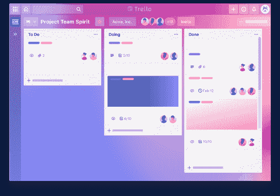
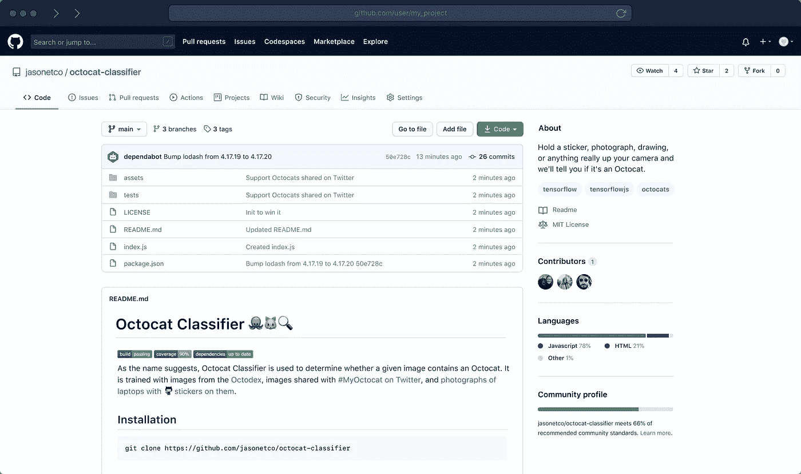
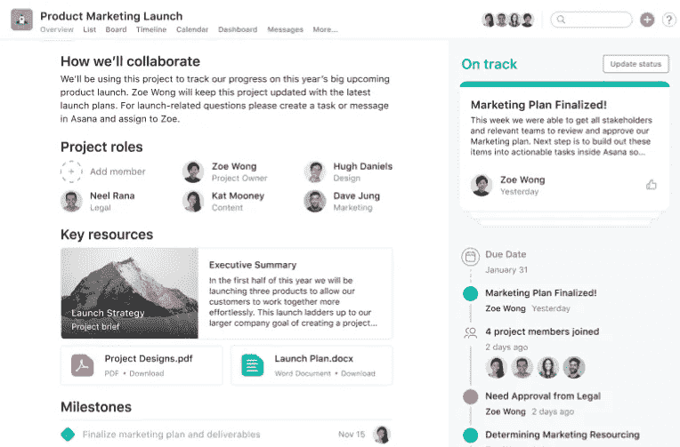
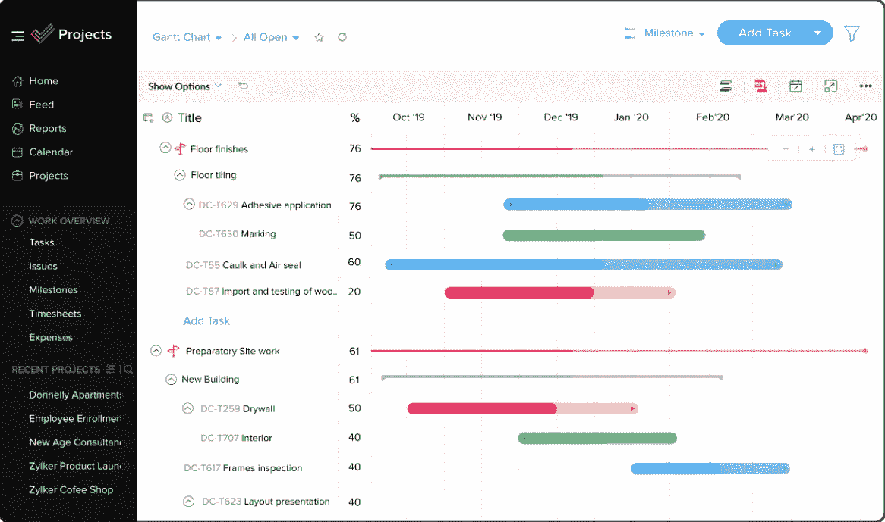

# 免费应用程序来组织你的软件开发团队

> 原文：<https://blog.devgenius.io/free-apps-to-organize-your-software-development-team-2da34acece83?source=collection_archive---------16----------------------->

## 生产力|编程

## 如何作为一个团队来组织、划分和征服你的编程项目——并成功做到这一点。

你曾经尝试过用一个小团队来构建一个项目吗？如果你有，你可能知道组织“谁做什么”的困难。人们倾向于忘记他们的任务，做他们没有计划要做的事情，或者偏离最初建立的想法很多。那是令人沮丧的。

## [特雷罗](https://trello.com/es/home)

Trello 可能是这类应用中最出名的。与它的主要竞争对手 monday.com 相比，我仍然认为它要好得多。

来自 Trello 的官方网页

我们不能忘记一件事:Trello 是完全*免费的*，它涵盖了我们大部分的必需品。最重要的是，对于初学者或不知道如何使用终端的人来说，Trello 是一个很好的选择——它有自己的移动设备应用程序！

特征

*   对参与者的数量没有限制
*   提供表格、计时表和门票
*   提供自动化
*   兼容 Dropbox 或 drive 等软件
*   每队最多 10 桌

## [GitHub](https://github.com)

GitHub 是国际公认的互联网上最好的免费版本控制软件(VCS)。但是如果我告诉你 GitHub 不仅仅是一个 VCS 呢？

图片来自 GitHub

GitHub(基于 git 语言)为用户带来了许多工具和机会，帮助他们协调团队和项目。与之相对应的是，为了正确使用 GitHub*，必须记录自己。我不会说 GitHub 是初学者友好的，但对于那些愿意花时间学习如何使用它的人来说，它仍然是一个非常好的选择。*

*特点:*

*   *推/拉请求*
*   *类似看板的表格*
*   *计时图*
*   *私人回应*
*   *角色管理*
*   *无限合作者*

## *[体式](https://asana.com)*

*Asana 旨在帮助用户在其他应用程序中组织他们的工作。我会把它描述为一个持续或者一个辅助工具，而不是关注的焦点(GitHub 就是这样)。*

**

*Asana 工作流程快照*

*Asana 基本上是一种即插即用的服务。这意味着它可以很好地与你日常工作中使用的应用程序和网站配合使用，如 Google Drive、Google Sheets、Photoshop 等*

*特点:*

*   *易于组织的董事会*
*   *角色管理*
*   *清晰明了的界面*
*   *任务自动化*
*   *多达 15 名合作者*

## *[Zoho 项目](https://www.zoho.com/projects/)*

*Zoho Projects 类似于 Trello，但有一点局限性。它可能比 Trello 更友好，用户界面可能更现代，但它有明显的缺点。*

**

*Zoho 项目的工作风格示例。*

*Zoho 项目对于那些不愿意进入复杂软件的人来说可能很好，但是它有一个很大的缺点:它的免费版本最多只允许 3 个合作者。这对小的独立团队来说可能行得通，但对大团队来说就行不通了。*

*特点:*

*   *简单的用户界面*
*   *清晰易懂的计时表*
*   *与其他办公软件配合良好*
*   *在其免费计划中最多 3 个合作者*