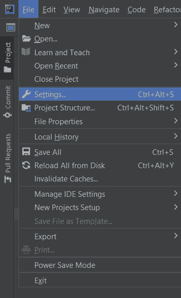
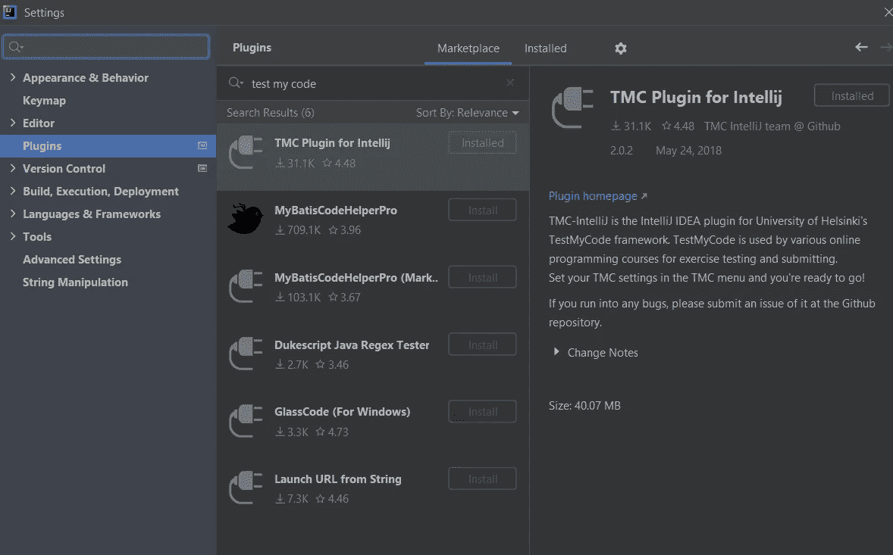
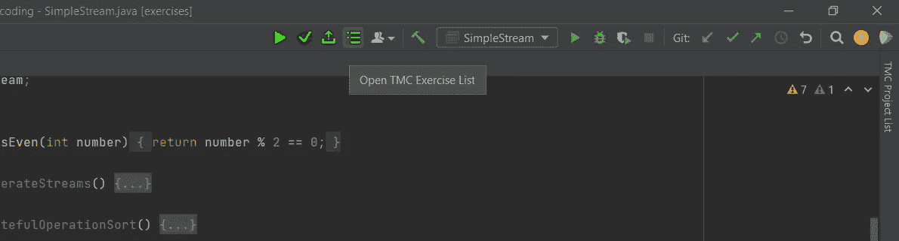
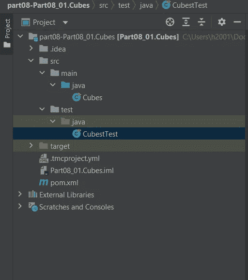

# 免费互动编程课程

> 原文：<https://blog.devgenius.io/free-interactive-programming-course-e51efac51290?source=collection_archive---------3----------------------->

跟赫尔辛基大学学 Java

我想这是赫尔辛基大学

# 你是想学编程吗？

你完全是初学者吗？或者也许你不是初学者，但你正在努力学习 Java，这个课程是为你而设的。

赫尔辛基大学发布了一个交互式在线课程，教授使用 Java 进行面向对象编程，我亲自参加了这个课程，它对我来说既有启发性又令人愉快。

在这篇文章中，我将向你解释我认为对这门课程和一般编程来说最好的设置。

# 课程结构

本课程用的是 Java 8，比较老(Java 17 发布了！)但仍然非常相关，对于初学者来说这已经足够了。

课程分为两个主要部分:“Java 编程 I”和“Java 编程 II”，这很好，因为完全的初学者可以从第一部分开始，对编程更熟悉的人可以从第二部分开始。

本课程涵盖了 if 语句和循环等基础课程，也涵盖了流等中级课程，非常适合初学者。

# 你需要做什么

你将需要一个“集成开发环境”或简称 IDE，这不过是一个旨在帮助程序员的文本编辑器，对于 Java，我推荐使用 [***IntelliJ 社区版***](https://www.jetbrains.com/idea/download/#section=windows) ，下载并安装在你的电脑上。

> **注意**:课程推荐使用 **NetBeans** IDE，我使用过它，但不喜欢它，所以我换成了 IntelliJ，这就是我推荐 IntelliJ 的原因，如果你愿意，请随意尝试 NetBeans。

课程附带了一个测试/评分插件，简称为“测试我的代码”,这个工具会给你的课程练习评分，使用这个工具是可选的，但我建议你使用它，你可以通过进入文件/设置/插件/并搜索“测试我的代码”将这个工具添加到 IntelliJ

转到设置并找到插件部分

搜索市场以找到 TMC 插件

你需要[为 TMC 创建一个账户](https://www.mooc.fi/en/sign-up/)，这样课程就可以跟踪你的成绩，当你打开 IntelliJ 时，它会提示你登录 TMC。

TMC 将在 IntelliJ 的上部选项卡中添加几个按钮，选择列表图标来下载练习文件

选择列表图标下载练习文件

下载练习后，您可以解决它们，并通过导航到 <exercise name="">/src/test/java 来测试您的解决方案，并通过点击测试类名旁边的绿色播放按钮“υ”来运行测试</exercise>

测试文件目录

你也可以提交你的程序在大学的服务器上进行测试和评分，这也会保存你的分数，这很好(所有这些都是可选的)。

# 怎么学习？

我在学习 Java 时所做的就是按照课程一步一步地解决每个练习。

如果你不能通过某个练习，试着在网上寻找答案，如果你找不到答案，跳到下一个练习，稍后再回到那个练习，重点是理解你所学的，而不是解决练习。