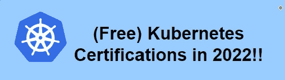

# (免费)2022 年 Kubernetes 认证！！

> 原文：<https://blog.devgenius.io/free-kubernetes-certifications-in-2022-90cb4e17db19?source=collection_archive---------1----------------------->

未来是 Kubernetes。毫无疑问，这将开创应用开发的新时代，一切都将依赖于 API/微服务。

作者照片

因此，如果你想在 Kubernetes 获得一份**的高薪工作，理解它的**特性和框架**是至关重要的。**

在这篇博客中，我将分享一份你应该知道的**免费 Kubernetes 认证**的综合列表。

# Kubernetes 基础知识:

Great Learning Academy 提供本课程是为了提高对 Kubernetes 的**基础知识、容器**以及讨论其**用途、功能和安装说明。**

这大多是初学 kubernetes 的新手首选，点击以下链接注册: [Kubernetes 基础知识。](https://www.mygreatlearning.com/academy/learn-for-free/courses/introduction-to-kubernetes1)

# **IKS(IBM Cloud 上的 Kubernetes):**

IBM 正在为 kubernetes 提供关于 IBM Cloud 的免费课程和动手实验，并在课程结束时授予您一枚徽章，该徽章解释了**容器化及其核心概念，在 Kubernetes 上构建可扩展的应用程序，以及在 IBM Cloud 上监控 K8 的集群。**

要注册，请点击以下链接: [IKS](https://www.ibm.com/cloud/kubernetes-service/kubernetes-tutorials)

# Docker 网络:

Docker 是虚拟化的基础，它被组织广泛用于运行微服务环境。在本课程中，您将了解关于 Docker 中的**存储和高级网络主题的更多信息。**

要注册，点击以下链接注册: [Docker 网络课程](https://www.mygreatlearning.com/academy/learn-for-free/courses/docker-for-intermediate-level)

# Kubernetes 运营商:

**SUSE(多集群产品)** Tigera **(Kubernetes 网络和安全产品)** Solo **(服务发现、负载平衡、加密、认证、授权等)** Sumologic **(可观察性、可追溯性)**是**杰出的市场参与者**以及他们的**K8**产品。他们正在提供免费课程，提供关于其功能的知识，随后是认证，我发现这对每个人都有好处。

要注册并开始 SUSE 认证，请点击以下链接: [SUSE 操作员](https://community.suse.com/courses/4242073/content)

要注册并开始 calico 认证，请点击以下链接:[认证 Calico 操作员](https://academy.tigera.io/course/certified-calico-operator-level-1/)。

要注册并开始 Istio 认证，请点击以下链接:[Istio 认证必备](https://www.solo.io/blog/get-certified-on-the-essentials-for-istio/)。

要注册并开始相扑认证，请点击以下链接:[相扑逻辑认证](https://www.sumologic.com/learn/certifications/)

# 混沌工程:

一种在问题变成故障之前发现问题的策略叫做混乱工程。无论你的职位或教育背景如何，这个认证让任何对可靠性感兴趣的人都可以轻松成为**混沌工程从业者。**

要注册并开始认证，请点击以下链接: [Gremlin 混沌工程从业者认证](https://www.gremlin.com/certification)

**关注我的其他文章，你可能会感兴趣:**

> [(免费)微软 Azure 认证 2022！！](https://medium.com/@musunurusharmila/free-microsoft-azure-certification-2022-798998069c87)
> 
> [2022 年免费 Devsecops 认证！！](https://medium.com/@musunurusharmila/free-devsecops-certifications-in-2022-ab49e5f9b87e)
> 
> [(免费)2022 年 4 个 Devops 认证！！](https://medium.com/@musunurusharmila/free-4-devops-certifications-in-2022-ba3a174946f7)
> 
> [(免费)2022 年网络安全认证！！](https://medium.com/@musunurusharmila/free-cybersecurity-certifications-in-2022-98d50aa9eb25)
> 
> [(免费)2022 年学生微软认证！！](https://medium.com/technology-hits/free-microsoft-certifications-for-students-in-2022-4e83085d5aa)
> 
> [微软-azure-free-training-get-free-exam-voucher-for-certification-as-bonus-2022](https://faun.pub/microsoft-azure-free-training-get-free-exam-voucher-for-certification-as-bonus-2022-a5e43ff496a9?source=your_stories_page-------------------------------------)
> 
> 在 Azure 上运行 Kubernetes 最便宜的方式？
> 
> [7-devo PS-tools-ymk-in-2022](https://faun.pub/7-devops-tools-ymk-in-2022-cb4536db2ee9?source=your_stories_page-------------------------------------)
> 
> [(免费)CSA 考试券 2022！！。](https://medium.com/@musunurusharmila/free-csa-exam-voucher-2022-af4bc9bad3e3)
> 
> [2022 年免费 Kubernetes 资源！！](/free-kubernetes-resources-in-2022-59f78fd503d1)
> 
> [(免费)2022 年 Kubernetes 认证！！](/free-kubernetes-certifications-in-2022-90cb4e17db19?source=your_stories_page-------------------------------------)

敬请关注并关注 [me](https://medium.com/@musunurusharmila/) 获取更多更新。别忘了给我们你的👏如果你喜欢阅读这篇文章来支持你的作者。！！

> 如果你想了解更多，请点击我的参考链接加入打折的 5 美元会员。

