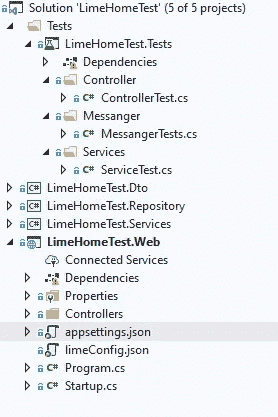
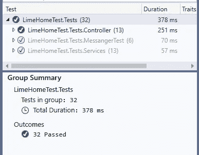
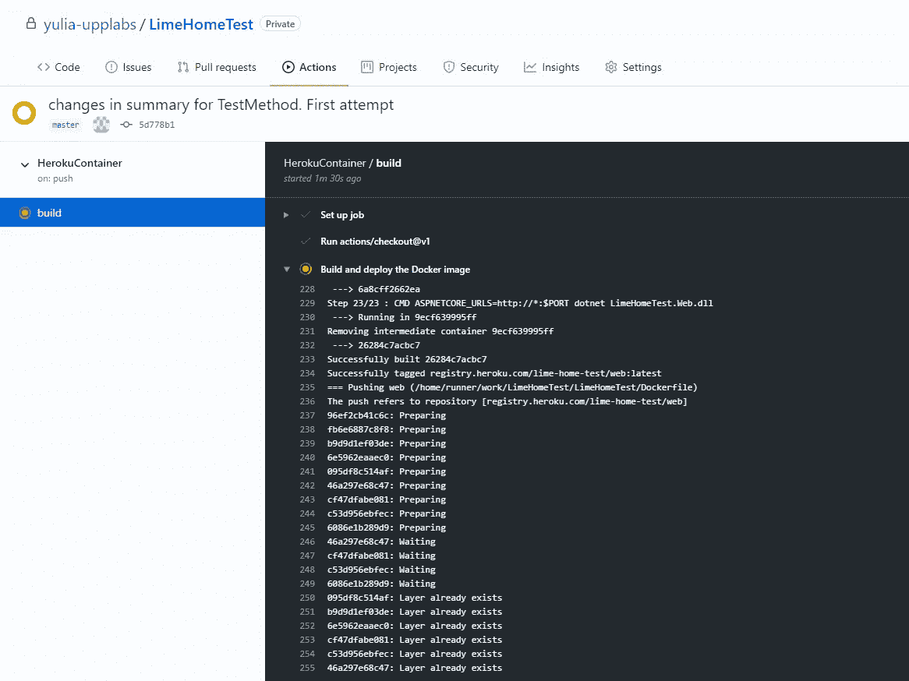
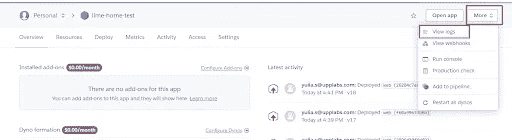
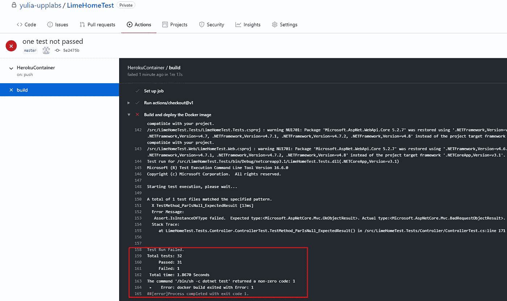

# 免费。通过 Docker 和 GitHub 在 Heroku 上托管 net core。使用单元测试部署

> 原文：<https://blog.devgenius.io/free-net-core-hosting-on-heroku-through-docker-and-github-deploy-with-unit-tests-50db3530606e?source=collection_archive---------10----------------------->

*本指南由* ***尤利娅*** *撰写，是上一篇* [***关于免费***](https://upplabs.com/free-net-core-hosting-on-heroku-through-docker-and-github-guide-for-startups/) **[***部署的后续文章。net***](https://upplabs.com/skills/net/) *核心托管在 Heroku 上通过 Docker 和 GitHub 来配置持续集成。今天的目标是调整过程，以便只有当所有的单元测试都通过时，才进行部署。此外，本文还提出了监控持续集成过程的问题。***


免费。通过 Docker 和 GitHub 在 Heroku 上托管 net core。使用单元测试进行部署。由 UppLabs 提供

最初发表于 [UppLabs 博客](https://upplabs.com/blog/free-net-core-hosting-on-heroku-through-docker-and-github-deploy-with-unit-tests/)。

这篇文章对寻求免费托管应用的初创公司和早期项目很有用。

# 主街区

所以，让我们言归正传，回到上一篇文章的项目结构。



单元测试覆盖了大部分代码，目前所有的测试都是成功的:



要将单元测试验证添加到您的持续集成过程中，您需要对 docker 文件进行一些修改:

```
FROM mcr.microsoft.com/dotnet/core/sdk:3.1 AS build
WORKDIR /src
COPY ["LimeHomeTest.Web/LimeHomeTest.Web.csproj", "LimeHomeTest.Web/"]
COPY ["LimeHomeTest.Services/LimeHomeTest.Services.csproj", "LimeHomeTest.Services/"]
COPY ["LimeHomeTest.Repository/LimeHomeTest.Repository.csproj", "LimeHomeTest.Repository/"]
COPY ["LimeHomeTest.Dto/LimeHomeTest.Dto.csproj", "LimeHomeTest.Dto/"]
COPY ["LimeHomeTest.Tests/LimeHomeTest.Tests.csproj", "Tests/LimeHomeTest.Tests/"]
RUN dotnet restore "LimeHomeTest.Web/LimeHomeTest.Web.csproj"
COPY . .# testing
WORKDIR /src/LimeHomeTest.Web
RUN dotnet build
WORKDIR /src/LimeHomeTest.Tests
RUN dotnet testWORKDIR "/src/LimeHomeTest.Web"
RUN dotnet build "LimeHomeTest.Web.csproj" -c Release -o /app/buildFROM build AS publish
RUN dotnet publish "LimeHomeTest.Web.csproj" -c Release -o /app/publishFROM base AS final
WORKDIR /app
COPY --from=publish /app/publish .
CMD ASPNETCORE_URLS=http://*:$PORT dotnet LimeHomeTest.Web.dll
```

与以前版本的 dockerfile 相比，我们可以看到，带有测试的项目副本被添加到了映像中:

```
COPY ["LimeHomeTest.Tests/LimeHomeTest.Tests.csproj", "Tests/LimeHomeTest.Tests/"]
```

以及运行测试来检查它们的传输:

```
WORKDIR /src/LimeHomeTest.Web
RUN dotnet build
WORKDIR /src/LimeHomeTest.Tests
RUN dotnet test
```

让我们通过 PowerShell 运行本地映像创建，以确保映像创建成功:

```
docker build . -t lime-test -f Dockerfile
```

如果构建成功，您可以提交并将其推送到主分支。

这就是全部的魔力！主要工作已经完成，但现在，让我们休息一下，确保一切都像瑞士表一样顺利。

# 试验

## 案例 1:所有测试都是成功的

我们已经做了所有的更改，所有的测试仍然是成功的，所以我将推送到主分支并观察部署过程。刚刚进行的推送应该会在 GitHub 上运行工作流(参见 [**之前的文章**](https://upplabs.com/blog/free-net-core-hosting-on-heroku-through-docker-and-github-guide-for-startups/) )。

事实上，如果你去 GitHub 上的存储库→ Actions → commit → build，你可以看到关于映像进度的信息:



我等待过程完成…一切顺利！下一步是将映像部署到 Heroku。您可以通过日志跟踪部署过程。为此，请转到您的应用程序—更多→查看日志按钮。



因此，只需点击几下，我们就可以获得有关部署的信息。我们检查大概的时间，以了解我们的提交当前是否正在处理日志。

正如您从日志中看到的，部署已经通过，现在您可以直接在网站上看到更改。

## 案例 2:并非所有的测试都是成功的

一切都很好，但是现在我们可以做一个实验，稍微破坏一下单元测试，只是为了检查部署不会发生。

我的一个测试是这样的:

```
[TestMethod]
  public void TestMethod_ParIsNull_ExpectedResult()
  {
var ServiceMock = new Mock<IService>();
var LoggerMock = new Mock<ILogger<PropertiesController>>();
var sut = new PropertiesController(ServiceMock.Object, LoggerMock.Object);var response = sut.TestMethod(null);Assert.IsNotNull(response);
Assert.IsInstanceOfType(response, typeof(BadRequestObjectResult));
Assert.AreEqual((int)HttpStatusCode.BadRequest, (response as BadRequestObjectResult).StatusCode);
}
```

我会做一些改变:

```
[TestMethod]
  public void TestMethod_ParIsNull_ExpectedResult()
  {
var ServiceMock = new Mock<IService>();
var LoggerMock = new Mock<ILogger<PropertiesController>>();
var sut = new PropertiesController(ServiceMock.Object, LoggerMock.Object);var response = sut.TestMethod(null);Assert.IsNotNull(response);
Assert.IsInstanceOfType(response, typeof(OkObjectResult));
Assert.AreEqual((int)HttpStatusCode.OK, (response as OkObjectResult).StatusCode);
}
```

这个测试将会失败，因为在 Assert 块中我们将会看到`OkObjectResult`，而实际上在输入参数为 null 的情况下，我们得到了`BadRequestObjectResult`。

我执行通常的过程——推送到主分支，然后在 GitHub 上的控制台中→操作我遵循创建映像的过程:



构建未成功通过。为什么？因为它没有通过一项测试(雅虎！).如果我们查看 Heroku 上的日志，我们将不会在近期看到任何记录，这很符合逻辑:docker 的映像没有创建，因此我们没有到达它在 Heroku 上部署的时刻。

赢了！目标实现了:如果至少有一个测试没有通过，部署就不会发生。

附言:如果您需要任何关于 [**托管您的应用程序或开发它**](https://upplabs.com/technical-skills/) 并验证它的想法或功能的帮助——[**UPP labs 随时为您提供帮助**](https://upplabs.com/contact-us/) ！

P.p.s .验证你的创业想法，并做一个小测验来确定你的企业是否存在一些问题:

[](https://upplabs.com/quiz/) [## 测验:你知道你的企业存在哪些问题吗？

### 该网站使用 cookies 来改善您的体验。我们假设您对此没有意见，但是如果您…

upplabs.com](https://upplabs.com/quiz/)