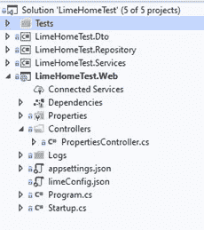
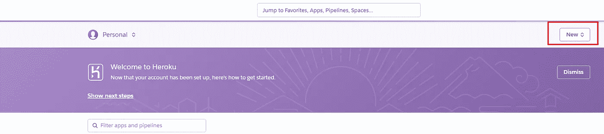
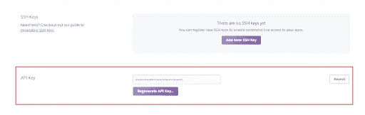
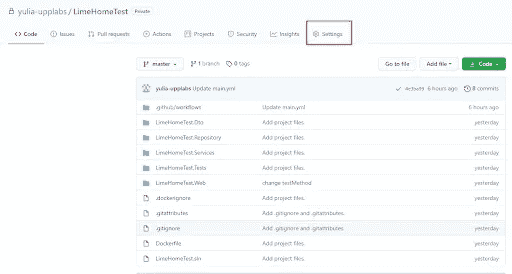
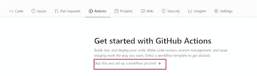
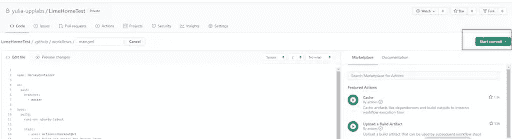
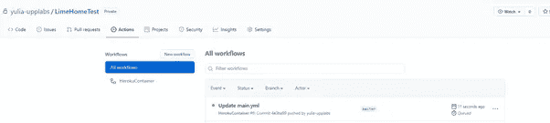
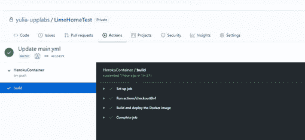
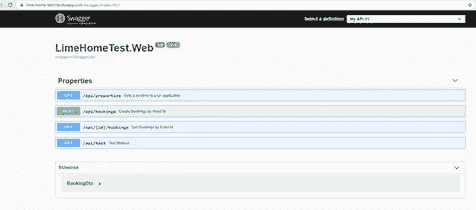

# 免费。通过 Docker 和 GitHub 在 Heroku 上托管 net core

> 原文：<https://blog.devgenius.io/free-net-core-hosting-on-heroku-through-docker-and-github-e455d73f9a19?source=collection_archive---------3----------------------->

*本指南由* ***尤利娅·塞沃斯季亚诺娃*** *撰写，对在上开发应用的初创公司非常有用。净核心，并开始考虑为它部署的地方，所以它可以给整个世界带来一些快乐，除了他们的亲人。*


免费。通过 Docker 和 GitHub 在 Heroku 上托管 net core。由 UppLabs 提供

基于我们对自然的了解，我们当然喜欢免费得到一些东西。请注意，我们有好消息要告诉你——现在有可能了！现在有一个很棒的解决方案，叫做 [**Heroku**](https://www.heroku.com/) 平台。

Heroku 是一个基于云的 [**PaaS**](https://en.wikipedia.org/wiki/Platform_as_a_service) 平台，支持多种编程语言(在撰写本文时 C#还没有得到官方支持，但这并不妨碍我们)，并且基于一个托管容器系统来部署和启动应用程序。Heroku 提供 DNS * .herokuapp.com。

# 初步准备

首先，我们需要一份。你引以为豪的，你认为值得向世人展示的. Net 核心应用。

我将使用。Net 核心 web API 作为测试用例。

接下来，我们将使用 Docker 作为应用程序的容器。

要做到这一点没有任何问题，你需要在[**https://hub.docker.com/**](https://hub.docker.com/)注册。在那里你还可以找到 Docker 桌面安装的说明，我们以后会用到。

此外，我们需要用 GitHub 上的 Docker 文件签入开发的项目。

我们需要做的最后一件事就是注册 Heroku。

# 关键时刻是部署

## 第一步。准备创建容器映像

当我的测试解决方案准备好进行部署时，它的结构通常如下所示:



## 第二步。创建一个图像

我的下一步是创建一个图像来容器化应用程序。为此，我们需要向解决方案文件夹添加两个文件:Dockerfile 和. dockerignore。

文档的内容:

```
FROM mcr.microsoft.com/dotnet/core/sdk:3.1 AS base
WORKDIR /app
FROM mcr.microsoft.com/dotnet/core/sdk:3.1 AS build
WORKDIR /src
COPY ["LimeHomeTest.Web/LimeHomeTest.Web.csproj", "LimeHomeTest.Web/"]
COPY ["LimeHomeTest.Services/LimeHomeTest.Services.csproj", "LimeHomeTest.Services/"]
COPY ["LimeHomeTest.Repository/LimeHomeTest.Repository.csproj", "LimeHomeTest.Repository/"]
COPY ["LimeHomeTest.Dto/LimeHomeTest.Dto.csproj", "LimeHomeTest.Dto/"]
RUN dotnet restore "LimeHomeTest.Web/LimeHomeTest.Web.csproj"
COPY . .
WORKDIR "/src/LimeHomeTest.Web"
RUN dotnet build "LimeHomeTest.Web.csproj" -c Release -o /app/build
FROM build AS publish
RUN dotnet publish "LimeHomeTest.Web.csproj" -c Release -o /app/publish
FROM base AS final
WORKDIR /app
COPY --from=publish /app/publish .
CMD ASPNETCORE_URLS=http://*:$PORT dotnet LimeHomeTest.Web.dll
```

让我们更仔细地看看。Dockerfile 有点像包含几个步骤的批处理脚本。正如我们从脚本中看到的，首先我们复制了所有的解决方案草案、构建、发布和打包。

值得注意的是最后一行，因为当图像在 docker 容器中启动时，它执行命令来启动应用程序。

它是特定于 Heroku 的，因为 Heroku 通过一个端口获得 HTTP 流量，该端口是一个$ PORT 环境变量。因此，您必须指定一个默认地址，以便在应用$PORT 变量的容器中使用。

的。dockerignore 文件包含了 docker 会忽略的所有内容。

在 docker 文件和。dockerignore 文件已经写好，放在解决方案文件夹中，Docker 桌面已经安装启动，我们可以尝试使用 Power Shell 在本地创建一个镜像，确保创建成功。将来，图像将使用 GitHub 上的工作流创建，但让我们保持一致…

因此，让我们使用管理员权限运行 Power Shell(以及 Docker Desktop ),转到解决方案文件夹(Docker 文件也在那里),然后运行命令:

```
docker build . -t <image_name> -f Dockerfile
```

如果图像创建成功，除了显示的其他内容之外，我们还可以看到以下内容:

```
Successfully built cb992a976e1d
Successfully tagged lime-test:latest
```

如果没有，那么恭喜你，是时候开始为此唱唱歌，跳跳舞了。仔细阅读错误，你可能会明白什么是错的…

## 第三步。在 Heroku 上创建应用程序

我们继续前进。下一步是在 Heroku 上创建一个应用程序。在仪表板上，您会发现新按钮:



我们单击它，填写应用程序名称字段，选择最近的区域，然后单击创建应用程序。应用程序已经创建，因此我们成功地通过了步骤 3。

## 第四步。最后一个。使用 GitHub 工具设置持续集成

我们还有最后一跳，所以我们聚集所有的力量，快速通过最后一个阶段。为此，您需要在 GitHub 上创建一个项目存储库。我们不会详细讨论这个问题。

因此，您基于 docker 文件的应用程序已经在 GitHub 存储库中了。您将需要使用 Heroku 提供的密钥来设置持续集成。

我们需要做的就是复制密钥。然后点击 Heroku 仪表盘右上角的用户图标，选择“账户设置”。向下滚动直到看到“API 密钥”，然后点按“显示”并复制密钥。



在 GitHub 存储库中，选择“设置”菜单，然后选择“秘密”—“新秘密”。



在 Name 字段中，我们指定键的名称(我选择了——HEROKU _ API _ KEY ),并将从 HEROKU 复制的键插入 Value 字段。

现在是时候在 GitHub 上建立一个行动了。我们返回到存储库，选择 Actions 菜单(与“Settings”位于同一位置)，选择“set up a workflow yourself”。



这就是我们如何在 GitHub 上获得 main . yml——workflow——文件，它可以帮助我们配置相同的持续集成。所以，让我们编辑这个文件如下:

```
name: HerokuContainer

on:
  push:
	branches:
  	- master

jobs:
  build:
	runs-on: ubuntu-latest

	steps:
  	- uses: actions/checkout@v1
  	- name: Build and deploy the Docker image
    	env:
          HEROKU_API_KEY: ${{ secrets.HEROKU_API_KEY }}
      	APP_NAME: ${{ 'lime-home-test' }}
    	run: |
      	docker login --username=_ --password=$HEROKU_API_KEY registry.heroku.com
      	heroku container:push web -a $APP_NAME
      	heroku container:release web -a $APP_NAME
```

在第一行中，我们设置了工作流的名称，然后在 master-branch 中的 push 上应用触发器来启动工作流。每个工作流必须至少有一个包含完成特定任务的一系列步骤的作业。

在我们的例子中，我们使用一个在默认虚拟环境(ubuntu-latest)上运行的作业。在 Heroku_API_KEY 和 APP_NAME 变量中，我们记下秘密的 HEROKU 密钥和在 HEROKU 上创建的应用程序的名称，然后一行代码启动 docker 文件来创建容器的映像:

```
docker login --username=_ --password=$HEROKU_API_KEY registry.heroku.com
```

下一个命令构建图像并将其推入 Heroku 容器(lime-home-test app)。之后，我们可以最终创建一个发布，把它放在代码的最后一行。

工作流已准备就绪，我们将在出现的窗口中单击“开始提交”——提交更改，这将开始执行此工作流。



之后，如果您转到 Actions，您将看到创建的带有提交的工作流。

在我的例子中，它是构建阶段的 Update main.yml 提交(后面跟着一个黄色圆圈)。



通过点击 commit 链接，您可以看到关于构建过程的信息。在 build 选项卡上，您可以找到所有必要的信息。如果一切顺利，那么所有项目都将有绿色勾号。



# 在本地

之后，不要忘记在本地项目中处理 Pull，以提取刚刚在 GitHub 中创建的工作流。您将在项目的根文件夹中找到 main.yml 文件。下一个文件夹-。github ->工作流-> main.yml。

正如您可能已经猜到的那样，在所描述的方式中，我们可以手动创建工作流作为 main.yml 文件，并且它也将在提交阶段启动。

万岁！我们做到了，工作流程没有错误，应用程序应该已经部署在 Heroku 上了。



从现在开始，通过 GitHub 上配置的工作流自动进入主分支的每一个变更都将被部署到 Heroku 上。

恭喜你。

附:如果您在托管或开发您的应用程序以及验证其想法或功能方面需要任何帮助，UppLabs 将为您提供帮助 ！