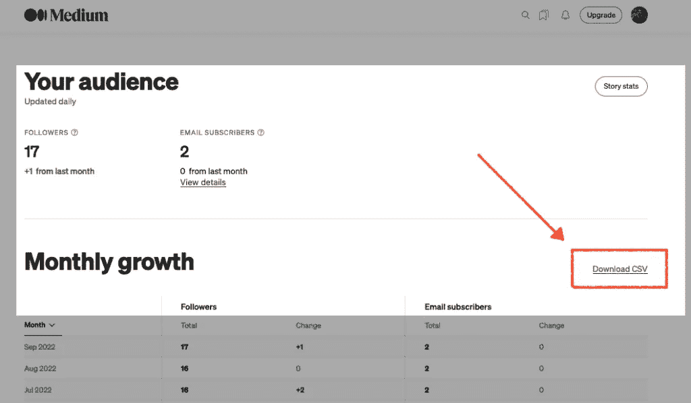
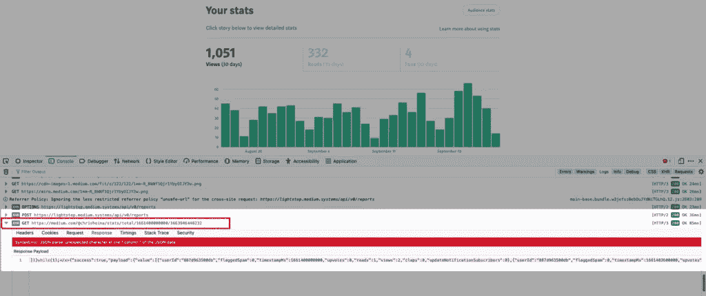
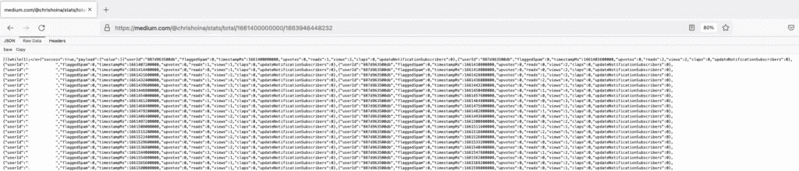
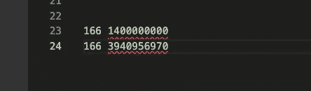
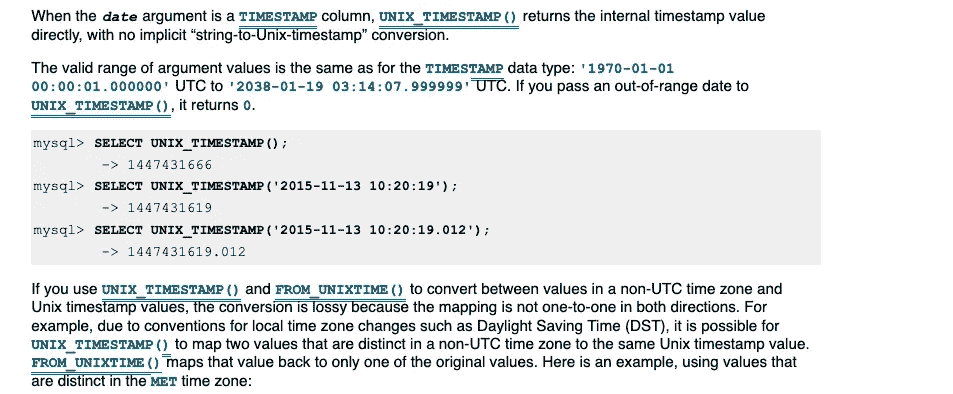
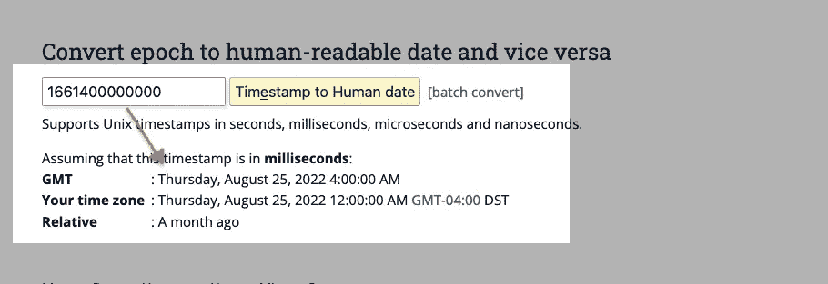
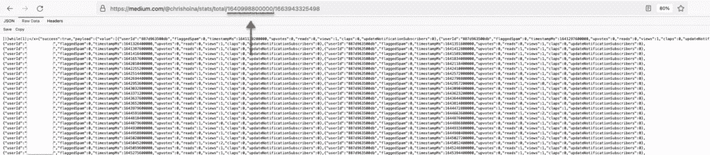
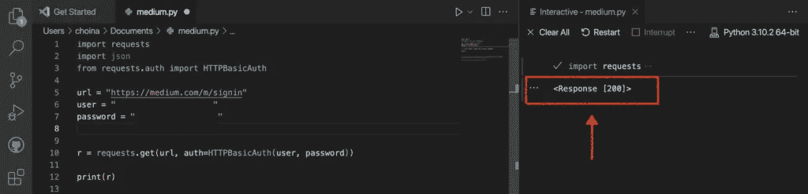
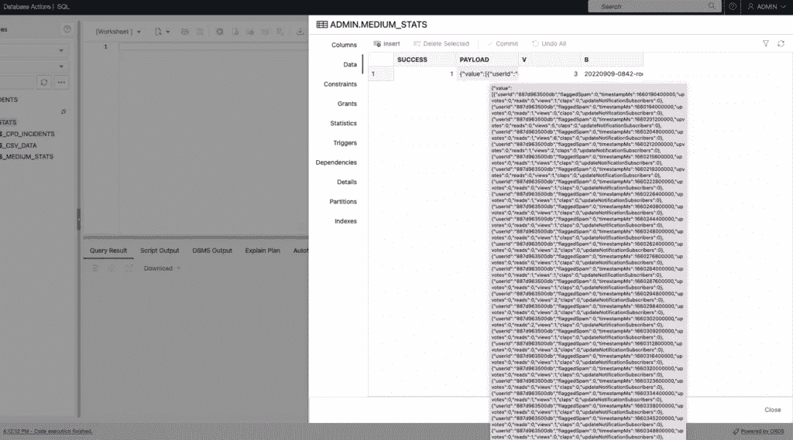

# Python GET 请求、中等统计数据和 Oracle 自治数据库带来的乐趣

> 原文：<https://blog.devgenius.io/friday-fun-with-python-get-requests-and-the-oracle-autonomous-database-af3a6153369c?source=collection_archive---------13----------------------->

我觉得发这个帖子很傻，因为你很快就会意识到，我现在不得不把事情做完*。但是我太兴奋了，我真的有东西要分享了！*

*如果你一直在关注，你知道你总能在我的博客上找到我。但我也尽力在其他渠道交叉发布:*

*   *[LinkedIn](https://www.linkedin.com/in/chrishoina/)*
*   *Tealfeed (目前来看，这种情况可能会有所改变)*
*   *中等(咄)*

*但是考虑到我所做的一切都支持开发社区，受众统计对我来说总是至关重要的。因此，我会定期查看我在博客和其他网站上的统计数据，以了解最热门的话题。*

*Python 继续做 ***巨大的*** 。任何与 Python 和 REST API 相关的东西。我的 [Python 和查询过滤](https://followthecoffee.com/sort-oracle-json-python-or-queries/)和 [Python 帖子请求](https://followthecoffee.com/python-post-requests-three-ways-with-oracle-rest-data-services-ords/)帖子似乎产生了很多兴趣。*

*不久前，我甚至做了一个非常受欢迎的 RegEx 帖子。谢天谢地，*没有那么流行，因为通过正则表达式工作让我很痛苦。**

*我可以在我的博客上快速查看站点统计数据，但是其他地方，比如 Medium，就比较难破译了。当然，你可以下载你的观众统计数据，但遗憾的是你的故事统计数据不能下载😐。*

**

*观众统计下载，但没有故事统计下载。*

*我没有被吓倒，我想看看是否有可能获得我的*故事*统计数据。这是可能的，在某种程度上…*

# *展示和讲解*

*如果在您登录到您的中型帐户后，导航到您的统计页面，在您的浏览器中打开开发者工具并导航到您的“控制台”从那里，重新加载页面，并简单地观察所有的流量。*

*你会看到一堆请求:*

*   *`GET`*
*   *`POST`*
*   *`OPTION`(老实说，我不知道这是什么，但我也还没有研究过)*

*我认为统计数据内容是通过这些 API 请求之一产生的。所以是的，我(一次一个)展开了每个请求，并查看了每个请求的响应体。我一直这么做，直到找到有用的东西。几分钟后，它出现了:*

**

*神奇的`GET`请求。*

*我确认我已经挖到了金子，把这个网址放入一个新的浏览器窗口，然后按下回车键。在选择“原始数据”后，我看到了这个:*

**

*仔细检查原始 JSON。*

*事实上，我们看到了我的故事统计。但是 URL 中的最后两个路径对我来说毫无意义。*

**

*图灵时间到了！*

*它们看起来如此相似…我别无选择，只能激活图灵模式。*

**

*一样的前缀，有意思…*

*我可以看到这些数字是相似的，所以我在我的文本编辑器中排列它们，看到它们共享相同的 **166** 前缀。我不太了解机器可读的代码，但是由于我的屏幕上显示的是过去 30 天，我想这可能是*的某个日期*。但是我以前从未见过这样的事情，所以我不是 100%确定。*

# *Unix 时间戳*

*在大约 20 分钟的搜索和几乎放弃之后，我在我们的 Oracle docs(一个 MySQL 参考指南)中找到了一些引用了 Unix 时间戳的东西。找到了。*

**

*关于 Oracle MySQL 文档中的 Unix 时间戳。*

*成功，我找到了。所以我搜索了一个“Unix 时间戳计算器”并输入数字。事实证明我的预感是正确的；这确实是过去的三十天！*

**

*验证 Unix 时间戳。*

*所以现在我想知道，如果我改变了`GET`请求中的前导日期，是否允许我获取从 2022 年 1 月到现在的所有故事统计数据？哦，当然，会的！*

**

*我所有的故事统计从 2022 年 1 月到现在。*

# *线的尽头*

*好的，所以这里我必须让它保持开放。我今天有有限的时间来做这件事，但我想做的是看看我是否可以使用基本身份验证来验证我的中型帐户。并且至少得到一个 [200 响应码](https://docs.oracle.com/en/database/oracle/oracle-rest-data-services/22.2/orrst/Status-Codes.html)。哦，等等，我已经做过了！？*

**

*得到那个甜蜜的，甜蜜的 200 回应码。*

*现在是 Python 代码！*

```
*import requests
import json 
from requests.auth import HTTPBasicAuthurl = "https://medium.com/m/signin"
# I found this to work even if I typically sign on through 
# the Google Single-sign-on. I just used the same email/password 
# I do when I login directly to google (Gmail). 
user = "[Your login/email]"
password = "[Your password]"r = requests.get(url, auth=HTTPBasicAuth(user, password))print(r) # I found this URL in the console but then removed everything after
# the query string (the "?"), and used that for the requests URL# "/m/signin?operation=login&amp;redirect=https%3A%2F%2Fmedium.com%2F&amp;source=--------------------------lo_home_nav-----------"*
```

*您可能想知道我是如何找到中型登录页面的正确 URL 的。很简单，我在控制台上找到正确的网址。这个有点棘手，但是经过一些调整后，我让它工作了。我最初发现了这个:*

```
*"/m/signin?operation=login&amp;redirect=https%3A%2F%2Fmedium.com%2F&amp;source=--------------------------lo_home_nav-----------"*
```

*因为我认为所有的事情都在 T1 之后是一个可选的[查询字符串](https://docs.oracle.com/en/database/oracle/oracle-rest-data-services/22.2/orddg/developing-REST-applications.html#GUID-4A7F4425-61DF-4290-AED0-05DC2EF77158)，我只是删除了它，并将相关部分添加到 Medium 的基本 URL 中，得到了这个:*

```
*[https://medium.com/m/signin](https://medium.com/m/signin)*
```

# *后续步骤*

*从这里开始，我想使用 JSON 对象，或者:*

*   *在通过 ORDS、*或*加载到我的自治数据库之前，使用 Python 熊猫库进行清理*
*   *用 SQL 提取现有的 JSON (CLOB )(详见[这篇 Oracle 社区论坛文章](https://community.oracle.com/tech/developers/discussion/4490358/extract-json-from-clob))*

*如果我想保持原样，我知道我可以轻松地用 cURL 命令和 ORDS 批处理加载 API 加载 JSON。事实上，我把它放到了我的自治数据库(数据加载)中，只是为了看看它会是什么样子:*

**

*我的 CLOB。*

*在我刚刚提到的 Oracle LiveLabs 研讨会[中，我们做了一些非常类似的事情。此处](https://followthecoffee.com/oracle-rest-apis-a-livelabs-review/)可进入[车间！](https://apexapps.oracle.com/pls/apex/f?p=133:180:17991266814702::::wid:815)*

*这个我会有后续的。但是现在，这是我前进的方向。如果你正在读这篇文章，并且想看到更多这样的内容，请告诉我！留下评论转发之类的。我想知道，我不会无缘无故患上腕管综合症🤣。*

# *别忘了跟着*

*如果您还没有分享或关注，请务必分享或关注:*

*   *[推特](https://twitter.com/chrishoina)*
*   *[我的博客](https://followthecoffee.com)*
*   *[YouTube](https://www.youtube.com/user/chrishoina/)*
*   *[GitHub](https://github.com/chrishoina)*
*   *[不和](https://discord.gg/seYeAPgq9E)*
*   *[领英](https://www.linkedin.com/in/chrishoina/)*
*   *[堆栈溢出](https://stackoverflow.com/users/9552864/chris-hoina)*