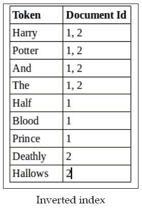

# frolics——一个用于前端应用程序的离线、轻量级全文搜索库

> 原文：<https://blog.devgenius.io/frolics-an-offline-lightweight-full-text-search-library-for-frontend-applications-121d029f5d9c?source=collection_archive---------11----------------------->

# 介绍

本文是对我自制的打字稿包“Frolics”的介绍，其灵感来源于 Elasticsearch、Solr 等现代全文搜索库。

我的目标是为前端应用程序创建一个轻量级的离线库。你可以在 [NPM 页面](https://www.npmjs.com/package/frolics)找到这个包。

这里省略了 Frolics 下的实现。相反，我将介绍现代搜索库如何收集原始数据，并将其转化为字典，以提高搜索效率。

最后但同样重要的是，我将在 ReactJS 中提供一个实际的例子来演示 Frolics 是如何工作的，并展示它在应用于您的项目时的灵活性和友好性。

如果你对开源贡献感兴趣，请随时打开一个问题或公关。感谢每一个反馈。

如果你觉得这个包有用，请在我的[回购](https://github.com/IMingGarson/Frolics)里留个星，它对我意义重大。谢谢你。

现在，我们开始吧。

# 数据预处理

在我们进行搜索之前，不可避免地要处理无组织的原始数据。一般来说，将杂乱的数据转化为我们想要的东西需要两个主要的动作:

1.  标记化—将文档拆分成几个标记，并排除停用词(如果有)。
2.  词干化—根据相似性聚合令牌以节省空间。

## 标记化

在 JavaScript 中，我们可以像这样用空格分割文档:

```
let words = words.split(' ');
```

将文档分割成标记不仅有助于我们更好地分析其组成，而且，由于停用词的存在，还能让我们洞察标记在每个文档中的重要性。

这是为什么呢？这里有一个无害的剧透警告——我们将计算所有文档中令牌的`weight`值。通过这样做，我们对原始数据进行分类和排序，以便在搜索时获得最相关的结果。

下面是 Frolics 使用的带有正则表达式的简单标记器，它只允许英文字母:

```
let words = [...new Set(words.filter((v) => /^\w+$/.test(v)))];
```

这里我使用了`Set`来删除重复的令牌。

## **停止字**

停用词是通常用于语法目的的通用词。这些词在大多数文档中会出现多次，以至于在搜索时变得无关紧要。比如:`the`、`will`、`and`……等等。

请记住，没有通用的停用词列表，Frolics 使用 Elasticsearch 提供的停用词。

这个过程很容易完成，如下所示:

## **词干**

一些单词由于它们的变形或起源而具有相似的结构。典型地，为了节省空间，利用**词干**对相似的词进行分类。

例如，像`develop`、`developer`、`development`和`developing`这样的单词可以有相同的词干`develop`。为了简单起见，我们可以将这 4 个单词视为一个条目，并建立一个字典。

Frolics 使用波特斯特梅尔算法实现词干提取，这里是[源代码链接](https://tartarus.org/martin/PorterStemmer/js.txt)。

# 重量计算

一旦我们将文档转换成多个令牌，我们就可以计算它们的`weights`。权重是一个数值，它表示一个标记在给定文档中有多重要。

TF-IDF 和 BM25 是获得这种数值统计的广泛使用的算法，后者被认为是前者的优化版本。

Frolics 用 BM25 计算重量，我们来看看它的方程式:


BM25 方程

`k1`和`b`是默认常量，在 Frolics 中分别为 1.2 和 0.75。

## 深入 BM25

先说`IDF(qi)`吧:


IDF 方程

IDF，或逆文档频率，**测量一个术语在所有文档中出现的频率，并“惩罚”常见的术语。**

在 IDF 等式中，`docCount`表示第**个文档，**和`f(qi)` 表示包含第 I 个查询词的****个文档。****

**从上面的等式我们可以了解到，一个术语出现的**越高，它的得分**就越少。**

**例如，我们有 4 个文档和两个单词`A`和`B`以及`f(A) = 2`和`f(B) = 4`。我们可以这样计算它们的重量:**

****

**A 的加权值**

****

**B 的加权值**

**由于`B`出现的次数更多，所以在搜索的时候，它的重要性就不那么关键了，也就是说，你可能很容易就找到很多包含`B`的文档。为了确保搜索术语时的准确性，我们**惩罚高频术语**和**查找包含术语**的特定文档，而不是大多数文档。**

**IDF 大概是 BM25 最重要的部分。如果你对整个故事感兴趣，我在参考部分提供了 Elasticsearch 官方网站的链接。强烈推荐看一看。**

**这就是 IDF 和 BM25 的游戏:**

**重量值计算**

# **倒排索引**

**现在我们有了令牌、文档和重量值。下一步是为搜索创建一个有效的数据结构。也就是——倒排索引。**

**倒排索引是一种数据库索引，其关键字可以是字符串或数值，值是文档集。**

**例如:**

****

**倒排索引示例**

**通常我们要搜索最相关的文档，所以文档是按权重值排序的。**

**这可以很容易地用 JavaScript 实现，如下所示:**

# **摘要**

**这是我在网上发布的第一个包。我真的很喜欢开发它，希望人们可以发现嬉戏不仅有用，而且鼓舞人心。**

**这里有一个在 [ReactJS](https://github.com/IMingGarson/ReactJS-Frolics-example) 中的实际例子。请给我留下一颗星和任何反馈。谢谢你。**

# ****参考****

**[](https://medium.com/@tusharsri/nlp-a-quick-guide-to-stemming-60f1ca5db49e) [## NLP:词干快速指南

### 词干提取基本上就是去掉一个单词的后缀，把它简化成它的词根。

medium.com](https://medium.com/@tusharsri/nlp-a-quick-guide-to-stemming-60f1ca5db49e) [](https://www.elastic.co/blog/practical-bm25-part-2-the-bm25-algorithm-and-its-variables) [## 实用 BM25 -第 2 部分:BM25 算法及其变量

### 这是由三部分组成的 BM25 实用系列的第二篇关于相似性排名(相关性)的文章。如果你只是…

www.elastic.co](https://www.elastic.co/blog/practical-bm25-part-2-the-bm25-algorithm-and-its-variables) [](https://stackoverflow.com/questions/33929377/what-exactly-does-the-data-structure-of-the-inverted-index-in-solr-looks-like) [## SOLR 倒排索引的数据结构到底是什么样的

### 请原谅我，我刚刚开始学习如何与 SOLR 共事。强大的 SE。我已经知道倒置…

stackoverflow.com](https://stackoverflow.com/questions/33929377/what-exactly-does-the-data-structure-of-the-inverted-index-in-solr-looks-like) [](https://github.com/IMingGarson/ReactJS-Frolics-example) [## GitHub-IMingGarson/ReactJS-Frolics-example:这是 react js 中的 Frolics 示例

### 这个项目是用 Create React App 引导的。在项目目录中，您可以运行:在…中运行应用程序

github.com](https://github.com/IMingGarson/ReactJS-Frolics-example)**