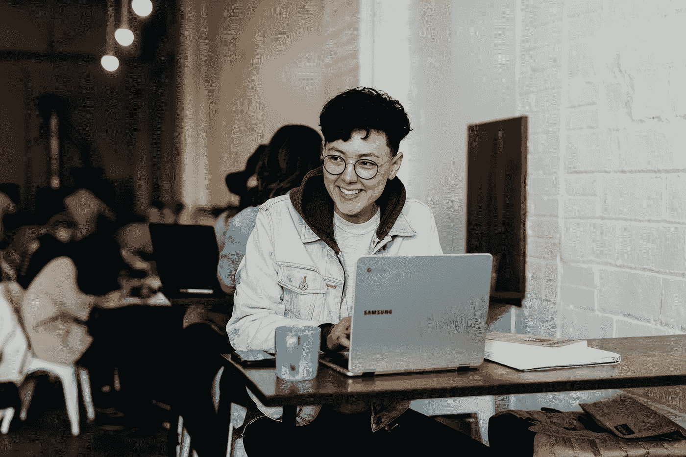

# 从医生到程序员

> 原文：<https://blog.devgenius.io/from-a-doctor-to-a-programmer-3214660c4142?source=collection_archive---------1----------------------->

## 追逐梦想的艰难旅程

[国家癌症研究所](https://unsplash.com/@nci?utm_source=medium&utm_medium=referral)在 [Unsplash](https://unsplash.com?utm_source=medium&utm_medium=referral) 上拍摄的照片

一开始就需要澄清的一点是，不存在博士不能做程序员的说法。

但是说实话，这是一个非常困难的任务，大多数人都做不到。这条路对我来说也不容易。让我们来讲述那次艰难旅程的故事。

## 我对编程的热爱是如何开始的:

从小我就热爱科学。我也擅长数学。在第八节课，我们被介绍了一门新的学科，叫做 ICT(信息与通信技术)。我不知道为什么，但是我非常喜欢这个主题。

## 最有价值的礼物&为实现它而做出的牺牲:

我恳求我父亲给我买一台电脑。但那时我父亲不可能在满足我们每月的开支后立即买一台电脑。

> 所以我开始自己存点钱。我记得，我步行去学校，没有碰我的钱包，只是为了节省每一分钱。

就这样，我攒了 6 个月的钱，父亲用我们的共同出资给我买了一台电脑。

*那天是我一生中最美好的日子之一。*

## 障碍:

我在 9 班的时候学了 Python。我从大学开始写代码。

但是我不知道为什么我父亲不喜欢我的电脑用得太多。我父母希望我成为一名医生。

所以他们想，如果我越来越沉迷于计算机，我就不会以医学为职业。

## 与父母的争吵:

我刚刚结束高中考试，想为工程学院的录取做准备。但是我父亲被激怒了。

他完全禁止我尝试，并说我必须为医学院做准备。我仍然和医学一起秘密地练习工程学。

我参加了两次入学考试，不知何故都被录取了。但是当我告诉父亲我可以进入计算机科学与工程专业时，他威胁说要和我断绝关系。

我不想再伤害我的父母，所以我不情愿地进入了医学院。

我被一所医学院录取，实现了他们的梦想。但是我的梦想呢？那会发生什么？会不会丢了？

Sebastián León Prado 在 [Unsplash](https://unsplash.com?utm_source=medium&utm_medium=referral) 上的照片

## 努力适应:

医学还不错。相当漂亮的东西。通过治疗治愈一个人无疑是一件伟大的事情。

我非常努力地去适应。我甚至最终适应了。很快我就迷上了解剖学、生理学、病理学、医学、外科学和许多其他书籍。

但是我对编程的渴望仍然很强烈。告诉我，你能忘记你的初恋吗？；)

老实说，在如此多的医学研究中，编码是一项非常困难的任务。但是，只要有时间，我还是会带着笔记本电脑坐下来。

## 我在医疗领域看到的令人惊讶的事情:

*   2020 年我过了 MBBS。我注意到一件事，这里的学习方法是非常教科书式的。只有老师们更喜欢纸质书。没有人了解最新的期刊或在线学习。

> 在这里，打开一本书比谷歌搜索更容易。人们用笔记本电脑看电影，而不是上网学习。

*   我见过我的 CSE 朋友，他们几乎不买书，而是阅读 PDF。但是在医学上，很多人连 pdf 都不知道怎么做。每个人总是阅读硬拷贝。
*   处方仍然是手写的，而且大多数时候，手写是如此难以理解，以至于没有人能理解。
*   在这种情况下，大多数病人不知道他们应该向哪个专科医生咨询哪个问题。
*   没有保存病人既往病史的数据库。他们经常隐瞒自己的症状或病史，或者处方丢失。
*   获得医生的预约也是一件困难的事情。

## 这些问题背后的原因:

我想知道问题出在哪里？尽管有这么简单的方法，为什么每个人都做得这么复杂？后来我意识到这背后有一些原因。

*   从一开始就是这样，没有人想过要改变它。原来如此。
*   在我国，医学和工程学被认为是两个完全不同的学科。
*   所以大多数学生实际上都是这样学习的。想当医生的，好好学生物，想当工程师的，学数学，物理。
*   所以在大多数情况下，医生的工程基础知识较少。
*   这里的每个人都很忙，没有人准备一下子改变一个习惯

## 我成为了一名程序员:

我想知道这种做法是否可以改变。如果所有的医学书籍都可以带到一个平台上，那么对所有人来说都是一个好处。

所以我决定做一个应用程序，在那里我们将集合所有医学相关的书籍。这有两个好处:

*   我找回了我的旧爱，编程。
*   医学生的痛苦会减少很多。

> 现在我正在和我的一个学 CSE 的朋友一起申请。我们夜以继日地编码，这样应用程序就可以很快地创建出来。

此外，我们将在这里添加更多的东西，以便医学研究可以用更多的技术来丰富。

我们还保留了处方书写、预约医生和 24 小时远程医疗服务的设施。

## 我的梦想实现了:

我的职业可能不是程序员。但我一直热爱编程。

现在我很开心。因为我让父母开心，也实现了我的梦想。现在，我是一名医生&也是一名自豪的程序员。

布鲁克·卡吉尔在 [Unsplash](https://unsplash.com?utm_source=medium&utm_medium=referral) 上的照片

我的最终目标是创建一个计算机化的医院系统。所有患者的信息都将存储在这里，并且很容易访问。

从处方到对入院病人的监控，所有信息都将被电脑化。因此，医院部门管理不善的情况将会减少。

## 最后一句话:

嗯，如果是这样的话，你生病了，你还需要做一个应用程序或网站，那么你会打电话给谁？"

当然是我。开玩笑的:D

生活中的所有愿望并不总是得到满足。但是如果你爱一样东西，你会回来的，不管它有多艰难！

*我的申请名还没定。请推荐一个好名字。别忘了在评论区提到你为实现梦想牺牲了什么。保重。*