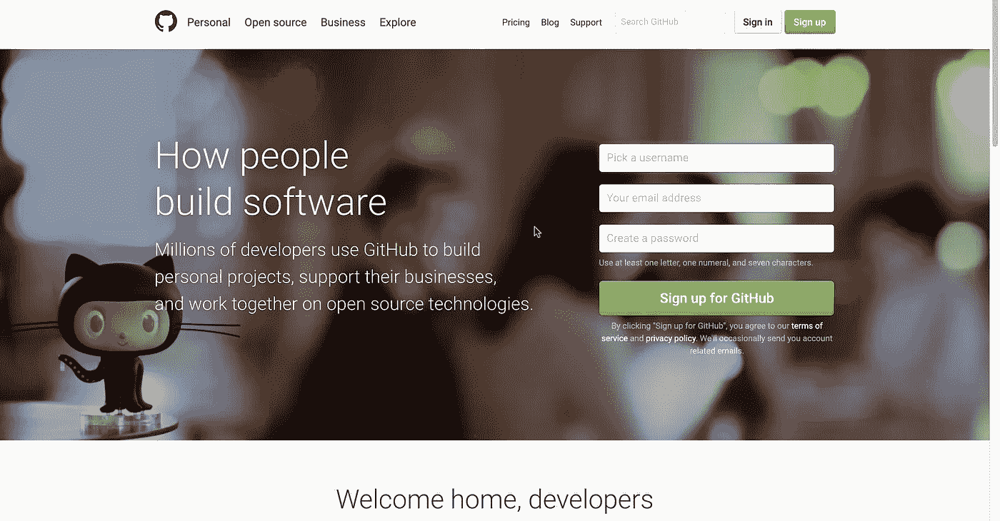
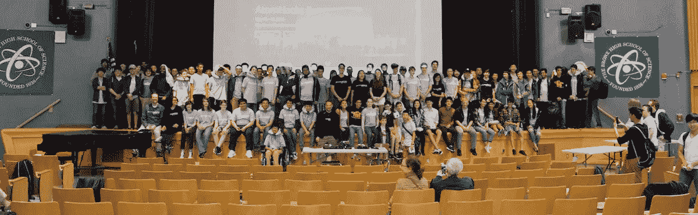
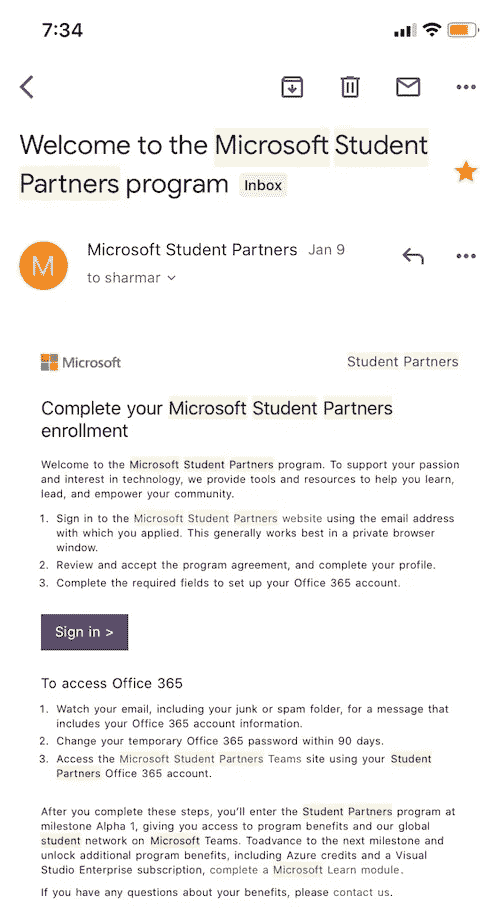
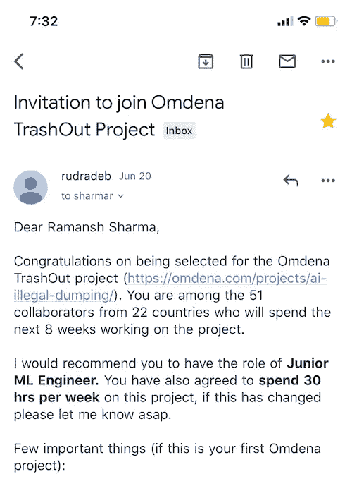

# 一年内从 Coursera 到 Omdena

> 原文：<https://blog.devgenius.io/from-coursera-to-omdena-in-1-year-fffa2aa9cd2f?source=collection_archive---------6----------------------->

照片由[鞠波·史密斯](https://unsplash.com/@jessysmith?utm_source=medium&utm_medium=referral)在 [Unsplash](https://unsplash.com?utm_source=medium&utm_medium=referral) 上拍摄

嗨读者们！我叫**拉曼什·夏尔马**，是奥姆德纳[公司的一名初级机器学习工程师。这是我在 Medium 上的第一个故事(还是有点习惯这里的写作方式)。](https://omdena.com/)

*首先，我在 medium 上的博客将讲述我的技术之旅和经历。如果你想了解我在深度学习领域正在做的项目，请访问我的个人博客网站，地址是*[https://ramanshsharma2806.github.io/blog](https://ramanshsharma2806.github.io/blog)。

# 介绍

我是 Ramapuram 的 SRM 科技学院的大二学生。我已经编程 5 年了。我的第一堂真正的编程课是“面向所有人的编码”，这是一门初级 Python 课程，当时我是高二学生([http://bxscience.edu/](http://bxscience.edu/))。从那以后，我学会了超过 6 (7？谁保持跟踪哈哈)编程语言，做了几十个项目。

客观地说，我记得 2016 年我加入 GitHub 时，它是这个样子的。

[http://github.com/](http://github.com/)回到 2016 年 12 月

有趣的事实:我的第一次黑客马拉松是我经历过的最好的一次。我在高一的时候只知道基本的 web 开发，我真的不想参加布朗克斯科学([http://atomhacks.org/](http://atomhacks.org/))的年度黑客马拉松。我父亲坚持要我继续学习，积累经验(这对一个 15 岁的我来说毫无意义)，我照做了。

幸运的是，我的一个羽毛球队的朋友在公共汽车站把我带进了他的球队。在接下来的 12 个小时里，我看到我的队友在他们高三的时候，用 Unity3D 上的 Myo 乐队制作了一个类似于钢琴的游戏，并融入了手部动作。迄今为止，这是我见过的最酷的东西。我们最终赢得了 MLH 首席执行官授予我们的黑客马拉松一等奖(iPad Mini 2)。

如果你放大的话，你可以看到我在舞台的右边

# 过渡到机器学习的世界

在高中剩下的时间里，我学习了游戏开发、高级数据结构和算法，但对人工智能了解不多。我唯一接触到机器学习的是这个网站[这里](http://neuralnetworksanddeeplearning.com/)，当时它对我来说没什么意义。

很快，我回到了印度，在东部公立学校上学，完成了 12 年级的学业，获得了国际学士学位。我开始了斯坦福大学的机器学习课程，老师是 http://ml-class.org/·吴恩达博士。

> 斯坦福课程是在整个互联网上任何地方开始机器学习的最佳资源——Ram

这门课什么都教。线性回归、逻辑回归、神经网络、支持向量机等等。最好的部分是，它不使用任何高级库来教你概念，所以你必须使用 MATLAB 来回答所有的编程任务。

这门课刚上了第二周，我就爱上了机器学习。我只是想尽可能多地吸收和同化我所能获得的知识。每天我都在日记中做细致的笔记，以增加我对 Coursera 上所看材料的记忆。

学完这个课程后，我从 [deeplearning.ai](http://deeplearning.ai/) 开始了 Coursera 上的深度学习专精。这 5 门课程帮助我形成了强大的神经网络基础，如何有效地训练它们，实践深度学习的最佳实践，以及顶级的最先进的网络，如 YOLO、盗梦空间等。

为了将我的知识付诸实践，我从头开始创建了一个数字识别器，只用 python 和 numpy 实现了一个普通的神经网络，而没有使用任何高级库。这是我在 GitHub 上的第一个主要项目。

# 微软学生合作伙伴

我的第一次重大突破是成为微软的学生合伙人。我是第二个在大学一年级就这样做的人。

我的申请花了 6 个月处理，但是一旦被接受，等待是值得的。

这个项目让我获得了一个来自世界各地的非常有价值的技术专业人士网络，并通过在大学校园举办活动和演讲对我周围的社区产生了积极的影响。

> 在成为微软学生伙伴的两个月内，我被选为我大学第一次 MSP 开放日的主题演讲人！

这对我来说是一个重要的时刻。我自己大一的时候也在上大学生深度学习课。

# deeplearning.ai 大使

有一天，我偶然发现了 deeplearning.ai 的一个大使项目。我马上申请了。为了成为大使，你必须在当地举办一次深度学习活动。由于四月份疫情已经占领了整个国家，我决定开展一个在线活动。

花了将近一个月的时间来计划所有的材料，邀请演讲者并进行练习，制作海报，编写广告内容，并准备网上研讨会的脚本。

最后，在 5 月 5 日，我们上线了系列活动的第一场活动，名为 [**派& AI:钦奈**](https://bit.ly/pieaichennaislack) ，钦奈的一个深度学习聚会社区。该活动取得了巨大的成功，超过 92 名观众在 2 小时内观看了该活动！

该计划允许大使们接触来自世界各地的深度学习专家的专业网络。此外，我们还就如何通过我们的活动向观众传递有意义的内容分享想法和资源。

# 奥姆德纳的初级机器学习工程师

成为 deeplearning.ai 大使后，我专注于通过该平台举办更多深度学习活动。

在这个过程中，我注意到我的一个来自 deeplearning.ai 的团队成员在他的 LinkedIn 个人资料下有一段经历，他是 Omdena 的机器学习工程师。

我访问了 Omdena 的网站,浏览了该组织的工作理念、项目和成就。我简直被我在那里发现的东西惊呆了！

Omdena 有一个项目接一个项目的招聘流程。这意味着你申请的是一个特定的项目，而不是一般的 Omdena 本身。我申请的第一个项目没有被接受。但是第二次…

就这样…

也许看起来不是很多，但我几乎完成了大一给自己定下的每一个目标。

*差不多。*

我没有成功的一件事是写我的第一篇研究论文。我已经准备好了项目，准备好了结果和数据，但是我从来没有抽出时间来写它。然而，最近，我已经开始学习一些专门的学术论文写作工具，并将很快发表我的第一篇论文。

我可能很快会写一个关于如何正确阅读研究论文的系列博客教程。是的，互联网上有很多关于这方面的资源，但有时，最好添加一个不同但即兴的观点。

# 外卖食品

对于正在读这篇文章的大学新生来说，他们可能会想，“Ram 是如何在第一年做这么多事情的？”如果你问我，我会说这个故事相当平淡无奇。你准备好秘方了吗，开始吧，

> 申请尽可能多的职位。申请！申请！申请！

真的没那么难。准备一份基本简历(嗯，也许是下次的教程)，列出你的项目(或者如果你还没有项目，至少做一个相当复杂的项目)，回答申请问题，然后点击**提交**。

我之所以强调申请的重要性，是因为你很可能不会被你申请的前 10 个职位录取。即使你擅长 Python 和房价数据集的探索性数据分析，这也不会让你与申请该职位的更有经验的候选人区分开来。那么问题就来了，“ ***我为什么要申请一个我不容易胜任的职位呢？*** 。

因为这有助于你进步。这些拒绝让你变得更好、更强、更聪明。我在这个博客中列出了 3 项主要成就。我还想提一下，从我开始上大学直到进入奥姆德纳，我已经被至少 200 个职位拒绝了。这很好，有时后退一步是朝着正确的方向前进所需要的。

在成为微软学生伙伴之前，当我看到拒绝邮件时，我总是很沮丧，每一步都在质疑我的未来。没有任何成就来支撑自己，是很难找到希望和信心的，但用艾罗睿智的话来说，

> 失败是重新开始的唯一机会。只是这一次，更明智地。

# 商务化人际关系网

在这段时间里，LinkedIn 给了我很大的帮助。我遇到了一些我一生的朋友和导师，了解了 deeplearning.ai 大使计划，了解了 Omdena 在 LinkedIn 上的项目和成就。

> LinkedIn 不是一个社交媒体平台。这是一个由高度专业的个人和组织组成的虚拟网络，他们互相帮助对方成长和发展自己的事业。

如果你还没有 LinkedIn 账户，我强烈建议你在完成这篇文章之前先注册一个。发送联系，与招聘人员交谈，寻求帮助(如果我告诉你那里的人有多么乐于助人，你可能不会相信我)，向他人提供帮助和专业知识，*通过组织页面*申请职位，在你知道它之前，你将会看到一封提供电子邮件。

# 结论

希望我的旅程能对阅读它的人有所帮助。鉴于新冠肺炎疫情的情况，大学生可能对职业不确定。在这场混乱中，看到其他人踏上旅程的具体路径有时会有所帮助。

牢记这一点，并回应我的大学同学的一些要求，我开始了我的媒介写作。

如果你有任何问题，请随时通过 LinkedIn([https://www.linkedin.com/in/ramanshsharma/](https://www.linkedin.com/in/ramanshsharma/))与我联系，我非常乐意回答我遇到的任何问题。