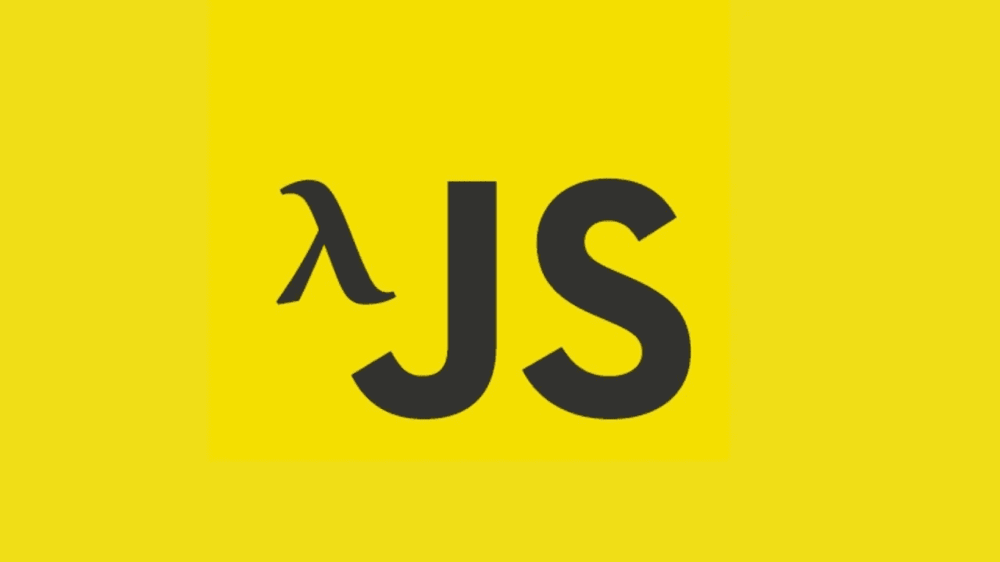
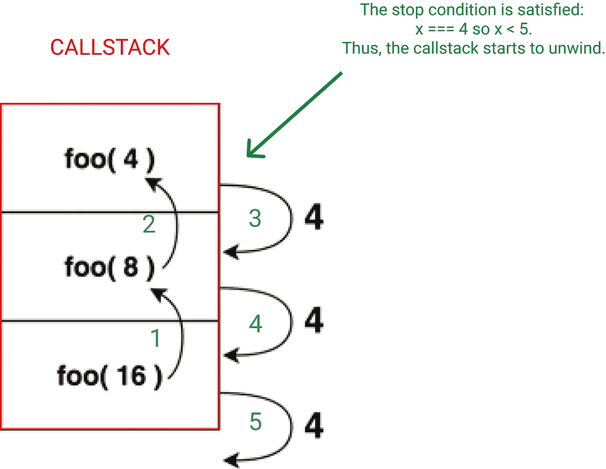

# 从命令式到声明式 JavaScript

> 原文：<https://blog.devgenius.io/from-imperative-to-declarative-javascript-f6bd8eec05bd?source=collection_archive---------3----------------------->

# 介绍

在这篇文章中，我将解释为什么*声明式*代码比*命令式*代码更好。

然后，我将列出一些在常见情况下将命令式 JavaScript 转换为声明式 JavaScript 的技术，同时定义一些关键术语。

# 为什么是声明性的？

首先，我们来定义一下*陈述性*和*命令性*是什么意思。

*声明性*代码是一种强调它所做事情意图的代码。

比起“如何”,它更喜欢“是什么”。

换句话说，实际执行工作的确切实现(也称为“如何”)是隐藏的，以便传达工作实际上是什么(也称为“什么”)。

相反，*命令式*代码是一种更喜欢“如何”而不是“什么”的代码。

让我们看一个例子:

下面的代码片段执行两件事:它计算`x`的平方，然后检查结果是否均匀。

在这里，我们可以看到，在我们必须按顺序遵循的几个步骤之后，我们终于得到了`isEven`。

这些步骤描述了我们“如何”知道`x`的正方形是否均匀，但这并不明显。

如果你找一个非程序员给他看这个，他可能很难破译。

现在让我们来看另一个片段，在这里我引入了一个神奇的`isSquareEven`函数，它执行了与前一个相同的两件事情。

简洁多了吧？

因为函数的名字，我们得到的结果是显而易见的。

即使不是程序员也能很容易理解。

但我在作弊。我用了一个神奇的功能。

我们看不到它实际上“如何”工作。

这是一件好事，因为这让我们有时间、精力和内存来关注这段代码在一天结束时做什么。

如果我们只是想用它，那是最理想的。

但是如果我们好奇的话，我们仍然有可能，通过函数的定义。(大多数编辑器允许您轻松跳转到它)

那么让我们来看看`isSquareEven`的实现(“如何”):

*声明性*代码的基本构件是函数。

在 JavaScript 中，它们具有“一流”的特殊性。

这意味着我们可以将它们作为普通的数据结构，如数字、字符串等。

换句话说，你可以在一个变量中存储一个函数。您可以将一个函数作为参数传递给另一个函数。一个函数可以返回另一个函数。

所以现在我们已经定义了这两个术语，更容易看出哪些*声明性*代码比*命令性*代码好。

> 声明性的*代码可读性更好。*

就像我们看到的，它更简洁，更容易理解。

在前面的例子中，我们没有处理太多的代码，所以这两段代码都很容易理解。

但是你可以想象一个真实的项目包含更多的代码，因此也更复杂。

因此，随着代码库的增长，优化可读性会越来越有帮助，如果多人一起工作，这就更重要了。

> 声明性的*代码是可重用的。(因为它经常暗示函数)*

您可能已经注意到在第一个代码片段(*命令式* one)中，`x`的值在开始时是硬编码的。

如果我们不这样做，下面的行就不能工作。

相反，当我们使用类似于*声明性*片段中的函数时，我们可以*重用*任何输入的逻辑，只要它是一个数字。

# 技术

这些技术涉及控制流语句:if/else、while、for 循环。

这些都是必须的。

他们描述的是工作是如何完成的，而不是工作是什么。

一般来说，您可以简单地将一段逻辑抽象成一个带有描述性名称的函数，以使您的代码更具声明性。

但是当涉及到控制流语句时，要做什么就不那么明显了。

# If/else 语句

有时，`if/else`语句非常明确和简短，所以我认为在这种情况下，坚持使用它们是合法的。

但其他时候，他们的条件不太明显和/或更长。

所以我们可以将它们抽象成具有声明性名称的函数。

例如，假设我们想检查一个对象是否为空:

[https://gist.github.com/e0be9a60a4b4dfb0bca1a46aaad85168](https://gist.github.com/e0be9a60a4b4dfb0bca1a46aaad85168)

在 JavaScript 中，没有简单的方法来确定一个对象是否为空。

你可能倾向于这样做:

但是该条件将评估为 false，因为当对对象(包括数组、函数、类)使用`==`或`===`符号时，它们是通过引用进行比较的，而不是通过它们属性的相等性进行比较的。

如果您不熟悉这种机制，可以探索一下[这个](http://adripofjavascript.com/blog/drips/object-equality-in-javascript.html)。

回到我们的例子，需要一点时间来认识到`Object.keys(o).length === 0`是一个检查对象是否为空的技巧。

因此，我们可以通过将它封装在一个函数中来实现这一点:

现在我们要记录“对象为空”或者“对象不为空”基于这个结果。

不使用`if/else`语句，我们可以使用*三元表达式*。

除了语法之外，两者的区别可以归结为一个*语句*和一个*表达式*的区别。

一个*语句*的计算结果为空，而一个*表达式*的计算结果总是为一个值。

所以我们可以把一个表达式当作一个值，这意味着我们可以把它存储在一个变量中，传递给一个函数，等等。

你不能用`if/else`语句做到这一点，例如:

最后，使用一个函数和一个三元表达式将我们的第一个*命令式*片段转换成一个*声明式*片段:

你可以将*三元表达式*的结果放入一个变量中，以获得更好的可读性和/或在以后重用它。

# 对于循环

当你想使用一个`for`循环时，你可以使用[映射](https://developer.mozilla.org/en-US/docs/Web/JavaScript/Reference/Global_Objects/Array/map)或 [forEach](https://developer.mozilla.org/en-US/docs/Web/JavaScript/Reference/Global_Objects/Array/forEach) 来代替。

如果您的数据还没有转换成数组，那么您可能需要将它转换成数组，因为这些函数只适用于它。

例如，您可以使用 [Object.entries()](https://developer.mozilla.org/en-US/docs/Web/JavaScript/Reference/Global_Objects/Object/entries) 从一个对象中获取一个键值对子数组。

然后，在映射之后，您可以使用 [Object.fromEntries()](https://developer.mozilla.org/en-US/docs/Web/JavaScript/Reference/Global_Objects/Object/fromEntries) 将结果转换回一个对象。

`forEach`通常用于副作用，而`map`必须是纯的。

换句话说，当你需要取回一个数组时，你使用`map`,而如果你想执行一些动作，但不在乎它是否返回什么，你使用`forEach`。

这就是为什么`forEach`返回`undefined`。

以下是我所说的一个例子:

现在让我们看看`map`和`forEach`给了我们什么:

我们可以简单地通过在`forEach`回调中创建“presentation”字符串并在之后记录它来获得相同的结果，但是我想展示`map`和`forEach`的用例。

现在你可能会说:

> *好。但是如果我想要，比方说，所有年龄的总和呢？*

使用`for`循环，这非常简单:

用`map`怎么实现呢？

我们不能，因为它总是给我们一个数组，而这里，我们想要一个数字。

现在我们需要另一个函数:`reduce`:

我不会在这里解释`reduce`是如何工作的，但这是一个非常强大的工具，你必须学习，因为它只是...太神奇了。(如果你愿意，我会在帖子的最后放一些资源。)

任何时候你想计算任何东西(另一个数组，一个对象，一个数字，一个字符串等等。)从一个数组中，你可以使用它。

事实上，你可以用它实现`map`、`filter`、`slice`以及其他“声明性”功能。

这也是为什么一开始比较难把握的原因。

但是，有没有一种不平凡的乐器，在演奏出美妙的音乐之前不需要学习？

我不这么认为。

正如我提到的，还有其他方便的功能，如`filter`和`slice`，可以代替`for`循环来完成特定的任务。(再次声明，资源在帖子的末尾。)

好吧！让我们来解决最后一项技术。

# While 循环

而循环可以用递归来代替，更准确地说，是递归函数。

那是什么鬼东西？

好吧。递归函数有两个特征:

1.  它自称(递归情况)。
2.  它作为一个停止条件(基本情况),当满足时，展开调用堆栈并最终返回所需的值。

让我们看一个例子:

这里有一个视觉化的结果:

每个黑色箭头都可以替换为“returns”。

整个过程从字面上解释:

1.  foo(16): x === 16 所以 x > 5，因此我们返回`foo(16 / 2)`。所以我们调用它并将返回这个调用返回的任何内容。
2.  foo(8): x === 8 所以 x > 5，因此我们返回`foo(8 / 2)`。所以我们调用它并将返回这个调用返回的任何内容。
3.  foo(4): x === 4 所以 x < 5，满足停止条件。因此我们返回 4。
4.  回到步骤 2，我们想要返回任何`foo(8 / 2)`(在步骤 3 中也称为 foo(4 ))返回的内容。现在我们知道是 4，我们返回 4。
5.  回到步骤 1，我们想要返回任何`foo(16 / 2)`(在步骤 2 中也称为 foo(8 ))返回的内容。现在我们知道是 4，我们返回 4。
6.  因为最初的调用是`foo(16)`，所以结果是 4。

这个例子很简单，但是最终，每个递归函数都有我上面列出的两个特征。

这是一个我很难掌握的技巧，所以如果是你的情况，不要放弃，定期接触不同的学习材料。

最终，这一天会到来。

现在让我们看一个例子，其中我们将 while 循环转换为递归函数:

现在，你能告诉我这个循环是干什么的吗？

它计算 5 的阶乘。

所以最后 x 是 120。

即使在这个相当简单的例子中，`while`循环的作用也不明显。

使用递归函数，我们可以通过给它一个有意义的名称来轻松解决这个问题:

漂亮吧？

尝试像我在之前的可视化中所做的那样分解函数。

把它写在纸上，真正地与信息联系起来。

# 更进一步

学习“简化”:

*   MDN 文档
*   [趣味趣味功能](https://www.youtube.com/watch?v=Wl98eZpkp-c)
*   [再次来自 Fun Fun 功能](https://www.youtube.com/watch?v=gU3wOcpbfCM)

学习递归:

*   [javascript.info](https://javascript.info/recursion)
*   [趣味趣味功能](https://www.youtube.com/watch?v=k7-N8R0-KY4)
*   [所有 JavaScript 的东西](https://www.youtube.com/watch?v=py7ZWFjrwEs)
*   [更多](https://github.com/getify/Functional-Light-JS/blob/master/manuscript/ch8.md/#chapter-8-recursion)

[过滤器](https://developer.mozilla.org/en-US/docs/Web/JavaScript/Reference/Global_Objects/Array/filter)

[切片](https://developer.mozilla.org/en-US/docs/Web/JavaScript/Reference/Global_Objects/Array/slice)

在这篇文章中，我强调了术语*命令性的*和*声明性的*，本质上声明了后者给了我们更多可读的代码。

但是这些术语经常被用在 OOP(通常是命令式的)和 FP(更多的是声明式的)的上下文中。

这是两种编程范例(如果你愿意，这是解决软件问题的方法)。

FP 代表函数式编程，OOP 代表面向对象编程。

虽然`for`循环并不是一个“面向对象”的东西，但是我介绍的[高阶函数](https://medium.com/javascript-scene/higher-order-functions-composing-software-5365cf2cbe99)是函数式编程中的核心工具，它们经常被认为是函数式编程的核心工具。

函数式范例真的让我很感兴趣，我想你会喜欢学习它的。

除了更具声明性之外，它还提供了其他强大的思想/特性，比如数据结构的不变性，这有助于避免与可变性相关的一系列错误。

不幸的是，JS 没有提供开箱即用的功能，所以试图强制执行它有点像逆水行舟，所以您可以使用一个类似于 [Clojure](https://clojure.org/index) 的功能。

但是它们是学习 JavaScript 这种范式的很好的资源，我推荐它们，因为函数式语言通常不太受欢迎，学习材料的生态系统也不太成熟。

以下是其中的几个:

书籍:

*   [轻量级功能 JavaScript](https://github.com/getify/Functional-Light-JS)

- [基本上足够的 FP 指南(在 JS 中)](https://github.com/MostlyAdequate/mostly-adequate-guide)

视频:

*   [趣味 Fun 功能播放列表](https://www.youtube.com/playlist?list=PL0zVEGEvSaeEd9hlmCXrk5yUyqUag-n84)

图书馆:

*   [拉姆达 JS](https://ramdajs.com/)

[更多](https://github.com/stoeffel/awesome-fp-js)

# 结论

就是这样！

我希望你喜欢这篇文章，更重要的是，它会很有用。

继续编码！😄

*最初发布于*[*https://yannsalmon . netlify . app/blog/from-important-to-declarative-JavaScript/*](https://yannsalmon.netlify.app/blog/from-imperative-to-declarative-javascript/)**。**