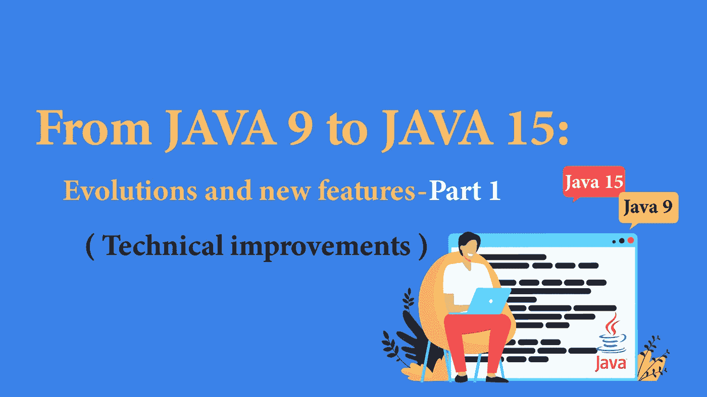

# 从 JAVA 9 到 JAVA 15:发展和新特性—第 1 部分

> 原文：<https://blog.devgenius.io/from-java-9-to-java-15-evolutions-and-new-features-part-1-c249947b7513?source=collection_archive---------9----------------------->

## 每个 Java 开发者都应该知道的 Java 版本进化链。



## 简介:从 Java 9 到 Java 15

根据 IDC(国际数据公司)的最新报告，超过 900 万全职开发人员使用 Java，Java 仍然是商业世界中最受欢迎和使用最广泛的语言之一。

事实上，根据 ORACLE 的统计，今天全世界有 900 万 Java 开发人员，将近 510 亿个活跃的 JVM。

为了保持这种受欢迎程度，并进一步扩大 Java 社区，甲骨文自 2017 年 9 月发布 Java 9 以来，加快了 Java 发布的步伐。

现在，每六个月发布一次改进，每三年发布一次 LTS(长期支持)版本，而不是每三年发布一次成千上万的修复和新功能。

目标是确保开发人员更高的生产力，并允许他们适应新的市场实践，同时提供可预测性和持续的稳定性。

这也将促进向新版本的迁移并扩大 Java 社区，这个问题已经在 Java 15 中实现，其中超过 20%的补丁由非 ORACLE 开发人员提供。

Java 8 之后的这种速度变化非常突然，许多公司还没有跟进，因为害怕或不知道每个新版本提供的好处。本文的目的是概述从 Java 9 到 Java 15(2020 年 9 月发布)的版本带来的不同发展，以便他们能够为其 SDK 的迁移做好最好的准备。

在第一部分中，我们将关注语言的技术发展，这些发展简化了开发者的生活，改善了他们的日常生活。然后，我们将研究对 JVM 的各种改进，特别是最近推出的“垃圾收集器”。最后，我们将在第三部分结束，这一部分专门讨论从 JDK 中删除或将要删除的模块和 API。最后，我们将给出一些建议，以便您可以放心地进行迁移。

# 技术改进

## 1.文本块(Java 15 以后的标准模式)

Java 编程中的文字字符串不限于短字符串，还可以对应于 XML 描述、SQL 查询、HTML 网页等。

然后它们可以包含几个转义序列、换行符、特殊字符等。

让我们以 HTML 格式的网页为例:

```
String html = "<html>\n" +
              "    <body>\n" +
              "        <p> Java, technical Enhancement </p>\n" +
              "    </body>\n" +
              "</html>\n";
```

这些写操作很麻烦，也可能成为开发人员的错误来源。

为了解决这个问题， **Java 13** 在预览模式中引入了二维“文本块”的新概念，这个概念在 Java 15 中已经标准化。以下是上一个示例的样子:

```
String html = """  //go back to the line
              <html>
                  <body>
                      <p> Java, technical Enhancement </p>
                  </body>
              </html>
              """;
```

在相同的上下文中， **JAVA 13** 为 String 类引入了新方法:

*   String::translateEscape:删除字符串中的转义序列
*   string::striping dent:删除每行开头的意外缩进。
*   String::formatted:允许您根据传递的参数格式化字符串。

还有其他一些以前由 **Java 11** 介绍的简便方法:

*   String::isBlank，String::repeat，String::lines:从行中返回流
*   String::strip，String::stripLeading，String::stripTrailing:允许更好地管理空间。

## 2.开关(从 Java 14 开始的标准模式)

在 Java 中，文本块并不是唯一相当冗长的部分,“开关”也是一个指令，历史上写在许多行中。

这是 **Java 12** 之前一个“开关”的样子:

```
switch (day) {
        case MONDAY:
        case TUESDAY:
        case THURSDAY:
        case FRIDAY:
            planning = "Workout";
            break;
        case WEDNESDAY:
            planning = "Day off";
            break;
        case SUNDAY:
        case SATURDAY:
            planning = "Weekend";
            break;
        default:
            throw new IllegalStateException(day+ "does not exist");
    }
```

在 **Java 12 之后，**我们有了更简洁的东西:

```
int planning = switch (day) {
    case MONDAY, TUESDAY, THURSDAY, FRIDAY -> "Workout"; // “case” accept multiple values separated by commas 
    case WEDNESDAY -> "Day off"; // it is possible to use the "arrow" operator
    case SATURDAY, SUNDAY -> "Weekend"; // no need to put "default" for enums if we cover all cases  
    };
```

也可以将代码块放在 close case 中。 **Java 13** 反过来又带来了一个新的*“yield”*关键字，取代了 break，让你可以脱离 switch。这些新特性随着 Java 14 进入了标准模式。

## 3.局部变量的 VAR(Java 10 以后的标准模式)

考虑下面的例子:

```
BufferedReader reader = Files.newBufferedReader(...);
List<String> programmingLanguage = List.of("java", "javaScript", "Swift",”C++”);
Map<String, List<String>> mapping = retrieveWritersBooksMap();
```

局部变量类型推断是 **Java 10** 最大的新特性。它避免了前面例子中的冗余，简化了复杂类型的显示。

请注意，过度使用 var 会导致编译器混乱。为此，Java 对它的使用施加了一些限制。以下是一些未经授权的代码示例:

```
var value ;  //il faut obligatoirement initialiser les variables
var object = null ; //variables must be initialized
var a=1,b=2 ; // cannot declare multiple variables on the same line
var words =   {“word1”, ”word2”}; // initializing an array requires an explicit type
var addition =  {a, b} -> a+b; // lamdas expressions require an explicit type but it is possible to cast
var compareString = String ::compareTo ; // reference methods require an explicit type but it is possible to cast (using Comparator<String> in the example)
var value = 10 ; value = ’’hello ‘’ ; // impossible to transform an already typed var
```

使用 **Java 11** ，可以在 lambdas 函数内部使用 var。这种用法有一个很大的优势，因为它允许您对参数进行注释。

```
(@Nonnull var x, @Nullable var y) -> x.process(y)
```

## 4.流

Java 8 引入的新的流 API 通过提供一种更简单、更有效的“迭代器”模式的替代方式，从根本上改变了集合的处理方式，而“迭代器”模式的设置相对来说比较麻烦。

Java 9 反过来为这个 API 提供了新的方法，下面是一些例子:

*   Stream::takeWhile:允许使用“谓词”浏览集合。只要条件有效，我们就浏览集合。
*   Stream::dropWhile:遵循 takeWhile 的反向操作。只有当条件有效时，我们才开始遍历集合。
*   Stream::Iterate:允许您通过指定起始值、谓词和增量函数来迭代集合。
*   Stream::ofNullable:当值为 null 时，通过返回“可选”接口来避免 npe。

Java 11 引入了 Null/InputStream、OutputStream、Reader、Writer，允许用 Null 启动流而不生成 NPE。因此，透明地处理输入/输出是可能的，即使它们表示空值。

以“流”结束， **Java 12** 在 java.util.stream.Collectors 接口上引入了 Stream::tee 方法。它将两个独立的集合作为输入，并允许使用一个双函数将它们组合起来:

```
Double average = numbers.stream()
                        .collect(teeing(SummingDouble(i -> i),
                                  counting(),(sum, n) -> sum / n));
```

## 5.密封的类

sealed 关键字是 **java 15** 最重要的新特性之一。它的目的是将一个类/接口的实现或继承限制在由“*许可*关键字定义的类列表中:

```
public abstract sealed class Shape
    	permits Circle, Rectangle, Square {...}
```

如果这些类是在同一个源文件中声明的，那么可以去掉“允许”关闭。

## 6.班级记录

记录不太冗长。事实上，它们减少了创建一个类所需的代码量(构造函数、getter/setter 访问器、equals()方法、hashcode())以及每次创建新属性时维护它所需的时间。

这里有一个例子:

```
public record Person (String firstName, String lastName) {}
```

它们最初是由 Java 14 以“预览”模式引入的。事实上，一个记录可以实现一个密封的接口，并且可以在一个方法内部本地声明。

## **7。空指针异常(Java 15 以后的标准模式)**

```
String email = employee.getPersonalDetails().getEmail().toLowerCase();
```

如本例所示，开发人员通常可以编写将多个方法链接在一起的代码。但是当 NPE 生成时，就不清楚错误来自哪里了。

```
Exception in thread "main" java.lang.NullPointerException
at com.enhancement.DemoNullPointerException.main(HelpfulNullPointerException.java:10
```

有了 **Java 14** ，JVM 提供了一个更明确的消息，准确地指出错误来自哪里。

```
Exception in thread "main" java.lang.NullPointerException: 
Cannot invoke "String.toLowerCase()" because the return value of 
"com.enhancement.DemoNullPointerException$PersonalDetails.getEmail()" is null
at com.enhancement.DemoNullPointerException.main(HelpfulNullPointerException.java:10)
```

这个增强是 Java 15 的标准配置。

## 8.JShell REPL“读取评估打印循环”(Java 9 以后的标准模式)

由 **Java 9** 推出的“JShell”是一个用于评估 Java 代码的命令行工具。

事实上，不再需要创建一个完整的程序(导入库，用 main()方法定义一个类，等等)。)来测试一个简单的表达式。这似乎很有用，尤其是对于不熟悉 Java 语言的开发人员。

下面是一个用 Jshell 执行的代码示例:

```
.. >jshell
|  Welcome to JShell -- Version 9
|  For an introduction type: /help intro

jshell>public long multiply(long n , long m ){
   ...>    return m * n ;
   ...> }
|  created method multiply(long ,long)
jshell>long result = multiply(20 , 10 )
result ==> 200
|  created variable result : long
```

“Jshell”提供了一个命令列表，包括:

```
/set feedback verbose : provides more information about executed commands.
/list -start : list all Jshell commands.
/drop [nom_variable] : deletes the created variable.
/vars : displays the list of all active variables in the current session.
/vars [Nom_variable] : is used to display the variable [Variable_name] and its value.
/vars – all : displays the list of all active, inactive and loaded variables at startup.

/types : allows you to list all the active types (Class, Interface, Enum) created in JShell.
/types [Nom_Type] : is used to display the type corresponding to [Name_Type].
/types -all : allows you to list all the types of the current session (active, inactive and loaded when starting JShell).

/edit : allows modifying the constructors in the current session.
/edit 1 :  allows to modify the first constructor in the current session.
/edit [Nom-constructeur] : allows you to modify a specific constructor in the current session.
/exit: quits JShell.
```

作为这一部分的结尾，这里简要介绍一些您可能感兴趣的其他改进:

*   接口中的“私有”方法: **Java 9**

这有助于封装，并避免复制代码的某些部分和只公开所需的方法。

*   不可变集合的工厂: **Java 9**

List.of()，Set.of()，Map.of()。

```
List<String> availableGC= List.of("GC1", "ZGC", "EPSILON");
```

*   “try-with-resources”**Java 9**中的最终变量:如果资源是最终的，那么可以在“try”块之外声明“Closeable”资源。为资源的实例化创建实用方法也可以提高可读性。
*   Predicate::not **Java11** :提供了一种简单的方法来反转“谓词”的值，用 lambdas 或方法引用来表示，降低了代码的复杂性。

下一部:[第二部](/from-java-9-to-java-15-evolutions-and-new-features-part-2-7405530ab748)。

> 我们在这里停下来，以免读得太长，下一部分我们将讨论对 JVM 的各种改进。